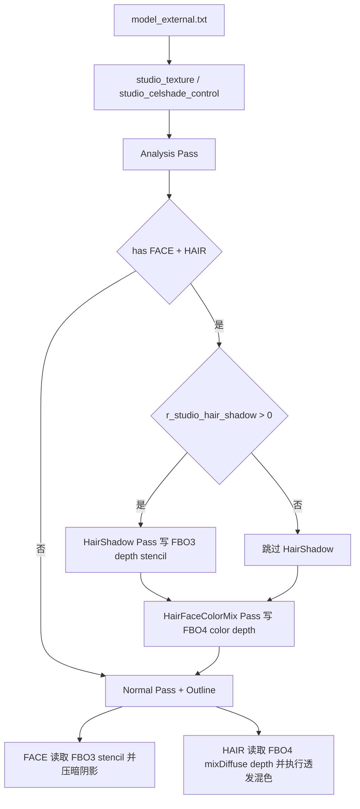

# Celshade

## 概述
Celshade 是 `Plugins/Renderer` 中 StudioModel 的风格化着色总管线，覆盖了基础 Celshade（分段明暗）、Outline、RimLight/RimDark、HairSpecular，以及与其强耦合的 HairShadow 与 Eyebrow-Passthrough（HairFaceColorMix）链路。

当前实现采用“Analysis + 多离屏几何 Pass + Normal Pass 屏幕空间采样”的组合：
- Analysis 统计模型是否含 FACE/HAIR/透明网格；
- HairShadow pass 把 FACE/HAIR 写入 FBO3 depth/stencil；
- HairFaceColorMix pass 把 FACE 颜色+alpha 写入 FBO4；
- Normal pass 在 FACE/Hair 分支分别采样 stencil 与 mixDiffuse/depth，完成阴影与透发效果。

## 职责
- 维护 Celshade 资产标记协议（`STUDIO_NF_CELSHADE` / `STUDIO_NF_CELSHADE_FACE` / `STUDIO_NF_CELSHADE_HAIR`）与外部配置入口（`[model]_external.txt`）。
- 在分析阶段统计 `r_draw_hasface / r_draw_hashair / r_draw_hasalpha / r_draw_hasadditive / r_draw_hasoutline`，驱动后续 pass 调度。
- 通过 `renderfx` 切换 HairShadow 与 HairFaceColorMix 几何 pass，并管理 FBO3/FBO4 的绑定与清理。
- 在 DrawPass 中构建 `StudioProgramState`，绑定 stencil/mixDiffuse/depth 等纹理输入并切换 shader 宏变体。
- 在 shader 侧实现 face/body celshade、rim light/dark、hair Kajiya specular、face stencil 阴影压暗、hair 屏幕空间颜色混合。
- 提供 cvar + 模型级覆盖（`studio_celshade_control`）双层参数体系，并支持 `r_studio_celshade_debug` 调试分支。

## 涉及文件 (不要带行号)
- docs/Renderer.md
- Plugins/Renderer/enginedef.h
- Plugins/Renderer/gl_common.h
- Plugins/Renderer/gl_local.h
- Plugins/Renderer/gl_rmain.cpp
- Plugins/Renderer/gl_studio.cpp
- Build/svencoop/renderer/shader/common.h
- Build/svencoop/renderer/shader/studio_shader.vert.glsl
- Build/svencoop/renderer/shader/studio_shader.frag.glsl

## 架构
整体流程（StudioModel Celshade）：

关键实现点：
- 启用判定：
  - `R_StudioHasHairShadow()`：`r_draw_hashair && r_draw_hasface && r_studio_hair_shadow>0 && !R_IsRenderingShadowView()`。
  - `R_StudioHasHairFaceColorMix()`：`r_draw_hashair && r_draw_hasface && !R_IsRenderingShadowView()`。
- 状态位到 shader 宏：`R_UseStudioProgram()` 将 `StudioProgramState` 映射为 `#define`（如 `HAIR_SHADOW_ENABLED`、`HAIR_FACE_COLOR_MIX_ENABLED`、`STENCIL_TEXTURE_ENABLED`、`MIX_DIFFUSE_TEXTURE_ENABLED`、`DEPTH_TEXTURE_ENABLED`）。
- 纠错逻辑：若出现 `STUDIO_NF_CELSHADE_FACE/HAIR` 但缺少 `STUDIO_NF_CELSHADE`，`R_UseStudioProgram()` 会自动补上 `STUDIO_NF_CELSHADE`。
- 全局开关：`R_StudioDrawMesh()` 在 mesh 级别执行 `if (!r_studio_celshade->value) flags &= ~STUDIO_NF_CELSHADE_ALLBITS;`，统一关断 Celshade 扩展位。

### Shader 核心
- `R_StudioCelShade()`（frag）：
  - 使用 `smoothstep(r_celshade_midpoint ± r_celshade_softness)` 生成明暗分段。
  - FACE 分支按头部朝向（`v_headfwd`）修正光向，减少极角下脸部跳变。
  - FACE + stencil 分支：命中 `STENCIL_MASK_HAS_SHADOW` 时强制 `litOrShadowArea = 0.0`。
  - 非 FACE 分支叠加 rim light / rim dark；HAIR 分支叠加 Kajiya strand specular。
- `R_GenerateAdjustedNormal()`：FACE 允许在原法线与球化法线之间插值（`flNormalMask`）；与文档“蓝通道控制 face 球化法线比例”一致。
- HairFaceColorMix pass（frag `HAIR_FACE_COLOR_MIX_ENABLED`）：输出 face `diffuseColor`；若有 specular 贴图则 `diffuseColor.a *= rawSpecularColor.a`。
- Hair normal pass 混色（frag `STUDIO_NF_CELSHADE_HAIR && MIX_DIFFUSE_TEXTURE_ENABLED`）：
  - 采样 `depthTex` 重建 `sceneWorldPos`；
  - 仅在 `distance(sceneWorldPos, vWorldPos) < 4.0` 时，使用 `mixDiffuseColor.a` 混合 face/hair 颜色，降低跨层误混。
- HairShadow 顶点偏移（vert `HAIR_SHADOW_ENABLED && STUDIO_NF_CELSHADE_HAIR`）：沿调整后的光向 + Z 偏移应用 `r_hair_shadow_offset`。

## 依赖
- 标记位与 renderfx 协议：
  - `STUDIO_NF_CELSHADE / FACE / HAIR`、`STUDIO_NF_CELSHADE_ALLBITS`。
  - `kRenderFxDrawHairShadowGeometry`、`kRenderFxDrawHairFaceColorMixGeometry`、`kRenderFxDrawOutline`。
- ProgramState 位：
  - `STUDIO_HAIR_SHADOW_ENABLED`、`STUDIO_HAIR_FACE_COLOR_MIX_ENABLED`、`STUDIO_STENCIL_TEXTURE_ENABLED`、`STUDIO_MIX_DIFFUSE_TEXTURE_ENABLED`、`STUDIO_DEPTH_TEXTURE_ENABLED`。
- 离屏资源：
  - `s_BackBufferFBO3`（stencil/depth 采样来源，含 stencil view）。
  - `s_BackBufferFBO4`（face mix diffuse + depth 采样来源）。
- 纹理槽位：
  - `STUDIO_BIND_TEXTURE_STENCIL=6`、`STUDIO_BIND_TEXTURE_MIX_DIFFUSE=7`、`STUDIO_BIND_TEXTURE_DEPTH=8`。
- stencil 位语义：
  - `STENCIL_MASK_HAS_SHADOW=0x1`、`STENCIL_MASK_HAS_FACE=0x2`。
- 参数来源：
  - 全局 cvar：`r_studio_celshade*`、`r_studio_hair_*`、`r_studio_outline*`、`r_studio_rim*`、`r_studio_celshade_debug`。
  - 模型级覆盖：`studio_celshade_control`（`R_StudioLoadExternalFile_Celshade`）。
- 资产依赖：
  - `studio_texture.flags`，以及可选 `replacetexture/speculartexture`（用于 eyebrow alpha 与 HDR 贴图工作流）。

## 注意事项
- `r_studio_celshade=0` 会在 mesh 入口清空 `STUDIO_NF_CELSHADE_ALLBITS`，所有 Celshade 扩展链路（含 HairShadow/HairFaceColorMix）都会失效。
- HairFaceColorMix 启用条件不依赖 `r_studio_hair_shadow`：只要存在 FACE+HAIR 且非 ShadowView 就会执行该 pass。
- Hair 混色阈值是固定世界空间距离 `4.0`，极端比例模型可能需要额外调参。
- HairShadow pass 文档将 `r_studio_hair_shadow_offset` 描述为“screen space offset”，但实现是顶点几何偏移后再投影。
- HairFaceColorMix pass 明确“不写 stencil”；face 阴影判定依赖前序 HairShadow pass 写入的 FBO3 stencil。
- 若 `s_BackBufferFBO3.s_hBackBufferStencilView` 或 `s_BackBufferFBO4` 深度视图不可用，会导致阴影判定/透发混色退化。
- GlowShell 分支会移除 Celshade 位并改为 `STUDIO_NF_FLATSHADE`，因此 Celshade 视觉不会直接叠到 GlowShell pass。

## 调用方（可选）
- `StudioRenderModel_Template`：驱动 Analysis、HairShadow、HairFaceColorMix、Normal、Outline 等 pass。
- `R_StudioDrawMesh`：统一处理 mesh flags（含 Celshade 开关），并分流到 AnalysisPass/DrawPass。
- `R_StudioDrawMesh_AnalysisPass`：收集 `hasface/hashair` 等统计位。
- `R_StudioDrawMesh_DrawPass`：根据 `renderfx + flags` 组装 `StudioProgramState`，完成纹理绑定、状态设置与 `glDrawElements`。
- `R_UseStudioProgram`：状态位 -> shader 宏变体编译/缓存。
- `R_CreateStudioRenderData` + `R_StudioLoadExternalFile`：初始化 CelshadeControl，并从 `studio_texture/studio_celshade_control` 加载覆盖参数。

## Pass渲染状态设置（按 Pass / Geometry 细分，重点 Stencil）

### 1) Analysis Pass
- 入口：`r_draw_analyzingstudio = true`。
- 行为：仅统计 `r_draw_hasface / r_draw_hashair / r_draw_hasalpha / r_draw_hasadditive`。
- stencil：无写入。

### 2) HairShadow Geometry Pass（`renderfx = kRenderFxDrawHairShadowGeometry`）
- 调度：绑定 `s_BackBufferFBO3`，清 `depth/stencil`，`glDrawBuffer(GL_NONE)`。
- Geometry 过滤：仅 `STUDIO_NF_CELSHADE_FACE` 或 `STUDIO_NF_CELSHADE_HAIR`。
- stencil 写入：
  - FACE：`GL_BeginStencilWrite(STENCIL_MASK_HAS_FACE, STENCIL_MASK_HAS_FACE | STENCIL_MASK_HAS_SHADOW)`。
  - HAIR：`GL_BeginStencilWrite(STENCIL_MASK_HAS_SHADOW, STENCIL_MASK_HAS_SHADOW)`。
- 状态：`glDisable(GL_BLEND)` + `glDepthMask(GL_TRUE)`；默认 `glCullFace(GL_FRONT)`，`DOUBLE_FACE` 则禁用剔除。

### 3) HairFaceColorMix Geometry Pass（`renderfx = kRenderFxDrawHairFaceColorMixGeometry`）
- 调度：绑定 `s_BackBufferFBO4`，清 color/depth/stencil。
- Geometry 过滤：仅 `STUDIO_NF_CELSHADE_FACE`。
- 输出：face `diffuseColor`（可与 `specular.a` 相乘后写入 alpha）。
- stencil：不写（代码注释 `No need to write stencil here`）。
- 状态：`glDisable(GL_BLEND)` + `glDepthMask(GL_TRUE)`。

### 4) Normal Pass（FACE）
- 绑定：非 HairShadow/HairFaceColorMix 情况下，为 FACE 尝试绑定 `s_BackBufferFBO3.s_hBackBufferStencilView` 到 slot 6。
- shader：`STUDIO_NF_CELSHADE_FACE && STENCIL_TEXTURE_ENABLED` 时读取 stencil，命中 `HAS_SHADOW` 强制阴影。

### 5) Normal Pass（HAIR）
- 绑定：若启用 HairFaceColorMix，为 HAIR 绑定 `mixDiffuse`（slot 7）与 `depth`（slot 8）。
- shader：重建场景世界坐标 + 距离阈值判定后，按 `mixDiffuse.a` 融合 face/hair 颜色（眉毛透发核心）。

### 6) DrawPass 收尾（每个 mesh）
- 恢复：`glDepthMask(GL_TRUE)`、`glDisable(GL_BLEND)`、`glEnable(GL_CULL_FACE)`、`glEnable(GL_DEPTH_TEST)`、`glDepthFunc(GL_LEQUAL)`。
- 结束 stencil：`GL_EndStencil()`。
- 解绑：按状态位解绑 depth/mixDiffuse/stencil/normal/parallax/specular/animated 纹理。