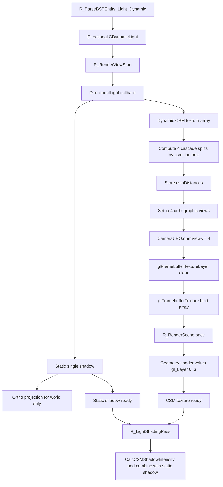

# DirectionalLightCSM

## Overview
DirectionalLightCSM 负责 Renderer 中方向光阴影的两层结构：静态单层正交阴影与动态级联阴影贴图。动态部分使用 `CCascadedShadowTexture` 和 `sampler2DArrayShadow`，通过一次多视图 `R_RenderScene()` 同时绘制 4 个级联层。

## Responsibilities
- 为方向光分配静态单层 `CSingleShadowTexture` 与动态级联 `CCascadedShadowTexture`。
- 使用主视图 near/far plane 与 FOV 计算 4 级联 split，并记录到 `IShadowTexture::SetCSMDistance()`。
- 构建每个级联的正交投影矩阵与 shadow matrix，并写入 `CameraUBO`。
- 通过 texture array 与多视图几何着色器，把一次 `R_RenderScene()` 输出到 4 个级联 layer。
- 在 `R_LightShadingPass()` 中同时绑定静态方向光阴影和动态 CSM 纹理，把两者共同纳入方向光延迟着色结果。

## Involved Files & Symbols
- `Plugins/Renderer/gl_light.h` - `CDynamicLight`
- `Plugins/Renderer/gl_light.cpp` - `R_AddVisibleDynamicLight`, `R_IterateVisibleDynamicLights`, `R_LightShadingPass`
- `Plugins/Renderer/gl_shadow.cpp` - `CSingleShadowTexture`, `CCascadedShadowTexture`, `R_CreateSingleShadowTexture`, `R_CreateCascadedShadowTexture`, `R_SetupShadowMatrix`, `R_RenderShadowmapForDynamicLights`
- `Plugins/Renderer/gl_rmain.cpp` - `R_PreRenderView`, `R_RenderScene`
- `Plugins/Renderer/gl_wsurf.cpp` - `R_ParseBSPEntity_Light_Dynamic`, 世界阴影绘制与 shadow proxy 分支
- `Plugins/Renderer/gl_studio.cpp` - Shadow caster shader 变体
- `Build/svencoop/renderer/shader/common.h` - `CSM_LEVELS`, `CameraUBO.numViews`, `DSHADE_BIND_CSM_TEXTURE`
- `Build/svencoop/renderer/shader/wsurf_shader.geom.glsl` - `gl_Layer` 输出级联层
- `Build/svencoop/renderer/shader/studio_shader.geom.glsl` - `gl_Layer` 输出级联层
- `Build/svencoop/renderer/shader/dlight_shader.frag.glsl` - `sampler2DArrayShadow csmTex`, `CalcCSMShadowIntensity`

## Architecture
方向光阴影由静态世界阴影和动态 CSM 两部分组成：

1. `R_ParseBSPEntity_Light_Dynamic()` 可从地图 `light_dynamic` 解析出 `DynamicLightType_Directional`，并携带 `size`、`shadow`、`static_shadow_size`、`dynamic_shadow_size`、`csm_lambda`、`csm_margin`。
2. `R_RenderViewStart()` 会把方向光直接加入 `g_VisibleDynamicLights`，方向光本身不做额外可见性裁剪。
3. `R_RenderShadowmapForDynamicLights()` 的 DirectionalLight callback 先处理静态阴影：
   - 使用 `CSingleShadowTexture`。
   - 设置单层正交投影，范围由 `args->size` 决定。
   - 只绘制 `DRAW_CLASSIFY_WORLD`，因此静态阴影主要缓存世界几何。
4. 然后处理动态 CSM：
   - 若动态纹理不存在或尺寸变化，则分配 `CCascadedShadowTexture`，底层是 `size x size x 4` 的 texture array。
   - 读取主视图 near/far plane 与主视图 FOV，按 `csm_lambda` 进行线性与对数混合切分，得到 4 个 split。
   - 把每个 split 的 far distance 记录到 `pCurrentShadowTexture->SetCSMDistance()`，供光照阶段选择 cascade。
   - 对每个 cascade 估算截头棱锥包围球半径，再乘以 `1.0 + csm_margin` 得到稳定的正交投影尺寸。
   - 4 个级联的世界矩阵、投影矩阵和 shadow matrix 会被一次性写入 `CameraUBO.views[0..3]`，并设置 `CameraUBO.numViews = CSM_LEVELS`。
5. FBO 侧先用 `glFramebufferTextureLayer()` 逐层清除，再用 `glFramebufferTexture()` 绑定整个 texture array，之后调用一次 `R_RenderScene()`。
6. `wsurf_shader.geom.glsl` 与 `studio_shader.geom.glsl` 在 multiview 模式下循环 `numViews`，并通过 `gl_Layer = viewIdx` 把几何写入对应的 cascade layer。
7. `R_LightShadingPass()` 中，方向光 shader：
   - 若静态纹理 ready，则启用 `DLIGHT_STATIC_SHADOW_TEXTURE_ENABLED` 并上传 `u_staticShadowMatrix`。
   - 若动态 CSM 纹理 ready，则启用 `DLIGHT_CSM_SHADOW_TEXTURE_ENABLED`，上传 `u_csmMatrices`、`u_csmDistances` 和 `u_csmTexel`，并绑定 `sampler2DArrayShadow csmTex`。
   - 片段着色器通过 `CalcCSMShadowIntensity()` 选取对应 cascade，并把静态方向光阴影与 CSM 结果取 `min`。

## Dependencies
- `CDynamicLight` 上的 `size`、`static_shadow_size`、`dynamic_shadow_size`、`csm_lambda`、`csm_margin`、`pStaticShadowTexture`、`pDynamicShadowTexture`。
- `CCascadedShadowTexture` 对 `GL_GenShadowTextureArray` 的封装。
- `Build/svencoop/renderer/shader/common.h` 中的 `CSM_LEVELS = 4` 与 `CameraUBO` 结构。
- `wsurf_shader.geom.glsl`、`studio_shader.geom.glsl` 的 multiview layer 输出。
- `dlight_shader.frag.glsl` 的 `sampler2DArrayShadow` 采样与 `CalcCSMShadowIntensity()`。

## Notes
- 方向光静态阴影与动态 CSM 的职责不同：前者主要缓存世界，后者主要覆盖动态不透明实体。
- 动态 CSM 目前固定为 4 级联，级联距离来自主视图 near/far plane 与 `csm_lambda` 混合切分，而不是固定比例常量。
- 级联正交尺寸使用截头棱锥的包围球近似，重点是稳定与避免裁边，因此会配合 `csm_margin` 增加额外外扩。
- 与旧的四宫格单纹理实现不同，当前 CSM 使用完整 `size x size x 4` texture array，每个 layer 都保有完整分辨率。
- CSM 渲染通过一次 `R_RenderScene()` 完成，显著降低 CPU 调度开销，并避免每级联单独切换视图。
- 方向光静态 pass 与点光静态 pass 一样，会用 `c_brush_polys > 0` 决定纹理是否 ready。
- 光照阶段最终阴影强度取静态方向光阴影和动态 CSM 结果的较小值，因此地图静态遮挡与动态实体遮挡能够共同生效。

## Callers (optional)
- `Plugins/Renderer/gl_wsurf.cpp` - `R_ParseBSPEntity_Light_Dynamic` 解析方向光参数
- `Plugins/Renderer/gl_rmain.cpp` - `R_PreRenderView` 调用 `R_RenderShadowMap`
- `Plugins/Renderer/gl_shadow.cpp` - `R_RenderShadowmapForDynamicLights` 中的 DirectionalLight callback 生成静态阴影与动态 CSM
- `Plugins/Renderer/gl_light.cpp` - `R_LightShadingPass` 中的 DirectionalLight callback 采样 static shadow 与 CSM texture array
