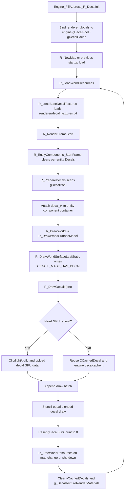

# DrawDecals

## Overview
`R_DrawDecals` 及其配套辅助函数，负责把引擎持有的 decal 池接入 Renderer 的 world-surface 渲染体系。它的完整生命周期覆盖：启动时绑定引擎 `gDecalPool/gDecalCache`，每帧把引擎 decal 归档到实体组件，按需构建或复用 Renderer 侧 GPU 缓存，并在地图切换或 world-surface 关闭时清空 Renderer 侧 decal 资源与材质映射。

## Responsibilities
- 通过引擎地址解析把 Renderer 的 decal 访问点绑定到引擎全局数据，如 `gDecalPool`、`gDecalCache`、`gDecalSurfCount`。
- 在每帧开始时扫描引擎 decal 池，并把 `decal_t*` 归档到对应实体的 `CEntityComponentContainer::Decals`。
- 在 `R_DrawWorldSurfaceModel` 中针对当前实体筛选可绘制 decal，并决定复用还是重建 GPU 缓存。
- 生成 decal 裁剪几何、lightmap UV、法线/TBN 与 instance 数据，并上传到专用 decal VBO/EBO。
- 在 world 资源重载或关闭时清空 Renderer 侧 cached decal 与 decal render-material 映射，使后续帧重新建立有效缓存。

## Involved Files & Symbols
- `Plugins/Renderer/gl_hooks.cpp` - `Engine_FillAddress_R_DecalInit`
- `Plugins/Renderer/gl_rmain.cpp` - `R_RenderFrameStart`, `R_NewMap`
- `Plugins/Renderer/gl_entity.h` - `CEntityComponentContainer::Reset`, `CEntityComponentContainer::Decals`
- `Plugins/Renderer/gl_entity.cpp` - `R_EntityComponents_StartFrame`
- `Plugins/Renderer/gl_rsurf.cpp` - `EngineGetDecalByIndex`, `EngineGetMaxDecalCount`, `R_PrepareDecals`, `R_DrawDecals`, `R_DecalIndex`, `R_DecalVertsClip`, `R_DecalVertsNoclip`, `R_DecalVertsLight`, `R_UploadDecalTextures`, `R_UploadDecalVertexBuffer`, `R_IsDecalCacheInvalidated`, `g_DecalDrawBatch`, `gDecalPool`, `gDecalCache`, `gDecalSurfCount`
- `Plugins/Renderer/gl_wsurf.cpp` - `R_DrawWorld`, `R_DrawWorldSurfaceModel`, `R_DrawWorldSurfaceLeafStatic`, `R_ClearDecalCache`, `R_ClearDetailTextureCache`, `R_FreeWorldResources`, `R_LoadWorldResources`, `R_LoadBaseDecalTextures`, `R_GetRenderMaterialForDecalTexture`, `R_ShutdownWSurf`
- `Plugins/Renderer/gl_wsurf.h` - `CDecalDrawBatch`, `CCachedDecal`, `CWorldSurfaceRenderer::vCachedDecals`
- `Plugins/Renderer/gl_common.h` - `decalvertex_t`, `decalvertextbn_t`, `STENCIL_MASK_HAS_DECAL`
- `Plugins/Renderer/enginedef.h` - `decalcache_t`, `FDECAL_CLIPTEST`, `FDECAL_NOCLIP`, `FDECAL_VBO`

## Architecture
生命周期起点不是 `R_DrawDecals` 本身，而是 Renderer 对引擎 decal 全局变量的接管。`gl_hooks.cpp` 中的 `Engine_FillAddress_R_DecalInit` 会反汇编引擎 `R_DecalInit` 附近指令，把 Renderer 侧的 `gDecalPool` 与 `gDecalCache` 指针绑定到引擎真实地址；同一套地址填充流程还会解析 `gDecalSurfCount` / `gDecalSurfs`。因此 Renderer 不拥有 decal 对象本身，而是直接引用引擎内存。

进入运行期后，`EngineGetDecalByIndex` 只是返回 `&gDecalPool[index]`，`EngineGetMaxDecalCount` 返回 `MAX_DECALS`。每帧开始时，`R_RenderFrameStart` 先调用 `R_EntityComponents_StartFrame`，而 `CEntityComponentContainer::Reset` 会清空实体上的 `Decals` 列表。随后 `R_PrepareDecals` 全量扫描引擎 decal 池；只要 `decal->psurface` 有效，就通过 `entityIndex` 找到目标实体，并把该 `decal_t*` 放进对应实体组件容器。这一步相当于把引擎池里的 decal 重新投影成 Renderer 每帧可消费的“按实体归档”视图。

world 资源加载决定了 decal 材质映射如何进入 Renderer。`R_NewMap` 会先执行 `R_FreeWorldResources`，再调用引擎的 `R_NewMap`，最后执行 `R_LoadWorldResources`。其中 `R_LoadWorldResources` 会调用 `R_LoadBaseDecalTextures`，从 `renderer/decal_textures.txt` 读取 decal 材质定义；`R_GetRenderMaterialForDecalTexture` 在绘制时按 decal 名称哈希查询 `g_DecalTextureRenderMaterials`，为 decal 绑定可选的 detail/normal/specular 等扩展材质。若查找失败，则 decal 仍可绘制，但没有额外 render material。

进入世界绘制后，`R_DrawWorld -> R_DrawWorldSurfaceModel` 会先绘制基础 world surface。`R_DrawWorldSurfaceLeafStatic` 在基础表面 pass 中写入 `STENCIL_MASK_HAS_DECAL`，给后续 decal pass 提供像素级遮罩。基础表面绘制结束后，`R_DrawWorldSurfaceModel` 立即调用 `R_DrawDecals(ent)`，因此 decal 覆盖发生在水面绘制之前、基础不透明表面之后。

`R_DrawDecals` 的前置过滤条件包括：开发 overview 模式、`DRAW_CLASSIFY_DECAL` 被关闭、SvEngine 下实体带有 `EF_NODECALS`、实体没有组件容器、或者组件容器内 `Decals` 为空。通过这些检查后，函数会清空 `g_DecalDrawBatch.BatchCount`，然后遍历当前实体持有的每个 decal。

对每个 decal，函数先取全局 `decalIndex`、decal 基础纹理，以及可选的 `CWorldSurfaceRenderMaterial`。如果 decal 尚未带有 `FDECAL_VBO`，或者 `R_IsDecalCacheInvalidated` 发现缓存中的 `gltexturenum`、尺寸或 `pRenderMaterial` 发生变化，就进入重建流程。这意味着 decal 的生命周期在 Renderer 内部被拆成“引擎对象长期存在”与“Renderer GPU 缓存按需失效重建”两层。

几何重建分为两条路径：
- `FDECAL_NOCLIP` 路径：走 `R_DecalVertsNoclip`。它复用引擎侧 `gDecalCache` 里的 `decalcache_t` 四顶点缓存；若缓存 miss，则内部仍调用一次 `R_DecalVertsClip` 生成四边形，再补 `R_DecalVertsLight`。
- 常规路径：走 `R_DecalVertsClip`。该函数把表面 polygon 顶点投影到 decal 纹理空间，按 `[0,1]` 边界执行四次 `SHClip`。如果 decal 首次通过 `FDECAL_CLIPTEST` 且结果是完整四边形，会把 flag 升级成 `FDECAL_NOCLIP`，让后续帧走更快路径。若当前渲染仍使用 lightmap，则额外调用 `R_DecalVertsLight` 计算每个顶点的 lightmap UV。

如果最终 `vertCount > 0`，`R_UploadDecalTextures` 会把贴图 id、尺寸、render material 记录到 `vCachedDecals[decalIndex]`，并在需要时向 `hMaterialSSBO` 追加一个 `world_material_t`，保存 diffuse/detail/normal/parallax/specular 的缩放信息。接着 `R_UploadDecalVertexBuffer` 会把裁剪后的 polygon 转成三角形列表，填充 `decalvertex_t`、`decalvertextbn_t` 和单实例 `brushinstancedata_t`，并写入 `hDecalVBO` 与 `hDecalEBO` 对应 `decalIndex` 的固定槽位；`CCachedDecal` 记录 `startIndex`、`indiceCount`、`startInstance`、`instanceCount` 等 GPU 提交参数。最后给 decal 打上 `FDECAL_VBO`。

如果 `vCachedDecals[decalIndex].indiceCount > 0`，`R_DrawDecals` 会把纹理 id、索引偏移、索引数量、实例范围和 render material 指针压入 `g_DecalDrawBatch`。这一步只做批次收集，不立即 draw。真正提交阶段，`R_DrawDecals` 会开启 alpha blend、关闭 depth write、启用 `GL_BeginStencilCompareEqual(STENCIL_MASK_HAS_DECAL, STENCIL_MASK_HAS_DECAL)`、把 GBuffer 写掩码限制到 `GBUFFER_MASK_DIFFUSE | GBUFFER_MASK_WORLDNORM | GBUFFER_MASK_SPECULAR`，然后绑定 `hDecalVAO`，逐批次调用 `glDrawElementsInstancedBaseInstance`。绘制结束后它会恢复图形状态，并把 `(*gDecalSurfCount)` 置零，作为本轮 decal 绘制后的引擎侧计数清理。

生命周期终点体现在 Renderer 侧资源释放而不是引擎 decal 销毁。`R_FreeWorldResources` 会清空 `vWorldMaterials`、`vWorldMaterialTextureMapping`，调用 `R_ClearDecalCache` 把 `vCachedDecals` 的索引计数和材质引用清零，再调用 `R_ClearDetailTextureCache` 清空 `g_DecalTextureRenderMaterials`。`R_NewMap` 在地图切换时会走这条释放链，`R_ShutdownWSurf` 在 world-surface 关闭时也会走同样流程。之后 `R_LoadWorldResources` 重新加载 decal 材质映射；下一帧 `R_PrepareDecals` 再从仍由引擎持有的 `gDecalPool` 重新归档 decal，`R_DrawDecals` 按需重建 GPU 缓存，完成新一轮生命周期。

## Dependencies
- 引擎地址解析与全局变量绑定：`gDecalPool`, `gDecalCache`, `gDecalSurfCount`, `gDecalSurfs`
- 引擎 decal 池与表面数据：`decal_t`, `msurface_t`, `entityIndex`, `Draw_DecalTexture`
- 实体组件生命周期：`R_EntityComponents_StartFrame`, `CEntityComponentContainer::Reset`, `R_GetEntityComponentContainer`
- world-surface GPU 资源：`hDecalVAO`, `hDecalVBO`, `hDecalEBO`, `hMaterialSSBO`, `vCachedDecals`
- decal 材质注册表：`g_DecalTextureRenderMaterials`, `renderer/decal_textures.txt`, `R_GetRenderMaterialForDecalTexture`
- 与基础表面 pass 共享的 stencil / lightmap / fog / clip / GBuffer / OIT 状态约定

## Notes
- Renderer 不分配也不释放 `decal_t`；它只引用引擎 `gDecalPool` 中的对象，并在每帧重新建立实体到 decal 的归档关系。
- `R_PrepareDecals` 每帧都会全量扫描 `MAX_DECALS`，但只保留 `psurface` 有效的 decal 进入 Renderer 可绘制列表。
- `FDECAL_NOCLIP` 是一个优化标记；一旦 `R_DecalVertsClip` 证明 decal 实际覆盖完整四边形，后续帧可以复用引擎侧 `gDecalCache` 里的四顶点结果。
- Renderer 侧 GPU 缓存失效条件是：没有 `FDECAL_VBO`，或者 `gltexturenum`、纹理尺寸、`pRenderMaterial` 发生变化；这属于“缓存失效”，不是引擎 decal 对象销毁。
- `R_ClearDecalCache` 只清空 Renderer 侧 `vCachedDecals` 的 draw-range 与材质引用，不会释放引擎 `gDecalPool` 或引擎 `gDecalCache`。
- `R_ClearDetailTextureCache` 会清空 `g_DecalTextureRenderMaterials`；当 `R_LoadWorldResources` 重新加载 decal 材质后，`R_IsDecalCacheInvalidated` 会因为 `pRenderMaterial` 指针变化而促发 decal GPU 缓存重建。
- `R_FreeWorldResources` 在 `R_NewMap` 和 `R_ShutdownWSurf` 中都会执行，因此地图切换和 world-surface 关闭都会终止当前 Renderer 侧 decal 资源生命周期。
- `R_DrawDecals` 末尾把 `(*gDecalSurfCount)` 置零；这体现了 Renderer 对引擎侧 decal 绘制计数的清理，但该计数在引擎内部更完整的消费链路未在本 memory 中继续展开。
- `R_UploadDecalVertexBuffer` 无法从 `msurface_t` 反查 worldmodel 或 surfIndex 时会直接 `Sys_Error`，因此它假设 decal 一定绑定到可解析的 world surface。

## Callers (optional)
- `Plugins/Renderer/gl_wsurf.cpp` - `R_DrawWorldSurfaceModel`
- 间接调用链：`Plugins/Renderer/gl_wsurf.cpp` - `R_DrawWorld` -> `R_DrawWorldSurfaceModel`
- 相关准备链：`Plugins/Renderer/gl_rmain.cpp` - `R_RenderFrameStart` -> `R_PrepareDecals`
