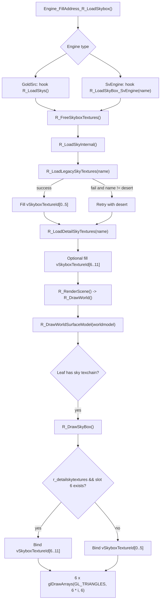

# DrawSkybox

## Overview
`DrawSkybox` 对应 `Renderer` 插件里天空盒资源的加载与帧内绘制流程。它通过 hook 引擎的天空加载入口，把天空纹理装入 `g_WorldSurfaceRenderer.vSkyboxTextureId[12]`，并在世界模型绘制时依据当前叶子节点是否含有天空面来决定是否先行绘制天空盒。

## Responsibilities
- hook 引擎的天空加载入口：GoldSrc 走 `R_LoadSkys()`，SvEngine 走 `R_LoadSkyBox_SvEngine(const char* name)`。
- 释放当前天空盒槽位并重新加载 6 张基础天空面，以及可选的 6 张 DDS 高质量替换面。
- 在世界表面纹理链生成阶段识别 `SURF_DRAWSKY` 天空面，并把它们记录到叶子节点的 `TextureChainSpecial[WSURF_TEXCHAIN_SPECIAL_SKY]`。
- 在 `R_DrawWorldSurfaceModel()` 中，仅当当前绘制的是 `cl_worldmodel` 且当前叶子节点包含天空链时，调用 `R_DrawSkyBox()` 在世界几何体之前绘制天空盒。
- 在特定视图分支下复用天空面几何绘制路径 `R_DrawWorldSurfaceLeafSky()`，用于水面反射等流程中的天空面处理。

## Involved Files & Symbols
- `Plugins/Renderer/gl_hooks.cpp` - `Engine_FillAddress_R_LoadSkybox`, `Engine_InstallHooks`
- `Plugins/Renderer/privatehook.h` - `gPrivateFuncs.R_LoadSkys`, `gPrivateFuncs.R_LoadSkyboxInt_SvEngine`, `gPrivateFuncs.R_LoadSkyBox_SvEngine`
- `Plugins/Renderer/gl_rmain.cpp` - `R_FreeSkyboxTextures`, `R_LoadLegacySkyTextures`, `R_LoadDetailSkyTextures`, `R_LoadSkyInternal`, `R_LoadSkyBox_SvEngine`, `R_LoadSkys`, `R_RenderScene`
- `Plugins/Renderer/gl_wsurf.cpp` - `R_GenerateIndicesForTexChain`, `R_GenerateTexChain`, `R_WorldSurfaceLeafHasSky`, `R_DrawSkyBox`, `R_DrawWorldSurfaceLeafSky`, `R_DrawWorldSurfaceModel`, `R_DrawWorld`
- `Plugins/Renderer/gl_wsurf.h` - `CWorldSurfaceRenderer::vSkyboxTextureId`
- `Plugins/Renderer/gl_draw.cpp` - `GL_Texturemode_internal`, `GL_UnloadTextures`
- `Plugins/Renderer/gl_local.h` - `r_detailskytextures`, `r_wsurf_sky_fog`, `r_loading_skybox`

## Architecture
天空盒加载和绘制可以拆成两段：

1. 加载段
`gl_hooks.cpp` 先通过 `Engine_FillAddress_R_LoadSkybox()` 反汇编定位引擎内部的天空加载入口与相关变量，然后在 `Engine_InstallHooks()` 中按引擎类型安装 inline hook。GoldSrc 分支 hook `R_LoadSkys()`，该函数从 `pmovevars->skyName` 取天空名；SvEngine 分支 hook `R_LoadSkyBox_SvEngine(name)`，直接接收天空名。

2. 纹理加载段
两个 hook 入口都会先执行 `R_FreeSkyboxTextures()` 清空 `vSkyboxTextureId[12]`，再进入 `R_LoadSkyInternal()`。其中：
- `R_LoadLegacySkyTextures(name)` 依次加载 `gfx/env/<name>{rt,lf,bk,ft,up,dn}.tga`，失败再尝试同名 `.bmp`，结果写入 `vSkyboxTextureId[0..5]`。
- 如果基础 6 面全部成功，再执行 `R_LoadDetailSkyTextures(name)`，优先从 `gfx/env/<name>{...}.dds` 读取，失败再尝试 `renderer/texture/skybox/<name>{...}.dds`，结果写入 `vSkyboxTextureId[6..11]`。
- 如果基础天空加载失败且名字不是 `desert`，`R_LoadSkyInternal()` 会回退到 `desert` 再尝试一次。

3. 天空可见性判定段
`R_GenerateTexChain()` 在 `TEXCHAIN_PASS_SOLID_WITH_SKY` 阶段，会把纹理名为 `"sky"` 且表面标记了 `SURF_DRAWSKY` 的 world surface 构造成 `TEXCHAIN_SKY`，写入叶子节点的 `TextureChainSpecial[WSURF_TEXCHAIN_SPECIAL_SKY]`。`R_WorldSurfaceLeafHasSky()` 本身只是检查这个 special texchain 的 `drawCount` 是否大于 0。

4. 帧内绘制段
`R_RenderScene()` 调用 `R_DrawWorld()`，后者再进入 `R_DrawWorldSurfaceModel()`。当且仅当当前模型是 `*cl_worldmodel` 时，函数会取当前视点叶子节点；如果该叶子节点带有天空链，就先执行 `R_DrawSkyBox()`，然后再继续静态表面与动画表面的世界绘制。因此天空盒是“世界绘制前置 pass”，而不是一个独立的后处理 pass。

5. Skybox 与 sky 面几何的区别
`R_DrawSkyBox()` 使用的是 `vSkyboxTextureId[0..11]` 里已经加载好的 6 面纹理，绑定 `WSURF_SKYBOX_ENABLED` 着色器变体，使用 `r_empty_vao` 对每一面执行一次 `glDrawArrays(GL_TRIANGLES, 6 * i, 6)`。如果 `r_detailskytextures` 为真且 `vSkyboxTextureId[6]` 非零，则整套绘制改用 `vSkyboxTextureId[6..11]`，否则使用基础面的 `vSkyboxTextureId[0..5]`。

`R_DrawWorldSurfaceLeafSky()` 则是另一条路径：它绘制的是 BSP 里被识别为天空的 world-surface 几何，而不是那 6 张天空盒面纹理。在当前代码里，它只在 `R_DrawWorldSurfaceModel()` 的水面视图分支里出现，并且调用前会关闭 color mask。

## Dependencies
- 引擎 hook 与地址解析：`Engine_FillAddress_R_LoadSkybox()`、`Engine_InstallHooks()`、`gPrivateFuncs.R_LoadSkys`、`gPrivateFuncs.R_LoadSkyBox_SvEngine`
- 天空名来源：GoldSrc 使用 `pmovevars->skyName`，SvEngine 直接使用函数参数 `name`
- 统一纹理加载：`R_LoadTextureFromFile()`
- 世界表面分类：`SURF_DRAWSKY`、纹理名 `"sky"`、`TextureChainSpecial[WSURF_TEXCHAIN_SPECIAL_SKY]`
- 绘制状态与开关：`DRAW_CLASSIFY_SKYBOX`、`WSURF_SKYBOX_ENABLED`、`r_detailskytextures`、`r_wsurf_sky_fog`
- 统一纹理生命周期管理：`GL_UnloadTextures()`

## Notes
- `vSkyboxTextureId[12]` 的实际布局是 6 张基础天空面加 6 张 DDS 替换面；`R_DrawSkyBox()` 不会把两者叠加，而是二选一。
- `R_DrawSkyBox()` 的早退条件包括：开发俯视模式、`DRAW_CLASSIFY_SKYBOX` 未开启、基础天空槽位 `vSkyboxTextureId[0]` 为空。
- `R_FreeSkyboxTextures()` 只把天空盒槽位清零，不直接删除 GL 纹理对象；真正的统一释放逻辑在 `GL_UnloadTextures()`，其注释说明该过程由 `R_NewMap` 触发。
- `R_LoadLegacySkyTextures()` / `R_LoadDetailSkyTextures()` 在任意一面失败时立即返回 `false`，不会回滚本次已经写入的纹理槽位；因此如果一次加载在中途失败，数组里可能暂时保留部分已写入结果，直到下一次重新清空。
- `R_DrawWorldSurfaceModel()` 虽然也被 `R_DrawBrushModel()` 复用，但天空盒前置绘制只在 `pModel->m_model == (*cl_worldmodel)` 的世界模型分支中发生，普通 brush entity 不会触发 `R_DrawSkyBox()`。
- `r_loading_skybox` 会在 `gl_hooks.cpp` 中从引擎内部变量解析出来，但在当前 `Renderer` 代码里没有进一步参与天空盒本地流程。
- `R_DrawWorldSurfaceLeafSky()` 在水面视图分支里于关闭 color mask 后执行；从当前调用位置看，它更像是为反射视图维护天空面几何/深度相关状态，而不是直接承担 6 面天空盒纹理绘制。这一点属于基于调用上下文的推断。

## Callers (optional)
- 引擎天空加载流程，经由 `Engine_InstallHooks()` 安装的 inline hook 进入 `R_LoadSkys()` 或 `R_LoadSkyBox_SvEngine()`
- `R_RenderScene()` -> `R_DrawWorld()` -> `R_DrawWorldSurfaceModel()` -> `R_DrawSkyBox()`
- `R_DrawWorldSurfaceModel()` -> `R_DrawWorldSurfaceLeafSky()`（仅水面视图分支）