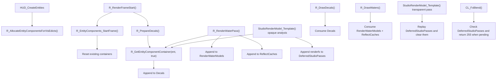

# EntityComponentContainer

## Overview
`CEntityComponentContainer` 是 Renderer 插件里的按实体临时渲染附件容器，用来在一帧内为单个 `cl_entity_t` 挂接额外的渲染数据，而不直接修改实体结构本身。它把 decal、水面渲染数据和 studio 延迟 pass 这几类跨阶段数据统一缓存到实体级容器中，供后续绘制阶段消费。

## Responsibilities
- 为单个实体维护一份可复用的渲染组件容器，并按 client entity、temp entity 或 fallback 指针进行索引。
- 在帧开始时清空容器中的“本帧数据”，但保留容器对象本身，避免每帧反复分配/释放。
- 在 `R_PrepareDecals` 阶段按实体收集 decal 列表，供 `R_DrawDecals` 读取。
- 在 `R_RenderWaterPass` 阶段按实体收集可见水面模型和反射缓存，供 `R_DrawWaters` 读取。
- 在 `StudioRenderModel_Template` 的 opaque 分析阶段记录延迟的 studio renderfx pass，供透明阶段重放。
- 在 renderer 初始化/关闭阶段负责容器注册表的建立与彻底释放，并在 `HUD_CreateEntities` 中为当前可见实体预分配容器。

## Involved Files & Symbols
- `Plugins/Renderer/gl_entity.h` - `CEntityComponentContainer`
- `Plugins/Renderer/gl_entity.cpp` - `g_ClientEntityRenderComponents`
- `Plugins/Renderer/gl_entity.cpp` - `g_TempEntityRenderComponents`
- `Plugins/Renderer/gl_entity.cpp` - `g_UnmanagedEntityRenderComponent`
- `Plugins/Renderer/gl_entity.cpp` - `R_GetEntityComponentContainer`
- `Plugins/Renderer/gl_entity.cpp` - `R_InitEntityComponents`
- `Plugins/Renderer/gl_entity.cpp` - `R_ShutdownEntityComponents`
- `Plugins/Renderer/gl_entity.cpp` - `R_EntityComponents_StartFrame`
- `Plugins/Renderer/gl_entity.cpp` - `R_AllocateEntityComponentsForVisEdicts`
- `Plugins/Renderer/gl_rsurf.cpp` - `R_PrepareDecals`
- `Plugins/Renderer/gl_rsurf.cpp` - `R_DrawDecals`
- `Plugins/Renderer/gl_water.cpp` - `R_RenderWaterPass`
- `Plugins/Renderer/gl_water.cpp` - `R_DrawWaters`
- `Plugins/Renderer/gl_studio.cpp` - `StudioRenderModel_Template`
- `Plugins/Renderer/gl_rmain.cpp` - `R_RenderFrameStart`
- `Plugins/Renderer/gl_rmain.cpp` - `CL_FxBlend`
- `Plugins/Renderer/exportfuncs.cpp` - `HUD_CreateEntities`

## Architecture
核心结构分成“容器对象”和“三套全局注册表”。`CEntityComponentContainer` 本身只保存四类按实体归属的渲染附加数据：`Decals`、`RenderWaterModels`、`ReflectCaches`、`DeferredStudioPasses`。容器对象通过 `R_GetEntityComponentContainer` 进行统一访问和惰性分配。

注册表分三类：
- `g_ClientEntityRenderComponents`：按 `cl_entities` 基址上的 client entity 索引访问。
- `g_TempEntityRenderComponents`：按 `gTempEnts` 中 `TEMPENTITY` 的槽位索引访问。
- `g_UnmanagedEntityRenderComponent`：对不落在前两类连续内存范围内的实体指针做 map fallback。

`R_GetEntityComponentContainer` 的查找顺序固定为 client entity -> temp entity -> unmanaged fallback。对于命中的 client/temp 槽位，如果数组长度不够会先 `resize`，然后在 `create_if_not_exists=true` 时按需 `new CEntityComponentContainer()`。这使调用方可以在“收集阶段”用 `true` 建立容器，在“消费阶段”用 `false` 只读访问。

生命周期上，`R_InitEntityComponents` 只清空全局注册表；`R_ShutdownEntityComponents` 遍历三套注册表并 `delete` 容器；`R_EntityComponents_StartFrame` 每帧只调用 `Reset()` 清空容器内部向量，不销毁容器对象，所以容器分配是跨帧复用的。

从渲染流程看，这个组件充当跨 pass 的实体级 scratchpad：

几个具体子流程如下：
- Decal 路径：`R_PrepareDecals` 遍历引擎 decal 列表，按 `decal->entityIndex` 找到实体后写入 `Decals`；`R_DrawDecals` 再从该实体容器读取并绘制。
- Water 路径：`R_RenderWaterPass` 为可见水面实体写入 `RenderWaterModels` 和对应的 `ReflectCaches`；`R_DrawWaters` 按相同索引成对读取这两组数组。
- Studio 路径：`StudioRenderModel_Template` 在 opaque 分析阶段检测到 alpha/additive/glowshell 时，将对应 `renderfx` 记录进 `DeferredStudioPasses`；透明阶段再逐个重放，并在完成后清空该数组；`CL_FxBlend` 也会读取它，若存在待执行的 deferred studio pass，则直接返回 `255`。

## Dependencies
- 引擎实体存储与可见列表：`cl_entities`、`cl_max_edicts`、`gTempEnts`、`cl_visedicts`、`cl_numvisedicts`、`r_worldentity`
- 引擎查询接口：`gEngfuncs.GetEntityByIndex(0)`
- Renderer 子系统：`gl_rsurf.cpp`、`gl_water.cpp`、`gl_studio.cpp`、`gl_rmain.cpp`、`exportfuncs.cpp`
- 数据类型与渲染常量：`decal_t`、`CWaterSurfaceModel`、`CWaterReflectCache`、`kRenderFxDrawAlphaMeshes`、`kRenderFxDrawAdditiveMeshes`、`kRenderFxDrawGlowShell`

## Notes
- `Reset()` 只会清空向量，不会深度释放 `Decals` 和 `ReflectCaches` 指向的对象；这两类对象的所有权在容器外部。`RenderWaterModels` 使用 `shared_ptr`，清空时只会释放当前容器持有的引用。
- `RenderWaterModels` 与 `ReflectCaches` 是并行数组：二者在 `R_RenderWaterPass` 中同一位置写入，并在 `R_DrawWaters` 中按同一索引读取，后续维护必须保证长度和顺序一致。
- `R_InitEntityComponents()` 只是 `clear()` 三套注册表，不会释放历史容器对象；它依赖当前调用约束，即只在 `R_Init()` 的一次性初始化路径中调用，而真正的释放由 `R_ShutdownEntityComponents()` 完成。
- 从 `R_GetEntityComponentContainer()` 的实现可以推断：`r_worldentity` 会先被规范化成 `GetEntityByIndex(0)`，但 client entity 分支只接受 `index > 0`，因此 world entity 的容器最终会落入 `g_UnmanagedEntityRenderComponent`。
- 这些全局注册表都是可变全局状态，没有同步保护，按当前实现假定只在渲染相关主线程路径中访问。

## Callers (optional)
- `Plugins/Renderer/gl_rmain.cpp` - `R_Init`、`R_Shutdown`、`R_RenderFrameStart`、`CL_FxBlend`
- `Plugins/Renderer/exportfuncs.cpp` - `HUD_CreateEntities`
- `Plugins/Renderer/gl_rsurf.cpp` - `R_PrepareDecals`、`R_DrawDecals`
- `Plugins/Renderer/gl_water.cpp` - `R_RenderWaterPass`、`R_DrawWaters`
- `Plugins/Renderer/gl_studio.cpp` - `StudioRenderModel_Template`
