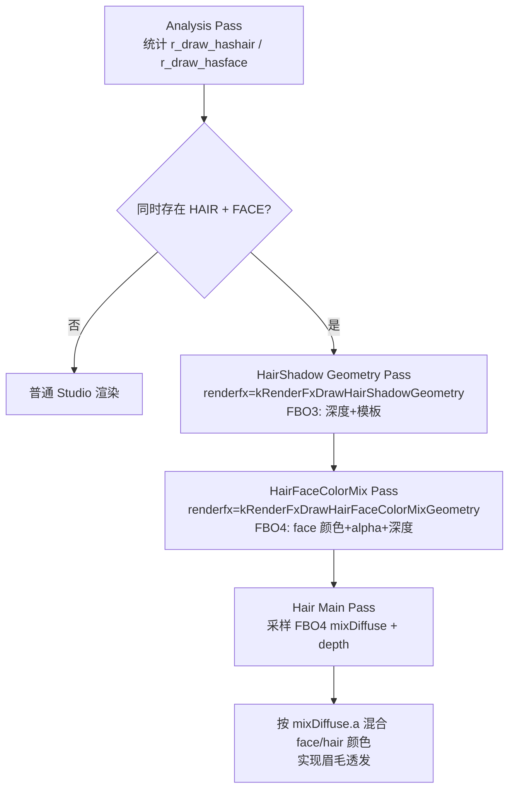

# Eyebrow-Passthrough

## 概述
Eyebrow-Passthrough 是 Renderer/StudioModel 管线中的“眉毛透发”实现：在头发遮挡脸部时，允许眉毛区域依据贴图 alpha 透过后发显示。当前实现采用“多离屏几何预处理 + 头发主通道屏幕空间混色”方案，而不是直接改写头发透明排序。

该实现与 `docs/Renderer.md` 的使用约定一致：
1) 眉毛所在贴图标记 `STUDIO_NF_CELSHADE_FACE`；
2) 头发贴图标记 `STUDIO_NF_CELSHADE_HAIR`；
3) 眉毛像素提供 `< 255` 的 alpha（可来自 replacetexture，或与 specular alpha 混合后得到）。

## 职责
- 在分析阶段识别模型是否同时包含 `FACE` 与 `HAIR` 子网格，并决定是否启用透发相关 pass。
- 通过独立 renderfx 调度两类几何预处理：HairShadow 几何与 HairFaceColorMix 几何。
- 为头发主渲染 pass 绑定 mix diffuse 与 depth 采样输入，在片元阶段进行屏幕空间颜色混合。
- 维护 `studio_texture` 外部配置入口（`flags`/`replacetexture`/`speculartexture`），保证资产侧可控。
- 提供 celshade debug 开关（`r_studio_celshade_debug`）用于调试头部朝向/混色相关问题。

## 涉及文件 (不要带行号)
- docs/Renderer.md
- Plugins/Renderer/enginedef.h
- Plugins/Renderer/gl_common.h
- Plugins/Renderer/gl_local.h
- Plugins/Renderer/gl_studio.cpp
- Plugins/Renderer/gl_rmain.cpp
- Plugins/Renderer/gl_rmisc.cpp
- Plugins/Renderer/gl_draw.cpp
- Plugins/Renderer/gl_draw.h
- Build/svencoop/renderer/shader/common.h
- Build/svencoop/renderer/shader/studio_shader.vert.glsl
- Build/svencoop/renderer/shader/studio_shader.frag.glsl

## 架构
整体流程（当前实现）：

关键实现点：
- 分析开关：`R_StudioHasHairShadow()` 受 `r_studio_hair_shadow` 控制；`R_StudioHasHairFaceColorMix()` 只要求同时有 `FACE/HAIR`。
- HairShadow 几何：在 `HAIR_SHADOW_ENABLED && STUDIO_NF_CELSHADE_HAIR` 时，顶点着色器按 `r_hair_shadow_offset` 做轻微几何偏移；并在模板中区分 `HAS_SHADOW`/`HAS_FACE`，确保脸部在前方时可抑制背后发丝阴影污染。
- HairFaceColorMix 几何：只画 `FACE` 几何，片元分支 `HAIR_FACE_COLOR_MIX_ENABLED` 输出 face 的 `diffuseColor`；若有 specular 贴图，会执行 `diffuseColor.a *= rawSpecularColor.a`，将 specular alpha 混入。
- Hair 主通道混色：`STUDIO_NF_CELSHADE_HAIR && MIX_DIFFUSE_TEXTURE_ENABLED` 时，采样 `mixDiffuseTex` 与 `depthTex`，将深度反推 world pos；仅当 `distance(sceneWorldPos, vWorldPos) < 4.0` 时执行 `mix(mixDiffuseColor.rgb, diffuseColor.rgb, mixDiffuseColor.a)`，避免错误跨层混色。

提交演进（均为 2026-02-06）：
- `4fbc8112b17a15741144ea5044ba02fdcde48deb`：首次针对该问题重构（Fix #789），引入更明确的 Hair/Celshade 相关离屏采样路径与 depth 参与。
- `adbe72ed688f7486c1a7397d85dc36ab3bfafdfa`：核心版本，正式引入 `kRenderFxDrawHairShadowGeometry` + `kRenderFxDrawHairFaceColorMixGeometry` 双通道，并新增 `STUDIO_HAIR_FACE_COLOR_MIX_ENABLED` / `STUDIO_MIX_DIFFUSE_TEXTURE_ENABLED`；同时移除未使用的 `STUDIO_NF_CELSHADE_HAIR_H`。
- `16d60634d6e30daacf2b8225d436c4114ca76010`：修正 shader 条件分支遗留（去除 `HAIR_H` 条件残留）。
- `97f4c66188ee7538fa1eea981e6539a4c0fc55aa`：修复“眉毛错误穿透后发”边界，引入 depth 采样/反投影邻近判定（当时阈值为 `3.0 * scale`）。
- `85605857dadb85e39bf9624b2f0e486528407d73`：加入调试能力 `r_studio_debug`。
- `355d63b4b1c05c734d4b88c9d9ea830200fee878`：调试能力重命名与收敛为 `r_studio_celshade_debug`，并对应 `CELSHADE_DEBUG_ENABLED`。
- `b4616f937c25271df217226cc1fadd40853d4eca` / `aec1af43db7c0063d08a88c9821d8f9e758fe855` / `b7200abadf6c73d4b78b1666a8893fc43aa2c32f`：连续微调深度邻近阈值，最终落在固定值 `4.0`。

## 依赖
- 模型外部配置体系：`studio_texture` 的 `flags`、`replacetexture`、`speculartexture`。
- Studio 渲染状态位与 renderfx 协议：`STUDIO_NF_CELSHADE_FACE`、`STUDIO_NF_CELSHADE_HAIR`、`STUDIO_HAIR_SHADOW_ENABLED`、`STUDIO_HAIR_FACE_COLOR_MIX_ENABLED`。
- 离屏缓冲资源：`s_BackBufferFBO3`（模板/阴影相关）、`s_BackBufferFBO4`（face mix 颜色+深度），以及 depth/stencil texture view。
- Shader 公共函数：深度反投影与模板读取（`GenerateWorldPositionFromDepth`、`LoadStencilValueFromStencilTexture`）。
- 相关 cvar：`r_studio_celshade`、`r_studio_hair_shadow`、`r_studio_hair_shadow_offset`、`r_studio_celshade_debug`。
- 资产格式支持（间接）：`gl_draw` 对 DX10/HDR 贴图格式（如 BC6H / RGBA16F）支持，配合文档中“diffuse 无 alpha 时用 specular alpha 参与混合”的工作流。

## 注意事项
- 若 `r_studio_celshade=0`，代码会清掉 `STUDIO_NF_CELSHADE_ALLBITS`，透发链路整体失效。
- 必须同模同时存在 `FACE` 与 `HAIR` 标记网格，否则不会进入 HairFaceColorMix 路径。
- 眉毛可见度本质由 face alpha 决定；alpha 越低，透发越明显。
- 现实现最终使用固定邻近阈值 `distance < 4.0`（世界空间），对极端比例模型可能需要额外调校。
- HairShadow pass 与 HairFaceColorMix pass 都依赖离屏深度/模板一致性；FBO 或 depth view 失配会导致混色/遮挡异常。
- `r_studio_celshade_debug` 用于观察 celshade/头部相关调试信息，仅在 face 分支上有意义。

## 调用方（可选）
- `StudioRenderModel_Template`：驱动 analysis pass、HairShadow pass、HairFaceColorMix pass 与 normal pass 的调度。
- `R_StudioDrawMesh_AnalysisPass`：统计 `r_draw_hashair / r_draw_hasface`。
- `R_StudioDrawMesh_DrawPass`：根据 renderfx 与 program state 执行实际绑定与绘制。
- `R_StudioLoadExternalFile_Texture`：读取 `studio_texture` 外部配置并把 `flags` 与外部贴图加载到材质。

## Pass渲染状态设置（按 Pass / Geometry 细分，重点 Stencil）

### Stencil 位定义（Studio view）
- `STENCIL_MASK_HAS_SHADOW = 0x1`
- `STENCIL_MASK_HAS_FACE = 0x2`

### 1) Analysis Pass（`r_draw_analyzingstudio = true`）
- Geometry 行为：仅统计 `r_draw_hashair / r_draw_hasface / r_draw_hasalpha / r_draw_hasadditive`。
- 渲染状态：不进入 HairShadow/HairFaceColorMix 的专用 GPU 状态分支。
- Stencil：无写入（仅做特征收集）。

### 2) HairShadow Geometry Pass（`renderfx = kRenderFxDrawHairShadowGeometry`，目标 `s_BackBufferFBO3`）
- 调度层状态：
  - 绑定 `s_BackBufferFBO3`。
  - `GL_ClearDepthStencil(1.0f, STENCIL_MASK_NONE, STENCIL_MASK_ALL)`。
  - `glDrawBuffer(GL_NONE)`（该 pass 主要用于 depth/stencil 记录）。
- Geometry 过滤：仅 `STUDIO_NF_CELSHADE_HAIR` / `STUDIO_NF_CELSHADE_FACE` 参与。
- Geometry 级 stencil 写入：
  - Face geometry：`GL_BeginStencilWrite(STENCIL_MASK_HAS_FACE, STENCIL_MASK_HAS_FACE | STENCIL_MASK_HAS_SHADOW)`。
  - Hair geometry：`GL_BeginStencilWrite(STENCIL_MASK_HAS_SHADOW, STENCIL_MASK_HAS_SHADOW)`。
- 其他状态：
  - `glDisable(GL_BLEND)`，`glDepthMask(GL_TRUE)`。
  - 默认 `glEnable(GL_CULL_FACE); glCullFace(GL_FRONT)`，若 `STUDIO_NF_DOUBLE_FACE` 则禁用剔除。
- 与透发关系：
  - 该 pass 不直接输出透发颜色，但给 face 分支提供“头发遮挡阴影位”，避免背后头发错误影响前脸。

### 3) HairFaceColorMix Geometry Pass（`renderfx = kRenderFxDrawHairFaceColorMixGeometry`，目标 `s_BackBufferFBO4`）
- 调度层状态：
  - 绑定 `s_BackBufferFBO4`。
  - `GL_ClearColor(0,0,0,1)` + `GL_ClearDepthStencil(...)`。
- Geometry 过滤：仅 `STUDIO_NF_CELSHADE_FACE` 参与。
- Stencil：代码路径明确 `//No need to write stencil here`，本 pass 不做专用 stencil 写入。
- 其他状态：
  - `glDisable(GL_BLEND)`，`glDepthMask(GL_TRUE)`。
- 颜色输出：
  - 输出 face 的 `diffuseColor` 到 FBO4；若存在 specular 贴图，先做 `diffuseColor.a *= rawSpecularColor.a`，让 specular alpha 参与眉毛透发控制。

### 4) Normal Pass（Face geometry）
- 纹理绑定：
  - 在非 HairShadow/HairFaceColorMix 分支下，FACE 几何会尝试绑定 `s_BackBufferFBO3.s_hBackBufferStencilView` 到 `STUDIO_BIND_TEXTURE_STENCIL(6)`，并置位 `STUDIO_STENCIL_TEXTURE_ENABLED`。
- Stencil 用法：
  - Face-celshade 片元阶段读取 `stencilTex`；若命中 `STENCIL_MASK_HAS_SHADOW`，则将 `litOrShadowArea` 置 `0.0`。
- 作用：
  - 把 HairShadow pass 的模板结果转化为脸部明暗控制，保持阴影关系稳定。

### 5) Normal Pass（Hair geometry，透发核心）
- 纹理绑定：
  - 绑定 `s_BackBufferFBO4` color 到 `STUDIO_BIND_TEXTURE_MIX_DIFFUSE(7)`。
  - 绑定 `s_BackBufferFBO4` depth/depth-view 到 `STUDIO_BIND_TEXTURE_DEPTH(8)`。
- 混色逻辑：
  - `STUDIO_NF_CELSHADE_HAIR && MIX_DIFFUSE_TEXTURE_ENABLED` 时，采样 `mixDiffuseTex + depthTex`。
  - 仅当 `distance(sceneWorldPos, vWorldPos) < 4.0` 执行 `mix(mixDiffuseColor.rgb, diffuseColor.rgb, mixDiffuseColor.a)`。
- Stencil：
  - Hair 主通道透发不依赖额外 stencil 写入；主要依赖 FBO4 的 color/depth 重建约束。

### 6) DrawPass 末尾公共状态恢复（每个 mesh 后）
- `glDepthMask(GL_TRUE)`
- `glDisable(GL_BLEND)`
- `glEnable(GL_CULL_FACE)`
- `glEnable(GL_DEPTH_TEST)`
- `glDepthFunc(GL_LEQUAL)`
- `GL_EndStencil()`
