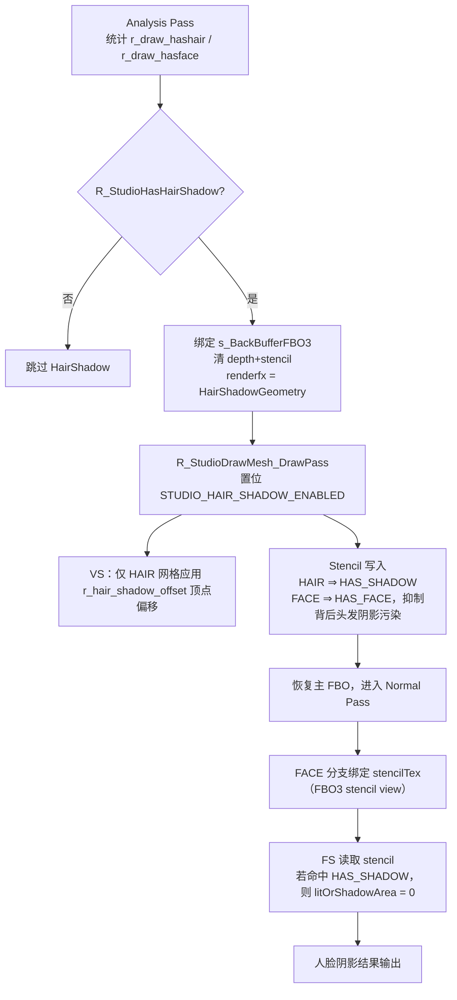

# HairShadow

## 概述
HairShadow 是 `Plugins/Renderer` 中 Studio Celshade 管线的一条“屏幕空间头发阴影”链路：先把头发/脸部几何写入离屏深度模板，再在主渲染的人脸片元阶段按屏幕坐标读取模板位来决定是否强制落入阴影区。

核心目标是：当头发遮挡脸部时，在脸上生成稳定可控的阴影，不依赖传统透明排序。

## 职责
- 在分析阶段识别模型是否同时存在 `STUDIO_NF_CELSHADE_HAIR` 与 `STUDIO_NF_CELSHADE_FACE` 网格。
- 通过独立 `renderfx`（`kRenderFxDrawHairShadowGeometry`）触发 HairShadow 几何 pass。
- 在 HairShadow pass 中区分“头发阴影位”和“脸部遮挡位”的 stencil 写入策略。
- 在主渲染 pass 为人脸绑定并采样 `s_BackBufferFBO3` 的 stencil texture，按屏幕空间位置做阴影判定。
- 暴露运行时与模型级参数入口（`r_studio_hair_shadow`、`r_studio_hair_shadow_offset`、`studio_celshade_control.hair_shadow_offset`）。

## 涉及文件 (不要带行号)
- docs/Renderer.md
- Plugins/Renderer/enginedef.h
- Plugins/Renderer/gl_common.h
- Plugins/Renderer/gl_local.h
- Plugins/Renderer/gl_rmain.cpp
- Plugins/Renderer/gl_studio.cpp
- Build/svencoop/renderer/shader/common.h
- Build/svencoop/renderer/shader/studio_shader.vert.glsl
- Build/svencoop/renderer/shader/studio_shader.frag.glsl

## 架构
整体流程：

关键实现点：
- 启用条件：`R_StudioHasHairShadow()` 要求 `r_draw_hashair && r_draw_hasface && r_studio_hair_shadow>0 && !R_IsRenderingShadowView()`。
- pass 调度：`StudioRenderModel_Template` 在 analysis 后执行 HairShadow pass（`renderfx = kRenderFxDrawHairShadowGeometry`），并将绘制目标切到 `s_BackBufferFBO3`。
- shader 变体：`STUDIO_HAIR_SHADOW_ENABLED` 会注入 `#define HAIR_SHADOW_ENABLED`，走专用分支。
- 顶点偏移：`studio_shader.vert.glsl` 仅对 `HAIR_SHADOW_ENABLED && STUDIO_NF_CELSHADE_HAIR` 网格偏移，偏移参数来自 `r_hair_shadow_offset`。
- 屏幕空间判定：`studio_shader.frag.glsl` 的 face-celshade 分支在 `STENCIL_TEXTURE_ENABLED` 下读取 `stencilTex`，命中 `STENCIL_MASK_HAS_SHADOW` 则把 `litOrShadowArea` 置为 `0.0`。

## 依赖
- 网格标记：`STUDIO_NF_CELSHADE_FACE`、`STUDIO_NF_CELSHADE_HAIR`（来自 `studio_texture` 外部配置）。
- 渲染状态位：`STUDIO_HAIR_SHADOW_ENABLED`、`STUDIO_STENCIL_TEXTURE_ENABLED`。
- renderfx 协议：`kRenderFxDrawHairShadowGeometry`。
- FBO 资源：`s_BackBufferFBO3`（`GL_RGBA8 + GL_DEPTH24_STENCIL8`，并提供 stencil view 采样）。
- 纹理槽位：`STUDIO_BIND_TEXTURE_STENCIL = 6`。
- Shader 公共函数/常量：`LoadStencilValueFromStencilTexture`、`STENCIL_MASK_HAS_SHADOW`、`STENCIL_MASK_HAS_FACE`。
- 参数来源：
  - 全局 cvar：`r_studio_hair_shadow`、`r_studio_hair_shadow_offset`。
  - 模型级覆盖：`studio_celshade_control` 的 `hair_shadow_offset`（由 `R_StudioLoadExternalFile_Celshade` 解析）。

## 注意事项
- `r_studio_celshade=0` 时会清除 `STUDIO_NF_CELSHADE_ALLBITS`，HairShadow 链路整体失效。
- 必须同模同时存在 FACE+HAIR 标记网格，否则 `R_StudioHasHairShadow()` 不成立。
- HairShadow pass 主要用于 depth/stencil 写入（`glDrawBuffer(GL_NONE)`），不是直接颜色输出 pass。
- 人脸阴影判定依赖 `s_BackBufferFBO3.s_hBackBufferStencilView`；若 stencil view 不可用，face 分支将拿不到阴影遮挡信息。
- 代码注释称 `r_studio_hair_shadow_offset` 为“screen space offset”，但实现上是对头发顶点做几何偏移后再投影到屏幕。
- HairShadow 不在 ShadowView 中运行（`!R_IsRenderingShadowView()`），避免与阴影贴图视角混用。

## 调用方（可选）
- `StudioRenderModel_Template`：驱动 Analysis -> HairShadow pass -> Normal pass。
- `R_StudioDrawMesh_AnalysisPass`：统计 `r_draw_hashair / r_draw_hasface`。
- `R_StudioDrawMesh_DrawPass`：
  - 识别 `kRenderFxDrawHairShadowGeometry` 并置位 `STUDIO_HAIR_SHADOW_ENABLED`；
  - 在 normal pass 给 face 分支绑定 stencil texture。
- `R_UseStudioProgram`：按 `StudioProgramState` 生成/选择 `HAIR_SHADOW_ENABLED` shader 变体。

## Pass渲染状态设置（按 Geometry 细分，重点 Stencil）

### Stencil 位语义
- `STENCIL_MASK_HAS_SHADOW = 0x1`：标记“头发阴影几何”。
- `STENCIL_MASK_HAS_FACE = 0x2`：标记“脸部几何”。

### 1) Analysis Pass（特征统计）
- 入口：`r_draw_analyzingstudio = true` 时走 `R_StudioDrawMesh_AnalysisPass`。
- Geometry 处理：
  - 普通路径仅统计 `r_draw_hashair / r_draw_hasface / r_draw_hasalpha / r_draw_hasadditive`。
  - 不做 HairShadow 专用渲染状态切换。
- Stencil：无写入（仅统计标记，不做 stencil 操作）。

### 2) HairShadow Geometry Pass（`kRenderFxDrawHairShadowGeometry`）
- 调度层（`StudioRenderModel_Template`）：
  - 绑定 `s_BackBufferFBO3`。
  - `GL_ClearDepthStencil(1.0f, STENCIL_MASK_NONE, STENCIL_MASK_ALL)` 清空 depth/stencil。
  - `glDrawBuffer(GL_NONE)`，该 pass 以 depth/stencil 写入为主。
- Geometry 筛选（`R_StudioDrawMesh_DrawPass`）：
  - 仅 `STUDIO_NF_CELSHADE_HAIR` 或 `STUDIO_NF_CELSHADE_FACE` 网格参与；其它网格直接 `return`。
- Stencil 设置（核心）：
  - Face geometry：`GL_BeginStencilWrite(STENCIL_MASK_HAS_FACE, STENCIL_MASK_HAS_FACE | STENCIL_MASK_HAS_SHADOW)`。
    - 目的：当前景脸部存在时，抑制背后头发阴影对脸部的错误污染。
  - Hair geometry：`GL_BeginStencilWrite(STENCIL_MASK_HAS_SHADOW, STENCIL_MASK_HAS_SHADOW)`。
    - 目的：仅写入阴影位，供后续 face 片元读取。
- 深度/混合/光栅：
  - `glDisable(GL_BLEND)`，`glDepthMask(GL_TRUE)`。
  - 默认 `glEnable(GL_CULL_FACE); glCullFace(GL_FRONT)`；若 `STUDIO_NF_DOUBLE_FACE` 则关闭剔除。
- Pass 收尾：恢复 `glDrawBuffer(GL_COLOR_ATTACHMENT0)` 并绑定回原 FBO。

### 3) HairFaceColorMix Geometry Pass（`kRenderFxDrawHairFaceColorMixGeometry`）
- 调度层（`StudioRenderModel_Template`）：
  - 绑定 `s_BackBufferFBO4`。
  - `GL_ClearColor(0,0,0,1)` + `GL_ClearDepthStencil(...)`。
- Geometry 筛选：
  - 仅 `STUDIO_NF_CELSHADE_FACE` 网格参与；非 FACE 网格直接 `return`。
- Stencil 设置：
  - 代码路径显式注明 `//No need to write stencil here`，不做 HairFaceColorMix 专用 stencil 写入。
- 深度/混合：
  - `glDisable(GL_BLEND)`，`glDepthMask(GL_TRUE)`。
- 颜色输出：
  - 此 pass 输出 face `diffuseColor` 到 `s_BackBufferFBO4`；若存在 specular 贴图，先执行 `diffuseColor.a *= rawSpecularColor.a`。

### 4) Normal Pass（Face Geometry）
- 纹理绑定条件：
  - 若当前 geometry 是 `STUDIO_NF_CELSHADE_FACE` 且不在 HairShadow/HairFaceColorMix pass，尝试绑定 `s_BackBufferFBO3.s_hBackBufferStencilView` 到 `STUDIO_BIND_TEXTURE_STENCIL(6)`，并置位 `STUDIO_STENCIL_TEXTURE_ENABLED`。
- Stencil 使用方式：
  - 该阶段主要是“读 stencil”而非“写 stencil”。
  - `studio_shader.frag.glsl` 的 face-celshade 分支中，读取 `stencilTex`：
    - 命中 `STENCIL_MASK_HAS_SHADOW` 时，`litOrShadowArea = 0.0`，从而把对应脸部像素压入阴影。

### 5) Normal Pass（Hair Geometry）
- 纹理绑定：
  - 绑定 `s_BackBufferFBO4` 的 mix diffuse（slot 7）与 depth（slot 8）用于屏幕空间混色。
- Stencil：
  - 无 HairShadow 专用 stencil 写入逻辑；Hair 阴影效果的关键 stencil 已在 HairShadow Geometry Pass 中生成。

### 6) DrawPass 公共状态恢复（每次 mesh 绘制后）
- `glDepthMask(GL_TRUE)`
- `glDisable(GL_BLEND)`
- `glEnable(GL_CULL_FACE)`
- `glEnable(GL_DEPTH_TEST)`
- `glDepthFunc(GL_LEQUAL)`
- `GL_EndStencil()`
