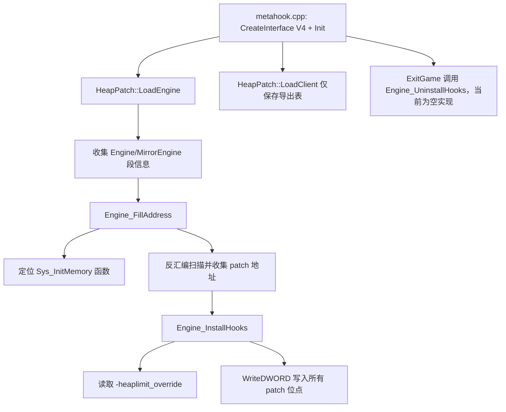

# HeapPatch

## 概述
`HeapPatch` 是一个工具型插件，用于在引擎启动后定位 `Sys_InitMemory` 相关的堆大小立即数，并将其改写为更大的阈值，从而缓解 GoldSrc/SvEngine 固定堆限制过小导致的内存不足问题。

## 职责
- 在 `LoadEngine` 阶段收集引擎镜像/真实模块的段信息，并解析 `Sys_InitMemory` 入口地址。
- 通过反汇编遍历 `Sys_InitMemory` 控制流，定位与堆上限相关的 `MOV/CMP imm` 立即数字段地址。
- 根据默认值或启动参数 `-heaplimit_override`（MB）将目标立即数改写为新的字节数。
- 兼容 mirror engine 场景，通过 RVA/VA 映射在镜像空间与真实引擎空间间转换地址。

## 涉及文件 (不要带行号)
- `Plugins/HeapPatch/plugins.cpp`
- `Plugins/HeapPatch/plugins.h`
- `Plugins/HeapPatch/privatehook.cpp`
- `Plugins/HeapPatch/privatehook.h`
- `Plugins/HeapPatch/exportfuncs.cpp`
- `Plugins/HeapPatch/exportfuncs.h`
- `Plugins/HeapPatch/enginedef.h`
- `Plugins/HeapPatch/HeapPatch.vcxproj`
- `MetaHook.sln`
- `scripts/build-Plugins.bat`
- `Build/svencoop/metahook/configs/plugins_goldsrc.lst`
- `Build/svencoop/metahook/configs/plugins_svencoop.lst`
- `src/metahook.cpp`

## 架构
核心流程围绕 `IPluginsV4` 生命周期展开：

关键实现点：
- `Engine_FillAddress_Sys_InitMemory`：通过字符串 `"Available memory less than"` 反向定位 `Sys_InitMemory`，并在 mirror/real dll 间做地址空间转换。
- `Engine_FillAddress_Sys_InitMemory_Patches`：使用 `DisasmRanges` 遍历分支，匹配 `MOV/CMP` 立即数；
  - `ENGINE_SVENGINE`：匹配 `0x20000000`（512MB）
  - 非 `ENGINE_SVENGINE`：匹配 `0x2000000`（32MB，旧构建）、`0x2800000`（40MB）或 `0x8000000`（128MB，新构建）
- `Engine_InstallHooks`：默认上限 256MB；若提供 `-heaplimit_override`，范围会被钳制到 `[32, 1024]` MB，然后写回所有 patch 地址。

## 依赖
- MetaHook API：`SearchPattern` / `ReverseSearchFunctionBeginEx` / `DisasmRanges` / `WriteDWORD` / `GetEngineType` / `GetEngineBuildnum` / 段查询接口。
- Capstone：用于指令级解析（`privatehook.cpp`，工程中含 `$(CapstoneIncludeDirectory)` 与 `$(CapstoneCheckRequirements)`）。
- 插件系统生命周期：由 `src/metahook.cpp` 统一调度 `Init/LoadEngine/LoadClient/ExitGame/Shutdown`。
- 构建与加载集成：`MetaHook.sln`、`scripts/build-Plugins.bat`、`plugins_goldsrc.lst`、`plugins_svencoop.lst`。

## 注意事项
- `Engine_UninstallHooks()` 当前为空：该插件属于“写入即生效”的一次性补丁，不会在 `ExitGame` 回滚原立即数。
- patch 位点强依赖签名与反汇编结果；若 `Sys_InitMemory` 模式变化且未命中，会触发 `Sys_Error("Sys_InitMemory imm not found")`。
- `-heaplimit_override` 单位是 MB，并被强制限制在 `32~1024`；超范围值会被钳制。
- `g_Sys_InitMemory_Patches` 通过控制流遍历收集，受 `max_insts=1000` 与 `max_depth=16` 限制，极端指令布局可能漏检。
- `privatehook.cpp` 顶部定义了多组 `SYS_INITMEMORY_SIG_*` 常量，但当前主流程实际使用的是字符串 + push/call 反向定位路径。

## 调用方（可选）
- `src/metahook.cpp`：
  - 创建插件 API 后调用 `IPluginsV4::Init`。
  - 在引擎加载阶段循环调用 `IPluginsV4::LoadEngine`。
  - 在客户端导出表就绪后调用 `IPluginsV4::LoadClient`。
  - 在退出流程调用 `IPluginsV4::ExitGame` 与 `IPluginsV4::Shutdown`。
- 插件加载清单：`Build/svencoop/metahook/configs/plugins_goldsrc.lst` 与 `plugins_svencoop.lst` 均包含 `HeapPatch.dll`。