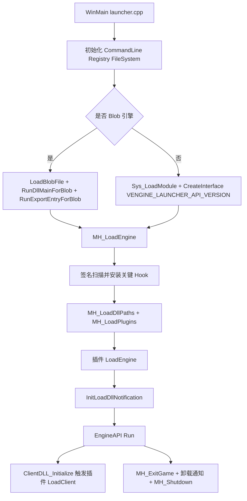

# MetaHook

## 概述
`MetaHook` 是 Loader 侧核心源码集合，负责启动游戏引擎（普通 PE 或 legacy blob）、定位引擎内部关键符号、安装 Hook、加载并驱动插件生命周期、转发 DLL 加载通知，以及在退出时回收资源。主执行链路以 `src/launcher.cpp` 为入口，以 `src/metahook.cpp` 为核心逻辑实现。

## 职责
- 启动与重启控制：解析命令行、初始化注册表/文件系统、选择并加载 `hw.dll/sw.dll`，执行 `IEngineAPI::Run`。
- 引擎适配与符号定位：按引擎类型（GoldSrc/SvEngine/HL25/blob）在代码段中做签名扫描与反汇编定位（build number、`ppEngfuncs`、`ppExportFuncs`、`gClientUserMsgs`、`cl_parsefuncs`、studio 接口等）。
- Hook 基础设施：提供 inline/VFT/IAT/inline-patch 四类 hook，支持事务式提交（批量登记后统一 commit）。
- 插件生命周期管理：按 `plugins.lst` 读取插件，协商 V4/V3/V2/V1 接口并调用 `Init/LoadEngine/LoadClient/ExitGame/Shutdown`。
- Blob 模块加载：识别 blob 文件、解码+重定位+导入修复+入口调用，支持 blob 导入表 hook 查询。
- DLL 加载通知：统一向插件分发 blob/Ldr 的 load/unload 事件，并携带 engine/client/blob/critical-region 标记。
- 运行期能力暴露：通过 `gMetaHookAPI` / `gMetaHookAPI_LegacyV2` 向插件暴露内存读写、反汇编、模式搜索、模块查询、线程池、通知注册等能力。

## 涉及文件 (不要带行号)
- src/launcher.cpp
- src/metahook.cpp
- src/LoadBlob.cpp
- src/LoadBlob.h
- src/LoadDllNotification.cpp
- src/LoadDllNotification.h
- src/commandline.cpp
- src/registry.cpp
- src/sys_launcher.cpp
- src/Z.cpp
- src/sys.h
- include/metahook.h
- include/Interface/IPlugins.h

## 架构
运行期主流程：

关键源码分工：
- `launcher.cpp`：进程入口、单实例互斥、引擎 DLL 选择、engine run 循环、重启/视频模式回退。
- `metahook.cpp`：核心状态与 API 表、符号扫描、hook 管理、插件加载与生命周期、镜像 DLL、线程池。
- `LoadBlob.cpp`：blob 格式校验/解码/装载/卸载、blob 查询、blob IAT hook。
- `LoadDllNotification.cpp`：`LdrRegisterDllNotification` 优先、`LdrLoadDll` detour 兜底、统一事件分发。
- `commandline.cpp`：命令行解析与改写，支持 `@file` 参数展开。
- `registry.cpp`：`HKCU\Software\Valve\Half-Life\Settings` 读写封装。
- `sys_launcher.cpp`：可执行路径与长路径工具函数。
- `Z.cpp`：`.blob` 段静态缓冲（仅 blob-support/debug 构建启用）。

## 依赖
- 内部接口：`metahook.h`、`IPlugins.h`、`IEngineAPI.h`、`IFileSystem/IFileSystem_HL25`、`ICommandLine`、`IRegistry`。
- 第三方能力：Detours（inline detour）、Capstone（反汇编/指令扫描）、MemoryModule/LoadDllMemoryApi（镜像 DLL 只读加载与重定位）。
- 运行时资源：`<game>\metahook\configs\plugins.lst`、`<game>\metahook\plugins\*.dll`、`<game>\metahook\dlls`（递归加入 PATH）。
- 插件 ABI：优先协商 `METAHOOK_PLUGIN_API_VERSION_V4`，依次回退到 V3/V2/V1。

## 注意事项
- 插件调用顺序与 `plugins.lst` 书写顺序相反：`MH_LoadPlugin` 采用链表头插，`LoadEngine/LoadClient` 按链表从头遍历。
- `MH_LoadPlugins` 中 `_SSE.dll` 分支出现重复尝试（同条件两次）。
- `MH_FreeHooksForModule` 当前为 `TODO`，但 unload 通知路径中已调用该函数，模块卸载后的 hook 回收逻辑并未真正实现。
- `LoadDllNotification` 在 `Ldr` critical region 内也会分发回调；插件回调若做阻塞或重入敏感操作，需要自行规避。
- blob 支持受编译宏限制（`METAHOOK_BLOB_SUPPORT`）；非支持构建会直接报错要求使用 `metahook_blob.exe`。
- `MH_LoadEngine` 依赖大量签名/反汇编定位，若引擎二进制布局变化，可能触发 `MH_SysError` 提前终止。
- `launcher.cpp` 存在未参与当前主流程的辅助代码（如 `SetActiveProcess` 未被调用）。

## 调用方（可选）
- 启动调用方：`WinMain`（`src/launcher.cpp`）直接调用 `MH_LoadEngine` / `MH_ExitGame` / `MH_Shutdown`。
- 引擎回调调用方：引擎在初始化 client 时回调 `ClientDLL_Initialize`，由 MetaHook 接管并触发插件 `LoadClient`。
- 插件调用方：插件通过 `IPluginsV2+::Init` 获得 `metahook_api_t` 与 `mh_interface_t` 后反向调用 Loader 暴露能力。