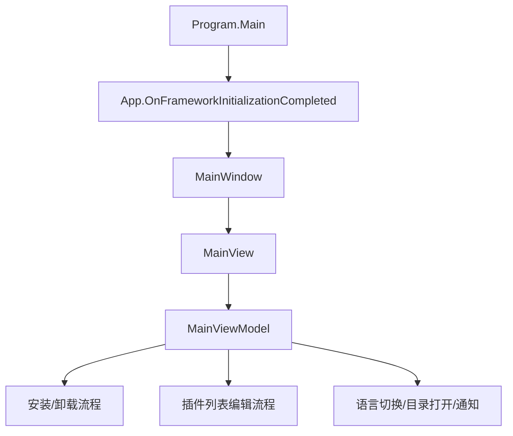
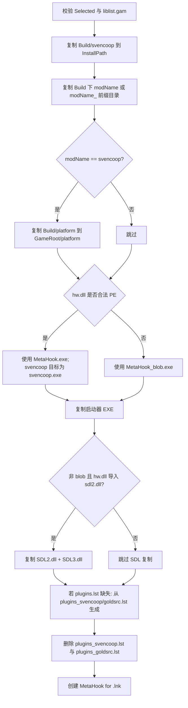

# MetahookInstaller

## 概述
`toolsrc/MetahookInstaller` 是一个基于 Avalonia + ReactiveUI 的 Windows 安装器工具（.NET 8）。它负责把仓库 `Build/` 目录中的 MetaHook 运行文件部署到目标 GoldSrc/Sven Co-op 游戏目录，并提供 `plugins.lst` 的可视化编辑能力（启用/禁用、排序、保存）。

## 职责
- 自动发现 Steam 安装路径与 Steam Library，推断预设游戏的安装目录并生成可选 Mod 列表。
- 执行安装流程：复制基础目录/Mod 目录、选择 `MetaHook.exe` 或 `MetaHook_blob.exe`、按需复制 `SDL2.dll/SDL3.dll`、落地 `plugins.lst`、创建启动快捷方式。
- 执行卸载流程：删除安装器已知目录/文件（含快捷方式），并给出通知反馈。
- 提供插件编辑器：读取 `metahook/configs/plugins.lst` 与 `metahook/plugins/*.dll`，支持拖拽排序、列表迁移、启用状态编辑、持久化保存。
- 提供辅助功能：语言切换（`zh-CN` / `en-US`）、常用目录快速打开、Toast/Notification 提示。

## 涉及文件 (不要带行号)
- `toolsrc/MetahookInstaller/Directory.Build.props`
- `toolsrc/MetahookInstaller/MetahookInstallerAvalonia.Desktop/Program.cs`
- `toolsrc/MetahookInstaller/MetahookInstallerAvalonia.Desktop/MetahookInstallerAvalonia.Desktop.csproj`
- `toolsrc/MetahookInstaller/MetahookInstallerAvalonia.Desktop/app.manifest`
- `toolsrc/MetahookInstaller/MetahookInstallerAvalonia.Desktop/Properties/PublishProfiles/FolderProfile.pubxml`
- `toolsrc/MetahookInstaller/MetahookInstallerAvalonia/MetahookInstallerAvalonia.csproj`
- `toolsrc/MetahookInstaller/MetahookInstallerAvalonia/App.axaml`
- `toolsrc/MetahookInstaller/MetahookInstallerAvalonia/App.axaml.cs`
- `toolsrc/MetahookInstaller/MetahookInstallerAvalonia/ViewModels/MainViewModel.cs`
- `toolsrc/MetahookInstaller/MetahookInstallerAvalonia/ViewModels/PluginInfo.cs`
- `toolsrc/MetahookInstaller/MetahookInstallerAvalonia/ViewModels/ViewModelBase.cs`
- `toolsrc/MetahookInstaller/MetahookInstallerAvalonia/Handler/Command.cs`
- `toolsrc/MetahookInstaller/MetahookInstallerAvalonia/Behavior/ListBoxDragDrop.cs`
- `toolsrc/MetahookInstaller/MetahookInstallerAvalonia/Styles/ViewStyles.axaml`
- `toolsrc/MetahookInstaller/MetahookInstallerAvalonia/Views/MainWindow.axaml`
- `toolsrc/MetahookInstaller/MetahookInstallerAvalonia/Views/MainWindow.axaml.cs`
- `toolsrc/MetahookInstaller/MetahookInstallerAvalonia/Views/MainView.axaml`
- `toolsrc/MetahookInstaller/MetahookInstallerAvalonia/Views/MainView.axaml.cs`
- `toolsrc/MetahookInstaller/MetahookInstallerAvalonia/Views/InstallerPage.axaml`
- `toolsrc/MetahookInstaller/MetahookInstallerAvalonia/Views/EditorPage.axaml`
- `toolsrc/MetahookInstaller/MetahookInstallerAvalonia/Lang/Resources.resx`
- `toolsrc/MetahookInstaller/MetahookInstallerAvalonia/Lang/Resources.zh-CN.resx`
- `MetaHook.sln`
- `scripts/install-helper-AIO.bat`
- `scripts/install-helper-CopyBuild.bat`
- `scripts/install-helper-CopySDL2.bat`
- `scripts/install-helper-CreateShortcut.bat`

## 架构
整体采用 **Desktop Host + Avalonia UI + ViewModel 业务编排** 的结构。

关键对象与数据结构：
- `MainViewModel`：核心业务编排（安装、卸载、Steam 发现、插件编辑、命令装配）。
- `ModInfo`：目标游戏/Mod 描述（`Name/Directory/AppID/GamePath/InstallPath`）。
- `PluginInfo`：插件条目（`Name/Enabled/Index`）。
- `PluginInfoComparer`：用于插件名去重（大小写不敏感比较）。
- `ItemsListBoxDropHandler`：插件列表拖拽行为（Move/Swap/Copy）并回写索引。

安装主流程（`MainViewModel.InstallMod`）：

插件编辑流程（Page 2）：
- `InitPluginList`：读取 `plugins.lst` 得到已配置列表；扫描 `metahook/plugins/*.dll` 生成可用列表；按插件名去重并计算显示索引。
- `ToAvaliableCommand` / `ToPluginsCommand`：在“已启用/可用”列表之间移动条目。
- 拖拽行为由 `ItemsListBoxDropHandler` 实现顺序调整，完成后统一调用 `RecaculatePluginIndex`。
- `SavePluginList`：将 `_plugins` 回写为 `plugins.lst`，禁用项以前缀 `;` 表示。

## 依赖
- 外部库（NuGet）：`Avalonia`、`ReactiveUI.Avalonia`、`Irihi.Ursa`、`Semi.Avalonia`、`Xaml.Behaviors.Avalonia`、`securifybv.ShellLink`。
- Windows 依赖：注册表 `HKCU\Software\Valve\Steam`（读取 SteamPath）、`explorer.exe`、`.lnk` 快捷方式写入。
- 仓库内契约依赖：
  - `Build/` 目录内容（`MetaHook.exe` / `MetaHook_blob.exe` / `svencoop` / `platform` / `SDL2.dll` / `SDL3.dll` 等）。
  - 游戏目录结构（`<mod>/liblist.gam`、`metahook/configs/plugins*.lst`、`metahook/plugins/*.dll`）。
- 解决方案集成：`MetaHook.sln` 的 `Tools` 分组中包含 `MetahookInstallerAvalonia` 与 `MetahookInstallerAvalonia.Desktop`。
- 历史脚本链路：`scripts/install-helper-*.bat` 与该 GUI 工具职责重叠，说明安装器逻辑由批处理向 UI 工具演进。

## 注意事项
- `HasImportedModule` 用 `BinaryReader.ReadString()` 读取 PE 导入模块名（PE 中通常是 C 风格零结尾字符串），存在解析不稳风险，可能导致 SDL 依赖判定为假阴性。
- `PluginInfoComparer` 的 `Equals` 是大小写不敏感，但 `GetHashCode` 直接用默认 `string.GetHashCode()`，与比较语义不完全一致，可能造成 `Distinct` 去重边界异常。
- 路径发现与配置文件读写大量依赖当前工作目录（如 `./Build`、`./lang`），若启动目录变化，可能出现“找不到 Build/语言配置”的行为偏差。
- `GetLibraryFolders` / `GetInstallDirFromManifest` 采用行文本拆分解析 VDF/ACF，鲁棒性弱于正式 VDF 解析器；遇到格式变化可能失效。
- 卸载逻辑基于固定白名单路径删除，覆盖面有限且不做备份；用户手工放入同路径下的内容存在被删除风险。
- 桌面工程未显式请求提权；当目标游戏目录在受保护路径（如 `Program Files`）时，安装/卸载可能抛出权限异常（代码中已提示但不自动提权）。

## 调用方（可选）
- 启动调用链：`MetahookInstallerAvalonia.Desktop/Program.cs` -> `App.axaml.cs` -> `MainWindow`（`DataContext = new MainViewModel()`）。
- UI 触发：
  - `InstallerPage.axaml` 触发 `InstallCommand`、`UninstallCommand`。
  - `EditorPage.axaml` 触发 `ToAvaliableCommand`、`ToPluginsCommand`、`ResetCommand`、`SaveCommand`。
  - `MainWindow.axaml` 语言菜单触发 `ChangeLanguageCommand`。
  - `MainView.axaml` 的目录按钮触发 `OpenFolderCommand`。
