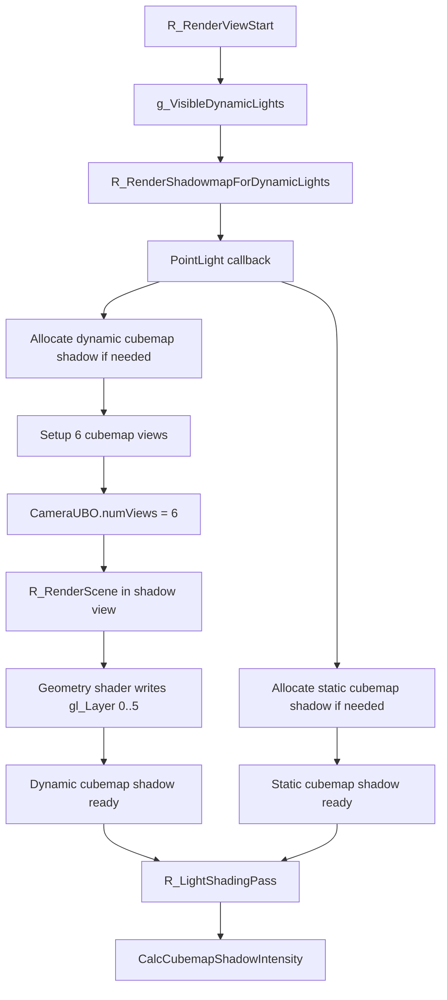

# PointLightShadow

## Overview
PointLightShadow 负责 Renderer 中点光源的阴影贴图生成与延迟光照采样。它以 cubemap shadow mapping 为核心，分别支持静态世界阴影与动态实体阴影，并通过一次多视图绘制把 6 个方向写入同一个立方体深度纹理。

## Responsibilities
- 为带阴影的点光分配或复用 `CCubemapShadowTexture`。
- 在 Shadow pass 中构建 6 个 cubemap 视角的投影矩阵、世界矩阵和 shadow matrix。
- 通过 `CameraUBO.numViews = 6` 与多视图几何着色器，一次 `R_RenderScene()` 输出到 6 个 cubemap 面。
- 在存在静态阴影缓存时，只为动态阴影 pass 绘制不透明实体；在没有静态阴影时同时绘制世界和实体。
- 在 `R_LightShadingPass()` 中把静态和动态 cubemap shadow 纹理绑定到点光 shader，并配合 PCF 完成阴影采样。

## Involved Files & Symbols
- `Plugins/Renderer/gl_light.h` - `CDynamicLight`
- `Plugins/Renderer/gl_light.cpp` - `R_AddVisibleDynamicLight`, `R_IterateVisibleDynamicLights`, `R_LightShadingPass`
- `Plugins/Renderer/gl_shadow.cpp` - `CCubemapShadowTexture`, `R_CreateCubemapShadowTexture`, `R_SetupShadowMatrix`, `R_RenderShadowmapForDynamicLights`
- `Plugins/Renderer/gl_rmain.cpp` - `R_PreRenderView`, `R_RenderScene`
- `Plugins/Renderer/gl_wsurf.cpp` - Shadow view 下的世界表面阴影绘制路径
- `Plugins/Renderer/gl_studio.cpp` - Shadow view 下的 `STUDIO_SHADOW_CASTER_ENABLED`
- `Build/svencoop/renderer/shader/common.h` - `CameraUBO.numViews`
- `Build/svencoop/renderer/shader/wsurf_shader.geom.glsl` - `gl_Layer` 多视图输出
- `Build/svencoop/renderer/shader/studio_shader.geom.glsl` - `gl_Layer` 多视图输出
- `Build/svencoop/renderer/shader/dlight_shader.frag.glsl` - `CalcCubemapShadowIntensity`

## Architecture
点光阴影的帧内流程如下：

1. `R_RenderViewStart()` 先把来自 `g_BSPDynamicLights` 与 `g_EngineDynamicLights` 的可见点光加入 `g_VisibleDynamicLights`。
2. `R_RenderShadowmapForDynamicLights()` 通过 `R_IterateVisibleDynamicLights()` 进入 PointLight callback。
3. 如果 `static_shadow_size > 0`，系统为该点光分配静态 `CCubemapShadowTexture`，并在纹理未 ready 时生成一次世界阴影缓存。
4. 如果 `dynamic_shadow_size > 0`，系统为该点光分配动态 `CCubemapShadowTexture`；该 pass 会启用 `r_draw_shadowview`、`r_draw_multiview`、`r_draw_nofrustumcull`、`r_draw_lineardepth`。
5. CPU 侧为 cubemap 的 6 个方向分别设置 `vieworg`、`viewangles`、`90 x 90` 透视投影、frustum 与 shadow matrix，并把 6 组相机数据写入 `CameraUBO`。
6. `R_RenderScene()` 被调用一次，几何着色器根据 `CameraUBO.numViews` 循环并通过 `gl_Layer` 输出到 cubemap 的 6 个面。
7. 进入 `R_LightShadingPass()` 后，点光 shader 根据 `pStaticShadowTexture` 与 `pDynamicShadowTexture` 的 ready 状态决定是否启用 static cubemap shadow 与 dynamic cubemap shadow 宏，并在片段阶段用 `CalcCubemapShadowIntensity()` 采样。

点光静态与动态阴影的职责分工：
- 静态 cubemap shadow：
  - 只在 `static_shadow_size > 0` 时参与。
  - 主要用于缓存世界几何阴影，是否 ready 由 `c_brush_polys > 0` 决定。
- 动态 cubemap shadow：
  - 面向会变化的实体阴影。
  - 当静态阴影已存在时，动态 pass 只画 `DRAW_CLASSIFY_OPAQUE_ENTITIES`，减少世界重复绘制。
  - 当静态阴影不存在时，动态 pass 绘制 `DRAW_CLASSIFY_WORLD | DRAW_CLASSIFY_OPAQUE_ENTITIES`，保证点光阴影完整。

## Dependencies
- `CDynamicLight` 上的 `static_shadow_size`、`dynamic_shadow_size`、`pStaticShadowTexture`、`pDynamicShadowTexture`。
- `CCubemapShadowTexture` 对 `GL_GenCubemapShadowTexture` 的封装。
- `CameraUBO` 多视图结构与几何着色器 `gl_Layer` 输出能力。
- `R_SetupShadowMatrix()` 负责生成世界坐标到阴影纹理空间的矩阵。
- 延迟光照 shader 中点光阴影分支与 cubemap shadow sampler。

## Notes
- 来自 `cl_dlights` 的普通引擎点光在 `R_ProcessEngineDynamicLights()` 中默认 `shadow = 0`，因此通常不走 PointLightShadow；本专题主要覆盖地图 `light_dynamic` 的点光阴影。
- 点光动态阴影会启用 `r_draw_lineardepth`，因此 shader 使用与光源距离一致的线性深度比较逻辑。
- 如果点光绑定了 `source_entity_index`，该实体会在 shadow pass 中被隐藏，避免自投影污染阴影。
- 点光静态阴影和动态阴影都使用 cubemap 类型，但 ready 状态和绘制分类不同。
- 点光光照阶段可同时绑定 static cubemap shadow 和 dynamic cubemap shadow，shader 中两者共同影响最终阴影结果。

## Callers (optional)
- `Plugins/Renderer/gl_rmain.cpp` - `R_PreRenderView` 调用 `R_RenderShadowMap`
- `Plugins/Renderer/gl_shadow.cpp` - `R_RenderShadowmapForDynamicLights` 中的 PointLight callback 生成 cubemap Shadow Map
- `Plugins/Renderer/gl_light.cpp` - `R_LightShadingPass` 中的 PointLight callback 采样 cubemap shadow
