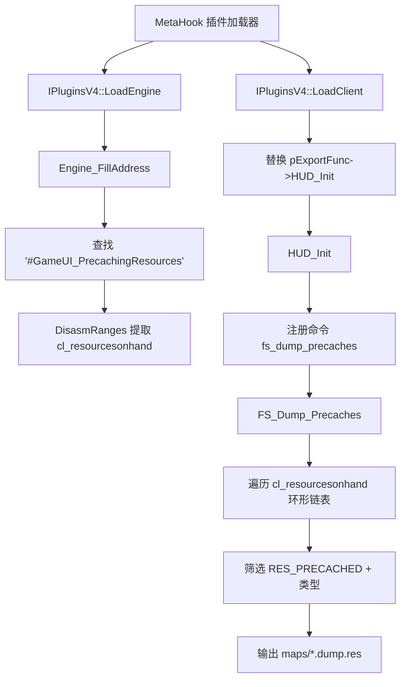

# PrecacheManager

## 概述
`PrecacheManager` 是 MetaHookSv 的工具插件。在客户端初始化后，它注册控制台命令 `fs_dump_precaches`，用于将当前地图的已预缓存资源导出到 `[ModDirectory]\\maps\\[mapname].dump.res`。插件在引擎加载阶段通过签名扫描 + 反汇编定位运行时资源链表头 `cl_resourcesonhand`。

## 职责
- 在 `IPluginsV4::LoadEngine` 阶段初始化插件运行环境（文件系统接口、引擎类型/版本、镜像引擎段信息）。
- 调用 `Engine_FillAddress` 扫描并解析 `cl_resourcesonhand` 地址，建立资源遍历入口。
- 在 `IPluginsV4::LoadClient` 阶段接管 `HUD_Init`，并在 `HUD_Init` 中注册 `fs_dump_precaches` 命令。
- 执行 `FS_Dump_Precaches`：遍历预缓存资源链表，按类型筛选后写出 `.dump.res` 文件。

## 涉及文件 (不要带行号)
- Plugins/PrecacheManager/plugins.cpp
- Plugins/PrecacheManager/plugins.h
- Plugins/PrecacheManager/exportfuncs.cpp
- Plugins/PrecacheManager/exportfuncs.h
- Plugins/PrecacheManager/privatehook.cpp
- Plugins/PrecacheManager/privatehook.h
- include/metahook.h
- include/HLSDK/engine/custom.h
- Build/svencoop/metahook/configs/plugins_goldsrc.lst
- Build/svencoop/metahook/configs/plugins_svencoop.lst
- scripts/build-Plugins.bat
- README.md
- READMECN.md

## 架构
核心由三段流程构成：
1. **插件生命周期接入**（`plugins.cpp`）：`LoadEngine` 收集引擎/文件系统上下文并执行地址解析；`LoadClient` 接管 `HUD_Init`。
2. **地址解析层**（`privatehook.cpp`）：通过 `#GameUI_PrecachingResources` 字符串定位相关代码片段，再用 `DisasmRanges` 扫描指令，识别 `CMP reg, imm` 指向的数据段立即数，映射为真实引擎空间中的 `cl_resourcesonhand`。
3. **命令执行层**（`exportfuncs.cpp`）：`HUD_Init` 注册命令，`FS_Dump_Precaches` 遍历资源双向循环链表并导出文件。

## 依赖
- **MetaHook API**：`GetEngineType`、`GetEngineBuildnum`、`GetMirrorEngineBase`、`GetSectionByName`、`SearchPattern`、`DisasmRanges`、`SysError`。
- **引擎导出表**：`cl_enginefunc_t`（`pfnGetLevelName`、`pfnAddCommand`、`Con_Printf`）。
- **文件系统抽象**：`IFileSystem` / `IFileSystem_HL25`，通过 `FILESYSTEM_ANY_OPEN/CLOSE/WRITE` 统一调用。
- **反汇编能力**：Capstone 的 `cs_insn` 结构用于指令级匹配。
- **资源标志/类型**：`RES_PRECACHED` 以及插件内定义的 `resourcetype_t`、`resource_t`。
- **加载与构建接入**：`plugins_goldsrc.lst`、`plugins_svencoop.lst`、`scripts/build-Plugins.bat`。

## 注意事项
- `FS_Dump_Precaches` 只导出 `t_sound`、`t_model`（且排除 `*` 开头模型）和 `t_generic`；不会导出 decal/eventscript/world 等类型。
- 资源遍历依赖 `cl_resourcesonhand` 已被成功解析；若签名失配，`Sig_VarNotFound` 会触发 `Sys_Error`（通常为致命错误路径）。
- 导出文件名逻辑是“地图名去掉末尾 4 个字符再追加 `.dump.res`”，隐含地图名后缀为 `.bsp` 的假设。
- Sven Co-op 的声音资源还受 `soundcache.txt` 机制影响，导出列表不一定覆盖全部声音资产（README/READMECN 已注明）。
- `private_funcs_t` / `gPrivateFuncs` 与 `GetVFunctionFromVFTable` 在当前版本中未形成完整的 hook 安装路径，属于模板化保留能力。

## 调用方（可选）
- MetaHook 插件框架通过 `EXPOSE_SINGLE_INTERFACE(..., METAHOOK_PLUGIN_API_VERSION_V4)` 驱动 `Init/LoadEngine/LoadClient` 生命周期。
- 控制台命令系统在用户执行 `fs_dump_precaches` 时调用 `FS_Dump_Precaches`。
- `Build/svencoop/metahook/configs/plugins_goldsrc.lst` 与 `Build/svencoop/metahook/configs/plugins_svencoop.lst` 均加载 `PrecacheManager.dll`。