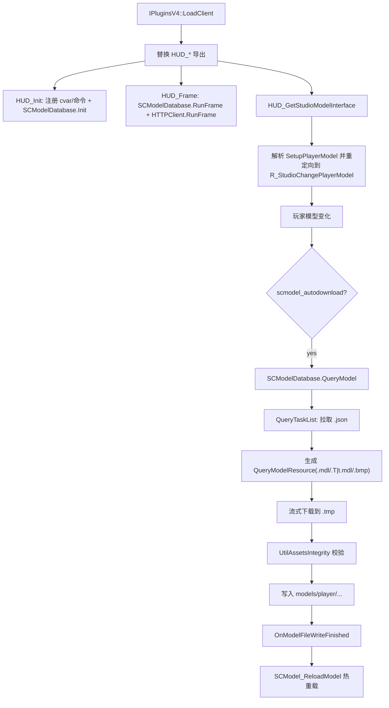

# SCModelDownloader

## 概述
`Plugins/SCModelDownloader` 是 Sven Co-op 客户端玩家模型自动下载插件。它通过接管 `HUD_*` 导出与 `SetupPlayerModel` 调用链，在玩家模型切换时触发异步下载任务，校验并写入模型资源后热重载玩家模型；同时提供 GameUI 设置页、任务页和“切换到新版本模型”交互。

## 职责
- 接管 `HUD_Init/HUD_Frame/HUD_Shutdown/HUD_GetStudioModelInterface`，把数据库初始化、每帧任务驱动、清理逻辑挂到 client 生命周期。
- 拦截 `R_StudioChangePlayerModel` 调用点，在模型切换时按条件（`scmodel_autodownload`）触发 `QueryModel`。
- 维护模型元数据：`models.json`（可用模型索引）与 `versions.json`（旧名 -> 最新版本名映射）。
- 维护查询任务队列与状态机（`Querying/Receiving/Failed/Finished`），并把状态变化分发给 UI。
- 下载资源文件（`.mdl/.T|t.mdl/.bmp`）到临时文件，执行完整性校验后写入目标目录。
- 管理本地玩家“跳过升级模型”列表（`skippedmodels.txt`），支持提示后切换/跳过。
- 提供 VGUI2 界面：设置页（自动下载、下载最新版本、CDN、强制更新数据库）与任务列表页。

## 涉及文件 (不要带行号)
- Plugins/SCModelDownloader/plugins.cpp
- Plugins/SCModelDownloader/plugins.h
- Plugins/SCModelDownloader/exportfuncs.cpp
- Plugins/SCModelDownloader/exportfuncs.h
- Plugins/SCModelDownloader/privatehook.cpp
- Plugins/SCModelDownloader/privatehook.h
- Plugins/SCModelDownloader/SCModelDatabase.cpp
- Plugins/SCModelDownloader/SCModelDatabase.h
- Plugins/SCModelDownloader/UtilHTTPClient.cpp
- Plugins/SCModelDownloader/UtilHTTPClient.h
- Plugins/SCModelDownloader/UtilAssetsIntegrity.cpp
- Plugins/SCModelDownloader/UtilAssetsIntegrity.h
- Plugins/SCModelDownloader/VGUI2ExtensionImport.cpp
- Plugins/SCModelDownloader/VGUI2ExtensionImport.h
- Plugins/SCModelDownloader/BaseUI.cpp
- Plugins/SCModelDownloader/GameUI.cpp
- Plugins/SCModelDownloader/SCModelDownloaderDialog.cpp
- Plugins/SCModelDownloader/SCModelDownloaderDialog.h
- Plugins/SCModelDownloader/SCModelDownloaderSettingsPage.cpp
- Plugins/SCModelDownloader/SCModelDownloaderSettingsPage.h
- Plugins/SCModelDownloader/TaskListPage.cpp
- Plugins/SCModelDownloader/TaskListPage.h
- Plugins/SCModelDownloader/TaskListPanel.cpp
- Plugins/SCModelDownloader/TaskListPanel.h
- Build/svencoop/scmodeldownloader/SCModelDownloaderDialog.res
- Build/svencoop/scmodeldownloader/SCModelDownloaderSettingsPage.res
- Build/svencoop/scmodeldownloader/TaskListPage.res
- Build/svencoop/scmodeldownloader/gameui_english.txt
- Build/svencoop/scmodeldownloader/gameui_schinese.txt
- Build/svencoop/metahook/configs/plugins_svencoop.lst

## 架构
核心由三层组成：
1. **入口与Hook层**（`plugins.cpp` + `exportfuncs.cpp` + `privatehook.cpp`）
   - `LoadClient` 覆盖 HUD 导出函数。
   - `HUD_GetStudioModelInterface` 中解析 `SetupPlayerModel`，定位并 patch 调向插件版 `R_StudioChangePlayerModel`。
2. **下载与状态机层**（`SCModelDatabase.cpp`）
   - `CSCModelDatabase` 持有任务队列、数据库、版本映射、回调列表。
   - 任务类型：`QueryDatabase`、`QueryVersions`、`QueryTaskList`、`QueryModelResource`。
3. **UI与交互层**（`GameUI.cpp` + 对话框/页面）
   - 显示下载任务状态。
   - 提供配置项与强制更新。
   - 本地玩家换模时弹窗提示切换最新版本或跳过。

补充流程：
- `RunFrame` 还会监听本地玩家当前模型变化，并触发 `ISCModelLocalPlayerModelChangeHandler`；`GameUI.cpp` 中据此检查 `versions.json` 映射，提示切换到更新版本。
- 模型仓库使用分片：`repoId = SCModel_Hash(lowerName) % 32`，文件清单从 `scmodels_data_<repoId>` 拉取。

## 依赖
- **MetaHook/引擎接口**：`metahook_api_t`、`cl_enginefunc_t`、`engine_studio_api_t`、文件系统宏（`FILESYSTEM_ANY_*`）。
- **动态库（运行时）**：
  - `UtilHTTPClient_libcurl.dll`（优先）或 `UtilHTTPClient_SteamAPI.dll`（fallback）
  - `UtilAssetsIntegrity.dll`
  - `VGUI2Extension.dll`（UI回调注册依赖）
- **第三方库（编译时）**：RapidJSON、Capstone、ScopeExit。
- **网络端点**：
  - `https://raw.githubusercontent.com/wootguy/pmodels/.../models.json`
  - `https://raw.githubusercontent.com/wootguy/scmodels/.../versions.json`
  - `https://wootdata.github.io/scmodels_data_<id>/models/player/...`
  - `https://cdn.jsdelivr.net/...`（`scmodel_cdn=1` 时）
- **本地数据/资源**：
  - `scmodeldownloader/models.json`
  - `scmodeldownloader/versions.json`
  - `scmodeldownloader/skippedmodels.txt`
  - `models/player/<name>/...`（下载产物）
  - `Build/svencoop/scmodeldownloader/*.res, gameui_*.txt`

## 注意事项
- 当前签名定位 `R_StudioChangePlayerModel` 的核心路径仅在 `ENGINE_SVENGINE` 分支实现，且该插件也只在 `plugins_svencoop.lst` 中启用。
- `BuildQueryList` 中已有注释提示：当数据库尚未可用时，模型查询可能失败；需要依赖后续数据库任务完成后再次触发查询。
- 失败重试固定为 5 秒（`OnFailure` 设置 `m_flNextRetryTime`），网络抖动场景会持续重试。
- `GetNewerVersionModel` 返回 `m_VersionMapping` 内部 `std::string` 的 `c_str()`；调用方应视为短期可用指针，不应长期缓存。
- `EngineStudio_FillAddress_SetupPlayerModel` 基于反汇编模式匹配定位 `DM_PlayerState` 与 callsite，受引擎二进制变化影响较大。
- UI回调中存在若干空实现（`Start/Shutdown/RunFrame` 等），当前主要功能集中在 KeyValues/TaskBar 回调与数据库回调。

## 调用方（可选）
- 插件加载链：`IPluginsV4::LoadClient` 将 `HUD_*` 导出替换为本插件实现。
- 运行时引擎调用链：`SetupPlayerModel` 被 patch 后调用到 `R_StudioChangePlayerModel`，触发自动下载入口。
- UI调用链：
  - `CTaskListPage` 通过 `RegisterQueryStateChangeCallback` + `EnumQueries` 刷新任务列表。
  - `CSCModelDownloaderSettingsPage` 调 `BuildQueryDatabase/BuildQueryVersions` 强制更新。
  - `CSCModelLocalPlayerModelChangeHandler` 调 `GetNewerVersionModel/QueryModel/AddSkippedModel`。