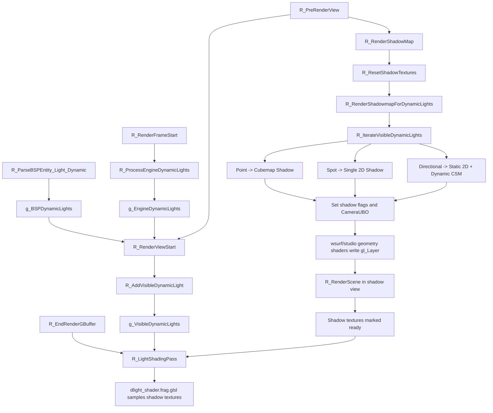

# ShadowMapping

## Overview
Renderer 的动态光 Shadow Mapping 系统在主场景 G-Buffer 几何阶段之前生成每个可见动态光的深度阴影纹理，并在延迟光照阶段按光源类型采样这些纹理。系统把引擎 `cl_dlights` 与地图 `light_dynamic` 实体统一为 `CDynamicLight`，再通过同一套遍历回调分别处理点光、聚光和方向光。

## Responsibilities
- 将引擎动态光和地图动态光统一映射到 `CDynamicLight`，保存阴影尺寸、CSM 参数与阴影纹理句柄。
- 在每个视图开始前构建 `g_VisibleDynamicLights`，只保留当前帧需要参与光照和阴影的光源。
- 根据光源类型分配或复用阴影纹理：点光使用 cubemap，聚光使用单层 2D，方向光使用单层静态正交阴影和动态 CSM 纹理数组。
- 通过 `r_draw_shadowview`、`r_draw_multiview`、`r_draw_lineardepth` 等状态复用 `R_RenderScene()` 生成 Shadow Map，而不是维护一套独立几何管线。
- 在 `R_LightShadingPass()` 中把阴影矩阵、级联距离和深度纹理绑定到动态光着色器，完成延迟光照中的阴影衰减。
- 通过 `IShadowTexture` 层次结构管理纹理大小、viewport、ready 状态、shadow matrix 和 CSM 分级距离。

## Involved Files & Symbols
- `Plugins/Renderer/gl_rmain.cpp` - `R_RenderFrameStart`, `R_PreRenderView`, `R_RenderViewStart`, `R_RenderScene`, `R_EndRenderOpaque`
- `Plugins/Renderer/gl_light.h` - `CDynamicLight`, `CVisibleDynamicLightEntry`
- `Plugins/Renderer/gl_light.cpp` - `R_ProcessEngineDynamicLights`, `R_AddVisibleDynamicLight`, `R_IterateVisibleDynamicLights`, `R_LightShadingPass`, `R_EndRenderGBuffer`, `g_EngineDynamicLights`, `g_BSPDynamicLights`, `g_VisibleDynamicLights`
- `Plugins/Renderer/gl_shadow.h` - `IShadowTexture`, `R_ShouldRenderShadow`, `R_RenderShadowMap`
- `Plugins/Renderer/gl_shadow.cpp` - `CBaseShadowTexture`, `CSingleShadowTexture`, `CCubemapShadowTexture`, `CCascadedShadowTexture`, `R_ShouldCastShadow`, `R_SetupShadowMatrix`, `R_RenderShadowmapForDynamicLights`, `R_ResetShadowTextures`
- `Plugins/Renderer/gl_wsurf.cpp` - `R_ParseBSPEntity_Light_Dynamic`, `R_DrawWorldSurfaceLeafShadow`, `R_DrawWorldSurfaceModelShadowProxy`
- `Plugins/Renderer/gl_studio.cpp` - Shadow view 下的 `STUDIO_SHADOW_CASTER_ENABLED` 分支
- `Build/svencoop/renderer/shader/common.h` - `CSM_LEVELS`, `CameraUBO.numViews`
- `Build/svencoop/renderer/shader/wsurf_shader.geom.glsl` - 多视图输出到 `gl_Layer`
- `Build/svencoop/renderer/shader/studio_shader.geom.glsl` - 多视图输出到 `gl_Layer`
- `Build/svencoop/renderer/shader/dlight_shader.frag.glsl` - `CalcShadowIntensityLinear`, `CalcCSMShadowIntensity`, `CalcCubemapShadowIntensity`

## Architecture
Shadow Mapping 的帧内流程分为“光源准备 → Shadow Map 生成 → 延迟光照采样”三段：

1. `R_RenderFrameStart()` 调用 `R_ProcessEngineDynamicLights()`，把 `cl_dlights` 转成 `g_EngineDynamicLights`。其中引擎 flashlight 会被映射为带 `dynamic_shadow_size = 256` 的聚光源；普通引擎点光默认不启用阴影。
2. 地图加载阶段，`R_ParseBSPEntity_Light_Dynamic()` 解析 `light_dynamic` 实体，把 `shadow`、`static_shadow_size`、`dynamic_shadow_size`、`csm_lambda`、`csm_margin` 等参数写入 `g_BSPDynamicLights`。
3. `R_PreRenderView()` 先调用 `R_RenderViewStart()`，把 `g_BSPDynamicLights` 和 `g_EngineDynamicLights` 中当前有效的光源送入 `R_AddVisibleDynamicLight()`，形成 `g_VisibleDynamicLights`。
4. `R_PreRenderView()` 随后调用 `R_RenderShadowMap()`，后者先执行 `R_ResetShadowTextures()`，再由 `R_RenderShadowmapForDynamicLights()` 遍历可见光源生成 Shadow Map。
5. Shadow pass 内部会切换到 `r_draw_shadowview` 模式，并根据需要启用 `r_draw_multiview`、`r_draw_nofrustumcull`、`r_draw_lineardepth`。几何阶段仍然复用 `R_RenderScene()`；`gl_wsurf.cpp` 和 `gl_studio.cpp` 只是在该模式下切换到 shadow caster shader 变体。
6. 主场景几何绘制结束后，`R_EndRenderOpaque()` 触发 `R_EndRenderGBuffer()`；后者调用 `R_LightShadingPass()`，再次遍历 `g_VisibleDynamicLights`，把已生成的 Shadow Texture 绑定到动态光 shader，完成带阴影的延迟光照。

不同光源的 Shadow Map 细节：
- 点光：
  - 静态阴影使用 `CCubemapShadowTexture`，仅在 `static_shadow_size > 0` 且纹理未 ready 时生成，主要面向世界几何。
  - 动态阴影也使用 `CCubemapShadowTexture`，一次渲染 6 个视角，`CameraUBO.numViews = 6`，几何着色器通过 `gl_Layer` 输出到 6 个 cubemap 面。
  - 如果存在静态阴影，动态阴影 pass 只画不透明实体；如果没有静态阴影，动态 pass 会一起画世界和实体。
- 聚光：
  - 当前只生成动态单层 2D Shadow Map，使用 `CSingleShadowTexture`。
  - 投影矩阵由 `coneAngle * 2` 转成 FOV，启用 `r_draw_lineardepth`，shadow compare 使用线性深度版本。
- 方向光：
  - 静态阴影使用 `CSingleShadowTexture`，采用单层正交投影，只画世界几何。
  - 动态阴影使用 `CCascadedShadowTexture`，底层是 `size x size x 4` 的 2D texture array。
  - CSM 分割基于主视图 near/far plane 和主视图 FOV，使用线性/对数混合参数 `csm_lambda` 计算 4 个 split，再用 `csm_margin` 扩张每级联正交包围盒。
  - 4 个级联的矩阵会一次性写入 `CameraUBO`，`R_RenderScene()` 只调用一次，多视图几何着色器通过 `gl_Layer` 输出到 texture array 的 4 层。

Shadow Map 到光照阶段的衔接：
- `R_SetupShadowMatrix()` 负责生成 bias * projection * world 形式的 shadow matrix，供 shader 从世界坐标映射到阴影纹理空间。
- `R_LightShadingPass()` 会根据纹理是否 ready 打开不同 shader 宏：
  - 点光启用 static/dynamic cubemap shadow 宏，并可配合 PCF。
  - 聚光启用 dynamic single-layer shadow 宏，并上传 `u_dynamicShadowMatrix`。
  - 方向光可同时启用 static single-layer shadow 与 dynamic CSM 宏，上传 `u_staticShadowMatrix`、`u_csmMatrices` 和 `u_csmDistances`。
- `dlight_shader.frag.glsl` 中：
  - 点光通过 `CalcCubemapShadowIntensity()` 采样 cubemap shadow。
  - 聚光通过 `CalcShadowIntensityLinear()` 采样单层 2D shadow。
  - 方向光通过 `CalcCSMShadowIntensity()` 采样 `sampler2DArrayShadow csmTex`，并把静态方向光阴影与 CSM 结果取 `min`。

## Dependencies
- Renderer 延迟渲染链路：Shadow Map 生成要求 `R_CanRenderGBuffer()` 为真，因此依赖 deferred lighting / G-Buffer 可用。
- 共享视图数据：`CameraUBO` 与 `CSM_LEVELS` 定义在 `Build/svencoop/renderer/shader/common.h`，供 CPU 和 shader 双方共享。
- 几何着色器多视图输出：`wsurf_shader.geom.glsl` 与 `studio_shader.geom.glsl` 使用 `CameraUBO.numViews` 和 `gl_Layer` 把一次 draw 写入 cubemap 面或 CSM array layer。
- 动态光来源：引擎 `cl_dlights` 通过 `R_ProcessEngineDynamicLights()` 更新；地图 `light_dynamic` 通过 `R_ParseBSPEntity_Light_Dynamic()` 载入。
- 阴影开关：总开关为 `r_shadow`；flashlight 阴影相关参数还依赖 `r_flashlight_*` 系列控制变量。

## Notes
- `R_ShouldRenderShadow()` 会在 shadow view、水面视图、portal、dev overview 或 `r_shadow = 0` 时直接跳过整个 Shadow Map 生成阶段。
- `R_ResetShadowTextures()` 只把当前帧可见光源的动态阴影纹理标记为 not ready；静态阴影纹理可跨帧缓存，仅在首次生成或尺寸变化后重建。
- 点光和方向光的静态阴影 pass 会根据 `c_brush_polys` 是否大于 0 决定 `SetReady(true/false)`，表示静态世界几何是否真正写入了该阴影纹理。
- 与光源绑定的模型可通过 `source_entity_index` 在阴影 pass 中被临时隐藏，避免发光体把自己投到自己的 Shadow Map 中。
- `R_ShouldCastShadow()` 主要约束 studio 实体投射阴影；世界表面不走这个判定，而是在 `gl_wsurf.cpp` 中使用单独的世界阴影绘制路径或 shadow proxy。
- 聚光当前没有对应的静态单层阴影分支；虽然后续参数结构允许传入 static shadow 指针，但生成与着色逻辑目前只使用动态 2D shadow。
- 方向光 CSM 的 4 级联当前使用固定 `CSM_LEVELS = 4`，并基于包围截头棱锥的球半径估算正交尺寸，优先保证稳定和不裁边。

## Callers (optional)
- `Plugins/Renderer/gl_rmain.cpp` - `R_RenderFrameStart` 调用 `R_ProcessEngineDynamicLights`
- `Plugins/Renderer/gl_rmain.cpp` - `R_PreRenderView` 依次调用 `R_RenderViewStart`、`R_RenderShadowMap`、`R_RenderWaterPass`
- `Plugins/Renderer/gl_shadow.cpp` - `R_RenderShadowMap` 调用 `R_ResetShadowTextures` 和 `R_RenderShadowmapForDynamicLights`
- `Plugins/Renderer/gl_light.cpp` - `R_EndRenderGBuffer` 调用 `R_LightShadingPass`
