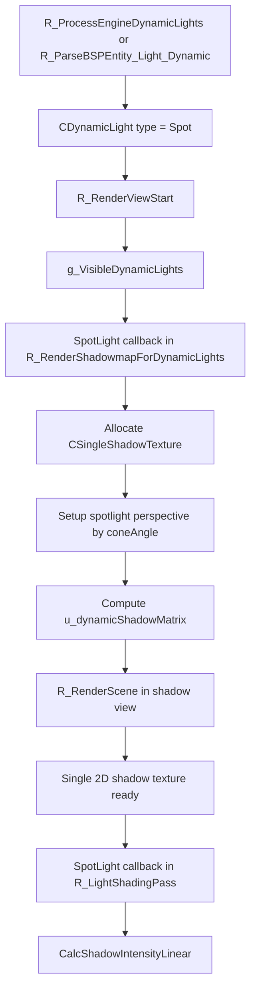

# SpotLightShadow

## Overview
SpotLightShadow 负责 Renderer 中聚光源的单层 2D Shadow Map 生成与延迟光照采样。当前实现以动态阴影为主，既覆盖从引擎 `cl_dlights` 映射出的 flashlight，也覆盖地图 `light_dynamic` 定义的 spot light。

## Responsibilities
- 将 flashlight 或地图聚光参数整理为 `CDynamicLight` 的 `distance`、`coneAngle`、`origin`、`angles` 和 `dynamic_shadow_size`。
- 为聚光分配或复用 `CSingleShadowTexture`。
- 在 Shadow pass 中根据 `coneAngle` 计算透视投影，并生成单层 shadow matrix。
- 通过 `r_draw_shadowview` 与 `r_draw_lineardepth` 复用 `R_RenderScene()` 生成 2D 深度阴影图。
- 在 `R_LightShadingPass()` 中绑定 `dynamicShadowTex` 和 `u_dynamicShadowMatrix`，使用线性深度版本的 shadow compare 完成聚光阴影采样。

## Involved Files & Symbols
- `Plugins/Renderer/gl_light.h` - `CDynamicLight`
- `Plugins/Renderer/gl_light.cpp` - `R_ProcessEngineDynamicLights`, `R_AddVisibleDynamicLight`, `R_IterateVisibleDynamicLights`, `R_LightShadingPass`
- `Plugins/Renderer/gl_shadow.cpp` - `CSingleShadowTexture`, `R_CreateSingleShadowTexture`, `R_SetupShadowMatrix`, `R_RenderShadowmapForDynamicLights`
- `Plugins/Renderer/gl_rmain.cpp` - `R_PreRenderView`, `R_RenderScene`
- `Plugins/Renderer/gl_studio.cpp` - Shadow view 下的 `STUDIO_SHADOW_CASTER_ENABLED`
- `Plugins/Renderer/gl_wsurf.cpp` - Shadow view 下的世界与实体几何绘制分支
- `Build/svencoop/renderer/shader/dlight_shader.frag.glsl` - `CalcShadowIntensityLinear`

## Architecture
聚光阴影的流程分为“光源参数准备 → Shadow Map 生成 → 延迟光照采样”三段：

1. `R_ProcessEngineDynamicLights()` 会把引擎 flashlight 映射为 `DynamicLightType_Spot`：
   - 通过 `r_flashlight_distance`、`r_flashlight_cone_degree` 计算 `distance` 和 `coneAngle`。
   - 根据第一人称视角、武器 attachment、实体角度和碰撞 trace 确定 `origin` 与 `angles`。
   - 默认设置 `dynamic_shadow_size = 256`、`static_shadow_size = 0`、`shadow = 1`。
2. 地图加载阶段，`R_ParseBSPEntity_Light_Dynamic()` 也可以直接创建 `DynamicLightType_Spot`，并携带 `shadow` 与 `dynamic_shadow_size` 参数。
3. `R_RenderViewStart()` 将可见聚光加入 `g_VisibleDynamicLights`。
4. `R_RenderShadowmapForDynamicLights()` 的 SpotLight callback 在需要时分配 `CSingleShadowTexture`，然后开启 `r_draw_shadowview`、`r_draw_multiview`、`r_draw_lineardepth`。
5. CPU 根据 `coneAngle * 2` 计算阴影视图 FOV，使用 `R_SetupPerspective()` 建立单层透视投影，之后生成 `u_dynamicShadowMatrix` 对应的 shadow matrix。
6. Shadow pass 会清空 `DRAW_CLASSIFY_TRANS_ENTITIES`、`DRAW_CLASSIFY_PARTICLES`、`DRAW_CLASSIFY_DECAL`、`DRAW_CLASSIFY_WATER`，因此聚光阴影只覆盖不透明世界与不透明实体。
7. 在 `R_LightShadingPass()` 中，聚光 shader 若发现 `pDynamicShadowTexture->IsReady()`，就启用 `DLIGHT_DYNAMIC_SHADOW_TEXTURE_ENABLED`，上传纹理尺寸与 `u_dynamicShadowMatrix`，再通过 `CalcShadowIntensityLinear()` 完成阴影比较。

聚光 volume 与 fullscreen 两种光照绘制方式都共用同一份 Shadow Map：
- 当 `args->bVolume` 为真时，使用圆锥体几何绘制 `DrawConeSpotLight`。
- 当 `args->bVolume` 为假时，使用全屏三角形路径 `DrawFullscreenSpotLight`。
- 两个分支都会在 shader 中绑定同一个 `dynamicShadowTex` 和 `u_dynamicShadowMatrix`。

## Dependencies
- `CDynamicLight` 上的 `distance`、`coneAngle`、`dynamic_shadow_size`、`pDynamicShadowTexture`。
- flashlight 控制变量：`r_flashlight_distance`、`r_flashlight_min_distance`、`r_flashlight_cone_degree`、`r_flashlight_*` 光照参数。
- `CSingleShadowTexture` 及其底层 `GL_GenShadowTexture`。
- `R_SetupPerspective()`、`R_SetupShadowMatrix()` 和延迟光照 shader 中的聚光分支。

## Notes
- 当前聚光只实现动态单层阴影，虽然参数结构中存在 `ppStaticShadowTexture`，但生成和着色路径并未真正使用静态聚光阴影。
- 聚光 shadow compare 使用 `CalcShadowIntensityLinear()`，与方向光的非线性投影采样逻辑不同。
- flashlight 在本地玩家第一人称视角下会优先尝试 weapon attachment，再回退到视点与左右手偏移位置。
- flashlight 会先做 `PM_PlayerTrace`，距离过短或起点在实体内部时会直接把该动态光置为 `DynamicLightType_Unknown`，从而跳过阴影和光照。
- 聚光 shadow pass 会隐藏 `source_entity_index` 对应实体，避免自投影污染。

## Callers (optional)
- `Plugins/Renderer/gl_light.cpp` - `R_ProcessEngineDynamicLights` 生成 flashlight 类型的 `CDynamicLight`
- `Plugins/Renderer/gl_rmain.cpp` - `R_PreRenderView` 调用 `R_RenderShadowMap`
- `Plugins/Renderer/gl_shadow.cpp` - `R_RenderShadowmapForDynamicLights` 中的 SpotLight callback 生成 2D Shadow Map
- `Plugins/Renderer/gl_light.cpp` - `R_LightShadingPass` 中的 SpotLight callback 采样单层聚光 shadow
