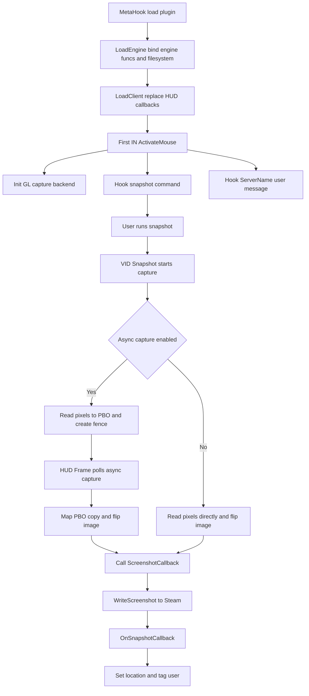

# SteamScreenshots

## 概述
`SteamScreenshots` 是一个仅面向 Sven Co-op 场景的截图桥接插件：拦截引擎 `snapshot` 命令，抓取当前 OpenGL 帧缓冲，并通过 Steamworks `ISteamScreenshots` 上传到 Steam 截图管理器。

## 职责
- 在插件加载阶段接管 `client.dll` 的导出回调：`HUD_Frame`、`HUD_Shutdown`、`IN_ActivateMouse`。
- 在首帧鼠标激活时（`IN_ActivateMouse`）初始化截图子系统，并安装 `snapshot` 命令 hook。
- 维护服务器名上下文（通过 `ServerName` 用户消息）并用于 Steam 截图元数据标注。
- 负责 OpenGL 像素抓取：根据能力选择同步路径或 PBO+Fence 异步路径。
- 将抓图数据提交给 `SteamScreenshots()->WriteScreenshot`，并在 `ScreenshotReady_t` 回调中设置 Location 与用户标签。

## 涉及文件 (不要带行号)
- `Plugins/SteamScreenshots/plugins.cpp`
- `Plugins/SteamScreenshots/plugins.h`
- `Plugins/SteamScreenshots/exportfuncs.cpp`
- `Plugins/SteamScreenshots/exportfuncs.h`
- `Plugins/SteamScreenshots/gl_capture.h`
- `Plugins/SteamScreenshots/gl_catpure.cpp`
- `Plugins/SteamScreenshots/SteamScreenshots.vcxproj`
- `Build/svencoop/metahook/configs/plugins_svencoop.lst`

## 架构
核心对象与模块：
- 插件入口：`IPluginsV4`（`Init/LoadEngine/LoadClient/HUD_*` 接管）。
- 截图管理：`CSnapshotManager`（`STEAM_CALLBACK` 处理 `ScreenshotReady_t`）。
- 抓图后端：`gl_catpure.cpp`（全局状态 + Sync/Async 两套抓图实现）。

关键流程：

补充：
- `HUD_Frame` 每帧都会调用 `GL_QueryAsyncCapture`，并在未进图（`levelname` 为空）时清空 `g_szServerName`。
- `HUD_Shutdown` 释放抓图资源（PBO、Sync、ImageBuffer）后再转调原始 `HUD_Shutdown`。

## 依赖
- MetaHook API：`HookCmd`、`GetVideoMode`、插件导出替换机制。
- HLSDK/客户端接口：`cl_enginefunc_t`、`parsemsg`（`BEGIN_READ/READ_STRING`）、用户消息 hook。
- OpenGL + GLEW：`glReadPixels`、`GL_PIXEL_PACK_BUFFER`、`glFenceSync/glClientWaitSync`。
- Steamworks：`steam_api.h`、`ISteamScreenshots`、`ScreenshotReady_t`、`SteamUser`。
- 构建依赖（vcxproj）：`steam_api.lib`、GLEW 相关库；项目为 Win32 DLL。
- 运行配置：在 `plugins_svencoop.lst` 中由 `SteamScreenshots.dll` 加载。

## 注意事项
- 命令 hook 使用的是 `"snapshot"`（单数）；文档中存在 `snapshots`（复数）描述，属于文档与实现口径差异点。
- 命令 hook 安装时机绑定在首次 `IN_ActivateMouse`，若该路径未执行则不会接管截图命令。
- `ServerName` 最长保留 255 字节，来源依赖服务器消息；主菜单/未进图时会被清空。
- 异步抓图依赖 OpenGL 3.2 + Sync API；不满足时回退同步抓图（可能引入瞬时阻塞）。
- `ScreenshotCallback` 与 `OnSnapshotCallback` 默认假设 Steam 接口可用，代码中未做显式空指针防护。

## 调用方（可选）
- MetaHook 插件加载器通过 `EXPOSE_SINGLE_INTERFACE(IPluginsV4, ...)` 实例化与驱动生命周期。
- Sven Co-op 配置 `plugins_svencoop.lst` 直接列出 `SteamScreenshots.dll`。
- 引擎命令系统在 `snapshot` 被 hook 后回调 `VID_Snapshot_f`。
- 引擎消息分发通过 `HOOK_MESSAGE(ServerName)` 进入 `__MsgFunc_ServerName`。
- 客户端每帧/退出路径通过替换后的 `HUD_Frame`、`HUD_Shutdown` 驱动异步查询与资源回收。