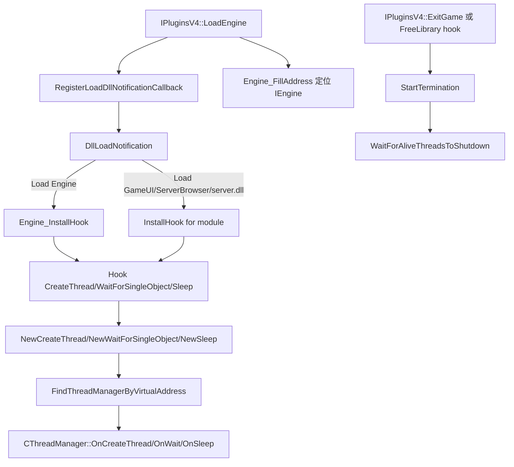

# ThreadGuard

## 概述
`ThreadGuard` 是一个 MetaHook 插件：通过拦截目标模块的线程相关 API（`CreateThread` / `WaitForSingleObject` / `Sleep`）并在退出阶段集中等待线程结束，降低 DLL 卸载后后台线程继续运行导致崩溃或长时间卡住的风险。

## 职责
- 在 `LoadEngine` 时注册 `DllLoadNotification`，对引擎与指定 DLL 的 load/unload 动态安装/卸载 hook。
- 为每个目标模块创建 `CThreadManager`，记录 `CreateThread` 产生的线程句柄并维护终止状态。
- 在终止期短路忙等路径：对 `WaitForSingleObject(..., 0)` 返回立即完成、对 `Sleep(1)` 的非主线程执行 `ExitThread(0)`。
- 在 `ExitGame` 或 `FreeLibrary` 卸载路径中调用 `StartTermination + WaitForAliveThreadsToShutdown`，等待被跟踪线程退出。
- 通过 `EngineCommand_InstallHook` 钩住 `_restart`，先执行 `shutdownserver` 再执行原重启函数，修复重启时服务端清理不完整问题。

## 涉及文件 (不要带行号)
- `Plugins/ThreadGuard/plugins.cpp`
- `Plugins/ThreadGuard/plugins.h`
- `Plugins/ThreadGuard/privatehook.cpp`
- `Plugins/ThreadGuard/privatehook.h`
- `Plugins/ThreadGuard/ThreadManager.cpp`
- `Plugins/ThreadGuard/ThreadManager.h`
- `Plugins/ThreadGuard/exportfuncs.cpp`
- `Plugins/ThreadGuard/exportfuncs.h`
- `Plugins/ThreadGuard/ThreadGuard.vcxproj`

## 架构
核心由三层组成：
1. **插件生命周期层（`plugins.cpp`）**：初始化全局接口、注册 DLL 通知回调、在 `ExitGame` 触发引擎线程收敛。
2. **模块路由层（`privatehook.cpp`）**：根据 DLL 名称/引擎标志选择安装到 `Engine` / `GameUI.dll` / `ServerBrowser.dll` / `server.dll` 的 hook，并在卸载时清理对应 `IThreadManager`。
3. **线程管理层（`ThreadManager.cpp`）**：
   - 通过 `_ReturnAddress()` + `.text` 区间匹配，将 API 调用归属到正确模块的 `CThreadManager`；
   - 追踪线程句柄数组（`m_hAliveThread`）；
   - 终止阶段调用 `WaitForMultipleObjects(..., INFINITE)` 等待全部结束后 `CloseHandle`。

补充：`Engine_FillAddress` 通过特征串 `"Sys_InitArgv( OrigCmd )"` + 反汇编扫描定位 `IEngine** engine`，供 `GetEngineDLLState()` 判断 `DLL_CLOSE/DLL_RESTART`。

## 依赖
- **MetaHook API**：`RegisterLoadDllNotificationCallback` / `IATHook` / `BlobIATHook` / `UnHook` / `SearchPattern` / `DisasmRanges` / `HookCmd` / `FindCmd` 等。
- **Win32 线程与模块 API**：`CreateThread`、`DuplicateHandle`、`WaitForSingleObject`、`WaitForMultipleObjects`、`Sleep`、`ExitThread`、`CloseHandle`、`FreeLibrary`。
- **Capstone**（`capstone.h`）：用于 `Engine_FillAddress` 里的指令级扫描判定。
- **引擎接口**：`IEngine::GetState()`（`IEngine.h`）用于终止阶段门控。

## 注意事项
- 线程句柄池固定为 `MAXIMUM_WAIT_OBJECTS`；满时会尝试回收已 signaled 槽位，仍失败则 `SysError("Failed to insert thread to thread manager!")`。
- `WaitForSingleObject` 只在 `dwMilliseconds == 0` 时被特殊处理；`Sleep` 只在 `Sleep(1)` 场景触发“终止期直接退线程”，其它等待/休眠路径不受控。
- 真正等待线程退出仅在 `GetEngineDLLState()` 为 `DLL_CLOSE` 或 `DLL_RESTART` 时执行。
- `GameUI.dll` / `ServerBrowser.dll` 在“依赖 `steam_api.dll` 且未导入 `CreateThread`”时会跳过线程 hook（认为使用回调模型）。
- `server.dll` 相关 hook 仅在 `svencoop` 目录下启用（`ServerDLL_InstallHook` 有显式门控）。
- `Engine_FillAddress` 强依赖特征串与代码布局；定位失败会触发 `Sys_Error("CEngine not found")`，对引擎版本变化较敏感。
- `privatehook.h` 中 `Engine_InstallHook` / `Engine_UninstallHook` 声明为无参，而 `privatehook.cpp` 实际定义为带参版本，属于声明与实现风格不一致的维护风险点。
- `ThreadManager.cpp` 中“closed thread”相关流程存在 `#if 0` 的停用代码，说明当前仅维护 alive-thread 路径。

## 调用方（可选）
- MetaHook 插件框架：驱动 `IPluginsV4::Init/LoadEngine/LoadClient/ExitGame/Shutdown`。
- `LoadEngine` 内注册的 DLL 通知系统：运行时回调 `DllLoadNotification` 以安装/卸载目标模块 hook。
- `LoadClient`：调用 `EngineCommand_InstallHook` 安装 `_restart` 命令 hook。
- `ExitGame`：调用 `Engine_WaitForShutdown(g_pMetaHookAPI->GetEngineModule(), g_pMetaHookAPI->GetBlobEngineModule())`。
- 被 hook 的 `FreeLibrary` 路径：`NewFreeLibrary_Engine` / `NewFreeLibrary_GameUI` 在模块释放前触发对应 `*_WaitForShutdown`。