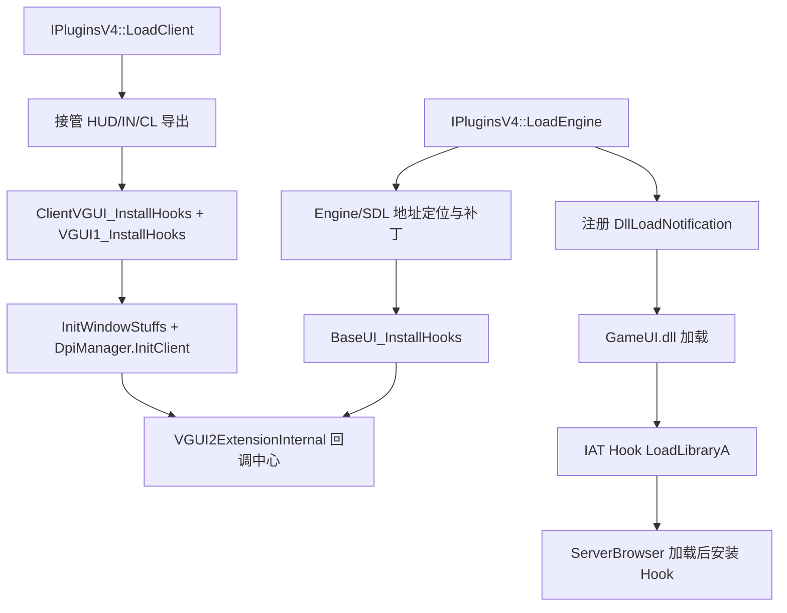

# VGUI2Extension

## 概述
`VGUI2Extension` 是 MetaHookSv 的 VGUI2 扩展框架插件：在运行时接管 `BaseUI/GameUI/ClientVGUI/KeyValues/GameConsole` 等入口，把原始 VGUI2 调用包装成可注册回调链，供其他插件进行 UI 扩展、拦截和重定向。

它同时负责语言强制（`-forcelang` / `-steamlang`）与 HiDPI 支持（`-high_dpi` / `-no_high_dpi`），并向外导出 `IVGUI2Extension`、`ISurface2`、`ISchemeManager2`、`IInput2`、`IDpiManager` 等接口。

## 职责
- 提供 `IVGUI2Extension` 回调注册中心（按 `GetAltitude()` 排序并分发）。
- 在 `IPluginsV4::LoadEngine/LoadClient` 期间安装 VGUI2 相关 hook（vtable + inline + IAT）。
- 对 `GameUI.dll` / `ServerBrowser.dll` 做延迟加载跟踪与二次 hook 安装。
- 拦截 `KeyValues_LoadFromFile`（GameUI/ClientUI/ServerBrowser）并对外暴露统一回调入口。
- 对 `ISurface` / `ISchemeManager` 进行代理，接入字体管理、语言设置和比例换算逻辑。
- 实现 DPI 探测、强制 HD proportional 与 `SKIN` 搜索路径注入（`*_dpiNNN` / `*_hidpi`）。
- 处理 Win32/SDL IME 事件，改善中文/日文/韩文输入与候选框行为。

## 涉及文件 (不要带行号)
- `Plugins/VGUI2Extension/plugins.cpp`
- `Plugins/VGUI2Extension/plugins.h`
- `Plugins/VGUI2Extension/VGUI2ExtensionInternal.cpp`
- `Plugins/VGUI2Extension/VGUI2ExtensionInternal.h`
- `Plugins/VGUI2Extension/BaseUI.cpp`
- `Plugins/VGUI2Extension/GameUI.cpp`
- `Plugins/VGUI2Extension/ClientVGUI.cpp`
- `Plugins/VGUI2Extension/VGUI1Hook.cpp`
- `Plugins/VGUI2Extension/exportfuncs.cpp`
- `Plugins/VGUI2Extension/exportfuncs.h`
- `Plugins/VGUI2Extension/privatefuncs.cpp`
- `Plugins/VGUI2Extension/privatefuncs.h`
- `Plugins/VGUI2Extension/DpiManagerInternal.cpp`
- `Plugins/VGUI2Extension/DpiManagerInternal.h`
- `Plugins/VGUI2Extension/SurfaceHook.cpp`
- `Plugins/VGUI2Extension/SchemeHook.cpp`
- `Plugins/VGUI2Extension/Scheme2.cpp`
- `Plugins/VGUI2Extension/Surface2.cpp`
- `Plugins/VGUI2Extension/InputWin32.cpp`
- `Plugins/VGUI2Extension/KeyValuesSystemHook.cpp`
- `Plugins/VGUI2Extension/FontManager.cpp`
- `Plugins/VGUI2Extension/Win32Font.cpp`
- `include/Interface/IVGUI2Extension.h`
- `docs/VGUI2Extension.md`

## 架构
核心由三层组成：
1. **插件生命周期层**（`plugins.cpp`）
   - `LoadEngine`：读取引擎信息、定位私有符号、补丁 `VGUIClient001` 和语言路径、安装 BaseUI hook、初始化 DPI engine 阶段、注册 DLL 加载通知。
   - `LoadClient`：接管 `cl_exportfuncs`，定位 client 私有符号，安装 `ClientVGUI/VGUI1` 相关 hook，初始化窗口/DPI client 阶段。
2. **回调中心层**（`VGUI2ExtensionInternal.*`）
   - 维护 8 类回调容器：`BaseUI/GameUI/GameUIOptionDialog/GameUITaskBar/GameUIBasePanel/GameConsole/ClientVGUI/KeyValues`。
   - 注册时按 `Altitude` 从高到低排序；分发中当 `Result >= HANDLED` 终止后续插件。
3. **具体 hook/代理层**（`BaseUI.cpp`、`GameUI.cpp`、`ClientVGUI.cpp`、`SurfaceHook.cpp`、`SchemeHook.cpp`、`VGUI1Hook.cpp`）
   - 代理函数统一采用 `CallbackContext` 两阶段调用：`IsPost=false` 前置回调 -> 原函数（可跳过）-> `IsPost=true` 后置回调。
   - `DllLoadNotification` + `NewLoadLibraryA_GameUI` 处理 `GameUI.dll/ServerBrowser.dll` 迟加载场景。

`IVGUI2Extension.h` 对外定义的能力与实现基本一一对应：
- `Register*/Unregister*` 系列 <-> `CVGUI2Extension` 内部 8 个 vector。
- `GetBaseDirectory/GetCurrentLanguage` <-> `GetBaseDirectory()` 与 `GetCurrentGameLanguage()`。
- `VGUI2Extension_Result` 语义（`HANDLED/OVERRIDE/SUPERCEDE/...`）被各代理函数用于决定是否调用原函数与后置插件。

## 依赖
- MetaHook API：`VFTHook/InlineHook/IATHook/InlinePatchRedirectBranch/DisasmRanges/SearchPattern` 等。
- VGUI2/GoldSrc 接口：`IBaseUI`、`IGameUI`、`IClientVGUI`、`ISurface`、`ISchemeManager`、`IKeyValuesSystem`。
- 运行库与系统组件：`GameUI.dll`、`ServerBrowser.dll`、`vgui2.dll`、`sdl2.dll`、Win32 IME/User32。
- 文本与字体：`FontManager/Win32Font/SurfaceHook/Scheme2` 协同。
- 配置与环境：命令行参数（`-forcelang`、`-steamlang`、`-high_dpi`、`-no_high_dpi`、`-nomousespi`）与 Steam 语言注册表。

## 注意事项
- `Engine_InstallHooks`/`Engine_UninstallHooks`、`Client_InstallHooks`/`Client_UninstallHooks`、`EngineSurface_InstallHooks`/`EngineSurface_UninstallHooks` 当前为空实现，真实主要逻辑集中在 BaseUI/GameUI/ClientVGUI/Surface/Scheme 侧。
- `g_bIsSvenCoop` 仅声明初始化为 `false`，当前源码未看到置 `true` 的分支。
- 回调容器无去重/无锁；重复注册会重复触发，线程并发注册/注销不是设计目标。
- 多处符号定位依赖签名扫描与反汇编，游戏版本/二进制布局变化会导致 `Sig_NotFound`。

## 调用方（可选）
已确认通过 `VGUI2ExtensionImport.cpp` 获取 `VGUI2_EXTENSION_INTERFACE_VERSION` 并注册回调的插件：
- `Plugins/CaptionMod`（BaseUI/ClientVGUI/GameUI）
- `Plugins/BulletPhysics`（BaseUI/ClientVGUI/GameUI）
- `Plugins/Renderer`（BaseUI/GameUI）
- `Plugins/SCModelDownloader`（BaseUI/GameUI/TaskBar/KeyValues 等）

常见调用模式：
- 初始化时 `Register*Callbacks(...)`
- 退出时 `Unregister*Callbacks(...)`
- 读取语言时 `VGUI2Extension()->GetCurrentLanguage()`
