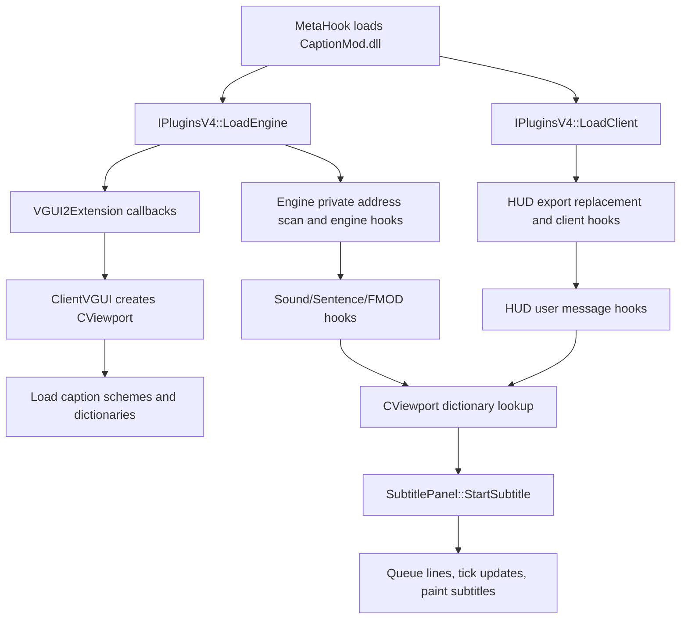

# CaptionMod

## Overview
`CaptionMod` is a MetaHook plugin that adds a VGUI2-based subtitle system, HUD text translation, multi-byte text rendering support, and a Source 2007 style chat dialog for GoldSrc/SvEngine games. It is tightly coupled to `VGUI2Extension.dll` for VGUI2 callback registration, language lookup, scheme/DPI support, and GameUI option integration.

## Responsibilities
- Expose the `IPluginsV4` plugin interface and install engine/client hooks during MetaHook plugin loading.
- Import `VGUI2Extension` interfaces and register BaseUI, ClientVGUI, and GameUI callbacks.
- Load caption resources, localization files, and CSV subtitle dictionaries from `captionmod/` resources.
- Classify dictionary rows into sound, sentence, SendAudio, HUD message, and netmessage entries, including regex-based netmessage translation.
- Convert sound playback, Sven Co-op FMOD playback, SendAudio, HudText/HudTextArgs, TextMsg, SayText, and ShowMenu events into translated HUD output or subtitle display.
- Render subtitles through `CViewport` and `SubtitlePanel`, including line wrapping, timing, queueing, anti-spam, speaker prefix, fade, and panel background behavior.
- Provide GameUI option controls for `cap_subtitle_*` cvars and a VGUI2 chat dialog controlled by `cap_newchat`.

## Involved Files (no line numbers)
- `Plugins/CaptionMod/plugins.cpp`
- `Plugins/CaptionMod/plugins.h`
- `Plugins/CaptionMod/exportfuncs.cpp`
- `Plugins/CaptionMod/exportfuncs.h`
- `Plugins/CaptionMod/privatefuncs.cpp`
- `Plugins/CaptionMod/privatefuncs.h`
- `Plugins/CaptionMod/VGUI2ExtensionImport.cpp`
- `Plugins/CaptionMod/VGUI2ExtensionImport.h`
- `Plugins/CaptionMod/Viewport.cpp`
- `Plugins/CaptionMod/Viewport.h`
- `Plugins/CaptionMod/SubtitlePanel.cpp`
- `Plugins/CaptionMod/SubtitlePanel.h`
- `Plugins/CaptionMod/message.cpp`
- `Plugins/CaptionMod/message.h`
- `Plugins/CaptionMod/chatdialog.cpp`
- `Plugins/CaptionMod/chatdialog.h`
- `Plugins/CaptionMod/cstrikechatdialog.cpp`
- `Plugins/CaptionMod/cstrikechatdialog.h`
- `Plugins/CaptionMod/GameUI.cpp`
- `Plugins/CaptionMod/BaseUI.cpp`
- `Plugins/CaptionMod/ClientVGUI.cpp`
- `Plugins/CaptionMod/util.cpp`
- `Plugins/CaptionMod/util.h`
- `Plugins/CaptionMod/MurmurHash2.cpp`
- `Plugins/CaptionMod/MurmurHash2.h`
- `Plugins/CaptionMod/CaptionMod.vcxproj`
- `docs/CaptionMod.md`
- `docs/CaptionModCN.md`
- `Build/svencoop/captionmod/`
- `Build/svencoop_hidpi/captionmod/`
- `Build/gearbox/captionmod/`
- `Build/echoes/captionmod/`
- `Build/svencoop/metahook/configs/plugins_svencoop.lst`
- `Build/svencoop/metahook/configs/plugins_goldsrc.lst`

## Architecture
CaptionMod has four main layers:

1. Plugin lifecycle and hook installation:
   - `IPluginsV4::Init` stores MetaHook interfaces.
   - `IPluginsV4::LoadEngine` captures filesystem/video/engine metadata, copies engine functions, stores original `pfnTextMessageGet` and `pfnServerCmdUnreliable`, scans engine private functions, installs engine hooks, initializes `VGUI2Extension`, registers BaseUI/ClientVGUI/GameUI callbacks, and registers DLL load notifications.
   - `IPluginsV4::LoadClient` saves original `cl_exportfuncs_t`, replaces `HUD_Init/HUD_VidInit/HUD_Frame/HUD_Redraw/HUD_Shutdown`, scans client private functions, and installs client hooks.
   - `IPluginsV4::ExitGame` unregisters VGUI2 callbacks and shuts down the VGUI2Extension import path; `Shutdown` unregisters the DLL load notification callback.

2. VGUI2 and GameUI integration:
   - `VGUI2Extension_Init` requires `VGUI2Extension.dll` and imports `IVGUI2Extension`, DPI manager, surface, scheme, and input interfaces.
   - `ClientVGUI` callbacks initialize VGUI interfaces for module name `CaptionMod`, load `captionmod/CaptionScheme.res`, load `captionmod/dictionary_%language%.txt` with English fallback, create `CViewport`, set its parent, and forward client UI activate/hide events.
   - `BaseUI` obtains `IGameUIFuncs` from the engine factory and registers BaseUI callbacks.
   - `GameUI` callbacks load `captionmod/gameui_%language%.txt`, add a CaptionMod options tab, and route connect-to-server notifications into `CViewport`.

3. Dictionary loading and lookup:
   - `CViewport::LoadBaseDictionary` reads `captionmod/dictionary.csv` via the active filesystem abstraction and parses rows with `csv::CSVReader`.
   - `CViewport::LoadCustomDictionary` loads map-specific dictionaries such as `<map>_dictionary.csv` and `<map>_dictionary_<language>.csv`.
   - `CDictionary::LoadFromRow` classifies entries by sound extension, text message lookup, sentence prefix, `SENDAUDIO:`, `MESSAGE:`, `SENTENCE:`, `NETMESSAGE:`, and `NETMESSAGE_REGEX:` prefixes; it also resolves localized text, colors, durations, speakers, chained next entries, style flags, and optional regex objects.
   - `CViewport::LinkDictionary` resolves `Next` links after all dictionary entries are loaded.
   - Non-Sven paths load base/map dictionaries from `VidInit` and `ConnectToServer`; Sven Co-op reloads dictionaries after `ScClient_SoundEngine_LoadSoundList` succeeds.

4. Event-to-subtitle and rendering flow:

Key event paths:
- Engine sound hooks call `S_StartSoundTemplate`, then `S_StartSentence` or `S_StartWave`, apply distance/volume filters, estimate duration, and call `CViewport::StartSubtitle`.
- Sven Co-op FMOD playback calls `ScClient_SoundEngine_PlayFMODSound`, which can resolve sentence indices through SC sound-engine helpers or fall back to wave lookup.
- HUD message hooks registered by `CHudMessage::Init` intercept `HudText`, `HudTextPro`, `HudTextArgs`, `SendAudio`, `SayText`, and `TextMsg`; handled messages return early, otherwise the original user message hook is called.
- `CHudMessage::MsgFunc_HudText` and `MsgFunc_HudTextArgs` can create dynamic `client_textmessage_t` objects for translated messages and then start chained subtitles through `StartNextSubtitle`.
- `CHudMenu::Init` hooks `ShowMenu` for multi-byte menu text support, excluding Counter-Strike paths and requiring the Sven Co-op `WeaponsResource_SelectSlot` private function.
- `SubtitlePanel::StartSubtitle` converts dictionary text into wrapped wide-character lines, derives display timing from sound/message duration and cvars, queues back lines, and `OnTick` promotes ready lines into active display lines.

## Dependencies
- `VGUI2Extension.dll` and interfaces from `include/Interface/IVGUI2Extension.h`.
- MetaHook API for plugin lifecycle, command hooks, inline hooks, DLL load notifications, pattern searches, disassembly, and engine/client metadata.
- GoldSrc/SvEngine client and engine interfaces: `cl_enginefunc_t`, `cl_exportfuncs_t`, user messages, `client_textmessage_t`, sound/sentence functions, and file system interfaces.
- HLSDK and Source SDK support code included by `CaptionMod.vcxproj`, including VGUI/VGUI controls, filesystem helpers, tier0/tier1/vstdlib, and mathlib.
- CSV parser include path `$(CSVParserDirectory)` for dictionary parsing.
- Runtime resources under `captionmod/`: `CaptionScheme.res`, `SubtitlePanel.res`, `ChatScheme.res`, `ChatDialog.res`, `OptionsSubAudioAdvancedDlg.res`, `dictionary.csv`, `dictionary_%language%.txt`, `gameui_%language%.txt`, materials, and fonts.
- Plugin load order: `VGUI2Extension.dll` must be loaded before `CaptionMod.dll` in the plugin list.

## Notes
- CaptionMod intentionally fails fast if `VGUI2Extension.dll` or required VGUI2Extension interfaces are missing.
- The plugin relies on private engine/client symbol discovery and binary layout assumptions in `privatefuncs.cpp`; engine, client, or mod binary changes can break hooks or trigger signature-not-found failures.
- Project documentation marks BugFixedHL as incompatible because it has a different VGUI2 component layout.
- Dictionary encoding matters: CSV dictionaries use UTF-8 BOM for multi-byte text handling, while localization text files are expected to be UTF-16 LE for non-ASCII content.
- Missing `captionmod/dictionary.csv` is fatal in `LoadBaseDictionary`; missing custom map dictionaries are treated as debug-print-only misses.
- Sven Co-op and non-Sven dictionary lifecycles differ, so subtitle availability can depend on whether `ScClient_SoundEngine_LoadSoundList` has run.
- Source-level review points observed during analysis: `BaseUI_InstallHooks` checks `fnCreateInterface` again after querying `gameuifuncs`; `CHudMessage::MsgFunc_HudTextArgs` uses a clamp expression that appears to always select `MAX_MESSAGE_ARGS`; `CDictionary::LoadFromRow` has a lowercase-left-align branch typo because the one-letter `L` condition repeats uppercase `L`. These are documented risks, not fixed here.
- `cap_debug` is the primary runtime evidence switch for dictionary hit/miss diagnostics for sounds, sentences, SendAudio, netmessages, and HUD text messages.

## Callers (optional)
- MetaHook loader calls `IPluginsV4` lifecycle methods after loading `CaptionMod.dll` through the plugin list.
- `Build/svencoop/metahook/configs/plugins_svencoop.lst` and `Build/svencoop/metahook/configs/plugins_goldsrc.lst` list `VGUI2Extension.dll` before `CaptionMod.dll`.
- `VGUI2Extension` invokes CaptionMod's registered BaseUI, ClientVGUI, and GameUI callbacks.
- Engine/client hook paths call into CaptionMod through replaced HUD exports, user-message hooks, inline sound hooks, and Sven Co-op sound-engine hooks.

## Gamedata migration (2026-09-27, first batch: engine side)

- **Scope:** `Plugins/CaptionMod/privatefuncs.cpp` `Engine_FillAddress_*` was the last large signature-scan locator block outside the already-migrated plugins. The plugin had **no gamedata dependency at all** before this change.
- **New helper:** `Plugins/CaptionMod/plugins.h` now includes `<metahook.h>`, asserts `METAHOOK_API_VERSION >= 109`, and defines `GamedataResolvePtr(moduleBase, name, kind)` (required, fatal via `Sys_Error`) and `GamedataResolvePtrIfAvailable(...)` (returns `nullptr` when the identity publishes no record), mirroring `Plugins/Renderer/plugins.h`.
- **Migrated to gamedata (11/11 engine identities each, plugin read point confirmed):** FUNCTION `S_FindName`, `S_StartDynamicSound`, `S_StartStaticSound`, `S_LoadSound`, `TextMessageParse`, `COM_ExplainDisconnection`, `COM_ExtendedExplainDisconnection`, `SequenceGetSentenceByIndex`; GLOBAL `cl_time`, `cl_oldtime`, `cl_viewentity`, `listener_origin`, `cszrawsentences`, `rgpszrawsentence`, `scr_drawloading`. All old string-anchored searches, `ReverseSearchFunctionBeginEx` probes, and three `DisasmRanges` walks (including the 3-level `COM_ExplainDisconnection` scan) were deleted.
- **Deletions rather than migrations** (following the "publish ≠ consumer needs" rule): `gPrivateFuncs.S_Init` and `gPrivateFuncs.SCR_BeginLoadingPlaque` had no read point outside their own locator, so the struct fields, their locators, the `SCR_BEGIN_LOADING_PLAQUE` / `S_INIT_SIG_*` macros and the unused `g_phook_S_FindName` handle were removed. `hostparam_basedir` (declared in `privatefuncs.h`, **never defined or assigned** in this plugin) was also removed. 9 `*_SIG_*` macro families deleted wholesale.
- **`realtime` is not migratable:** the catalog carries no `realtime` record on any of the 21 snapshots, so `Engine_FillAddress_RealTime` keeps its two signature scans.
- **`VOX_LookupString` is conditionally gated:** published on 8/11 identities only, and the missing set is `hl-10210` (non-isBlob) + `svencoop-10257` / `svencoop-8948`. `cszrawsentences` / `rgpszrawsentence` are resolved via `GamedataResolvePtrIfAvailable`; the legacy locator survives **only** for the SvEngine identity with no record (`svencoop-10257`), and `Sig_VarNotFound` fires immediately on a non-SvEngine identity. Unlike the pre-migration code, the GoldSrc/HL25 `MOV`-shape disassembly branch was dropped because those identities are gamedata-covered.
- **Client side (second batch, same day):** the two Sven Co-op sound-engine symbols are now gamedata-backed. `Client_FillAddress_SCClient_SoundEngine_LoadSoundList` resolves the FUNCTION `CClient_SoundEngine_LoadSoundList`; `Client_FillAddress_SCClient_SoundEngine_maxsentences` became `GamedataQueryStructMember(moduleBase, "CClient_SoundEngine.m_iSentenceCount")` and its `private_funcs_t` field changed from `int` to `uint32_t` (it now holds an object-relative offset, not an absolute address). The 0x300-byte `Sentence length too long! Greater than` string + `DisasmRanges(MOV reg,[disp>0x100000] / INC [disp>0x100000])` locator was deleted.
- **Equivalence was verified against the real binaries** (`D:/GoldSrc_VibeSignatures/bin/svencoop-{10257,8948}/client/client.dll`) rather than assumed: replaying the deleted heuristic at the `push offset "Sentence length too long"` site lands on `mov eax, dword ptr [ebx + 0x11b09c]` (10257 `0x1000d31d`, 8948 `0x1005a865`) — exactly the catalog `offset 0x11b09c`, size 4. The surrounding code confirms the semantics: `cmp eax, 0x800` then `mov [ebx+eax*4], esi` / `inc dword ptr [ebx+0x11b09c]`, i.e. the pushed sentence-entry count, the same value the plugin uses as its lookup loop bound. The neighbouring `[ebx+0x11b0a0]` (compared against `0x1000`) is a *different* field and must not be confused with it.
- **Still not migrated** (no consumer in the catalog): `SCClient_soundengine` — the `CClient_SoundEngine` instance getter has no record on any identity, so it keeps the `HUD_PlayerMoveTexture` E9-thunk → E8-call walk. Everything else on the client side (`PlayFMODSound`, `LookupSoundBySentenceIndex`, `LookupSoundBySample`, `WeaponsResource_SelectSlot`, `GetClientColor`, `GetTextColor`, `GameViewport`, `gHud`, `CHud_GetBorderSize`, `CGameViewport`, `BaseTextColor`) likewise has no record and keeps its locator.
- **Module base correction:** all gamedata queries now pass `RealDllInfo.ImageBase`, not the locator's `DllInfo.ImageBase`. The old code always produced a final address inside the *real* module (`ConvertDllInfoSpace(..., RealDllInfo)`), while `DllInfo` is the mirror copy when one exists — and `RegisterMirrorAlias` is only wired for the engine, so a mirror client base has no CRC64 mapping. `RealDllInfo` is identical to `DllInfo` when there is no mirror, so this is a no-op on the primary path and correct on the mirrored one. `plugins.h` now asserts `METAHOOK_API_VERSION >= 114` for `QueryGameSymbolStructMember`.
- **Validator:** `validate_captionmod` gained a client group (`CAPTIONMOD_CLIENT_GAMES = ("svencoop-10257", "svencoop-8948")`, with `CAPTIONMOD_CLIENT_FUNCTIONS` / `CAPTIONMOD_CLIENT_STRUCT_MEMBERS`); non-SvEngine identities require no client records.
- **Verification (both batches):** `CaptionMod.vcxproj` Release|Win32 and Debug|Win32 build clean; `scripts/tests` reports 118 passed / 2 skipped / 36 subtests (baseline 110, +8 `CaptionModGateTests`); `validate-gamedata.py` reports 334 errors, identical line-for-line to the unmodified `HEAD` validator (0 new). In-game subtitles/audio were not exercised. Net diff across the whole migration: +278 / −938 lines.
- **Remaining un-migratable client symbols** (`Client_FillAddress_SCClient*` / `_CounterStrike*`): `CClient_SoundEngine_PlayFMODSound`, `_LookupSoundBySentenceIndex`, `_LookupSoundBySample`, `WeaponsResource_SelectSlot`, `GetClientColor`, `GetTextColor`, `GameViewport`, `gHud`, `CHud_GetBorderSize`, `CGameViewport`, `BaseTextColor` have **no catalog records** — the cstrike/czero/czeror/hl client modules publish only studio-renderer symbols — so those locators stay. Feeding them to the gamedata upstream is the prerequisite for any further client-side migration.
- **Validator detail:** the CaptionMod engine gate is `CAPTIONMOD_ENGINE_FUNCTIONS` / `CAPTIONMOD_ENGINE_GLOBALS` (applied to every snapshot publishing engine records). The shared per-symbol check was extracted as `_consumer_check(...)` with `_renderer_check` delegating to it. `VOX_LookupString` is deliberately **not** gated because it is only consumed by the legacy fallback.
- **`SCClient_soundengine_maxsentences` field type:** changed `int` → `uint32_t` so that `gPrivateFuncs` no longer implies an absolute address for what is now an object-relative offset; `SCClient_SoundEngine_GetMaxSentences` already forwards it to `(PUCHAR)pSoundEngine + offset`, so its behaviour is unchanged.
