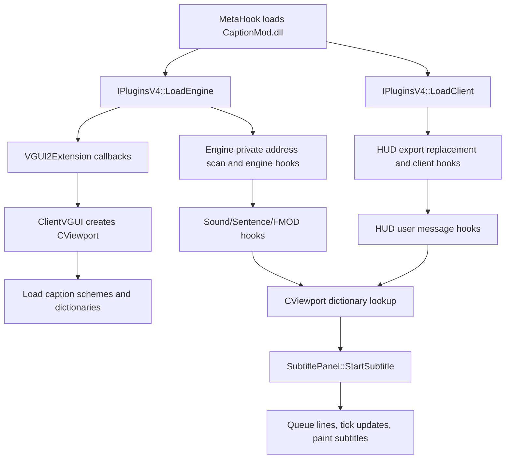

# CaptionMod

## Overview
`CaptionMod` is a MetaHook plugin that adds a VGUI2-based subtitle system, HUD text translation, multi-byte text rendering support, and a Source 2007 style chat dialog for GoldSrc/SvEngine games. It is tightly coupled to `VGUI2Extension.dll` for VGUI2 callback registration, language lookup, scheme/DPI support, and GameUI option integration.

## Responsibilities
- Expose the `IPluginsV4` plugin interface and install engine/client hooks during MetaHook plugin loading.
- Import `VGUI2Extension` interfaces and register BaseUI, ClientVGUI, and GameUI callbacks.
- Load caption resources, localization files, and CSV subtitle dictionaries from `captionmod/` resources.
- Classify dictionary rows into sound, sentence, SendAudio, HUD message, and netmessage entries, including regex-based netmessage translation.
- Convert sound playback, Sven Co-op FMOD playback, SendAudio, HudText/HudTextArgs, TextMsg, SayText, and ShowMenu events into translated HUD output or subtitle display.
- Render subtitles through `CViewport` and `SubtitlePanel`, including line wrapping, timing, queueing, anti-spam, speaker prefix, fade, and panel background behavior.
- Provide GameUI option controls for `cap_subtitle_*` cvars and a VGUI2 chat dialog controlled by `cap_newchat`.

## Involved Files (no line numbers)
- `Plugins/CaptionMod/plugins.cpp`
- `Plugins/CaptionMod/plugins.h`
- `Plugins/CaptionMod/exportfuncs.cpp`
- `Plugins/CaptionMod/exportfuncs.h`
- `Plugins/CaptionMod/privatefuncs.cpp`
- `Plugins/CaptionMod/privatefuncs.h`
- `Plugins/CaptionMod/VGUI2ExtensionImport.cpp`
- `Plugins/CaptionMod/VGUI2ExtensionImport.h`
- `Plugins/CaptionMod/Viewport.cpp`
- `Plugins/CaptionMod/Viewport.h`
- `Plugins/CaptionMod/SubtitlePanel.cpp`
- `Plugins/CaptionMod/SubtitlePanel.h`
- `Plugins/CaptionMod/message.cpp`
- `Plugins/CaptionMod/message.h`
- `Plugins/CaptionMod/chatdialog.cpp`
- `Plugins/CaptionMod/chatdialog.h`
- `Plugins/CaptionMod/cstrikechatdialog.cpp`
- `Plugins/CaptionMod/cstrikechatdialog.h`
- `Plugins/CaptionMod/GameUI.cpp`
- `Plugins/CaptionMod/BaseUI.cpp`
- `Plugins/CaptionMod/ClientVGUI.cpp`
- `Plugins/CaptionMod/util.cpp`
- `Plugins/CaptionMod/util.h`
- `Plugins/CaptionMod/MurmurHash2.cpp`
- `Plugins/CaptionMod/MurmurHash2.h`
- `Plugins/CaptionMod/CaptionMod.vcxproj`
- `docs/CaptionMod.md`
- `docs/CaptionModCN.md`
- `Build/svencoop/captionmod/`
- `Build/svencoop_hidpi/captionmod/`
- `Build/gearbox/captionmod/`
- `Build/echoes/captionmod/`
- `Build/svencoop/metahook/configs/plugins_svencoop.lst`
- `Build/svencoop/metahook/configs/plugins_goldsrc.lst`

## Architecture
CaptionMod has four main layers:

1. Plugin lifecycle and hook installation:
   - `IPluginsV4::Init` stores MetaHook interfaces.
   - `IPluginsV4::LoadEngine` captures filesystem/video/engine metadata, copies engine functions, stores original `pfnTextMessageGet` and `pfnServerCmdUnreliable`, scans engine private functions, installs engine hooks, initializes `VGUI2Extension`, registers BaseUI/ClientVGUI/GameUI callbacks, and registers DLL load notifications.
   - `IPluginsV4::LoadClient` saves original `cl_exportfuncs_t`, replaces `HUD_Init/HUD_VidInit/HUD_Frame/HUD_Redraw/HUD_Shutdown`, scans client private functions, and installs client hooks.
   - `IPluginsV4::ExitGame` unregisters VGUI2 callbacks and shuts down the VGUI2Extension import path; `Shutdown` unregisters the DLL load notification callback.

2. VGUI2 and GameUI integration:
   - `VGUI2Extension_Init` requires `VGUI2Extension.dll` and imports `IVGUI2Extension`, DPI manager, surface, scheme, and input interfaces.
   - `ClientVGUI` callbacks initialize VGUI interfaces for module name `CaptionMod`, load `captionmod/CaptionScheme.res`, load `captionmod/dictionary_%language%.txt` with English fallback, create `CViewport`, set its parent, and forward client UI activate/hide events.
   - `BaseUI` obtains `IGameUIFuncs` from the engine factory and registers BaseUI callbacks.
   - `GameUI` callbacks load `captionmod/gameui_%language%.txt`, add a CaptionMod options tab, and route connect-to-server notifications into `CViewport`.

3. Dictionary loading and lookup:
   - `CViewport::LoadBaseDictionary` reads `captionmod/dictionary.csv` via the active filesystem abstraction and parses rows with `csv::CSVReader`.
   - `CViewport::LoadCustomDictionary` loads map-specific dictionaries such as `<map>_dictionary.csv` and `<map>_dictionary_<language>.csv`.
   - `CDictionary::LoadFromRow` classifies entries by sound extension, text message lookup, sentence prefix, `SENDAUDIO:`, `MESSAGE:`, `SENTENCE:`, `NETMESSAGE:`, and `NETMESSAGE_REGEX:` prefixes; it also resolves localized text, colors, durations, speakers, chained next entries, style flags, and optional regex objects.
   - `CViewport::LinkDictionary` resolves `Next` links after all dictionary entries are loaded.
   - Non-Sven paths load base/map dictionaries from `VidInit` and `ConnectToServer`; Sven Co-op reloads dictionaries after `ScClient_SoundEngine_LoadSoundList` succeeds.

4. Event-to-subtitle and rendering flow:

Key event paths:
- Engine sound hooks call `S_StartSoundTemplate`, then `S_StartSentence` or `S_StartWave`, apply distance/volume filters, estimate duration, and call `CViewport::StartSubtitle`.
- Sven Co-op FMOD playback calls `ScClient_SoundEngine_PlayFMODSound`, which can resolve sentence indices through SC sound-engine helpers or fall back to wave lookup.
- HUD message hooks registered by `CHudMessage::Init` intercept `HudText`, `HudTextPro`, `HudTextArgs`, `SendAudio`, `SayText`, and `TextMsg`; handled messages return early, otherwise the original user message hook is called.
- `CHudMessage::MsgFunc_HudText` and `MsgFunc_HudTextArgs` can create dynamic `client_textmessage_t` objects for translated messages and then start chained subtitles through `StartNextSubtitle`.
- `CHudMenu::Init` hooks `ShowMenu` for multi-byte menu text support, excluding Counter-Strike paths and requiring the Sven Co-op `WeaponsResource_SelectSlot` private function.
- `SubtitlePanel::StartSubtitle` converts dictionary text into wrapped wide-character lines, derives display timing from sound/message duration and cvars, queues back lines, and `OnTick` promotes ready lines into active display lines.

## Dependencies
- `VGUI2Extension.dll` and interfaces from `include/Interface/IVGUI2Extension.h`.
- MetaHook API for plugin lifecycle, command hooks, inline hooks, DLL load notifications, pattern searches, disassembly, and engine/client metadata.
- GoldSrc/SvEngine client and engine interfaces: `cl_enginefunc_t`, `cl_exportfuncs_t`, user messages, `client_textmessage_t`, sound/sentence functions, and file system interfaces.
- HLSDK and Source SDK support code included by `CaptionMod.vcxproj`, including VGUI/VGUI controls, filesystem helpers, tier0/tier1/vstdlib, and mathlib.
- CSV parser include path `$(CSVParserDirectory)` for dictionary parsing.
- Runtime resources under `captionmod/`: `CaptionScheme.res`, `SubtitlePanel.res`, `ChatScheme.res`, `ChatDialog.res`, `OptionsSubAudioAdvancedDlg.res`, `dictionary.csv`, `dictionary_%language%.txt`, `gameui_%language%.txt`, materials, and fonts.
- Plugin load order: `VGUI2Extension.dll` must be loaded before `CaptionMod.dll` in the plugin list.

## Notes
- CaptionMod intentionally fails fast if `VGUI2Extension.dll` or required VGUI2Extension interfaces are missing.
- The plugin relies on private engine/client symbol discovery and binary layout assumptions in `privatefuncs.cpp`; engine, client, or mod binary changes can break hooks or trigger signature-not-found failures.
- Project documentation marks BugFixedHL as incompatible because it has a different VGUI2 component layout.
- Dictionary encoding matters: CSV dictionaries use UTF-8 BOM for multi-byte text handling, while localization text files are expected to be UTF-16 LE for non-ASCII content.
- Missing `captionmod/dictionary.csv` is fatal in `LoadBaseDictionary`; missing custom map dictionaries are treated as debug-print-only misses.
- Sven Co-op and non-Sven dictionary lifecycles differ, so subtitle availability can depend on whether `ScClient_SoundEngine_LoadSoundList` has run.
- Source-level review points observed during analysis: `BaseUI_InstallHooks` checks `fnCreateInterface` again after querying `gameuifuncs`; `CHudMessage::MsgFunc_HudTextArgs` uses a clamp expression that appears to always select `MAX_MESSAGE_ARGS`; `CDictionary::LoadFromRow` has a lowercase-left-align branch typo because the one-letter `L` condition repeats uppercase `L`. These are documented risks, not fixed here.
- `cap_debug` is the primary runtime evidence switch for dictionary hit/miss diagnostics for sounds, sentences, SendAudio, netmessages, and HUD text messages.

## Callers (optional)
- MetaHook loader calls `IPluginsV4` lifecycle methods after loading `CaptionMod.dll` through the plugin list.
- `Build/svencoop/metahook/configs/plugins_svencoop.lst` and `Build/svencoop/metahook/configs/plugins_goldsrc.lst` list `VGUI2Extension.dll` before `CaptionMod.dll`.
- `VGUI2Extension` invokes CaptionMod's registered BaseUI, ClientVGUI, and GameUI callbacks.
- Engine/client hook paths call into CaptionMod through replaced HUD exports, user-message hooks, inline sound hooks, and Sven Co-op sound-engine hooks.

## Gamedata migration (2026-09-27)

Two batches on the same day. The second batch also had to correct two first-batch conclusions that the upstream release `2026-09-27T12:05:05Z` (synced locally at 20:32) invalidated — that release expanded the client modules (cstrike/czero/czeror went from empty shells to 17–20 records) and added the engine `realtime` global.

- **Scope:** `Plugins/CaptionMod/privatefuncs.cpp` `Engine_FillAddress_*` was the last large signature-scan locator block outside the already-migrated plugins. The plugin had **no gamedata dependency at all** before this change.
- **New helper:** `Plugins/CaptionMod/plugins.h` now includes `<metahook.h>`, asserts `METAHOOK_API_VERSION >= 114`, and defines `GamedataResolvePtr(moduleBase, name, kind)` (required, fatal via `Sys_Error`), `GamedataResolvePtrIfAvailable(...)` (returns `nullptr` when the identity publishes no record) and `GamedataQueryStructMember(moduleBase, name)`, mirroring `Plugins/Renderer/plugins.h`.
- **Migrated to gamedata (11/11 engine identities each, plugin read point confirmed):** FUNCTION `S_FindName`, `S_StartDynamicSound`, `S_StartStaticSound`, `S_LoadSound`, `TextMessageParse`, `COM_ExplainDisconnection`, `COM_ExtendedExplainDisconnection`, `SequenceGetSentenceByIndex`; GLOBAL `cl_time`, `cl_oldtime`, `cl_viewentity`, `listener_origin`, `cszrawsentences`, `rgpszrawsentence`, `scr_drawloading`. All old string-anchored searches, `ReverseSearchFunctionBeginEx` probes, and three `DisasmRanges` walks (including the 3-level `COM_ExplainDisconnection` scan) were deleted.
- **Deletions rather than migrations** (following the "publish ≠ consumer needs" rule): `gPrivateFuncs.S_Init` and `gPrivateFuncs.SCR_BeginLoadingPlaque` had no read point outside their own locator, so the struct fields, their locators, the `SCR_BEGIN_LOADING_PLAQUE` / `S_INIT_SIG_*` macros and the unused `g_phook_S_FindName` handle were removed. `hostparam_basedir` (declared in `privatefuncs.h`, **never defined or assigned** in this plugin) was also removed. 9 `*_SIG_*` macro families deleted wholesale.
- **`realtime` deleted, not migrated:** the first batch recorded "no `realtime` record on any of the 21 snapshots, so the two signature scans stay". The `2026-09-27T12:05:05Z` release publishes it (engine GLOBAL, 11/11), but the plugin has **no read point** — only the `privatefuncs.cpp` definition, the locator's own assignment and the `privatefuncs.h` extern — so per "上游发布 ≠ 消费端需要" it was **deleted** rather than gated: global + extern + `Engine_FillAddress_RealTime` + dispatch entry + both scans are gone. Replaying the two legacy patterns against `D:/GoldSrc_VibeSignatures/bin` confirmed they did resolve to the catalog address on hl-8684 (non-HL25 shape), hl-10210 (HL25 shape), svencoop-10257 and svencoop-8948 — correct, but unused.
- **`VOX_LookupString` fallback removed:** the first batch kept `VOX_LOOKUPSTRING_SIG` because the sentence counters were believed unpublished on `svencoop-10257`. They are now 11/11, so `cszrawsentences` / `rgpszrawsentence` are plain required `GamedataResolvePtr` calls and the whole fallback (SearchContext struct, the `CMP` / `PUSH` `DisasmRanges` BFS, the macro, the `ENGINE_SVENGINE` guard) was deleted. `VOX_LookupString` itself stays un-gated: CaptionMod never resolves that function, only the two counters.
- **Client side, first pair:** `Client_FillAddress_SCClient_SoundEngine_LoadSoundList` resolves the FUNCTION `CClient_SoundEngine_LoadSoundList`; `Client_FillAddress_SCClient_SoundEngine_maxsentences` became `GamedataQueryStructMember(moduleBase, "CClient_SoundEngine.m_iSentenceCount")` and its `private_funcs_t` field changed from `int` to `uint32_t` (it now holds an object-relative offset, not an absolute address). The 0x300-byte `Sentence length too long! Greater than` string + `DisasmRanges(MOV reg,[disp>0x100000] / INC [disp>0x100000])` locator was deleted.
- **Equivalence was verified against the real binaries** (`D:/GoldSrc_VibeSignatures/bin`) rather than assumed:
  - **the deleted `maxsentences` heuristic**: replaying it at the `push offset "Sentence length too long"` site lands on `mov eax, dword ptr [ebx + 0x11b09c]` (10257 `0x1000d31d`, 8948 `0x1005a865`) — exactly the catalog `offset 0x11b09c`, size 4. The surrounding code confirms the semantics: `cmp eax, 0x800` then `mov [ebx+eax*4], esi` / `inc dword ptr [ebx+0x11b09c]`, i.e. the pushed sentence-entry count, the same value the plugin uses as its lookup loop bound. The neighbouring `[ebx+0x11b0a0]` (compared against `0x1000`) is a *different* field and must not be confused with it.
  - **all 10 Sven Co-op client locators** land exactly on the catalog address on **both** SvEngine builds (`PlayFMODSound` `0x1000d9f0` / `0x1005aed0`, `gViewPort` `0x101f8990` / `0x101ba884`, `gHUD` `0x105f8be0` / `0x105baac8`, `GetClientColor` `0x10031840` / `0x1007c130`, …).
  - **the CS locators** land exactly on their catalog addresses too (cstrike-8684 `GetTextColor` `0x1963380`, cstrike-4554 `0x1963a30`, czero-10210 `GetClientColor` `0x10048180`).
  - **GLOBAL semantics match:** `ResolveGameSymbol` returns the *variable address* (`gv_va`), which is precisely what the deleted locators stored — `gHud` stored `&gHUD` and `gViewport` stored `&gViewPort`, both forwarded to the target function as `this`.
  - **the `(moduleCRC64, symbolName)` key:** hashing the shipped `client.dll` files with CRC-64/XZ reproduces `binaries.client.windows.crc64` for svencoop-10257, svencoop-8948 and cstrike-8684.
- **Second batch (client side, same day) — 12 symbols.** The first batch's "客户端侧未迁移：11 个符号零记录" conclusion was invalidated by the `2026-09-27T12:05:05Z` release, which expanded the client modules (cstrike/czero/czeror went from empty shells to 17–20 records). Now gamedata-backed: SC branch FUNCTION `CClient_SoundEngine_PlayFMODSound`, `CClient_SoundEngine_LookupSoundBySentenceIndex`, `CClient_SoundEngine_LookupSoundBySample`, `GetClientColor`, `TeamFortressViewport_AllowedToPrintText`, `TeamFortressViewport_IsScoreBoardVisible`, `WeaponsResource_SelectSlot`, `CHud_GetBorderSize`; GLOBAL `gViewPort` (the plugin global was renamed `GameViewport` → `gViewport` to match the catalog name) and `gHUD` (plugin global `gHud`) — all 2/2 on the SvEngine snapshots. Counter-Strike branch FUNCTION `GetClientColor` (10/10 CS-family snapshots, required) and `GetTextColor` (6/10, `IfAvailable`). The SC locators were heuristic (`DisasmRanges` BFS, `ReverseSearchFunctionBeginEx`, string anchors, `"common/wpn_hudon.wav"`); all of it is gone.
- **Equivalence of the CS `GetTextColor` gap:** the catalog publishes a **windows** `GetTextColor` record for cstrike-3248/3647/4554/6153/8684 and czero-8684 only; cstrike-10210, czero-10210, czeror-10210 and czeror-8684 have a **linux-only** record. Replaying the plugin's signature locator on those four `client.dll` files reproduces the same failure (no match), so `GamedataResolvePtrIfAvailable` is not narrower than the scan it replaced.
- **`SCClient_soundengine` resolved from the published backing global.** The catalog has no record for the engine's accessor, but it does publish `CClient_SoundEngine_m_pSoundEngine` — the singleton pointer the accessor manages. Disassembling that accessor (`0x1000c3e0` on svencoop-10257) shows a lazy singleton: `mov eax,[0x105fb214]; test eax,eax; jne return; push 0x11b0d4; call ctor` / `mov [0x105fb214],esi`. So the getter is **not** equivalent to a plain read — the value is legitimately `nullptr` until first construction. The `HUD_PlayerMoveTexture` E9-thunk → E8-call walk was therefore replaced by `GamedataResolvePtr(..., "CClient_SoundEngine_m_pSoundEngine", MH_GAMESYMBOL_KIND_GLOBAL)` with the field retyped `void* (*)()` → `void**` (it now holds the address of the engine's pointer variable), plus a shared null-tolerant accessor `SCClient_SoundEngine_GetInstance()` (`exportfuncs.cpp`, declared in `exportfuncs.h`). Both consumers guard on it: `SCClient_GetSoundDuration` returns `0`, and `CViewport::…` (the `g_bIsSvenCoop` dictionary classification at `Viewport.cpp:195`) skips the sentence lookup. This also removed the plugin's last `GetProcAddress`-based locator and the last `GetCallAddress` use.
- **Verified on both SvEngine builds:** the catalog's own instruction metadata (`gv_sig_va + gv_inst_offset`) decodes to `mov esi, dword ptr [<gv_va>]` — `0x105fb214` (10257) and `0x105bcd88` (8948) — and on 10257 the accessor both reads and writes that exact address, confirming `*(void**)gv_va` is the pointer the accessor returns.
- **`CGameViewport` has no record** and keeps its locator. **`BaseTextColor`** turned out to be a mis-named lookup, not an uncovered symbol: the field is the address of the catalog global **`g_LocationColor`** (the `float[3]` = `{0, 0.8, 0.0}` array returned for `TEXTCOLOR_LOCATION`). The `33 C0 EB ?? B8 <imm32> EB ??` pattern's `imm32` *is* `moduleBase + gv_rva`, so the locator was deleted and the field renamed `BaseTextColor` → `LocationColor`. See the gamedata-migration note below for the equivalence evidence and the czeror gap.
- **`BaseTextColor` → `g_LocationColor` (2026-09-27, third batch).** The last Counter-Strike signature locator is gone. Its pattern `33 C0 EB ?? B8 <imm32> EB ??` (`cstrike`/`czero`/`czeror` gamedirs, only when `GetTextColor` is unresolved and the gamedir is not `czeror`) loaded `mov eax, offset <global>`; the catalog publishes that same global as `g_LocationColor` — `kind: global`, `module: client`, exactly one windows record per publishing identity. Three independent checks agree, all run against `D:/GoldSrc_VibeSignatures/bin/<gv>/client/client.dll`:
  1. **The plugin's own pattern** hits exactly once on each replayable build and its `imm32` RVA equals the catalog `gv_rva` — cstrike-4554 `0xe7a28`, cstrike-6153 `0xe8930`, cstrike-8684 / czero-8684 `0xe9a08`, cstrike-10210 / czero-10210 `0x106398`. CRC-64/XZ of each file reproduces `binaries.client.windows.crc64`.
  2. **The catalog's own reference site** (`gv_sig_va + gv_inst_offset`, `gv_inst_disp 1`, `gv_inst_length 5`) decodes to a literal `B8 <imm32>` whose immediate equals `gv_va` on all six — a different instruction site from the one the plugin's pattern finds, yet the same address, so the two derivations are genuinely independent.
  3. **The data at that address** is `{0.0, 0.8, 0.0}` in all six, matching the official `cl_dll/health.cpp` definition `float g_LocationColor[3] = { 0.0, 0.8, 0.0 };`.
  cstrike-3248 / cstrike-3647 are MetaHook blobs (`isBlob: true`), so they cannot be replayed statically; the catalog publishes `gv_rva 0xe0790` for both and their recorded `gv_sig` embeds `33 C0 C3 B8 <imm32>` at offset `0xf`. That does not matter in practice: the branch is guarded by `!gPrivateFuncs.GetTextColor`, and both builds **do** publish `GetTextColor`, so the fallback is unreachable there.
  **The reachable set is exactly `{cstrike-10210, czero-10210}`** — `CAPTIONMOD_CS_CLIENT_GAMES` minus `CAPTIONMOD_CS_TEXT_COLOR_GAMES` minus czeror — and both publish `g_LocationColor`, which is why the resolve stays **required** (`GamedataResolvePtr`), preserving the deleted locator's `Sig_AddrNotFound` fatality. The `strcmp(gEngines.pfnGetGameDirectory(), "czeror")` guard had to stay: **czeror publishes neither `GetTextColor` nor `g_LocationColor`** (verified across every czeror record and by a 0-hit pattern replay on both czeror `client.dll` files), so a required resolve there would abort the plugin. This is the one non-czeror case where both symbols are absent, so the pair `GetTextColor` ∪ `g_LocationColor` covers all eight non-czeror CS clients.
  Rename: `private_funcs_t::BaseTextColor` → `LocationColor` (still `void*`; `chatdialog.cpp:645-647` casts to `float*`), matching the catalog-name precedent already applied to the SC globals. **The `TEXTCOLOR_LOCATION` arm of `SayTextLine::Colorize` was restored** after the rename (`message.cpp`, previously commented out and referring to a non-existent `g_LocationColor`), guarded as `range.color = gPrivateFuncs.LocationColor ? (float *)gPrivateFuncs.LocationColor : NULL;` so czeror keeps the default colour. Caveat worth knowing before anyone expects a visible effect: **`SayTextLine::Colorize`'s output is currently inert** — its only reader is `SayTextLine::Draw`, whose first statement is an unconditional `return;` (`message.cpp:1112`), and `m_textRanges` has no other reader anywhere (`g_sayTextLine[]` is only ever `SetText`/`Colorize`d, never `Draw`n). Also note the field is populated **only** when `GetTextColor` is absent, so on the six builds where `GetTextColor` is published `LocationColor` stays null and `TEXTCOLOR_LOCATION` falls through to the default colour; widening that would mean resolving `g_LocationColor` unconditionally and moving it into the six-build gate. New validator group `CAPTIONMOD_CS_LOCATION_COLOR_GAMES` (`cstrike-10210`, `czero-10210`) pins the record, with tests asserting the required set equals the derived `CAPTIONMOD_CS_CLIENT_GAMES − CAPTIONMOD_CS_TEXT_COLOR_GAMES − czeror`, that czeror is not gated, and that the six builds covered by `GetTextColor` are not gated either. Cascading effect: `Search_Pattern`, `Sig_AddrNotFound` and `ConvertDllInfoSpace` now have **zero** call sites inside CaptionMod (`ConvertDllInfoSpace` retains its definition in `privatefuncs.cpp` and header declaration, and `GetVFunctionFromVFTable` likewise — both left in place pending a decision on the now-dead mirror-space toolkit).
  Verification: `CaptionMod.vcxproj` Release|Win32 and Debug|Win32 exit 0 (`chatdialog.cpp` + `privatefuncs.cpp` recompiled); `scripts/tests` 135 passed / 2 skipped / 113 subtests; `validate-gamedata.py` reports 367 errors **identical line-for-line** to the unmodified `HEAD` validator on the same catalog (0 new, none mentioning `g_LocationColor`). In-game chat colour output was **not** exercised.
- **VOX sentence helpers narrowed to `const`.** `VOX_LookupString` and `VOX_GetDirectory` — plugin-local reimplementations in `exportfuncs.cpp` (the repo ships no `vox.h`, so there is no external prototype to conflict with, and `VOX_GetDirectory` already deviated from the HLSDK signature by returning a value) — now return `const char *`, and `VOX_GetDirectory` also takes `const char *psz`. Both hand back pointers into **engine-owned** sentence data: the gamedata-resolved `rgpszrawsentence` table, or `sentenceEntry_s::data`, neither of which the plugin writes through. `VOX_ParseString` deliberately stays `void VOX_ParseString(char *, char *(*)[CVOXWORDMAX])`: it splits the sentence **in place** (`*pszscan++ = 0`), so `S_LoadSentence` now hands it the local `buffer` copy directly instead of reassigning `psz = buffer`. This is a type-only change (no behaviour difference) that stops a future edit from writing into the engine's sentence table.
- **Module base correction:** all gamedata queries now pass `RealDllInfo.ImageBase`, not the locator's `DllInfo.ImageBase`. The old code always produced a final address inside the *real* module (`ConvertDllInfoSpace(..., RealDllInfo)`), while `DllInfo` is the mirror copy when one exists — and `RegisterMirrorAlias` is only wired for the engine, so a mirror client base has no CRC64 mapping. `RealDllInfo` is identical to `DllInfo` when there is no mirror, so this is a no-op on the primary path and correct on the mirrored one. `plugins.h` now asserts `METAHOOK_API_VERSION >= 114` for `QueryGameSymbolStructMember`.
- **Validator:** `validate_captionmod` gained an `include_engine` flag (the cstrike/czero/czeror snapshots publish no engine module of their own, and their engine symbols resolve against the hl-* / svencoop-* records by module CRC64 at runtime). The SC client group is `CAPTIONMOD_CLIENT_FUNCTIONS` / `CAPTIONMOD_CLIENT_GLOBALS` / `CAPTIONMOD_CLIENT_STRUCT_MEMBERS`; the new CS group is `CAPTIONMOD_CS_CLIENT_GAMES` (all ten CS-family snapshots), `CAPTIONMOD_CS_CLIENT_FUNCTIONS` and `CAPTIONMOD_CS_TEXT_COLOR_GAMES` (the six that publish a windows `GetTextColor`). The dispatch loop now also visits the CS snapshots.
- **Verification (all batches):** `CaptionMod.vcxproj` Release|Win32 and Debug|Win32 build clean (exit 0). `scripts/tests` reports 124 passed / 2 skipped / 80 subtests (baseline 118 / 36). `validate-gamedata.py` reports 367 errors that are **identical line-for-line** to the unmodified `HEAD` validator run against the same refreshed catalog (0 new) — the 334 → 367 jump is the `2026-09-27T12:05:05Z` release adding more of the pre-existing vgui2 virtualFunction problems, not this change. Net diff across the whole migration: `privatefuncs.cpp` 922 → 403 lines. In-game subtitles/audio were **not** exercised.
- **Validator detail:** the CaptionMod engine gate is `CAPTIONMOD_ENGINE_FUNCTIONS` / `CAPTIONMOD_ENGINE_GLOBALS` (applied to every snapshot publishing engine records). The shared per-symbol check was extracted as `_consumer_check(...)` with `_renderer_check` delegating to it. `VOX_LookupString` is deliberately **not** gated: CaptionMod never resolves that function, only the two sentence counters.
- **`SCClient_soundengine_maxsentences` field type:** changed `int` → `uint32_t` so that `gPrivateFuncs` no longer implies an absolute address for what is now an object-relative offset; `SCClient_SoundEngine_GetMaxSentences` already forwards it to `(PUCHAR)pSoundEngine + offset`, so its behaviour is unchanged. `privatefuncs.cpp` also dropped `<capstone.h>`, now that no `DisasmRanges` / `cs_insn` use remains.
