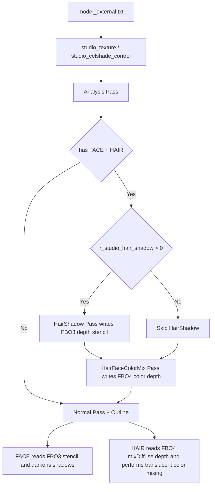

# Celshade

## Overview
Celshade is the overall stylized-shading pipeline for StudioModel in `Plugins/Renderer`. It covers base Celshade (stepped light and dark bands), Outline, RimLight/RimDark, HairSpecular, and the tightly coupled HairShadow and Eyebrow-Passthrough (HairFaceColorMix) paths.

The current implementation combines “Analysis + multiple off-screen geometry passes + Normal Pass screen-space sampling”:
- Analysis counts whether the model contains FACE/HAIR/transparent meshes.
- The HairShadow pass writes FACE/HAIR into FBO3 depth/stencil.
- The HairFaceColorMix pass writes FACE color + alpha into FBO4.
- In their respective FACE/Hair branches, the Normal pass samples stencil and mixDiffuse/depth to produce shadows and translucency effects.

## Responsibilities
- Maintains the Celshade asset-flag protocol (`STUDIO_NF_CELSHADE` / `STUDIO_NF_CELSHADE_FACE` / `STUDIO_NF_CELSHADE_HAIR`) and the external configuration entry point (`[model]_external.txt`).
- Counts `r_draw_hasface / r_draw_hashair / r_draw_hasalpha / r_draw_hasadditive / r_draw_hasoutline` during Analysis to drive subsequent pass scheduling.
- Switches HairShadow and HairFaceColorMix geometry passes through `renderfx` and manages FBO3/FBO4 binding and clearing.
- Builds `StudioProgramState` in DrawPass, binds texture inputs such as stencil/mixDiffuse/depth, and switches shader macro variants.
- Implements face/body celshade, rim light/dark, Kajiya hair specular, face stencil-shadow darkening, and hair screen-space color mixing in shaders.
- Provides a two-tier parameter system of cvars plus model-level overrides (`studio_celshade_control`), and supports the `r_studio_celshade_debug` debug branch.

## Involved Files (No Line Numbers)
- docs/Renderer.md
- Plugins/Renderer/enginedef.h
- Plugins/Renderer/gl_common.h
- Plugins/Renderer/gl_local.h
- Plugins/Renderer/gl_rmain.cpp
- Plugins/Renderer/gl_studio.cpp
- Build/svencoop/renderer/shader/common.h
- Build/svencoop/renderer/shader/studio_shader.vert.glsl
- Build/svencoop/renderer/shader/studio_shader.frag.glsl

## Architecture
Overall workflow (StudioModel Celshade):

Key implementation points:
- Enable conditions:
  - `R_StudioHasHairShadow()`: `r_draw_hashair && r_draw_hasface && r_studio_hair_shadow>0 && !R_IsRenderingShadowView()`.
  - `R_StudioHasHairFaceColorMix()`: `r_draw_hashair && r_draw_hasface && !R_IsRenderingShadowView()`.
- State flags to shader macros: `R_UseStudioProgram()` maps `StudioProgramState` to `#define` directives (such as `HAIR_SHADOW_ENABLED`, `HAIR_FACE_COLOR_MIX_ENABLED`, `STENCIL_TEXTURE_ENABLED`, `MIX_DIFFUSE_TEXTURE_ENABLED`, and `DEPTH_TEXTURE_ENABLED`).
- Correction logic: if `STUDIO_NF_CELSHADE_FACE/HAIR` is present but `STUDIO_NF_CELSHADE` is missing, `R_UseStudioProgram()` automatically adds `STUDIO_NF_CELSHADE`.
- Global switch: `R_StudioDrawMesh()` executes `if (!r_studio_celshade->value) flags &= ~STUDIO_NF_CELSHADE_ALLBITS;` at mesh level, disabling Celshade extension bits consistently.

### Shader Core
- `R_StudioCelShade()` (frag):
  - Uses `smoothstep(r_celshade_midpoint ± r_celshade_softness)` to create stepped lighting bands.
  - The FACE branch adjusts the light direction according to head direction (`v_headfwd`) to reduce facial popping at extreme angles.
  - FACE + stencil branch: forces `litOrShadowArea = 0.0` when `STENCIL_MASK_HAS_SHADOW` is hit.
  - Non-FACE branches add rim light / rim dark; the HAIR branch adds Kajiya strand specular.
- `R_GenerateAdjustedNormal()`: FACE can interpolate between the original normal and a spherical normal (`flNormalMask`), consistent with the documentation statement “the blue channel controls the ratio of the face spherical normal.”
- FACE vertical-light correction (#795): when the horizontal component of `lightdirWS.xy` is extremely small (`length < 0.2`), Z-flattening fails after `normalize()`, producing a “vertical line shadow” artifact. The correction detects verticality with `smoothstep(0.05, 0.2, length(lightdirWS.xy))` after calculating `litOrShadowArea` and before the stencil check, gradually transitioning to unshadowed (`litOrShadowArea = 1.0`).
- HairFaceColorMix pass (frag `HAIR_FACE_COLOR_MIX_ENABLED`): outputs face `diffuseColor`; if a specular texture exists, applies `diffuseColor.a *= rawSpecularColor.a`.
- Hair normal-pass color mixing (frag `STUDIO_NF_CELSHADE_HAIR && MIX_DIFFUSE_TEXTURE_ENABLED`):
  - Samples `depthTex` to reconstruct `sceneWorldPos`.
  - Only when `distance(sceneWorldPos, vWorldPos) < 4.0`, uses `mixDiffuseColor.a` to blend face/hair colors and reduce erroneous cross-layer mixing.
- HairShadow vertex offset (vert `HAIR_SHADOW_ENABLED && STUDIO_NF_CELSHADE_HAIR`): applies `r_hair_shadow_offset` along the adjusted light direction plus Z offset.

## Dependencies
- Flag and renderfx protocol:
  - `STUDIO_NF_CELSHADE / FACE / HAIR`, `STUDIO_NF_CELSHADE_ALLBITS`.
  - `kRenderFxDrawHairShadowGeometry`, `kRenderFxDrawHairFaceColorMixGeometry`, `kRenderFxDrawOutline`.
- ProgramState flags:
  - `STUDIO_HAIR_SHADOW_ENABLED`, `STUDIO_HAIR_FACE_COLOR_MIX_ENABLED`, `STUDIO_STENCIL_TEXTURE_ENABLED`, `STUDIO_MIX_DIFFUSE_TEXTURE_ENABLED`, `STUDIO_DEPTH_TEXTURE_ENABLED`.
- Off-screen resources:
  - `s_BackBufferFBO3` (stencil/depth sampling source, including stencil view).
  - `s_BackBufferFBO4` (face mix-diffuse + depth sampling source).
- Texture slots:
  - `STUDIO_BIND_TEXTURE_STENCIL=6`, `STUDIO_BIND_TEXTURE_MIX_DIFFUSE=7`, `STUDIO_BIND_TEXTURE_DEPTH=8`.
- Stencil-bit semantics:
  - `STENCIL_MASK_HAS_SHADOW=0x1`, `STENCIL_MASK_HAS_FACE=0x2`.
  - Parameter sources:
  - Global cvars: `r_studio_celshade*`, `r_studio_hair_*`, `r_studio_outline*`, `r_studio_rim*`, and `r_studio_celshade_debug`.
  - Model-level override: `studio_celshade_control` (`R_StudioLoadExternalFile_Celshade`).
- Asset dependencies:
  - `studio_texture.flags`, plus optional `replacetexture/speculartexture` (for eyebrow alpha and HDR texture workflows).

## Notes
- `r_studio_celshade=0` clears `STUDIO_NF_CELSHADE_ALLBITS` at the mesh entry point, disabling every Celshade extension path, including HairShadow/HairFaceColorMix.
- The HairFaceColorMix enable condition does not depend on `r_studio_hair_shadow`: the pass runs whenever FACE+HAIR is present and the renderer is not in ShadowView.
- The Hair color-mixing threshold is a fixed world-space distance of `4.0`; extremely scaled models may require additional tuning.
- HairShadow pass documentation describes `r_studio_hair_shadow_offset` as a “screen space offset,” but the implementation applies a vertex-geometry offset before projection.
- The HairFaceColorMix pass explicitly “does not write stencil”; face-shadow determination depends on the FBO3 stencil written by the preceding HairShadow pass.
- If `s_BackBufferFBO3.s_hBackBufferStencilView` or the `s_BackBufferFBO4` depth view is unavailable, shadow determination/translucent color mixing degrades.
- The GlowShell branch removes Celshade bits and changes to `STUDIO_NF_FLATSHADE`, so Celshade visuals do not directly layer onto the GlowShell pass.

## Callers (Optional)
- `StudioRenderModel_Template`: drives Analysis, HairShadow, HairFaceColorMix, Normal, Outline, and other passes.
- `R_StudioDrawMesh`: consistently handles mesh flags (including the Celshade switch) and routes to AnalysisPass/DrawPass.
- `R_StudioDrawMesh_AnalysisPass`: collects statistics flags such as `hasface/hashair`.
- `R_StudioDrawMesh_DrawPass`: builds `StudioProgramState` from `renderfx + flags`, completes texture binding and state setup, and calls `glDrawElements`.
- `R_UseStudioProgram`: compiles/caches shader macro variants from state flags.
- `R_CreateStudioRenderData` + `R_StudioLoadExternalFile`: initializes CelshadeControl and loads override parameters from `studio_texture/studio_celshade_control`.

## Pass Render-State Setup (By Pass / Geometry, Focused on Stencil)

### 1) Analysis Pass
- Entry: `r_draw_analyzingstudio = true`.
- Behavior: counts only `r_draw_hasface / r_draw_hashair / r_draw_hasalpha / r_draw_hasadditive`.
- Stencil: no writes.

### 2) HairShadow Geometry Pass (`renderfx = kRenderFxDrawHairShadowGeometry`)
- Scheduling: binds `s_BackBufferFBO3`, clears `depth/stencil`, and calls `glDrawBuffer(GL_NONE)`.
- Geometry filter: only `STUDIO_NF_CELSHADE_FACE` or `STUDIO_NF_CELSHADE_HAIR`.
- Stencil writes:
  - FACE: `GL_BeginStencilWrite(STENCIL_MASK_HAS_FACE, STENCIL_MASK_HAS_FACE | STENCIL_MASK_HAS_SHADOW)`.
  - HAIR: `GL_BeginStencilWrite(STENCIL_MASK_HAS_SHADOW, STENCIL_MASK_HAS_SHADOW)`.
- State: `glDisable(GL_BLEND)` + `glDepthMask(GL_TRUE)`; defaults to `glCullFace(GL_FRONT)`, while `DOUBLE_FACE` disables culling.

### 3) HairFaceColorMix Geometry Pass (`renderfx = kRenderFxDrawHairFaceColorMixGeometry`)
- Scheduling: binds `s_BackBufferFBO4` and clears color/depth/stencil.
- Geometry filter: only `STUDIO_NF_CELSHADE_FACE`.
- Output: face `diffuseColor` (alpha may be written after multiplication with `specular.a`).
- Stencil: no writes (code comment: `No need to write stencil here`).
- State: `glDisable(GL_BLEND)` + `glDepthMask(GL_TRUE)`.

### 4) Normal Pass (FACE)
- Binding: outside HairShadow/HairFaceColorMix, attempts to bind `s_BackBufferFBO3.s_hBackBufferStencilView` to slot 6 for FACE.
- Shader: reads the stencil when `STUDIO_NF_CELSHADE_FACE && STENCIL_TEXTURE_ENABLED`; a `HAS_SHADOW` hit forces shadowing.

### 5) Normal Pass (HAIR)
- Binding: if HairFaceColorMix is enabled, binds `mixDiffuse` (slot 7) and `depth` (slot 8) for HAIR.
- Shader: after reconstructing the scene world position and checking the distance threshold, blends face/hair colors according to `mixDiffuse.a` (the core of eyebrow translucency).

### 6) DrawPass Cleanup (Each Mesh)
- Restores: `glDepthMask(GL_TRUE)`, `glDisable(GL_BLEND)`, `glEnable(GL_CULL_FACE)`, `glEnable(GL_DEPTH_TEST)`, and `glDepthFunc(GL_LEQUAL)`.
- Ends stencil: `GL_EndStencil()`.
- Unbinds depth/mixDiffuse/stencil/normal/parallax/specular/animated textures according to state flags.
