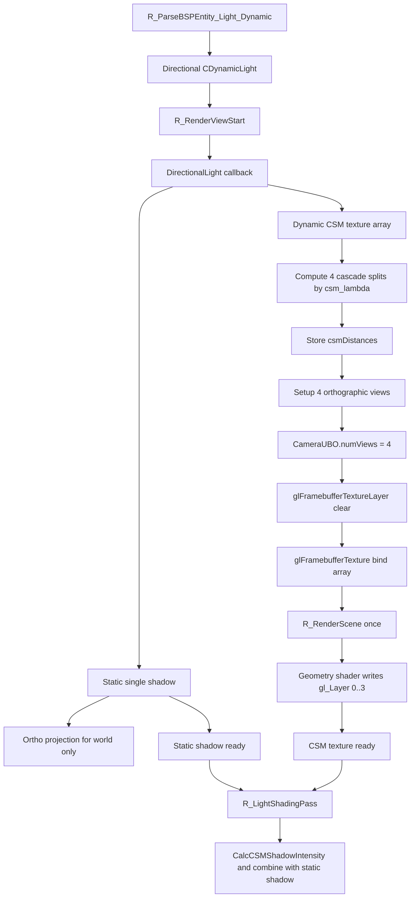

# DirectionalLightCSM

## Overview
DirectionalLightCSM handles the two-layer directional-light shadow structure in the Renderer: a static single-layer orthographic shadow and dynamic cascaded shadow maps. The dynamic portion uses `CCascadedShadowTexture` and `sampler2DArrayShadow`, rendering four cascade layers simultaneously through a single multiview `R_RenderScene()` call.

## Responsibilities
- Allocates a static single-layer `CSingleShadowTexture` and dynamic cascaded `CCascadedShadowTexture` for directional lights.
- Uses the main view's near/far planes and FOV to calculate four cascade splits, recording them through `IShadowTexture::SetCSMDistance()`.
- Builds each cascade's orthographic projection matrix and shadow matrix, then writes them to `CameraUBO`.
- Uses a texture array and multiview geometry shaders to output one `R_RenderScene()` call to four cascade layers.
- In `R_LightShadingPass()`, binds the static directional-light shadow and dynamic CSM texture together so both participate in the directional-light deferred shading result.

## Involved Files & Symbols
- `Plugins/Renderer/gl_light.h` - `CDynamicLight`
- `Plugins/Renderer/gl_light.cpp` - `R_AddVisibleDynamicLight`, `R_IterateVisibleDynamicLights`, `R_LightShadingPass`
- `Plugins/Renderer/gl_shadow.cpp` - `CSingleShadowTexture`, `CCascadedShadowTexture`, `R_CreateSingleShadowTexture`, `R_CreateCascadedShadowTexture`, `R_SetupShadowMatrix`, `R_RenderShadowmapForDynamicLights`
- `Plugins/Renderer/gl_rmain.cpp` - `R_PreRenderView`, `R_RenderScene`
- `Plugins/Renderer/gl_wsurf.cpp` - `R_ParseBSPEntity_Light_Dynamic`, world-shadow rendering, and shadow-proxy branches
- `Plugins/Renderer/gl_studio.cpp` - Shadow-caster shader variants
- `Build/svencoop/renderer/shader/common.h` - `CSM_LEVELS`, `CameraUBO.numViews`, `DSHADE_BIND_CSM_TEXTURE`
- `Build/svencoop/renderer/shader/wsurf_shader.geom.glsl` - `gl_Layer` outputs cascade layers
- `Build/svencoop/renderer/shader/studio_shader.geom.glsl` - `gl_Layer` outputs cascade layers
- `Build/svencoop/renderer/shader/dlight_shader.frag.glsl` - `sampler2DArrayShadow csmTex`, `CalcCSMShadowIntensity`

## Architecture
Directional-light shadows consist of static world shadows and dynamic CSMs:

1. `R_ParseBSPEntity_Light_Dynamic()` can parse `DynamicLightType_Directional` from the map's `light_dynamic` entities, including `size`, `shadow`, `static_shadow_size`, `dynamic_shadow_size`, `csm_lambda`, and `csm_margin`.
2. `R_RenderViewStart()` adds directional lights directly to `g_VisibleDynamicLights`; directional lights themselves receive no additional visibility culling.
3. The DirectionalLight callback in `R_RenderShadowmapForDynamicLights()` first processes static shadows:
   - Uses `CSingleShadowTexture`.
   - Sets a single-layer orthographic projection whose extent is determined by `args->size`.
   - Draws only `DRAW_CLASSIFY_WORLD`, so static shadows primarily cache world geometry.
4. It then processes dynamic CSMs:
   - If the dynamic texture does not exist or its dimensions change, it allocates `CCascadedShadowTexture`, backed by a `size x size x 4` texture array.
   - Reads the main view's near/far planes and FOV, then uses `csm_lambda` to combine linear and logarithmic splitting into four splits.
   - Records each split's far distance through `pCurrentShadowTexture->SetCSMDistance()` for cascade selection during lighting.
   - Estimates the bounding-sphere radius of each cascade's frustum, then multiplies it by `1.0 + csm_margin` to obtain a stable orthographic projection extent.
   - Writes world matrices, projection matrices, and shadow matrices for all four cascades to `CameraUBO.views[0..3]` at once, and sets `CameraUBO.numViews = CSM_LEVELS`.
5. The FBO first clears each layer with `glFramebufferTextureLayer()`, then binds the entire texture array with `glFramebufferTexture()` and calls `R_RenderScene()` once.
6. In multiview mode, `wsurf_shader.geom.glsl` and `studio_shader.geom.glsl` loop over `numViews` and write geometry to the matching cascade layer through `gl_Layer = viewIdx`.
7. In `R_LightShadingPass()`, the directional-light shader:
   - Enables `DLIGHT_STATIC_SHADOW_TEXTURE_ENABLED` and uploads `u_staticShadowMatrix` if the static texture is ready.
   - Enables `DLIGHT_CSM_SHADOW_TEXTURE_ENABLED`, uploads `u_csmMatrices`, `u_csmDistances`, and `u_csmTexel`, and binds `sampler2DArrayShadow csmTex` if the dynamic CSM texture is ready.
   - Selects the corresponding cascade through `CalcCSMShadowIntensity()` in the fragment shader and takes the `min` of the static directional-light shadow and CSM results.

## Dependencies
- `size`, `static_shadow_size`, `dynamic_shadow_size`, `csm_lambda`, `csm_margin`, `pStaticShadowTexture`, and `pDynamicShadowTexture` on `CDynamicLight`.
- The `CCascadedShadowTexture` wrapper around `GL_GenShadowTextureArray`.
- `CSM_LEVELS = 4` and the `CameraUBO` structure in `Build/svencoop/renderer/shader/common.h`.
- Multiview layer output from `wsurf_shader.geom.glsl` and `studio_shader.geom.glsl`.
- `sampler2DArrayShadow` sampling and `CalcCSMShadowIntensity()` in `dlight_shader.frag.glsl`.

## Notes
- Static directional-light shadows and dynamic CSMs have different responsibilities: the former primarily caches the world, while the latter primarily covers dynamic opaque entities.
- Dynamic CSMs are currently fixed at four cascades. Cascade distances are derived from the main view's near/far planes and the `csm_lambda` blended split, rather than fixed-ratio constants.
- Cascade orthographic extents use a frustum bounding-sphere approximation, prioritizing stability and avoiding clipped edges; `csm_margin` supplies extra expansion.
- Unlike the old four-quadrant single-texture implementation, the current CSM uses a full `size x size x 4` texture array, with each layer retaining full resolution.
- CSM rendering completes in a single `R_RenderScene()` call, significantly reducing CPU scheduling overhead and avoiding per-cascade view switches.
- Like the static point-light pass, the static directional-light pass uses `c_brush_polys > 0` to determine whether a texture is ready.
- The final shadow intensity in the lighting stage is the smaller of the static directional-light shadow and dynamic CSM results, allowing static map occlusion and dynamic-entity occlusion to apply together.

## Callers (optional)
- `Plugins/Renderer/gl_wsurf.cpp` - `R_ParseBSPEntity_Light_Dynamic` parses directional-light parameters
- `Plugins/Renderer/gl_rmain.cpp` - `R_PreRenderView` calls `R_RenderShadowMap`
- `Plugins/Renderer/gl_shadow.cpp` - the DirectionalLight callback in `R_RenderShadowmapForDynamicLights` generates static shadows and dynamic CSMs
- `Plugins/Renderer/gl_light.cpp` - the DirectionalLight callback in `R_LightShadingPass` samples the static shadow and CSM texture array
