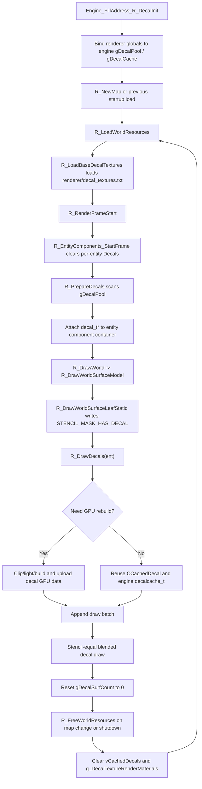

# DrawDecals

## Overview
`R_DrawDecals` and its supporting helpers integrate the engine-owned decal pool into the Renderer world-surface pipeline. Its full lifecycle includes binding to the engine's `gDecalPool/gDecalCache` at startup, assigning engine decals to entity components every frame, building or reusing Renderer-side GPU caches as needed, and clearing Renderer decal resources and material mappings on map changes or world-surface shutdown.

## Responsibilities
- Uses engine address resolution to bind the Renderer decal access points to engine globals such as `gDecalPool`, `gDecalCache`, and `gDecalSurfCount`.
- Scans the engine decal pool at the start of every frame and assigns `decal_t*` objects to the matching entity's `CEntityComponentContainer::Decals`.
- In `R_DrawWorldSurfaceModel`, filters drawable decals for the current entity and decides whether to reuse or rebuild GPU caches.
- Generates clipped decal geometry, lightmap UVs, normals/TBN, and instance data, then uploads them to dedicated decal VBO/EBOs.
- Clears Renderer-side cached decals and decal render-material mappings when world resources are reloaded or shut down, allowing subsequent frames to establish valid caches again.

## Involved Files & Symbols
- `Plugins/Renderer/gl_hooks.cpp` - `Engine_FillAddress_R_DecalInit`
- `Plugins/Renderer/gl_rmain.cpp` - `R_RenderFrameStart`, `R_NewMap`
- `Plugins/Renderer/gl_entity.h` - `CEntityComponentContainer::Reset`, `CEntityComponentContainer::Decals`
- `Plugins/Renderer/gl_entity.cpp` - `R_EntityComponents_StartFrame`
- `Plugins/Renderer/gl_rsurf.cpp` - `EngineGetDecalByIndex`, `EngineGetMaxDecalCount`, `R_PrepareDecals`, `R_DrawDecals`, `R_DecalIndex`, `R_DecalVertsClip`, `R_DecalVertsNoclip`, `R_DecalVertsLight`, `R_UploadDecalTextures`, `R_UploadDecalVertexBuffer`, `R_IsDecalCacheInvalidated`, `g_DecalDrawBatch`, `gDecalPool`, `gDecalCache`, `gDecalSurfCount`
- `Plugins/Renderer/gl_wsurf.cpp` - `R_DrawWorld`, `R_DrawWorldSurfaceModel`, `R_DrawWorldSurfaceLeafStatic`, `R_ClearDecalCache`, `R_ClearDetailTextureCache`, `R_FreeWorldResources`, `R_LoadWorldResources`, `R_LoadBaseDecalTextures`, `R_GetRenderMaterialForDecalTexture`, `R_ShutdownWSurf`
- `Plugins/Renderer/gl_wsurf.h` - `CDecalDrawBatch`, `CCachedDecal`, `CWorldSurfaceRenderer::vCachedDecals`
- `Plugins/Renderer/gl_common.h` - `decalvertex_t`, `decalvertextbn_t`, `STENCIL_MASK_HAS_DECAL`
- `Plugins/Renderer/enginedef.h` - `decalcache_t`, `FDECAL_CLIPTEST`, `FDECAL_NOCLIP`, `FDECAL_VBO`

## Architecture
The lifecycle starts not in `R_DrawDecals` itself, but when the Renderer takes over the engine decal globals. `Engine_FillAddress_R_DecalInit` in `gl_hooks.cpp` disassembles instructions near the engine's `R_DecalInit` and binds the Renderer `gDecalPool` and `gDecalCache` pointers to the actual engine addresses; the same address-fill process also resolves `gDecalSurfCount` / `gDecalSurfs`. The Renderer therefore does not own decal objects, but directly references engine memory.

At runtime, `EngineGetDecalByIndex` simply returns `&gDecalPool[index]`, while `EngineGetMaxDecalCount` returns `MAX_DECALS`. At the start of every frame, `R_RenderFrameStart` calls `R_EntityComponents_StartFrame`, and `CEntityComponentContainer::Reset` clears the entity's `Decals` list. `R_PrepareDecals` then scans the full engine decal pool; whenever `decal->psurface` is valid, it finds the target entity through `entityIndex` and places the `decal_t*` in that entity's component container. This effectively projects engine-pool decals into an entity-indexed view that the Renderer can consume each frame.

World-resource loading determines how decal material mappings enter the Renderer. `R_NewMap` first runs `R_FreeWorldResources`, then calls the engine's `R_NewMap`, and finally runs `R_LoadWorldResources`. `R_LoadWorldResources` calls `R_LoadBaseDecalTextures` to read decal material definitions from `renderer/decal_textures.txt`; during drawing, `R_GetRenderMaterialForDecalTexture` looks up `g_DecalTextureRenderMaterials` by a decal-name hash to bind optional extended materials such as detail, normal, and specular materials. If lookup fails, the decal remains drawable but has no additional render material.

Once world drawing begins, `R_DrawWorld -> R_DrawWorldSurfaceModel` first draws the base world surface. `R_DrawWorldSurfaceLeafStatic` writes `STENCIL_MASK_HAS_DECAL` during the base-surface pass, providing a per-pixel mask for the subsequent decal pass. After base-surface rendering ends, `R_DrawWorldSurfaceModel` immediately calls `R_DrawDecals(ent)`, so decals are overlaid after base opaque surfaces and before water rendering.

`R_DrawDecals` first filters out the following cases: development overview mode, disabled `DRAW_CLASSIFY_DECAL`, entities with `EF_NODECALS` under SvEngine, entities without a component container, or an empty component-container `Decals` list. After passing these checks, it clears `g_DecalDrawBatch.BatchCount` and iterates every decal held by the current entity.

For each decal, the function obtains the global `decalIndex`, the base decal texture, and the optional `CWorldSurfaceRenderMaterial`. It enters the rebuild path if the decal lacks `FDECAL_VBO` or if `R_IsDecalCacheInvalidated` detects changes to cached `gltexturenum`, dimensions, or `pRenderMaterial`. Thus, the Renderer splits decal lifetime into two layers: a long-lived engine object and a Renderer GPU cache that is invalidated and rebuilt on demand.

Geometry rebuilding has two paths:
- `FDECAL_NOCLIP` path: uses `R_DecalVertsNoclip`. It reuses the four-vertex `decalcache_t` cache in the engine's `gDecalCache`; on a cache miss, it still calls `R_DecalVertsClip` once to generate the quad, then calls `R_DecalVertsLight`.
- Normal path: uses `R_DecalVertsClip`. This function projects surface-polygon vertices into decal texture space and performs four `SHClip` operations against the `[0,1]` bounds. If a decal first passes `FDECAL_CLIPTEST` and the result is a complete quad, it upgrades the flag to `FDECAL_NOCLIP`, enabling the faster path on subsequent frames. If the current renderer still uses lightmaps, it additionally calls `R_DecalVertsLight` to calculate lightmap UVs for every vertex.

If `vertCount > 0`, `R_UploadDecalTextures` records the texture ID, dimensions, and render material in `vCachedDecals[decalIndex]` and, when needed, appends a `world_material_t` to `hMaterialSSBO` containing diffuse/detail/normal/parallax/specular scaling data. `R_UploadDecalVertexBuffer` then converts the clipped polygon into a triangle list, fills `decalvertex_t`, `decalvertextbn_t`, and one `brushinstancedata_t` instance, and writes them to fixed `decalIndex` slots in `hDecalVBO` and `hDecalEBO`; `CCachedDecal` records GPU submission parameters such as `startIndex`, `indiceCount`, `startInstance`, and `instanceCount`. Finally, it applies `FDECAL_VBO` to the decal.

If `vCachedDecals[decalIndex].indiceCount > 0`, `R_DrawDecals` appends the texture ID, index offset, index count, instance range, and render-material pointer to `g_DecalDrawBatch`. This only collects batches; it does not draw immediately. During actual submission, `R_DrawDecals` enables alpha blending, disables depth writes, enables `GL_BeginStencilCompareEqual(STENCIL_MASK_HAS_DECAL, STENCIL_MASK_HAS_DECAL)`, limits the GBuffer write mask to `GBUFFER_MASK_DIFFUSE | GBUFFER_MASK_WORLDNORM | GBUFFER_MASK_SPECULAR`, binds `hDecalVAO`, and calls `glDrawElementsInstancedBaseInstance` for each batch. After rendering, it restores graphics state and resets `(*gDecalSurfCount)` to zero as cleanup of the engine-side count for this decal-drawing pass.

The lifecycle ends with Renderer-side resource release rather than engine decal destruction. `R_FreeWorldResources` clears `vWorldMaterials` and `vWorldMaterialTextureMapping`, calls `R_ClearDecalCache` to reset `vCachedDecals` index counts and material references, then calls `R_ClearDetailTextureCache` to clear `g_DecalTextureRenderMaterials`. `R_NewMap` follows this release chain during map changes, and `R_ShutdownWSurf` follows the same flow when world-surface shuts down. `R_LoadWorldResources` then reloads decal material mappings; on the next frame, `R_PrepareDecals` again assigns decals from the engine-owned `gDecalPool`, and `R_DrawDecals` rebuilds GPU caches as needed to complete a new lifecycle.

## Dependencies
- Engine address resolution and global binding: `gDecalPool`, `gDecalCache`, `gDecalSurfCount`, `gDecalSurfs`
- Engine decal pool and surface data: `decal_t`, `msurface_t`, `entityIndex`, `Draw_DecalTexture`
- Entity-component lifecycle: `R_EntityComponents_StartFrame`, `CEntityComponentContainer::Reset`, `R_GetEntityComponentContainer`
- World-surface GPU resources: `hDecalVAO`, `hDecalVBO`, `hDecalEBO`, `hMaterialSSBO`, `vCachedDecals`
- Decal material registry: `g_DecalTextureRenderMaterials`, `renderer/decal_textures.txt`, `R_GetRenderMaterialForDecalTexture`
- Shared stencil / lightmap / fog / clip / GBuffer / OIT state conventions for the base-surface pass

## Notes
- The Renderer neither allocates nor frees `decal_t`; it only references objects in the engine's `gDecalPool` and re-establishes entity-to-decal assignments every frame.
- `R_PrepareDecals` scans all `MAX_DECALS` every frame, but retains only decals with a valid `psurface` in the Renderer drawable list.
- `FDECAL_NOCLIP` is an optimization flag; once `R_DecalVertsClip` proves that a decal covers a complete quad, later frames can reuse the four-vertex result in the engine's `gDecalCache`.
- Renderer GPU caches are invalidated when `FDECAL_VBO` is absent or when `gltexturenum`, texture dimensions, or `pRenderMaterial` changes; this is cache invalidation, not engine decal destruction.
- `R_ClearDecalCache` clears only the draw ranges and material references in Renderer-side `vCachedDecals`; it does not free the engine's `gDecalPool` or `gDecalCache`.
- `R_ClearDetailTextureCache` clears `g_DecalTextureRenderMaterials`; after `R_LoadWorldResources` reloads decal materials, a changed `pRenderMaterial` pointer causes `R_IsDecalCacheInvalidated` to trigger decal GPU-cache rebuilding.
- `R_FreeWorldResources` runs in both `R_NewMap` and `R_ShutdownWSurf`, so map changes and world-surface shutdown both end the current Renderer decal-resource lifecycle.
- `R_DrawDecals` resets `(*gDecalSurfCount)` to zero at the end; this shows the Renderer clearing the engine-side decal drawing count, although this memory note does not further describe the engine's complete consumption path for that count.
- `R_UploadDecalVertexBuffer` calls `Sys_Error` if it cannot trace `msurface_t` back to a worldmodel or surfIndex, so it assumes every decal is bound to a resolvable world surface.

## Callers (optional)
- `Plugins/Renderer/gl_wsurf.cpp` - `R_DrawWorldSurfaceModel`
- Indirect call chain: `Plugins/Renderer/gl_wsurf.cpp` - `R_DrawWorld` -> `R_DrawWorldSurfaceModel`
- Related preparation chain: `Plugins/Renderer/gl_rmain.cpp` - `R_RenderFrameStart` -> `R_PrepareDecals`
