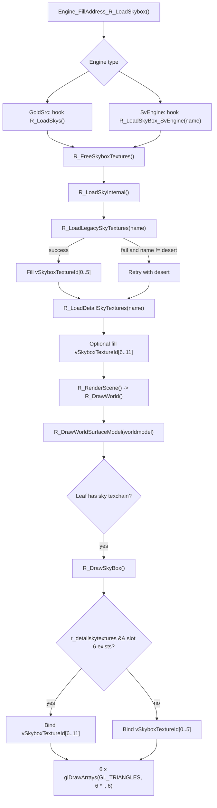

# DrawSkybox

## Overview
`DrawSkybox` covers the `Renderer` plugin's skybox resource loading and per-frame rendering flow. It hooks the engine's sky-loading entry point, loads sky textures into `g_WorldSurfaceRenderer.vSkyboxTextureId[12]`, and decides whether to render the skybox before world geometry based on whether the current leaf contains sky surfaces.

## Responsibilities
- Hooks the engine's sky-loading entry point: GoldSrc uses `R_LoadSkys()`, while SvEngine uses `R_LoadSkyBox_SvEngine(const char* name)`.
- Releases the current skybox slots and reloads six base sky faces plus an optional six DDS high-quality replacement faces.
- Identifies `SURF_DRAWSKY` sky surfaces while generating world-surface texture chains and records them in the leaf's `TextureChainSpecial[WSURF_TEXCHAIN_SPECIAL_SKY]`.
- In `R_DrawWorldSurfaceModel()`, calls `R_DrawSkyBox()` before world geometry only when drawing `cl_worldmodel` and the current leaf contains a sky chain.
- Reuses the sky-surface geometry path `R_DrawWorldSurfaceLeafSky()` in specific view branches, such as sky-surface processing for water reflections.

## Involved Files & Symbols
- `Plugins/Renderer/gl_hooks.cpp` - `Engine_FillAddress_R_LoadSkybox`, `Engine_InstallHooks`
- `Plugins/Renderer/privatehook.h` - `gPrivateFuncs.R_LoadSkys`, `gPrivateFuncs.R_LoadSkyboxInt_SvEngine`, `gPrivateFuncs.R_LoadSkyBox_SvEngine`
- `Plugins/Renderer/gl_rmain.cpp` - `R_FreeSkyboxTextures`, `R_LoadLegacySkyTextures`, `R_LoadDetailSkyTextures`, `R_LoadSkyInternal`, `R_LoadSkyBox_SvEngine`, `R_LoadSkys`, `R_RenderScene`
- `Plugins/Renderer/gl_wsurf.cpp` - `R_GenerateIndicesForTexChain`, `R_GenerateTexChain`, `R_WorldSurfaceLeafHasSky`, `R_DrawSkyBox`, `R_DrawWorldSurfaceLeafSky`, `R_DrawWorldSurfaceModel`, `R_DrawWorld`
- `Plugins/Renderer/gl_wsurf.h` - `CWorldSurfaceRenderer::vSkyboxTextureId`
- `Plugins/Renderer/gl_draw.cpp` - `GL_Texturemode_internal`, `GL_UnloadTextures`
- `Plugins/Renderer/gl_local.h` - `r_detailskytextures`, `r_wsurf_sky_fog`, `r_loading_skybox`

## Architecture
Skybox loading and rendering can be divided into the following stages:

1. Loading stage
`gl_hooks.cpp` first uses `Engine_FillAddress_R_LoadSkybox()` to locate the engine's internal sky-loading entry points and related variables through disassembly, then installs inline hooks by engine type in `Engine_InstallHooks()`. The GoldSrc branch hooks `R_LoadSkys()`, which obtains the sky name from `pmovevars->skyName`; the SvEngine branch hooks `R_LoadSkyBox_SvEngine(name)`, which receives the sky name directly.

2. Texture loading stage
Both hook entry points first call `R_FreeSkyboxTextures()` to clear `vSkyboxTextureId[12]`, then enter `R_LoadSkyInternal()`. Specifically:
- `R_LoadLegacySkyTextures(name)` loads `gfx/env/<name>{rt,lf,bk,ft,up,dn}.tga` in sequence, falls back to same-named `.bmp` files on failure, and writes the results to `vSkyboxTextureId[0..5]`.
- If all six base faces load successfully, `R_LoadDetailSkyTextures(name)` runs next. It first reads `gfx/env/<name>{...}.dds`, then falls back to `renderer/texture/skybox/<name>{...}.dds` on failure, and writes the results to `vSkyboxTextureId[6..11]`.
- If loading the base sky fails and the name is not `desert`, `R_LoadSkyInternal()` falls back to `desert` and tries again.

3. Sky visibility determination stage
During `TEXCHAIN_PASS_SOLID_WITH_SKY`, `R_GenerateTexChain()` turns world surfaces whose texture name is `"sky"` and which are flagged `SURF_DRAWSKY` into `TEXCHAIN_SKY`, writing them to the leaf's `TextureChainSpecial[WSURF_TEXCHAIN_SPECIAL_SKY]`. `R_WorldSurfaceLeafHasSky()` simply checks whether that special texchain's `drawCount` is greater than 0.

4. Per-frame rendering stage
`R_RenderScene()` calls `R_DrawWorld()`, which then enters `R_DrawWorldSurfaceModel()`. Only when the current model is `*cl_worldmodel`, the function gets the current viewpoint leaf; if that leaf has a sky chain, it calls `R_DrawSkyBox()` first and then continues rendering static and animated world surfaces. The skybox is therefore a pre-world-rendering pass, rather than an independent post-processing pass.

5. Difference between the skybox and sky-surface geometry
`R_DrawSkyBox()` uses the six already loaded face textures in `vSkyboxTextureId[0..11]`, binds the `WSURF_SKYBOX_ENABLED` shader variant, and performs `glDrawArrays(GL_TRIANGLES, 6 * i, 6)` for each face with `r_empty_vao`. If `r_detailskytextures` is true and `vSkyboxTextureId[6]` is nonzero, the entire draw uses `vSkyboxTextureId[6..11]`; otherwise, it uses the base faces in `vSkyboxTextureId[0..5]`.

`R_DrawWorldSurfaceLeafSky()` is a separate path: it draws world-surface geometry in the BSP that has been identified as sky, rather than the six skybox face textures. In the current code, it only appears in the water-view branch of `R_DrawWorldSurfaceModel()`, and the color mask is disabled before it is called.

## Dependencies
- Engine hooks and address resolution: `Engine_FillAddress_R_LoadSkybox()`, `Engine_InstallHooks()`, `gPrivateFuncs.R_LoadSkys`, and `gPrivateFuncs.R_LoadSkyBox_SvEngine`
- Sky name source: GoldSrc uses `pmovevars->skyName`, while SvEngine uses the function parameter `name` directly
- Unified texture loading: `R_LoadTextureFromFile()`
- World-surface classification: `SURF_DRAWSKY`, texture name `"sky"`, and `TextureChainSpecial[WSURF_TEXCHAIN_SPECIAL_SKY]`
- Rendering states and switches: `DRAW_CLASSIFY_SKYBOX`, `WSURF_SKYBOX_ENABLED`, `r_detailskytextures`, and `r_wsurf_sky_fog`
- Unified texture lifetime management: `GL_UnloadTextures()`

## Notes
- The actual layout of `vSkyboxTextureId[12]` is six base sky faces plus six DDS replacement faces; `R_DrawSkyBox()` does not overlay them, but selects one set or the other.
- `R_DrawSkyBox()` returns early in developer overview mode, when `DRAW_CLASSIFY_SKYBOX` is disabled, or when the base sky slot `vSkyboxTextureId[0]` is empty.
- `R_FreeSkyboxTextures()` only clears skybox slots and does not directly delete GL texture objects; the actual unified cleanup is in `GL_UnloadTextures()`, whose comment states that `R_NewMap` triggers the process.
- `R_LoadLegacySkyTextures()` / `R_LoadDetailSkyTextures()` immediately return `false` when any face fails and do not roll back texture slots already written in that attempt. Therefore, if a load fails partway through, the array can temporarily retain partially written results until the next clear.
- Although `R_DrawWorldSurfaceModel()` is also reused by `R_DrawBrushModel()`, pre-world skybox rendering occurs only in the world-model branch where `pModel->m_model == (*cl_worldmodel)`; ordinary brush entities do not trigger `R_DrawSkyBox()`.
- `r_loading_skybox` is resolved from an internal engine variable in `gl_hooks.cpp`, but does not further participate in the local skybox flow in the current `Renderer` code.
- `R_DrawWorldSurfaceLeafSky()` runs after the color mask is disabled in the water-view branch. From its current call site, it appears to maintain sky-surface geometry/depth-related state for reflection views rather than directly render the six skybox face textures. This is an inference based on the call context.

## Callers (optional)
- Engine sky-loading flow, entering `R_LoadSkys()` or `R_LoadSkyBox_SvEngine()` through an inline hook installed by `Engine_InstallHooks()`
- `R_RenderScene()` -> `R_DrawWorld()` -> `R_DrawWorldSurfaceModel()` -> `R_DrawSkyBox()`
- `R_DrawWorldSurfaceModel()` -> `R_DrawWorldSurfaceLeafSky()` (water-view branch only)
