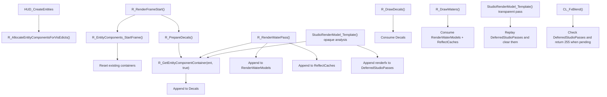

# EntityComponentContainer

## Overview
`CEntityComponentContainer` is a per-entity temporary render-attachment container in the Renderer plugin. It attaches extra render data to an individual `cl_entity_t` for one frame without directly modifying the entity structure itself. It centrally caches cross-stage data such as decals, water-rendering data, and deferred studio passes in an entity-level container for later drawing stages to consume.

## Responsibilities
- Maintains one reusable render-component container per entity, indexed by client entity, temp entity, or fallback pointer.
- Clears the container's “current-frame data” at the start of a frame while retaining the container itself, avoiding repeated per-frame allocation/deallocation.
- Collects decal lists per entity during `R_PrepareDecals` for `R_DrawDecals` to read.
- Collects visible water-surface models and reflection caches per entity during `R_RenderWaterPass` for `R_DrawWaters` to read.
- Records deferred studio renderfx passes during the opaque-analysis phase of `StudioRenderModel_Template` for replay during the transparent phase.
- Creates and fully releases the container registries during renderer initialization/shutdown, and preallocates containers for currently visible entities in `HUD_CreateEntities`.

## Involved Files & Symbols
- `Plugins/Renderer/gl_entity.h` - `CEntityComponentContainer`
- `Plugins/Renderer/gl_entity.cpp` - `g_ClientEntityRenderComponents`
- `Plugins/Renderer/gl_entity.cpp` - `g_TempEntityRenderComponents`
- `Plugins/Renderer/gl_entity.cpp` - `g_UnmanagedEntityRenderComponent`
- `Plugins/Renderer/gl_entity.cpp` - `R_GetEntityComponentContainer`
- `Plugins/Renderer/gl_entity.cpp` - `R_InitEntityComponents`
- `Plugins/Renderer/gl_entity.cpp` - `R_ShutdownEntityComponents`
- `Plugins/Renderer/gl_entity.cpp` - `R_EntityComponents_StartFrame`
- `Plugins/Renderer/gl_entity.cpp` - `R_AllocateEntityComponentsForVisEdicts`
- `Plugins/Renderer/gl_rsurf.cpp` - `R_PrepareDecals`
- `Plugins/Renderer/gl_rsurf.cpp` - `R_DrawDecals`
- `Plugins/Renderer/gl_water.cpp` - `R_RenderWaterPass`
- `Plugins/Renderer/gl_water.cpp` - `R_DrawWaters`
- `Plugins/Renderer/gl_studio.cpp` - `StudioRenderModel_Template`
- `Plugins/Renderer/gl_rmain.cpp` - `R_RenderFrameStart`
- `Plugins/Renderer/gl_rmain.cpp` - `CL_FxBlend`
- `Plugins/Renderer/exportfuncs.cpp` - `HUD_CreateEntities`

## Architecture
The core structure consists of “container objects” and “three global registries.” `CEntityComponentContainer` itself stores only four types of entity-owned render attachments: `Decals`, `RenderWaterModels`, `ReflectCaches`, and `DeferredStudioPasses`. Containers are accessed uniformly and allocated lazily through `R_GetEntityComponentContainer`.

There are three registry types:
- `g_ClientEntityRenderComponents`: accessed by the client-entity index in the `cl_entities` base array.
- `g_TempEntityRenderComponents`: accessed by the slot index of `TEMPENTITY` in `gTempEnts`.
- `g_UnmanagedEntityRenderComponent`: map fallback for entity pointers that do not fall in the contiguous-memory ranges of the first two types.

`R_GetEntityComponentContainer` always searches in the order client entity -> temp entity -> unmanaged fallback. For a matching client/temp slot, it first `resize`s if the array is too short, then conditionally `new CEntityComponentContainer()` when `create_if_not_exists=true`. This lets callers use `true` to create containers during the “collection phase” and `false` for read-only access during the “consumption phase.”

In lifecycle terms, `R_InitEntityComponents` only clears the global registries; `R_ShutdownEntityComponents` iterates the three registries and `delete`s their containers; `R_EntityComponents_StartFrame` calls `Reset()` each frame only to clear internal container vectors, without destroying containers. Container allocations are therefore reused across frames.

In the rendering flow, this component acts as an entity-level scratchpad shared across passes:

Specific subflows are as follows:
- Decal path: `R_PrepareDecals` iterates the engine decal list, finds each entity by `decal->entityIndex`, and writes it to `Decals`; `R_DrawDecals` then reads and draws from that entity's container.
- Water path: `R_RenderWaterPass` writes `RenderWaterModels` and corresponding `ReflectCaches` for visible water-surface entities; `R_DrawWaters` reads these two arrays in pairs at matching indices.
- Studio path: when `StudioRenderModel_Template` detects alpha/additive/glowshell during opaque analysis, it records the matching `renderfx` in `DeferredStudioPasses`; the transparent phase then replays them one by one and clears the array afterward. `CL_FxBlend` also reads it and directly returns `255` if a deferred studio pass is pending.

## Dependencies
- Engine entity storage and visible lists: `cl_entities`, `cl_max_edicts`, `gTempEnts`, `cl_visedicts`, `cl_numvisedicts`, `r_worldentity`
- Engine query interface: `gEngfuncs.GetEntityByIndex(0)`
- Renderer subsystems: `gl_rsurf.cpp`, `gl_water.cpp`, `gl_studio.cpp`, `gl_rmain.cpp`, `exportfuncs.cpp`
- Data types and render constants: `decal_t`, `CWaterSurfaceModel`, `CWaterReflectCache`, `kRenderFxDrawAlphaMeshes`, `kRenderFxDrawAdditiveMeshes`, `kRenderFxDrawGlowShell`

## Notes
- `Reset()` only clears vectors; it does not deeply free objects pointed to by `Decals` and `ReflectCaches`, whose ownership remains outside the container. `RenderWaterModels` uses `shared_ptr`, so clearing releases only references held by the current container.
- `RenderWaterModels` and `ReflectCaches` are parallel arrays: both are written at the same position in `R_RenderWaterPass` and read at the same index in `R_DrawWaters`; future maintenance must preserve matching length and order.
- `R_InitEntityComponents()` merely `clear()`s the three registries and does not release historical containers. It relies on its current calling contract: it is used only in the one-time initialization path of `R_Init()`, while actual release is handled by `R_ShutdownEntityComponents()`.
- The implementation of `R_GetEntityComponentContainer()` indicates that `r_worldentity` is first normalized to `GetEntityByIndex(0)`, but the client-entity branch accepts only `index > 0`; therefore, the world entity's container ultimately falls into `g_UnmanagedEntityRenderComponent`.
- These global registries are mutable global state without synchronization protection; the current implementation assumes access only from rendering-related main-thread paths.

## Callers (optional)
- `Plugins/Renderer/gl_rmain.cpp` - `R_Init`, `R_Shutdown`, `R_RenderFrameStart`, `CL_FxBlend`
- `Plugins/Renderer/exportfuncs.cpp` - `HUD_CreateEntities`
- `Plugins/Renderer/gl_rsurf.cpp` - `R_PrepareDecals`, `R_DrawDecals`
- `Plugins/Renderer/gl_water.cpp` - `R_RenderWaterPass`, `R_DrawWaters`
- `Plugins/Renderer/gl_studio.cpp` - `StudioRenderModel_Template`
