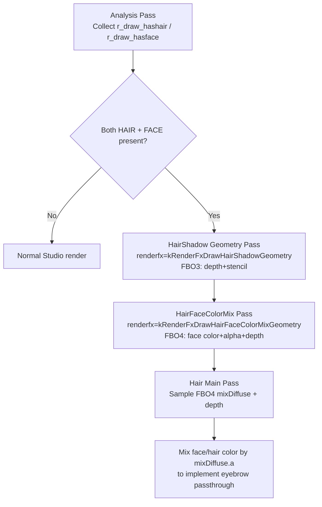

# Eyebrow-Passthrough

## Overview
Eyebrow-Passthrough is the "eyebrow passthrough" implementation in the Renderer/StudioModel pipeline: when hair occludes the face, it allows the eyebrow region to show through rear hair according to texture alpha. The current implementation uses "multi-off-screen geometry preprocessing + screen-space color mixing in the hair main pass", rather than directly changing hair transparency sorting.

This implementation follows the usage conventions in `docs/Renderer.md`:
1) the texture containing eyebrows is marked `STUDIO_NF_CELSHADE_FACE`;
2) the hair texture is marked `STUDIO_NF_CELSHADE_HAIR`;
3) eyebrow pixels provide alpha `< 255` (either from replacetexture or from mixing with specular alpha).

## Responsibilities
- Detect during analysis whether a model contains both `FACE` and `HAIR` submeshes, then decide whether to enable passthrough-related passes.
- Use separate renderfx values to schedule two geometry preprocessing paths: HairShadow geometry and HairFaceColorMix geometry.
- Bind mix-diffuse and depth sampling inputs for the hair main render pass, and perform screen-space color mixing in the fragment stage.
- Maintain external `studio_texture` configuration entry points (`flags`/`replacetexture`/`speculartexture`) to keep control on the asset side.
- Provide the celshade debug switch (`r_studio_celshade_debug`) for debugging head-orientation/color-mixing issues.

## Involved files (without line numbers)
- docs/Renderer.md
- Plugins/Renderer/enginedef.h
- Plugins/Renderer/gl_common.h
- Plugins/Renderer/gl_local.h
- Plugins/Renderer/gl_studio.cpp
- Plugins/Renderer/gl_rmain.cpp
- Plugins/Renderer/gl_rmisc.cpp
- Plugins/Renderer/gl_draw.cpp
- Plugins/Renderer/gl_draw.h
- Build/svencoop/renderer/shader/common.h
- Build/svencoop/renderer/shader/studio_shader.vert.glsl
- Build/svencoop/renderer/shader/studio_shader.frag.glsl

## Architecture
Overall flow (current implementation):

Key implementation points:
- Analysis switches: `R_StudioHasHairShadow()` is controlled by `r_studio_hair_shadow`; `R_StudioHasHairFaceColorMix()` only requires both `FACE/HAIR`.
- HairShadow geometry: with `HAIR_SHADOW_ENABLED && STUDIO_NF_CELSHADE_HAIR`, the vertex shader applies a small geometric offset according to `r_hair_shadow_offset`; it also distinguishes `HAS_SHADOW`/`HAS_FACE` in stencil, ensuring that when the face is in front it can suppress contamination from hair shadows behind it.
- HairFaceColorMix geometry: draws only `FACE` geometry; the `HAIR_FACE_COLOR_MIX_ENABLED` fragment branch outputs face `diffuseColor`; if a specular texture exists, it performs `diffuseColor.a *= rawSpecularColor.a` to mix in specular alpha.
- Hair main-pass mixing: with `STUDIO_NF_CELSHADE_HAIR && MIX_DIFFUSE_TEXTURE_ENABLED`, it samples `mixDiffuseTex` and `depthTex` and reconstructs world position from depth; it performs `mix(mixDiffuseColor.rgb, diffuseColor.rgb, mixDiffuseColor.a)` only when `distance(sceneWorldPos, vWorldPos) < 4.0`, avoiding incorrect cross-layer mixing.

Commit evolution (all on 2026-02-06):
- `4fbc8112b17a15741144ea5044ba02fdcde48deb`: the first refactor for this issue (Fix #789), introducing a clearer Hair/Celshade-related off-screen sampling path with depth participation.
- `adbe72ed688f7486c1a7397d85dc36ab3bfafdfa`: the core version, formally introducing the dual paths `kRenderFxDrawHairShadowGeometry` + `kRenderFxDrawHairFaceColorMixGeometry` and adding `STUDIO_HAIR_FACE_COLOR_MIX_ENABLED` / `STUDIO_MIX_DIFFUSE_TEXTURE_ENABLED`; it also removes unused `STUDIO_NF_CELSHADE_HAIR_H`.
- `16d60634d6e30daacf2b8225d436c4114ca76010`: fixes residual shader conditional branches (removes residual `HAIR_H` conditions).
- `97f4c66188ee7538fa1eea981e6539a4c0fc55aa`: fixes the "eyebrows incorrectly pass through rear hair" edge case by introducing depth sampling/reprojection proximity checks (the threshold at that time was `3.0 * scale`).
- `85605857dadb85e39bf9624b2f0e486528407d73`: adds the `r_studio_debug` debugging capability.
- `355d63b4b1c05c734d4b88c9d9ea830200fee878`: renames and consolidates the debugging capability as `r_studio_celshade_debug`, with corresponding `CELSHADE_DEBUG_ENABLED`.
- `b4616f937c25271df217226cc1fadd40853d4eca` / `aec1af43db7c0063d08a88c9821d8f9e758fe855` / `b7200abadf6c73d4b78b1666a8893fc43aa2c32f`: successively fine-tune the depth-proximity threshold, ultimately settling on the fixed value `4.0`.

## Dependencies
- External model-configuration system: `flags`, `replacetexture`, and `speculartexture` in `studio_texture`.
- Studio render-state bits and renderfx protocol: `STUDIO_NF_CELSHADE_FACE`, `STUDIO_NF_CELSHADE_HAIR`, `STUDIO_HAIR_SHADOW_ENABLED`, and `STUDIO_HAIR_FACE_COLOR_MIX_ENABLED`.
- Off-screen buffer resources: `s_BackBufferFBO3` (stencil/shadow-related), `s_BackBufferFBO4` (face-mix color+depth), and depth/stencil texture views.
- Shared shader functions: depth reprojection and stencil reading (`GenerateWorldPositionFromDepth` and `LoadStencilValueFromStencilTexture`).
- Relevant cvars: `r_studio_celshade`, `r_studio_hair_shadow`, `r_studio_hair_shadow_offset`, and `r_studio_celshade_debug`.
- Asset-format support (indirect): `gl_draw` support for DX10/HDR texture formats (such as BC6H / RGBA16F), used with the workflow documented as "when diffuse lacks alpha, use specular alpha in mixing".

## Notes
- If `r_studio_celshade=0`, the code clears `STUDIO_NF_CELSHADE_ALLBITS`, disabling the entire passthrough path.
- `FACE`- and `HAIR`-flagged meshes must coexist in the same model, otherwise the HairFaceColorMix path is not entered.
- Eyebrow visibility is fundamentally determined by face alpha; lower alpha produces more visible passthrough.
- The current implementation ultimately uses the fixed proximity threshold `distance < 4.0` (world space); models with extreme scale may require additional tuning.
- Both the HairShadow and HairFaceColorMix passes depend on consistent off-screen depth/stencil data; mismatched FBOs or depth views cause incorrect mixing/occlusion.
- `r_studio_celshade_debug` is for inspecting celshade/head-related debug information and is meaningful only in the face branch.

## Callers (optional)
- `StudioRenderModel_Template`: drives scheduling of the analysis pass, HairShadow pass, HairFaceColorMix pass, and normal pass.
- `R_StudioDrawMesh_AnalysisPass`: collects `r_draw_hashair / r_draw_hasface`.
- `R_StudioDrawMesh_DrawPass`: performs actual binding and drawing according to renderfx and program state.
- `R_StudioLoadExternalFile_Texture`: reads external `studio_texture` configuration and loads `flags` and external textures into materials.

## Pass render-state configuration (by pass / geometry; stencil-focused)

### Stencil-bit definitions (Studio view)
- `STENCIL_MASK_HAS_SHADOW = 0x1`
- `STENCIL_MASK_HAS_FACE = 0x2`

### 1) Analysis Pass (`r_draw_analyzingstudio = true`)
- Geometry behavior: only collects `r_draw_hashair / r_draw_hasface / r_draw_hasalpha / r_draw_hasadditive`.
- Render state: does not enter the specialized HairShadow/HairFaceColorMix GPU-state branches.
- Stencil: no writes (feature collection only).

### 2) HairShadow Geometry Pass (`renderfx = kRenderFxDrawHairShadowGeometry`, target `s_BackBufferFBO3`)
- Scheduling-layer state:
  - Binds `s_BackBufferFBO3`.
  - `GL_ClearDepthStencil(1.0f, STENCIL_MASK_NONE, STENCIL_MASK_ALL)`.
  - `glDrawBuffer(GL_NONE)` (this pass is mainly for depth/stencil recording).
- Geometry filtering: only `STUDIO_NF_CELSHADE_HAIR` / `STUDIO_NF_CELSHADE_FACE` participate.
- Geometry-level stencil writes:
  - Face geometry: `GL_BeginStencilWrite(STENCIL_MASK_HAS_FACE, STENCIL_MASK_HAS_FACE | STENCIL_MASK_HAS_SHADOW)`.
  - Hair geometry: `GL_BeginStencilWrite(STENCIL_MASK_HAS_SHADOW, STENCIL_MASK_HAS_SHADOW)`.
- Other state:
  - `glDisable(GL_BLEND)` and `glDepthMask(GL_TRUE)`.
  - By default, `glEnable(GL_CULL_FACE); glCullFace(GL_FRONT)`; disable culling for `STUDIO_NF_DOUBLE_FACE`.
- Relationship to passthrough:
  - This pass does not directly output passthrough color, but provides the face branch with the "hair-occlusion shadow bit" to prevent hair behind the face from incorrectly affecting the foreground face.

### 3) HairFaceColorMix Geometry Pass (`renderfx = kRenderFxDrawHairFaceColorMixGeometry`, target `s_BackBufferFBO4`)
- Scheduling-layer state:
  - Binds `s_BackBufferFBO4`.
  - `GL_ClearColor(0,0,0,1)` + `GL_ClearDepthStencil(...)`.
- Geometry filtering: only `STUDIO_NF_CELSHADE_FACE` participates.
- Stencil: the code path explicitly says `//No need to write stencil here`; this pass performs no dedicated stencil writes.
- Other state:
  - `glDisable(GL_BLEND)` and `glDepthMask(GL_TRUE)`.
- Color output:
  - Outputs face `diffuseColor` to FBO4; if a specular texture exists, first performs `diffuseColor.a *= rawSpecularColor.a` so specular alpha controls eyebrow passthrough.

### 4) Normal Pass (Face geometry)
- Texture binding:
  - Outside the HairShadow/HairFaceColorMix branches, FACE geometry attempts to bind `s_BackBufferFBO3.s_hBackBufferStencilView` to `STUDIO_BIND_TEXTURE_STENCIL(6)` and set `STUDIO_STENCIL_TEXTURE_ENABLED`.
- Stencil usage:
  - The face-celshade fragment stage reads `stencilTex`; if `STENCIL_MASK_HAS_SHADOW` is present, it sets `litOrShadowArea` to `0.0`.
- Effect:
  - Converts the stencil result of the HairShadow pass into face light/shadow control, keeping the shadow relationship stable.

### 5) Normal Pass (Hair geometry, passthrough core)
- Texture bindings:
  - Binds `s_BackBufferFBO4` color to `STUDIO_BIND_TEXTURE_MIX_DIFFUSE(7)`.
  - Binds the `s_BackBufferFBO4` depth/depth-view to `STUDIO_BIND_TEXTURE_DEPTH(8)`.
- Mixing logic:
  - With `STUDIO_NF_CELSHADE_HAIR && MIX_DIFFUSE_TEXTURE_ENABLED`, samples `mixDiffuseTex + depthTex`.
  - Performs `mix(mixDiffuseColor.rgb, diffuseColor.rgb, mixDiffuseColor.a)` only when `distance(sceneWorldPos, vWorldPos) < 4.0`.
- Stencil:
  - Hair main-pass passthrough does not depend on additional stencil writes; it primarily relies on the color/depth reconstruction constraint from FBO4.

### 6) Shared state restoration at the end of DrawPass (after every mesh)
- `glDepthMask(GL_TRUE)`
- `glDisable(GL_BLEND)`
- `glEnable(GL_CULL_FACE)`
- `glEnable(GL_DEPTH_TEST)`
- `glDepthFunc(GL_LEQUAL)`
- `GL_EndStencil()`
