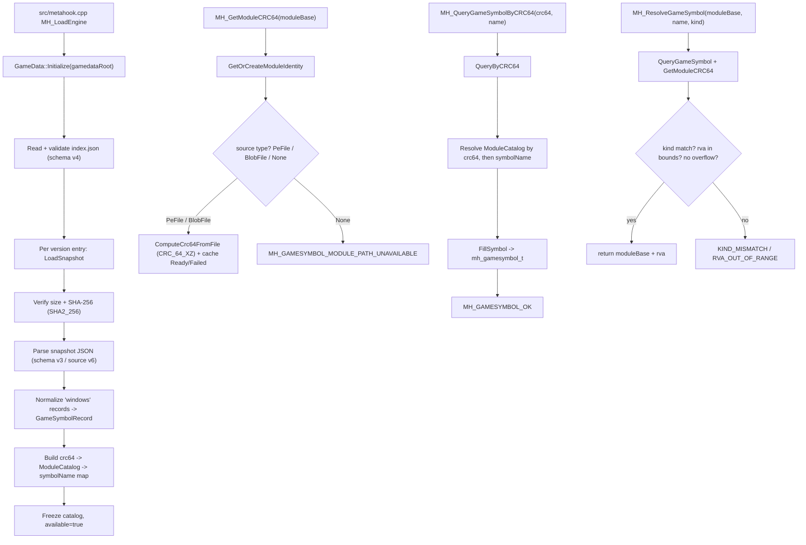

# GameData

## Overview

GameData 是 launcher 与 V3/V4 插件共享的本地游戏符号目录（catalog）组件：从 `<game>\<mod>\metahook\gamedata\index.json` 读取并冻结一份只读符号表，按 `(moduleCRC64, symbolName)` 查询符号元数据，并通过 `moduleBase` 懒计算模块原始文件的 CRC-64/XZ。公共接口以 MetaHook API 109 暴露（`metahook_api_t` 尾部追加的 6 个函数槽）。相关设计见 `docs/plans/metahook-gamedata-api-implementation-plan.md`。

## Responsibilities

- 构建并冻结只读 catalog（`GameData::Initialize`），初始化后不可重载，所有返回指针在进程退出前有效。
- 校验 index（schema v4）与每个 snapshot（schema v3 / `source.snapshotSchemaVersion` v6）的路径安全、size、SHA-256（`Chocobo1::SHA2_256`）。
- 只提取 `platform == "windows"` 的记录，将 `function` / `global` payload 规范化为 `GameSymbolRecord`；单 snapshot 失败隔离为 diagnostics，不破坏整个 catalog。
- 将 signature 文本编译为 `(bytes, mask, legacyPattern)` 三态。
- 按 `moduleBase` 管理 `ModuleIdentity`（普通 PE / Blob 文件 / None），懒计算并缓存模块 CRC-64/XZ，处理 mirror alias 与 unload 失效。
- 实现公共 API：`MH_GetModuleCRC64`、`MH_QueryGameSymbol`、`MH_QueryGameSymbolByCRC64`、`MH_ResolveGameSymbol`、`MH_SearchPatternMasked`、`MH_GetGameSymbolStatusString`。
- 提供 `GameData::RegisterModuleFileSource`（Blob engine）与 `RegisterMirrorAlias` 供 launcher 注册模块来源。

## Involved Files & Symbols

- `src/GameData.h` — `GameData` namespace 声明（`Initialize`/`QueryByCRC64`/`GetModuleCRC64`/`RegisterModuleFileSource`/`RegisterMirrorAlias`/`InvalidateModule`/`ResetModuleIdentities`，第 13-63 行）与公共 `MH_*` 入口（第 57-62 行）。
- `src/GameData.cpp` — 实现 `GameDataCatalog` 构建（`Initialize`/`LoadSnapshot`/`ValidateIndex`）、签名解析 `ParseSignature`、payload 规范化 `NormalizeFunction`/`NormalizeGlobal`、模块哈希状态机 `GetModuleCRC64`/`ComputeCrc64FromFile`、公共 API 与 `MH_GetGameSymbolStatusString`。
- `include/metahook.h` — `METAHOOK_API_VERSION 109`（第 112 行）、`mh_gamesymbol_kind_t`/`mh_gamesymbol_status_t`/`mh_pattern_t`/`mh_gamesymbol_t`（第 183-257 行）、`metahook_api_t` 新增 6 个函数槽（第 761-809 行）。
- `src/metahook.cpp` — launcher 集成：`MH_LoadEngine_ResolveSymbol`（第 1591 行）、`MH_LoadEngine_ResolveGlobalOperand`（第 1624 行）、`MH_LoadEngine` 中 catalog 初始化与来源注册（第 1664-1770 行）。
- `src/LoadDllNotification.cpp` / `.h` — DLL 加/卸载通知中调用 `GameData::InvalidateModule`（第 144、212 行）与 `MH_IsInLdrCriticalRegion`（第 66 行）。
- `scripts/sync-gamedata.py` — Pre-build 从固定 HTTPS index 下载、校验并事务式替换打包目录。
- `scripts/validate-gamedata.py` — 发布门禁：校验 index/snapshot、期望符号、冲突与 required profiles。
- `tools/global_common.props` — `GameSymbolsIndexUrl`、gamedata 目录、统一 `GameDataSyncCommand`。
- `src/MetaHook.vcxproj` / `.filters` — 加入 `GameData.cpp` 与 rapidjson / Chocobo1Hash include 路径。
- `.gitignore` — 忽略 `Build/svencoop/metahook/gamedata/`。
- `Build\svencoop\metahook\gamedata\index.json` 及 `<snapshot>.json` — 打包数据。

## Architecture

## Dependencies

- `thirdparty/rapidjson`（submodule）— 解析 index.json 与 snapshot JSON。
- `thirdparty/Chocobo1Hash`（submodule，gitlink `f455b0e`）— `Chocobo1::CRC_64_XZ`（模块身份哈希，refl poly `0xC96C5795D7870F42`）与 `Chocobo1::SHA2_256`（snapshot 完整性校验）。需在 `<windows.h>` 之前包含以免 `min/max` 宏污染。
- Windows API — `GetModuleFileNameW` / `CreateFileW` / `_wstat64` 用于普通 PE 来源发现与文件流式哈希；loader lock 判定 `MH_IsInLdrCriticalRegion`。
- 数据资源 — 打包 `Build\svencoop\metahook\gamedata\`（gitignore），运行时 `<game>\<mod>\metahook\gamedata\`。

## Notes

- catalog 构建后冻结，不重载；返回给插件的 `signature.text` / `bytes` / `mask` / `legacyPattern` 指向稳定 heap-owned 存储，有效至进程退出。
- 模块哈希懒计算且缓存：首个查询把 `Uncomputed -> Computing` 并在锁外做文件 I/O，后续线程在 cv 上等待；读取期间文件变化（size/mtime）返回 `MODULE_HASH_FAILED`。哈希 I/O 不持有全局 catalog 锁。
- loader 临界区内只用无锁 `g_pendingModuleInvalidations[64]` 与 `g_resetModuleIdentitiesPending` 排队失效，溢出时保守全量失效，并在下一个安全查询点 `DrainPendingModuleInvalidations`；`MH_LoadEngine` 开头的 `GameData::ResetModuleIdentities` 是每 engine session 的兜底。要求 lock-free 原子（`static_assert ATOMIC_POINTER_LOCK_FREE == 2`）。
- signature 只接受空格分隔的两位十六进制字节与 `??` wildcard；`bytes + mask` 为权威无损表示（`mask[i]==0` 通配），`legacyPattern` 仅在签名不含字面量 `0x2A` 字节时生成，否则为 `NULL`。
- 符号名查找区分大小写；键为 `(moduleCRC64, symbolName)`。完全相同的重复记录去重，内容冲突标记 `CATALOG_CONFLICT`；未类型化 kind 标记 `unsupportedKind` 查询返回 `UNSUPPORTED_KIND`。
- `cbSize` 契约：调用方先置 `cbSize = sizeof(mh_gamesymbol_t)`，过小返回 `OUTPUT_TOO_SMALL`；失败时输出字段清零但保留 `cbSize`。
- `ResolveGameSymbol` 只接受 `FUNCTION`/`GLOBAL`，并做 rva 与 `rva + symbolSize` 的溢出和映像边界检查；不校验内存 signature，也不做跨版本扫描。
- 当前发布数据缺口：svencoop-10257 尚缺 `videomode` / `cvar_hooks` / `Cvar_DirectSet`，因此 cvar 分支与 blob 客户端 `FreeBlob` 仍走旧扫描；`scripts/validate-gamedata.py` 作为门禁阻断发布，数据补齐前不迁移。
- `Build\svencoop\metahook\gamedata\` 被 gitignore，由 Pre-build 的 `sync-gamedata.py` 通过同卷 staging + 事务式目录交换生成；commit `6b8f6f65 "remove gamedata."` 删除了原先跟踪的 JSON 载荷。

## Callers

- `src/metahook.cpp` — `MH_LoadEngine_ResolveSymbol`（`MH_ResolveGameSymbol` / `MH_GetModuleCRC64` / `MH_GetGameSymbolStatusString`）、`MH_LoadEngine_ResolveGlobalOperand`（`MH_QueryGameSymbol`）、`MH_LoadEngine`（`GameData::Initialize` / `RegisterModuleFileSource` / `RegisterMirrorAlias` / `ResetModuleIdentities`）。
- `src/LoadDllNotification.cpp` — 加/卸载通知中 `GameData::InvalidateModule(ctx.ImageBase, inCritRegion)`。
- V3/V4 插件 — 通过 `metahook_api_t` API 109 新增的 6 个函数槽调用。

Related: [[metahook-privatevars]] [[project-overview]] [[plugin-system]]
