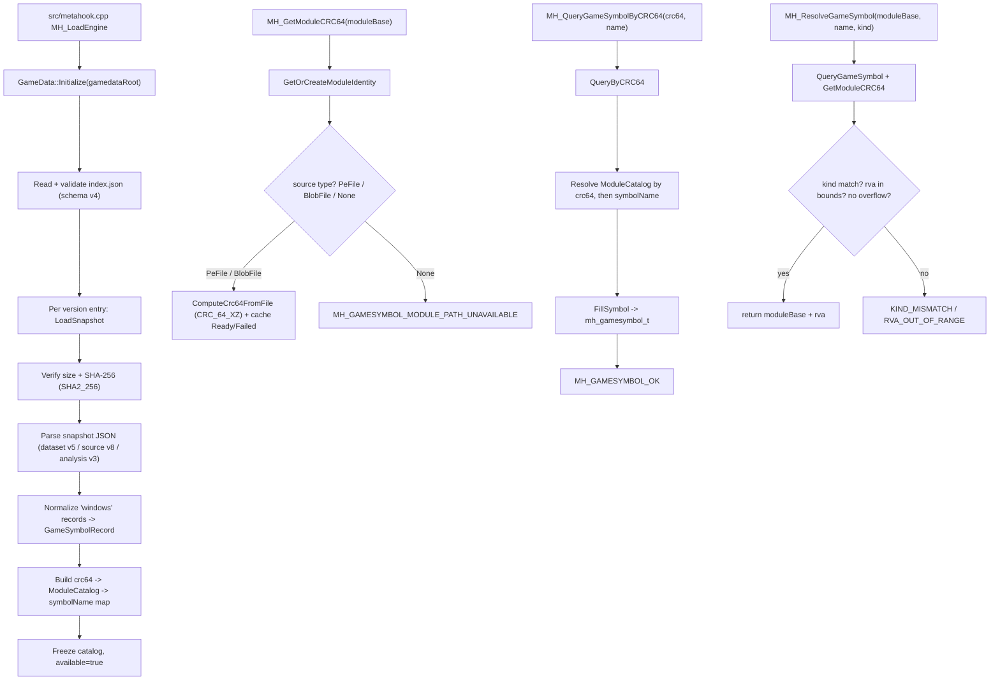

# GameData

## Overview

GameData 是 launcher 与 V3/V4 插件共享的本地游戏符号目录（catalog）组件：从 `<game>\<mod>\metahook\gamedata\index.json` 读取并冻结只读符号表，按 `(moduleCRC64, symbolName)` 查询元数据，并通过 `moduleBase` 懒计算模块原始文件的 CRC-64/XZ。公共接口从 API 109 起提供地址查询；API 110/111 分别追加 PATCH/SCALAR 与对应槽位，API 112/113 追加 VIRTUAL_FUNCTION/VTABLE 地址类型，API 114 追加 STRUCT_MEMBER 与 `QueryGameSymbolStructMember` 偏移查询槽位；既有函数槽位顺序不变。

## Responsibilities

- 构建并冻结只读 catalog（`GameData::Initialize`），初始化后不可重载，所有返回指针在进程退出前有效。
- 校验 index（schema v4）与每个 snapshot（dataset schema v5 / `source.snapshotSchemaVersion` v8 / `source.analysisOutputContractVersion` v3）的路径安全、size、SHA-256（`Chocobo1::SHA2_256`）。旧代际（dataset schema 4 / source contract 7）被明确拒绝并记为 diagnostic。
- 只提取 `platform == "windows"` 的记录，将 `function` / `global` / `patch` / `scalar` / `virtualFunction` payload 规范化为 `GameSymbolRecord`；单 snapshot 失败隔离为 diagnostics，不破坏整个 catalog。`patch` 记录正规化为 `MH_GAMESYMBOL_KIND_PATCH`，地址取 `patch_rva`，不把 signature 当函数长度。`scalar` 记录正规化为 `MH_GAMESYMBOL_KIND_SCALAR`，只保留 uint32 `scalar_value`（地址字段全 0，不加 image base、不解引用）。
- 将 signature 文本编译为 `(bytes, mask, legacyPattern)` 三态。
- 按 `moduleBase` 管理 `ModuleIdentity`（普通 PE / Blob 文件 / None），懒计算并缓存模块 CRC-64/XZ，处理 mirror alias 与 unload 失效。
- 实现公共 API：`MH_GetModuleCRC64`、`MH_QueryGameSymbol`、`MH_QueryGameSymbolByCRC64`、`MH_ResolveGameSymbol`、`MH_SearchPatternMasked`、`MH_GetGameSymbolStatusString`，API 110 的 `MH_IsGameSymbolAvailable`（仅返回状态码：存在 `OK`、不存在 `SYMBOL_NOT_FOUND`、其它失败保留原状态；不返回地址），以及 API 111 的 `MH_QueryGameSymbolScalar`（按 `moduleBase` + 名字返回 uint32；非 scalar kind 返回 `KIND_MISMATCH`）。
- 提供 launcher 内部 getter `GameData::GetGameVersion(moduleCRC64, &gameVersion)`（不进入 `metahook_api_t`），用于按引擎模块 CRC 反查 catalog 中的 gameVersion。
- 提供 `GameData::RegisterModuleFileSource`（Blob engine）与 `RegisterMirrorAlias` 供 launcher 注册模块来源。

## Involved Files & Symbols

- `src/GameData.h` — `GameData` namespace 声明（`Initialize`/`QueryByCRC64`/`QueryScalarByCRC64`/`GetGameVersion`/`GetModuleCRC64`/`RegisterModuleFileSource`/`RegisterMirrorAlias`/`InvalidateModule`/`ResetModuleIdentities`）与公共 `MH_*` 入口。
- `src/GameData.cpp` — 实现 `GameDataCatalog` 构建（`Initialize`/`LoadSnapshot`/`ValidateIndex`）、签名解析 `ParseSignature`、payload 规范化 `NormalizeFunction`/`NormalizeGlobal`/`NormalizePatch`/`NormalizeScalar`、模块哈希状态机 `GetModuleCRC64`/`ComputeCrc64FromFile`、公共 API 与 `MH_GetGameSymbolStatusString`。
- `include/metahook.h` — `METAHOOK_API_VERSION 112`、`mh_gamesymbol_kind_t`（含 `MH_GAMESYMBOL_KIND_PATCH` / `MH_GAMESYMBOL_KIND_SCALAR` / `MH_GAMESYMBOL_KIND_VIRTUAL_FUNCTION`）/`mh_gamesymbol_status_t`/`mh_pattern_t`/`mh_gamesymbol_t`、`metahook_api_t` 新增的 8 个函数槽（第 6 个为 `IsGameSymbolAvailable`，第 8 个为 `QueryGameSymbolScalar`）。
- `src/metahook.cpp` — launcher 集成：`MH_LoadEngine_FormatModuleIdentity` / `MH_LoadEngine_ReportSymbolFailure` / `MH_LoadEngine_ResolveSymbol` / `MH_LoadEngine_ResolveGlobalOperand`、`MH_LoadEngine_DetermineEngineType` / `MH_LoadEngine_FindCvarDirectSet` / `MH_LoadEngine_PatchCvarCallbacks` / `MH_LoadEngine_FindLoadBlobClient`（均 gamedata-only），以及 `MH_LoadEngine` 中 catalog 初始化与来源注册。
- `src/LoadDllNotification.cpp` / `.h` — DLL 加/卸载通知中调用 `GameData::InvalidateModule`（第 144、212 行）与 `MH_IsInLdrCriticalRegion`（第 66 行）。
- `scripts/sync-gamedata.py` — Pre-build 从固定 HTTPS index 下载、校验并事务式替换打包目录。
- `scripts/validate-gamedata.py` — 发布门禁：校验 index/snapshot、期望符号、冲突与 required profiles。
- `tools/global_common.props` — `GameSymbolsIndexUrl`、gamedata 目录、统一 `GameDataSyncCommand`。
- `src/MetaHook.vcxproj` / `.filters` — 加入 `GameData.cpp` 与 rapidjson / Chocobo1Hash include 路径。
- `.gitignore` — 忽略 `Build/svencoop/metahook/gamedata/`。
- `Build\svencoop\metahook\gamedata\index.json` 及 `<snapshot>.json` — 打包数据。

## Architecture

### 架构约定：可信上游与 gamedata-only 定位（2026-09-08 确认）

- [constraint] 始终信任上游 gamedata 提供的数据正确。复用现有查询、解析和发布门禁；后续实现与审查不因假设上游提供错误 RVA、错误长度或跨 snapshot 元数据冲突而新增防御体系。既有校验和错误状态处理继续保留。
- [decision] 能由 gamedata 定位的符号，最终地址统一通过 `MH_LoadEngine_ResolveSymbol` / `MH_ResolveGameSymbol` 获取；插件使用对应的 `g_pMetaHookAPI->ResolveGameSymbol`。不保留 signature、字符串或反查定位 fallback。
- **触发信号 / 适用范围**：launcher、插件及共享代码新增或迁移 gamedata 消费逻辑，以及相关 spec、代码审查；这是长期架构约定，不限于 #850。
- **根因 / 约束**：上游负责符号数据的正确性，消费端复用统一查询与地址解析职责，避免重复定位及额外防御体系。
- **正确做法**：元数据查询和存在性判断不替代最终地址 Resolve；缺少必需数据按既有失败诊断处理，补数由上游完成。对于已提供地址的 call-site 也直接消费 gamedata，不再通过函数体 disasm 重新定位。
- **验证方式**：审查最终地址来源、确认旧定位 fallback 已移除，运行现有发布门禁及与行为直接相关的定向验证；不为上述假设的错误上游数据新增防御性测试体系。
- **决策来源**：用户在 [issue #850](https://github.com/hzqst/MetaHookSv/issues/850) 修订讨论中明确要求将这两条提升为 Basic Memory 架构约定。规则已确认不代表 #850 的代码已实现。

### 组件数据流

## Dependencies
- `thirdparty/rapidjson`（submodule）— 解析 index.json 与 snapshot JSON。
- `thirdparty/Chocobo1Hash`（submodule，gitlink `f455b0e`）— `Chocobo1::CRC_64_XZ`（模块身份哈希，refl poly `0xC96C5795D7870F42`）与 `Chocobo1::SHA2_256`（snapshot 完整性校验）。需在 `<windows.h>` 之前包含以免 `min/max` 宏污染。
- Windows API — `GetModuleFileNameW` / `CreateFileW` / `_wstat64` 用于普通 PE 来源发现与文件流式哈希；loader lock 判定 `MH_IsInLdrCriticalRegion`。
- 数据资源 — 打包 `Build\svencoop\metahook\gamedata\`（gitignore），运行时 `<game>\<mod>\metahook\gamedata\`。
## Notes

- catalog 构建后冻结，不重载；返回给插件的 `signature.text` / `bytes` / `mask` / `legacyPattern` 指向稳定 heap-owned 存储，有效至进程退出。
- 模块哈希懒计算且缓存：首个查询把 `Uncomputed -> Computing` 并在锁外做文件 I/O，后续线程在 cv 上等待；读取期间文件变化（size/mtime）返回 `MODULE_HASH_FAILED`。哈希 I/O 不持有全局 catalog 锁。
- loader 临界区内只用无锁 `g_pendingModuleInvalidations[64]` 与 `g_resetModuleIdentitiesPending` 排队失效，溢出时保守全量失效，并在下一个安全查询点 `DrainPendingModuleInvalidations`；`MH_LoadEngine` 开头的 `GameData::ResetModuleIdentities` 是每 engine session 的兜底。要求 lock-free 原子（`static_assert ATOMIC_POINTER_LOCK_FREE == 2`）。
- signature 只接受空格分隔的两位十六进制字节与 `??` wildcard；`bytes + mask` 为权威无损表示（`mask[i]==0` 通配），`legacyPattern` 仅在签名不含字面量 `0x2A` 字节时生成，否则为 `NULL`。
- 符号名查找区分大小写；键为 `(moduleCRC64, symbolName)`。完全相同的重复记录去重，内容冲突标记 `CATALOG_CONFLICT`；未类型化 kind 标记 `unsupportedKind` 查询返回 `UNSUPPORTED_KIND`。
- `patch` 记录只消费 `patch_rva`（`symbolSize`/`signatureRva`/指令字段均为 0），不按 signature 搜索内存，也不改写长度；`MH_ResolveGameSymbol` 现在接受 `FUNCTION`/`GLOBAL`/`PATCH` 三种 expected kind。
- `scalar` 记录只保留 uint32 `scalar_value`，地址字段全 0；`QueryGameSymbolScalar`（`MH_QueryGameSymbolScalar` / `QueryScalarByCRC64`）返回 `KIND_MISMATCH` 当名字对应非 scalar kind，`ResolveGameSymbol` 因 `expectedKind` 只能为 `FUNCTION`/`GLOBAL`/`PATCH`/`VIRTUAL_FUNCTION` 而拒绝 scalar。
- `virtualFunction` 记录（API 112）由 `NormalizeVirtualFunction` 规范化为 `MH_GAMESYMBOL_KIND_VIRTUAL_FUNCTION`：`rva = func_rva`、`symbolSize = func_size`、signature 取 `vfunc_sig`；`vfunc_index` / `vtable_name` 仅校验不入库。`ResolveGameSymbol` 接受该 kind 并返回 `moduleBase + rva`，语义等同 FUNCTION；无需新增函数槽位。`vtable` 记录仍为 unsupported kind。经 `QueryGameSymbol` 查询 scalar 时 `kind == MH_GAMESYMBOL_KIND_SCALAR`、地址字段全 0。
- `IsGameSymbolAvailable` 是纯存在性查询（`moduleBase` + 精确名字），不返回地址、不做 expected kind 检查；`OK`/`SYMBOL_NOT_FOUND` 之外的失败保留原状态码。连续编号的 call-site 由调用方自行拼接名字并循环探测，API 不做枚举。
- `cbSize` 契约：调用方先置 `cbSize = sizeof(mh_gamesymbol_t)`，过小返回 `OUTPUT_TOO_SMALL`；失败时输出字段清零但保留 `cbSize`。
- `ResolveGameSymbol` 只接受 `FUNCTION`/`GLOBAL`，并做 rva 与 `rva + symbolSize` 的溢出和映像边界检查；不校验内存 signature，也不做跨版本扫描。
- 迁移历史（规则见上文“架构约定”）：ResourceReplacer（计划见 `docs/plans/resource-replacer-gamedata-migration-plan.md`，2026-09-06 已实施——4 符号 gamedata-only、旧扫描全删、`COMMON_REQUIRED` 门禁已纳入，详见 [[resource-replacer-privatevars]]）；HeapPatch（2026-09-07 已实施——`Sys_InitMemory` gamedata-only、旧扫描全删、`COMMON_REQUIRED` 门禁已纳入，函数体内 heap-limit immediate 仍走有界 disasm，详见 [[heap-patch-privatevars]]）；launcher `src/metahook.cpp`（issue #850，2026-09-08 已实施——引擎族改为 catalog gameVersion → 前缀/版本阈值规则，`Cvar_DirectSet`、`cvar_hooks`、`Cvar_Set_to_Cvar_DirectSet_callsite_N`、`NLoadBlob`、`FreeBlob` 全部 gamedata-only，旧字符串/反查/pattern 扫描与 `MH_DisasmRanges` 定位全部删除，详见 [[metahook-privatevars]]）；HeapPatch / ResourceReplacer / PrecacheManager 三个插件（issue #853，2026-09-09 已实施——`Sys_InitMemory_HeapLimitPatches_N`、`S_LoadSound_to_FS_Open_callsite_N`、`Mod_LoadModel_to_FS_Open_callsite_N` 与 `cl_resourcesonhand` 全部 gamedata-only；`DisasmRanges` 控制流遍历、`"rb"` / `#GameUI_PrecachingResources` 字符串搜索、push pattern、`FindFSOpenCallSites`、`ConvertDllInfoSpace` 与镜像空间准备全部删除，详见 [[heap-patch-privatevars]] [[resource-replacer-privatevars]] [[precache-manager-privatevars]]）；ThreadGuard / SCModelDownloader 两个插件（issue #855，2026-09-09 已实施——ThreadGuard 的 `engine` GLOBAL 与 SCModelDownloader 的 `R_StudioDrawPlayer` / `studioapi_SetupPlayerModel` / `Host_IsSinglePlayerGame` FUNCTION、`DM_PlayerState` / `cl_players_model` GLOBAL 全部 gamedata-only；SCModelDownloader 改为 inline hook 两个 caller 并重建触发谓词，`R_StudioChangePlayerModel` FUNCTION 与 call-site PATCH 依赖、签名搜索、CFG 遍历、`ConvertDllInfoSpace` 与镜像空间准备全部删除，详见 [[threadguard-privatevars]] [[scmodeldownloader-privatevars]]）；`Plugins/Renderer`（issue #873，2026-09-17 已实施——剩余 76 条 catalog-backed 私有符号（71 FUNCTION / 1 GLOBAL / 4 PATCH）全部 gamedata-only，旧 signature/字符串/`DisasmRanges` 定位与 `R_GLOW_BLEND_*` 宏删除，`R_GlowBlend` 统一为引擎真实名 `GlowBlend`，`CL_LinkPacketEntities_to_R_ResetLatched_callsite_0/_1` 两条 call-site 均重定向；新增 `GamedataResolvePtrIfAvailable` 承载条件依赖，validator 增加 Renderer consumer gate 且 snapshot 记录保留 module，详见 [[renderer-privatevars]]。follow-up（2026-09-18）：`loadname` / `loadmodel` 在插件内只写不读，连同 extern/定义与 `Engine_FillAddress_Mod_LoadModel`（printf 锚点 + 两段 `DisasmRanges`）一并删除，`Mod_LoadModel` 改为 dispatch 内联 Resolve；上游虽已随 release `2026-09-17T15:27:45Z` 将二者发布为 engine GLOBAL，但无消费者，故不纳入门禁）。仅对 gamedata 尚未提供且功能本体需要的指令信息保留相应操作；不能将 call-site 一概视为 gamedata 无法表达，已提供地址的符号必须直接 Resolve。PATCH 记录语义是目标**指令地址**：需要立即数位置时在真实地址上单条反汇编取 `encoding.imm_offset`，不新增立即数地址符号，也不按 `patch_sig` 重新定位。
- 上游契约升级（2026-09-08，schema 7 / dataset schema 4）：每个 module/platform 增加必需布尔 `isBlob`（仅通过完整 Metahook blob 解密/重建/校验的 Windows 二进制为 true；非 Windows 必须 false），并移除旧 `path`。MetaHook 只消费 `binaries.*.windows.crc64`，不读取 `isBlob`（遵循上文“信任上游”约定）。
- 上游契约升级（2026-09-12，dataset schema 5 / source snapshot contract 8 / analysis output contract 3，issue #865 前置）：新增 `kind: scalar`（payload 仅 `scalar_name` + uint32 `scalar_value`）。`src/GameData.cpp` 常量切到 `kSnapshotSchemaVersion 5` / `kSnapshotContractVersion 8` / `kAnalysisOutputContractVersion 3`，新增 `NormalizeScalar` 与公共 `QueryGameSymbolScalar`（API 111）；不再接受 schema 4 / contract 7 数据（逐 snapshot 记为 `unsupported schemaVersion`）。`scripts/sync-gamedata.py` 的 `SUPPORTED_SNAPSHOT_SCHEMA_VERSION 5` / `SUPPORTED_SNAPSHOT_CONTRACT_VERSION 8` / `SUPPORTED_ANALYSIS_OUTPUT_CONTRACT_VERSION 3`、`scripts/validate-gamedata.py` 的 `REQUIRED_SCALARS`（`size_of_frame` 属于 engine module，10 个受支持 engine 版本均覆盖）与 `isBlob` 布尔校验同步升级；行为测试见 `scripts/tests/test_gamedata_contract.py`。`gv_sig_allow_across_function_boundary` 现已在 `NormalizeGlobal` 中解析进 `flags`。`mh_gamesymbol_t` 布局与 `MetahookAPIVersion` 旧槽位不变；scalar 只经新槽位（第 8 个函数槽）获取，避免破坏旧插件 ABI。index 仍为 schema 4。
- 上游契约升级（2026-09-12，#865 消费端）：新增 `kind: virtualFunction` 记录（payload：`func_rva`/`func_size`/`vfunc_sig`/`vfunc_index`/`vtable_name`），供 client `CGameStudioRenderer` 等虚函数按名解析。`src/GameData.cpp` 新增 `NormalizeVirtualFunction`（kind = `MH_GAMESYMBOL_KIND_VIRTUAL_FUNCTION`，API 112），`MH_ResolveGameSymbol` 接受该 kind；不新增函数槽位。`scripts/validate-gamedata.py` 解析并校验 virtualFunction，新增 BulletPhysics 消费者门禁（engine 侧 function/global 每个 engine family 必需；client 侧 global 仅对 10 个发布了 client module 的 gameVersion 必需，6 个仅有 engine 产物的旧版本不强制）。`vtable` 记录仍为 unsupported kind。
- 上游契约消费（2026-09-14，API 113）：新增 `MH_GAMESYMBOL_KIND_VTABLE`（=6，`NormalizeVTable` 消费 `vtable_rva`/`vtable_size`，校验 `vtable_symbol`/`vtable_numvfunc` 不入库；`vtable` 记录不再是 unsupported kind），`MH_ResolveGameSymbol` 接受该 kind 并返回 `moduleBase + vtable_rva`（`.rdata` 中的虚表数组地址，消费者按 vfunc index 索引）。`METAHOOK_API_VERSION` bump 112 → 113（仅新增枚举值，无新函数槽位、无 ABI 布局变化）。validator 为 vtable 增加 payload 校验（含 `vtable_size == vtable_numvfunc * 4` 一致性），契约测试覆盖 accept/missing-fields/size-mismatch。同日 `Plugins/Renderer` 迁移其 gamedata 覆盖的私有符号（15 engine functions + 16 engine globals + 7 client globals + 7 client virtualFunctions + 7 engine `R_Studio*`，详见 [[renderer-privatevars]] 的 Gamedata-resolved symbols 节），helper `GamedataResolvePtr` 位于 `Plugins/Renderer/plugins.h`（required 语义，失败即 Sys_Error）。
- 消费端 required/optional 拆分（2026-09-12）：`Plugins/BulletPhysics` 的解析 helper 改为 `GamedataResolvePtr(..., bool required)` / `GamedataResolveScalar(..., bool required)`，`required=false` 时缺失返回 `nullptr`/`0` 而不 `Sys_Error`。validator 侧同步为 `BULLETPHYSICS_CLIENT_OPTIONAL_VFUNCS`（`GameStudioRenderer_StudioDrawModel`/`_StudioDrawPlayer`/`_StudioSetupBones`）：记录存在则校验 `kind`，缺失不报错；`g_pGameStudioRenderer` global 因在插件内无任何读取点（只写过一次、从未读）已从插件与 validator 必备列表中移除。
- 发布数据状态（2026-09-09 同步，release `v20260909c` / source `ecac7773`）：`scripts/validate-gamedata.py` 门禁通过（16 snapshots / 5 engine families），cvar 分支、blob 客户端符号与 #855 的 6 个符号已补齐；门禁按 kind 校验的 `COMMON_REQUIRED` 现含 `cl_resourcesonhand` global 与 `R_StudioDrawPlayer` / `studioapi_SetupPlayerModel` / `Host_IsSinglePlayerGame` function、`DM_PlayerState` / `cl_players_model` / `engine` global，`NUMBERED_PATCH_SETS` 为 `Sys_InitMemory_HeapLimitPatches`、`S_LoadSound_to_FS_Open_callsite`、`Mod_LoadModel_to_FS_Open_callsite`（从 `_0` 起连续、kind 必须为 patch）；含 windows 记录的为 cof-5936（46）、hl-10210（80）、hl-8684（80）、hl-6153（43）、hl-4554/hl-3647/hl-3329/hl-3266/hl-3248（各 44）、svencoop-10257（75），cstrike/czero/czeror 各版本仍为 0 记录空壳。发布流程注意：`release-build.yml` 的 `publish-release` 曾在创建 tag 时返回 403 `Resource not accessible by integration`（run 34360429634，临时性；重跑 run 34363903670 后成功），发布未完成时 `hlnd2t.github.io` 的 index 不会更新，`sync-gamedata.py` 也就拉不到新数据。
- `Build\svencoop\metahook\gamedata\` 被 gitignore，由 Pre-build 的 `sync-gamedata.py` 通过同卷 staging + 事务式目录交换生成；commit `6b8f6f65 "remove gamedata."` 删除了原先跟踪的 JSON 载荷。

- 迁移追加（2026-09-19，`Plugins/Renderer`）：上游 `e2836de` / `856a283` / `c7a87fb`（release `2026-09-19T10:17:32Z`）新发布的符号中，有消费者的 16 个改为 gamedata-only —— engine FUNCTION `R_TextureAnimation` / `R_RenderDynamicLightmaps`（11/11），engine GLOBAL `frustum` / `rtable` / `lightmaps` / `lightmap_textures` / `lightmap_rectchange` / `gDecalSurfs` / `gDecalSurfCount` / `d_lightstylevalue` / `filterMode` / `filterColorRed` / `filterColorGreen` / `filterColorBlue` / `filterBrightness`（均 11/11）。同时修正一处旧结论：`GL_UnloadTextures` 早在 `9c22ab4`（2026-09-13）就已发布，此前被误列为 catalog-uncovered，现也改为 `ResolveGameSymbol`。`Engine_FillAddress_GL_SelectTexture` / `_R_TextureAnimation` / `_SetFilterMode` / `_SetFilterColor` / `_SetFilterBrightness` 五个 locator 连同 `R_DrawSequentialPoly` 的 BFS、`R_NewMap` 的末尾 `E8` 启发式与相关 sig `#define` 全部删除；validator 的 `RENDERER_ENGINE_ALL_FUNCTIONS` / `_ALL_GLOBALS` 同步扩充。另有一批**无消费者**的符号被整体删除而非接入 gamedata：`GL_EnableMultitexture` / `GL_DisableMultitexture` 的 wrapper、`private_funcs_t` 字段、两个 locator 与 5 条 sig 宏，以及只写不读的 `gl_mtexable` / `mtexenabled` / `oldtarget` —— 最后的读点分别随 `69cfa251`（2025-10-06 删 `GL_PushDrawState`/`GL_PopDrawState`）与 `a5bfd6a5`（2025-06-02 fix #610）消失。由此确立一条规则：**迁移新发布符号前先确认插件确有读取点，上游发布 ≠ 消费端需要**，否则会把死代码变成阻塞发布的门禁依赖（同 `loadname` / `loadmodel` 先例）。gate 测试净 +3（新增 `test_gate_ignores_symbols_the_renderer_no_longer_consumes` 作为回归护栏）。详见 [[renderer-privatevars]]。
- 死代码追加（2026-09-19，`Plugins/Renderer`）：`R_AddDynamicLights` 经核查在语义层面从未被消费——插件本地空桩（`gl_rsurf.cpp:88`，末次调用在 `f8607c28` 2023-02-23 被注释）与引擎侧 `gPrivateFuncs.R_AddDynamicLights`（`Engine_FillAddress_R_AddDynamicLights`，`git log -S` 全历史零调用）皆是；删除后其唯一消费点（BFS 锚点）随之失效，故一并删除 `gPrivateFuncs.R_BuildLightMap` 及其 locator（同样全历史零调用）。共删 217 行：2 个 locator + 2 个 dispatch 调用+ 8 条 sig 宏（`R_BUILDLIGHTMAP_SIG_*` / `R_ADDDYNAMICLIGHTS_SIG_*`）+ 2 个 `private_funcs_t` 字段 + 2 个未安装的 `g_phook_*` + 本地空桩（`R_AddDynamicLights`，另连同同样零调用的本地 `R_RenderDynamicLightmaps` 空桩）及其声明。插件本地 `R_BuildLightMap`（活的重实现）保持不动（`gPrivateFuncs.R_RenderDynamicLightmaps` 当时作为 disasm 根一并保留，后经复核发现其锚定目标亦无消费者而被删除，见下方 2026-09-19 死代码追加条目）。此为该失败模式的第三例（另两例：`loadname`/`loadmodel`、多纹理对），新增推论：**当 resolver B 仅作为 resolver A 的锚点存在时，删 A 必须同时删 B**。详见 [[renderer-privatevars]]。
- 数据重同步 + 死代码追加（2026-09-19，`Plugins/Renderer`）：`scripts/sync-gamedata.py` 重新拉取到 release `2026-09-19T12:42:08Z`（21 snapshots 全部为新增发布；`snapshotSchemaVersion: 8`），其中新发布 sky 相关符号 `gSkyTexNumber`（engine GLOBAL 11/11）、`gLoadSky`（engine GLOBAL 11/11，即插件内 `r_loading_skybox` 的真实引擎名）、`R_LoadSkyboxInt_SvEngine`（engine FUNCTION 2/11，仅两个 SvEngine）。三者经核查在插件内**均无读取点**（resolver 只写不读），故按既有规则整体删除而非接入 gamedata：删除 `gSkyTexNumber` / `r_loading_skybox` 的全局与 extern、`private_funcs_t::R_LoadSkyboxInt_SvEngine` 字段，以及 `Engine_FillAddress_R_LoadSkybox` 的整段反汇编（`"SKY: "` 字符串搜索 + `ReverseSearchFunctionBeginEx(0x600)` 反向查找 + 两段 `DisasmRanges` BFS，185 行 → 11 行），该函数现仅剩两个 `GamedataResolvePtr`（`R_LoadSkyBox_SvEngine` / `R_LoadSkys`）。`R_LoadSkyboxInt_SvEngine` 虽已发布但无消费者，刻意不接入亦不入门禁。详见 [[renderer-privatevars]] [[draw-skybox]]。
- 死变量清扫（2026-09-19，`Plugins/Renderer`）：系统性审计 Renderer 的全部引擎镜像变量与文件作用域全局，50 个"只赋值/只声明、从不读取"的符号被删除。其中影响发布契约的一处：`g_pGameStudioRenderer` 从 `RENDERER_CLIENT_STUDIO_GLOBALS` 移除（现为 `("g_iUser1", "g_iUser2")`）——它仍由 gamedata 解析为 GLOBAL，但插件内已无读取点（vtable 改由 `VIRTUAL_FUNCTION` 记录解析）；BulletPhysics 早在 2026-09-12 就因同样原因移除了同一符号。其余删除为引擎 cvar 镜像 27 个 + 其它全局 17 个 + 6 个从未赋值/调用的 `gPrivateFuncs` 字段，均不涉及 gamedata 契约。另记录三条审计方法学要点（宏 `Install_InlineHook` 令牌拼接、跨插件同名变量、`decltype` 未求值操作数），详见 [[renderer-privatevars]]。
- 死变量清扫续（2026-09-19，`Plugins/Renderer`）：第一批漏出的 7 个"已被发布门禁要求但插件从不读取"的全局也一并删除——`RENDERER_ENGINE_ALL_GLOBALS` 移除 `gDecalSurfs` / `lightmap_rectchange` / `lightmap_textures`（注意其中 3 个由 `144d10c7` 加入，该 commit 的"16 个有消费者"结论对它们不成立）、`g_ChromeOrigin` / `r_model`；`RENDERER_CLIENT_STUDIO_GLOBALS` 移除 `g_iUser1` / `g_iUser2` 后变为空元组。另删除 Renderer 侧陈旧的 `DM_PlayerState` extern 与 `#if 0` 定义（validator 中该符号属于 SCModelDownloader 的 `COMMON_REQUIRED`，未动）。契约测试 `test_gate_requires_lightmap_and_decal_symbols_on_every_identity` 同步缩减。详见 [[renderer-privatevars]]。
- 迁移追加（2026-09-21，`Plugins/Renderer`）：`Engine_FillAddress_R_DecalInit` 从 `R_DecalInit` 签名扫描 + `DisasmRanges` 提取 `gDecalPool` / `gDecalCache`，改为对这两个 engine GLOBAL 直接 `GamedataResolvePtr`。两符号在全部 11 个引擎身份上均有 catalog 记录，且 `gl_rsurf.cpp` 有真实读取点。`RENDERER_ENGINE_ALL_GLOBALS` 与 `test_gate_requires_lightmap_and_decal_symbols_on_every_identity` 同步加入二者。详见 [[renderer-privatevars]] [[draw-decals]]。
- 迁移追加（2026-09-21，`Plugins/Renderer`）：`Engine_FillAddress_R_RenderFinalFog` 从 SvEngine 内联扫描 / GoldSrc-HL25 `R_RenderFinalFog` + `DisasmRanges` 提取 `g_bUserFogOn` 与四个 fog float，改为对 catalog 名 `g_bUserFogOn` / `flFinalFogColor` / `flFogDensity` / `flFogStart` / `flFogEnd` 直接 `GamedataResolvePtr`（11/11 engine GLOBAL，均有 `gl_rmain.cpp` 读取点）。写后从未读取的 `gPrivateFuncs.R_RenderFinalFog` 字段删除，`R_RenderFinalFog` 退出 `RENDERER_ENGINE_NON_SVENGINE_FUNCTIONS`。`g_bFogSkybox` / `R_FogParams` / `R_RenderFog` 无消费者，不入门禁。插件侧别名 `g_UserFogColor` / `g_UserFogDensity` / `g_UserFogStart` / `g_UserFogEnd` 随后改成与 catalog 同名。详见 [[renderer-privatevars]]。
- 迁移追加（2026-09-21，`Plugins/Renderer`）：`Engine_FillAddress_Mod_LoadSpriteFrame` 已用 gamedata 解析 `Mod_LoadSpriteFrame` FUNCTION，但仍 `DisasmRanges(+0x300)` 提取 `gSpriteMipMap`。该 GLOBAL 在全部 11 个引擎身份上均有 catalog 记录，且 `gl_sprite.cpp` 有真实读取点，改为直接 `GamedataResolvePtr`。写后从未读取的 `gPrivateFuncs.Mod_LoadSpriteFrame` 字段删除，`Mod_LoadSpriteFrame` 退出 `RENDERER_ENGINE_ALL_FUNCTIONS`。详见 [[renderer-privatevars]]。
- 迁移追加（2026-09-21，`Plugins/Renderer`）：`Engine_FillAddress_SCR_BeginLoadingPlaque` 从签名扫描 + `DisasmRanges` 提取 `scr_drawloading`，改为对 engine GLOBAL `scr_drawloading` 直接 `GamedataResolvePtr`（11/11，`gl_rmain.cpp` 有读取点）。写后从未读取的 `gPrivateFuncs.SCR_BeginLoadingPlaque` 字段与 `SCR_BEGIN_LOADING_PLAQUE` 签名宏删除；FUNCTION 记录无消费者，不入门禁。详见 [[renderer-privatevars]]。
- 死代码追加（2026-09-19，`Plugins/Renderer`）：`Engine_FillAddress_R_RenderDynamicLightmaps` 经核查定位的 4 个目标中 3 个为死代码——`gPrivateFuncs.R_RenderDynamicLightmaps`（`privatehook.h:66` 字段，全历史零调用、未安装 hook）、`lightmap_polys` 与 `lightmap_modified`（均由该函数内一段 `DisasmRanges` BFS 写出的全局，除定义/外部声明/BFS 写入外无任何读取点，write-only）；`d_lightstylevalue` 则为活符号（`gl_rsurf.cpp:567`、`gl_wsurf.cpp:5218` 两处真实读取，且全仓库唯一解析点就在此函数内），故不做整函数删除。处理：函数重命名为 `Engine_FillAddress_LightstyleVars`，函数体缩减为单行 `d_lightstylevalue` 解析；删除上述 3 个死符号（含 1 个 `private_funcs_t` 字段、2 个全局 + extern、SearchContext 结构体、DisasmRanges lambda、`_VA` 别名、2 条 `Sig_VarNotFound`）；`RENDERER_ENGINE_ALL_FUNCTIONS` 与 `test_gate_requires_lightmap_and_decal_symbols_on_every_identity` 元组移除 `R_RenderDynamicLightmaps`（该符号亦由此从 2026-09-19 的 gamedata 迁移记录中撤回），`d_lightstylevalue` 保留在门禁。此条同时修正了上上条记录中"`gPrivateFuncs.R_RenderDynamicLightmaps`（活的 disasm 根）"的判断——它只是 `lightmap_polys`/`lightmap_modified` BFS 的锚点，而锚点目标本身无消费者，与 `R_StudioChrome` → `R_StudioChromeVars` 同形。详见 [[renderer-privatevars]]。
- 迁移追加（2026-09-22，`Plugins/Renderer`）：`Engine_FillAddress_R_DrawParticles` 的最后一处反汇编定位（0x150 字节 `DisasmRanges` 提取 `particletexture`）改为对 engine GLOBAL `particletexture` 直接 `GamedataResolvePtr`。该符号在全部 11 个 engine 身份上均有 catalog 记录（`engine/particletexture.windows.yaml`），与同函数的 `R_DrawParticles` / `R_FreeDeadParticles` / `R_TracerDraw` / `R_BeamDrawList` / `active_particles` 覆盖面完全一致，故不引入新的身份要求；cstrike/czero/czeror 的 16-17 条记录空壳本就缺少同族五个符号，插件早已对 `R_DrawParticles` 报错。该函数体由此只剩 6 个 `GamedataResolvePtr`（删 78 行：SearchContext 结构体、DisasmRanges lambda、`R_DrawParticles_VA`、`Sig_VarNotFound`）。同时修正旧结论：此前 md 记的 "`particletexture` 是 catalog-uncovered" 自记录起即为错误（上游早已发布），已就地更正三处列表。`RENDERER_ENGINE_ALL_GLOBALS` 加入 `particletexture`，契约测试新增 `test_gate_requires_particletexture_on_every_identity`。详见 [[renderer-privatevars]]。
- 迁移追加（2026-09-22，`Plugins/Renderer`，第三条）：`Engine_FillAddress_VID_UpdateWindowVars` 的两半分别处理——`window_rect` 是活消费者（`GL_EndRendering` 处理器读 `window_rect->right/left/bottom/top`，`gl_rmain.cpp:3588`），11/11 发布为 engine GLOBAL，改为直接 `GamedataResolvePtr`，纳入 `RENDERER_ENGINE_ALL_GLOBALS` 并新增契约测试 `test_gate_requires_window_rect_on_every_identity`；`gPrivateFuncs.VID_UpdateWindowVars` 则**全无读取点**（只被本 locator 赋值与自守条件测试，无调用、无 `Install_InlineHook`、无 `g_phook_*`），按"上游发布 ≠ 消费端需要"规则删除字段而非接入 gamedata——连同 5 条 `VID_UPDATEWINDOWVARS_SIG_*` 宏、`Sig_FuncNotFound` 与 `Convert_VA_to_RVA`/`VA_from_RVA` 管道，函数体缩为 1 行（删 139 行）；该 FUNCTION 记录无消费者，不入门禁。详见 [[renderer-privatevars]]。
- 迁移追加（2026-09-22，`Plugins/Renderer`，第二条）：`Engine_FillAddress_BuildGammaTable` 的最后一处反汇编定位（0x250 字节 `DisasmRanges` 提取 `texgammatable`）改为对 engine GLOBAL `texgammatable` 直接 `GamedataResolvePtr`，函数体只剩 2 行（`BuildGammaTable` FUNCTION + `texgammatable` GLOBAL），删 48 行。该符号与同日迁移的 `lightgammatable` 同形：插件自身不读，但 hook wrapper `BuildGammaTable`（`gl_draw.cpp:3528`）在调用原函数后把恒等表写进引擎缓冲，由引擎的 gamma 路径读取——因此属活消费者，不在 2026-09-19/20 死变量清扫之列。`RENDERER_ENGINE_ALL_GLOBALS` 加入 `texgammatable`，契约测试新增 `test_gate_requires_texgammatable_on_every_identity`。详见 [[renderer-privatevars]]。
- 迁移追加（2026-09-22，`Plugins/Renderer`）：`Engine_FillAddress_BasePalette`、`_MissingTexture`、`_NoTexture`、`_Draw_Frame`、`_R_StudioLighting` 改为直接解析活跃 engine GLOBAL。全身份必需为 `host_basepal` / `giScissorTest` / `r_ambientlight` / `r_shadelight` / `r_plightvec` / `lightgammatable`（11/11）；fallback texture 按 family 分为 SvEngine 的 `r_missingtexture`（2/2）与非 SvEngine 的 `r_notexture_mip`（9/9）。`Draw_Frame` 本身仍是 live inline-hook target，继续解析 FUNCTION；仅作反汇编锚点的 `R_StudioLighting` 字段、无读取点的 `r_blightvec` 与 `scissor_x/y/width/height`、旧字符串/签名/`DisasmRanges` 定位全部删除；SvEngine 的 `r_emptytexture` 虽已发布但无消费者，不入门禁。详见 [[renderer-privatevars]]。
- 死代码追加 + 门禁收缩（2026-09-22，`Plugins/Renderer`）：`Engine_FillAddress_R_RenderScene` 整体删除而非迁移 gamedata——`gPrivateFuncs.R_RenderScene` **全无读取点**（仅本 locator 的三处赋值与自守条件，无调用、无 `Install_InlineHook`/`g_phook_*`），`R_RenderScene_inlined` 也只在定位器内部用于选择 fallback；插件自身的 `R_RenderScene`（`gl_rmain.cpp:4740`，调用点 `gl_rmain.cpp:3509`/`:6967`、`gl_water.cpp:804`/`:884`、`gl_shadow.cpp` 六处）不受影响。原定位器本已是"10/11 身份走 `GamedataResolvePtr`，仅 svencoop-10257 因 Windows 无 catalog 记录（只有 linux）走 `DisasmRanges(R_RenderView,+0x500)` 找 `R_SetupGL` 调用点"的形态——该分支无法用 gamedata 覆盖，且其输出无人消费。**门禁同步删除** `RENDERER_NOT_SVENGINE_10257_FUNCTIONS`（`("R_RenderScene",)`）及配套的 `RENDERER_NOT_SVENGINE_10257_GAMES`、`validate_renderer` 中的使用点与契约测试 `test_gate_render_scene_is_not_applicable_for_svengine_10257`：该门禁条目的唯一存在理由就是这条解析，保留会迫使发布门禁要求一个无消费者的符号（同 `CL_AllocDlight` / `R_LightStrength` 反向案例）。同时消除三条致命错误路径（`Sig_AddrNotFound`/`Sig_FuncNotFound` 与以 `R_SetupGL` 为锚的二次反汇编），并清空插件内最后一个 `*_inlined` 标志。详见 [[renderer-privatevars]]。

- 死代码追加 + 门禁收缩（2026-09-22，`Plugins/Renderer`，第四条）：三个只写 engine 函数指针整体删除。`gPrivateFuncs.R_RecursiveWorldNode` / `R_RecursiveWorldNode_HL25` 的唯一读取者是插件 wrapper `R_RecursiveWorldNode`（`gl_rsurf.cpp:68`），而该 wrapper 自身不可达——全仓库无调用点、无 `Install_InlineHook`、`g_phook_*` 形式在全部 git 历史中都不存在（2021-01-20 `97288aa4` 的遗留，2023-03-02 "Remove runtime recursions completely" 后成为孤儿），故两个字段实际只写不读；`gPrivateFuncs.R_DrawWorld` 与 `gPrivateFuncs.R_DrawViewModel` 同为只写（无调用点、无 hook，插件各自有完整重实现）。处理：删除 `Engine_FillAddress_R_RecursiveWorldNode` 及其 dispatch 调用、wrapper 的定义与声明、已死的 `R_RECURSIVEWORLDNODE_SIG_BLOB` 宏，以及三个字段的赋值与自守条件；`Engine_FillAddress_R_DrawWorld` 与 `Engine_FillAddress_R_DrawViewModel` 保留，前者现只解析 `modelorg`，后者只解析 `envmap` / `cl_stats` / `cl_weaponstarttime` / `cl_weaponsequence` / `cl_light_level`（均 gamedata GLOBAL，且都是活消费者）。**门禁同步收缩**：`R_RecursiveWorldNode` 与 `R_DrawWorld` 退出 `RENDERER_ENGINE_ALL_FUNCTIONS`；`RENDERER_NOT_SVENGINE_8948_GAMES` / `RENDERER_NOT_SVENGINE_8948_FUNCTIONS` 元组连同 `validate_renderer` 使用点与契约测试镜像一并删除（该门禁唯一存在理由就是 `R_DrawViewModel`）。catalog 记录不动——上游发布 ≠ 消费端需要。详见 [[renderer-privatevars]]。

- 死代码追加 + 门禁收缩（2026-09-22，`Plugins/Renderer`，第五条）：上一条的后续。`gPrivateFuncs.R_DrawBrushModel`（`privatehook.h:62`，赋值 `gl_hooks.cpp:2226`）经复核同为只写（无调用点、无 `Install_InlineHook` / `g_phook_*`），其原定用途是作为 `R_RecursiveWorldNode` / `R_DrawWorld` 的反汇编基址，而这两个 locator 已在上一条中删除并转为 gamedata。字段与赋值删除；插件的 `R_DrawBrushModel`（`gl_wsurf.cpp:5002`，调用点 `gl_rmain.cpp:2256` / `:3428`）是完整重实现，不受影响。`R_DrawBrushModel` 退出 `RENDERER_ENGINE_ALL_FUNCTIONS`，catalog 记录不动（上游发布 ≠ 消费端需要）。详见 [[renderer-privatevars]]。

- 迁移追加 + 死代码追加（2026-09-25，`Plugins/Renderer`）：`EngineStudio_FillAddress`（`exportfuncs.cpp`）整体并入 `Engine_FillAddress`（`gl_hooks.cpp`）。原 6 个 locator 依赖 `pstudio` 指向的 studio API thunk 做反汇编，现全部改为 gamedata，新增 7 个单参 locator：`Engine_FillAddress_StudioGlobals`（`currententity`/`pstudiohdr`/`r_origin`）、`_StudioGetTimes`（`cl_time`/`cl_oldtime`）、`_StudioSetForceFaceFlags`（`g_ForcedFaceFlags`）、`_StudioSetRemapColors`（`r_topcolor`/`r_bottomcolor`）、`_StudioSetRenderamt`（`CL_FxBlend`）、`_StudioSetupModel`（`psubmodel`）、`_StudioSetupLighting`（`r_colormix`）；12 个符号均为 engine GLOBAL，11/11 覆盖。`pstudio` 仅作反汇编锚点，故合并后无需该参数；两个调用点参数本已一致，解析仅从 `HUD_GetStudioModelInterface` 提前到 `LoadEngine`（纯静态地址赋值，消费者只在渲染期解引用）。两处死代码处理：`pbodypart` 只写不读（仅 `gl_studio.cpp` 定义、`gl_studio.h` extern 与 locator 自身赋值）→ 删除且刻意不入门禁；`_GetTimes` 中 `r_framecount` 的反汇编块删除——该符号早已由 `Engine_FillAddress_R_RecursiveWorldNodeVars` 用 gamedata 解析，而 `Sig_VarNotFound` 仅在空指针时触发，故该扫描只可能覆盖正确值，旧注释 "catalog-uncovered" 自始即错误。门禁 `RENDERER_ENGINE_ALL_GLOBALS` 新增 `g_ForcedFaceFlags`/`psubmodel`/`r_bottomcolor`/`r_colormix`/`r_topcolor`，契约测试新增 `test_gate_requires_direct_resolved_studio_globals_on_every_identity`（并断言 `pbodypart` 永不入门禁）。验证：`Renderer.vcxproj` Release|Win32 MSBuild 退出 0；契约测试 72 通过；`validate-gamedata.py` 报出的 110 条错误与未改动的 `HEAD` 校验器逐条一致（本地打包数据落后于当前 vgui2 vfunc 门禁的既有问题），本次未新增错误，且无一条涉及新增的 5 个符号；游戏内 studio 渲染未验证。详见 [[renderer-privatevars]]。

- 迁移追加 + 死代码追加（2026-09-26，`Plugins/Renderer`）：`Engine_FillAddress_EngineSurface_drawFlushText` 从镜像引擎 `EngineSurface::drawFlushText` 体内的四段 `DisasmRanges` 启发式（`CMP [abs],imm`、`MOV reg,[abs]`+`CMP reg,imm` 候选对、随后的 `PUSH imm32(.data)`）提取 `g_VertexBuffer` / `g_iVertexBufferEntriesUsed`，改为对这两个 engine GLOBAL 直接 `GamedataResolvePtr`（与插件别名同名，11/11 windows 覆盖，属 `RENDERER_ALL_GAMES` 全集；其 `gv_sig` 即被扫描的同一函数体）。二者由 VFTHook 包装 `enginesurface_drawFlushText`（GoldSrc/SvEngine index 22、HL25 index 23）真实读取——计数门控、`(*g_VertexBuffer)[i]` 顶点拷贝、绘制后清零——故均入门禁。函数体由 ~96 行缩为 2 行，签名去掉已无用的 `DllInfo` 参数。`gPrivateFuncs.enginesurface_drawFlushText` 的唯一读取点就是被删除的 disasm 基址，按\"上游发布 ≠ 消费端需要\"规则连同两个分支的赋值一并删除（`index_enginesurface_drawFlushText` 保留，VFTHook 仍需要）；catalog 中的 `EngineSurface::drawFlushText()` FUNCTION 记录刻意不入门禁（该函数由固定 vtable index 取得）。`RENDERER_ENGINE_ALL_GLOBALS` 新增两名，契约测试新增 `test_gate_requires_enginesurface_vertexbuffer_globals_on_every_identity`。验证：`MSBuild.exe MetaHook.sln -target:Plugins\Renderer` Release|Win32 退出 0 且 `EngineSurfaceHook.obj` 重新生成；契约测试 73 通过（原 72）；`validate-gamedata.py` 报出集合与未改动的 `HEAD` 校验器**逐条一致**（235 条，本地打包数据已推进，故与 2026-09-25 记录的 110 条基线不同，均为既有 vgui2 vfunc 问题），无一条涉及新增符号；游戏内 VGUI2 渲染未验证。详见 [[renderer-privatevars]]。

- 死代码清扫 + 契约修正（2026-09-26，`Plugins/Renderer`）：对 `gl_hooks.cpp` 做语义级未使用符号审计，清除三类：(1) **34 个 `*_SIG_*` / `*_BLOB` 宏全部删除**——它们是 gamedata 迁移前签名扫描的残留，迁移后所有 locator 均走 `GamedataResolvePtr`，全仓库零展开点；(2) **16 个 `g_phook_*` 句柄删除**（65 → 49）——`Install_InlineHook(X)` 展开为 `g_phook_##X` 且句柄一律 `static`，故只能经宏触达，这 16 个从未作为 `Install_InlineHook`/`Uninstall_Hook` 实参：12 个 `triapi_*`（pTriAPI 钩子改为直接改写 vtable 槽位，不走 hook 机制）、`Mod_LoadBrushModel`、`ClientPortalManager_ResetAll`、`DLL_SetModKey`（对应 `gPrivateFuncs` 字段根本不存在）、`SDL_GL_SetAttribute`（该函数取自 SDL2.dll 的 `GetProcAddress`）；(3) **18 个只写不读的 `gPrivateFuncs` 字段删除**——全仓库唯一出现处即捕获语句：12 个 triapi 原函数指针（注意 `triapi_Fog`/`triapi_FogParams`/`triapi_SpriteTexture` 有真实读点，保留），以及 `R_DrawParticles`/`R_DrawSequentialPoly`/`R_DrawSequentialPoly_HL25`/`R_DrawTEntitiesOnList`/`R_TextureAnimation`/`GL_Shutdown`——根因是插件自备 `R_DrawParticles`/`R_DrawTEntitiesOnList`/`GL_Shutdown` 实现（`gl_local.h` 声明、`gl_rmain.cpp` 定义）且从不回链引擎原函数，而对 `R_DrawSequentialPoly`/`R_TextureAnimation` 则完全不介入（直接用 `rtable`）。级联：`Engine_FillAddress_R_DrawTEntitiesOnList` 整体空转，locator 与调用点删除；另四个 locator 各减一行而保留活跃符号（`lightmaps`/`gDecalSurfCount`/`rtable`/`Sys_ShutdownGame_to_GL_Shutdown_callsite_0`）。**刻意保留** 5 个插件内只写的引擎全局（`c_alias_polys`/`detTexSupported`/`gl_extensions`/`lightgammatable`/`texgammatable`）——其唯一写入是解引用写穿引擎内存，引擎自读，属活消费者而非死存储。附带修复一处 hook 不对称：`Install_InlineHook(Host_ClearMemory)` 原无配对卸载，补 `Uninstall_Hook(Host_ClearMemory)`（插在 `PVSNode` 与 `CVideoMode_Common_DrawStartupGraphic` 之间，与安装顺序对齐）；另修一处 client hook 泄漏：`Client_UninstallHooks` 已定义却从无调用，其正确卸载点是 `HUD_Shutdown` 导出（`VGUI2Extension`/`CaptionMod` 的既有约定，全仓库无一插件从 `IPluginsV4::ExitGame` 调用它；`ExitGame` 是引擎侧卸载点，且 `MH_ExitGame` 派发后立刻 `MH_FreeAllHook()` 中央回收），现补入 Renderer 的 `HUD_Shutdown`（与同族 `ClientStudio_UninstallHooks` 同组，保留该文件原有"先回链再卸载"的顺序），并为同样缺失该导出的 `SCCameraFix` 新增 `HUD_Shutdown`（声明 + 定义 + `LoadClient` 挂载 `pExportFunc->HUD_Shutdown`）。清理 `gl_hooks.cpp` 中无使用者的 `<utlvector.h>` / `<SDL2/SDL_video.h>`（`<capstone.h>`、`<cstring>` 仍在用）。门禁 `RENDERER_ENGINE_ALL_FUNCTIONS` 移除插件已不再解析的 5 个函数，契约测试相应从必需列表删除 `R_TextureAnimation` 并新增 `test_gate_ignores_function_resolutions_the_renderer_never_read` 作回归护栏。验证：MSBuild 退出 0 且 `gl_hooks.obj` 重新生成；契约测试 74 通过（原 73）；`validate-gamedata.py` 报出集合与 `HEAD` 校验器**逐条一致**（235 条既有 vgui2 vfunc 问题），本次新增 0 错误；游戏内渲染未验证。详见 [[renderer-privatevars]]。

## Callers

- `src/metahook.cpp` — `MH_LoadEngine_ResolveSymbol`（`MH_ResolveGameSymbol` / `MH_GetModuleCRC64` / `MH_GetGameSymbolStatusString`）、`MH_LoadEngine_ResolveGlobalOperand`（`MH_QueryGameSymbol`）、`MH_LoadEngine_DetermineEngineType`（`MH_GetModuleCRC64` + `GameData::GetGameVersion`）、`MH_LoadEngine_PatchCvarCallbacks` / `MH_LoadEngine_FindLoadBlobClient`（`MH_IsGameSymbolAvailable`）、`MH_LoadEngine`（`GameData::Initialize` / `RegisterModuleFileSource` / `RegisterMirrorAlias` / `ResetModuleIdentities`）。
- `src/LoadDllNotification.cpp` — 加/卸载通知中 `GameData::InvalidateModule(ctx.ImageBase, inCritRegion)`。
- V3/V4 插件 — 通过 `metahook_api_t` API 109 的 6 个函数槽调用；API 110 起可用 `IsGameSymbolAvailable`（第 7 槽）；API 111 起可用 `QueryGameSymbolScalar`（第 8 槽）。

Related: [[metahook-privatevars]] [[project-overview]] [[plugin-system]]

## API 114: structMember offsets (2026-09-23)

- **Trigger / constraint:** Renderer needs the published `CVideoMode_Common` member offsets. The dataset already carries `kind: structMember`, but GameData previously marked it unsupported; `ResolveGameSymbol` and `QueryGameSymbolScalar` cannot represent an object-relative byte offset.
- **Implementation:** `MH_GAMESYMBOL_KIND_STRUCT_MEMBER = 7` and a tail-appended `QueryGameSymbolStructMember(moduleBase, name, uint32_t* outOffset)` slot raise `METAHOOK_API_VERSION` to 114 without moving older slots. `NormalizeStructMember` consumes nonempty `struct_name` / `member_name` and hexadecimal uint32 `offset`; signature/size metadata are not used. The normalized record stores an object-relative offset and zero address fields. The dedicated query returns `KIND_MISMATCH` for another kind and clears output on ordinary failures. `ResolveGameSymbol` continues to accept address-bearing kinds only. The existing dataset schema 5 / source contract 8 is unchanged.
- **Consumer:** Renderer requires API 114, queries `CVideoMode_Common.m_ImageID`, `.m_iBaseResX`, and `.m_iBaseResY` directly, and gates those three records as `structMember`. It no longer derives these values by disassembling `CVideoMode_Common_DrawStartupGraphic` or requiring the unused `.m_ImageID.m_Size` member.
- **Verification:** The structMember parser's accept/error tests pass, the gamedata contract suite reports 69 passed, scripts/tests reports 102 passed / 2 skipped / 26 subtests, and the packaged-data gate passes for 21 snapshots / five engine families. `MetaHook.vcxproj` and `Renderer.vcxproj` build in Release|Win32. In-game smoke tests were not run.
- **Scope:** API, catalog parser, validator, Renderer consumer, and public API documentation; no manual snapshot changes.
