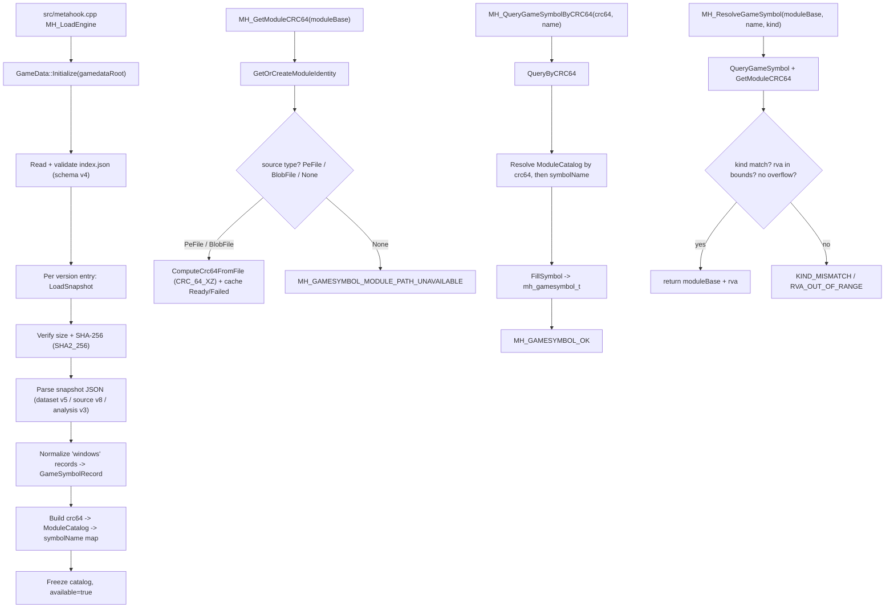

# GameData

## Overview

GameData 是 launcher 与 V3/V4 插件共享的本地游戏符号目录（catalog）组件：从 `<game>\<mod>\metahook\gamedata\index.json` 读取并冻结只读符号表，按 `(moduleCRC64, symbolName)` 查询元数据，并通过 `moduleBase` 懒计算模块原始文件的 CRC-64/XZ。公共接口从 API 109 起提供地址查询；API 110/111 分别追加 PATCH/SCALAR 与对应槽位，API 112/113 追加 VIRTUAL_FUNCTION/VTABLE 地址类型，API 114 追加 STRUCT_MEMBER 与 `QueryGameSymbolStructMember` 偏移查询槽位；既有函数槽位顺序不变。

## Responsibilities

- 构建并冻结只读 catalog（`GameData::Initialize`），初始化后不可重载，所有返回指针在进程退出前有效。
- 校验 index（schema v4）与每个 snapshot（dataset schema v5 / `source.snapshotSchemaVersion` v8 / `source.analysisOutputContractVersion` v3）的路径安全、size、SHA-256（`Chocobo1::SHA2_256`）。旧代际（dataset schema 4 / source contract 7）被明确拒绝并记为 diagnostic。
- 只提取 `platform == "windows"` 的记录，将 `function` / `global` / `patch` / `scalar` / `virtualFunction` payload 规范化为 `GameSymbolRecord`；单 snapshot 失败隔离为 diagnostics，不破坏整个 catalog。`patch` 记录正规化为 `MH_GAMESYMBOL_KIND_PATCH`，地址取 `patch_rva`，不把 signature 当函数长度。`scalar` 记录正规化为 `MH_GAMESYMBOL_KIND_SCALAR`，只保留 uint32 `scalar_value`（地址字段全 0，不加 image base、不解引用）。
- 将 signature 文本编译为 `(bytes, mask, legacyPattern)` 三态。
- 按 `moduleBase` 管理 `ModuleIdentity`（普通 PE / Blob 文件 / None），懒计算并缓存模块 CRC-64/XZ，处理 mirror alias 与 unload 失效。
- 实现公共 API：`MH_GetModuleCRC64`、`MH_QueryGameSymbol`、`MH_QueryGameSymbolByCRC64`、`MH_ResolveGameSymbol`、`MH_SearchPatternMasked`、`MH_GetGameSymbolStatusString`，API 110 的 `MH_IsGameSymbolAvailable`（仅返回状态码：存在 `OK`、不存在 `SYMBOL_NOT_FOUND`、其它失败保留原状态；不返回地址），以及 API 111 的 `MH_QueryGameSymbolScalar`（按 `moduleBase` + 名字返回 uint32；非 scalar kind 返回 `KIND_MISMATCH`）。
- 提供 launcher 内部 getter `GameData::GetGameVersion(moduleCRC64, &gameVersion)`（不进入 `metahook_api_t`），用于按引擎模块 CRC 反查 catalog 中的 gameVersion。
- 提供 `GameData::RegisterModuleFileSource`（Blob engine）与 `RegisterMirrorAlias` 供 launcher 注册模块来源。

## Involved Files & Symbols

- `src/GameData.h` — `GameData` namespace 声明（`Initialize`/`QueryByCRC64`/`QueryScalarByCRC64`/`GetGameVersion`/`GetModuleCRC64`/`RegisterModuleFileSource`/`RegisterMirrorAlias`/`InvalidateModule`/`ResetModuleIdentities`）与公共 `MH_*` 入口。
- `src/GameData.cpp` — 实现 `GameDataCatalog` 构建（`Initialize`/`LoadSnapshot`/`ValidateIndex`）、签名解析 `ParseSignature`、payload 规范化 `NormalizeFunction`/`NormalizeGlobal`/`NormalizePatch`/`NormalizeScalar`、模块哈希状态机 `GetModuleCRC64`/`ComputeCrc64FromFile`、公共 API 与 `MH_GetGameSymbolStatusString`。
- `include/metahook.h` — `METAHOOK_API_VERSION 112`、`mh_gamesymbol_kind_t`（含 `MH_GAMESYMBOL_KIND_PATCH` / `MH_GAMESYMBOL_KIND_SCALAR` / `MH_GAMESYMBOL_KIND_VIRTUAL_FUNCTION`）/`mh_gamesymbol_status_t`/`mh_pattern_t`/`mh_gamesymbol_t`、`metahook_api_t` 新增的 8 个函数槽（第 6 个为 `IsGameSymbolAvailable`，第 8 个为 `QueryGameSymbolScalar`）。
- `src/metahook.cpp` — launcher 集成：`MH_LoadEngine_FormatModuleIdentity` / `MH_LoadEngine_ReportSymbolFailure` / `MH_LoadEngine_ResolveSymbol` / `MH_LoadEngine_ResolveGlobalOperand`、`MH_LoadEngine_DetermineEngineType` / `MH_LoadEngine_FindCvarDirectSet` / `MH_LoadEngine_PatchCvarCallbacks` / `MH_LoadEngine_FindLoadBlobClient`（均 gamedata-only），以及 `MH_LoadEngine` 中 catalog 初始化与来源注册。
- `src/LoadDllNotification.cpp` / `.h` — DLL 加/卸载通知中调用 `GameData::InvalidateModule`（第 144、212 行）与 `MH_IsInLdrCriticalRegion`（第 66 行）。
- `scripts/sync-gamedata.py` — Pre-build 从固定 HTTPS index 下载、校验并事务式替换打包目录。
- `scripts/validate-gamedata.py` — 发布门禁：校验 index/snapshot、期望符号、冲突与 required profiles。
- `tools/global_common.props` — `GameSymbolsIndexUrl`、gamedata 目录、统一 `GameDataSyncCommand`。
- `src/MetaHook.vcxproj` / `.filters` — 加入 `GameData.cpp` 与 rapidjson / Chocobo1Hash include 路径。
- `.gitignore` — 忽略 `Build/svencoop/metahook/gamedata/`。
- `Build\svencoop\metahook\gamedata\index.json` 及 `<snapshot>.json` — 打包数据。

## Architecture

### 架构约定：可信上游与 gamedata-only 定位（2026-09-08 确认）

- [constraint] 始终信任上游 gamedata 提供的数据正确。复用现有查询、解析和发布门禁；后续实现与审查不因假设上游提供错误 RVA、错误长度或跨 snapshot 元数据冲突而新增防御体系。既有校验和错误状态处理继续保留。
- [decision] 能由 gamedata 定位的符号，最终地址统一通过 `MH_LoadEngine_ResolveSymbol` / `MH_ResolveGameSymbol` 获取；插件使用对应的 `g_pMetaHookAPI->ResolveGameSymbol`。不保留 signature、字符串或反查定位 fallback。
- **触发信号 / 适用范围**：launcher、插件及共享代码新增或迁移 gamedata 消费逻辑，以及相关 spec、代码审查；这是长期架构约定，不限于 #850。
- **根因 / 约束**：上游负责符号数据的正确性，消费端复用统一查询与地址解析职责，避免重复定位及额外防御体系。
- **正确做法**：元数据查询和存在性判断不替代最终地址 Resolve；缺少必需数据按既有失败诊断处理，补数由上游完成。对于已提供地址的 call-site 也直接消费 gamedata，不再通过函数体 disasm 重新定位。
- **验证方式**：审查最终地址来源、确认旧定位 fallback 已移除，运行现有发布门禁及与行为直接相关的定向验证；不为上述假设的错误上游数据新增防御性测试体系。
- **决策来源**：用户在 [issue #850](https://github.com/hzqst/MetaHookSv/issues/850) 修订讨论中明确要求将这两条提升为 Basic Memory 架构约定。规则已确认不代表 #850 的代码已实现。

### 组件数据流

```mermaid
flowchart TD
    A["src/metahook.cpp MH_LoadEngine"] --> B["GameData::Initialize(gamedataRoot)"]
    B --> C["Read + validate index.json (schema v4)"]
    C --> D["Per version entry: LoadSnapshot"]
    D --> E["Verify size + SHA-256 (SHA2_256)"]
    E --> F["Parse snapshot JSON (dataset v5 / source v8 / analysis v3)"]
    F --> G["Normalize 'windows' records -> GameSymbolRecord"]
    G --> H["Build crc64 -> ModuleCatalog -> symbolName map"]
    H --> I["Freeze catalog, available=true"]

    J["MH_GetModuleCRC64(moduleBase)"] --> K["GetOrCreateModuleIdentity"]
    K --> L{"source type? PeFile / BlobFile / None"}
    L -->|"PeFile / BlobFile"| M["ComputeCrc64FromFile (CRC_64_XZ) + cache Ready/Failed"]
    L -->|"None"| N["MH_GAMESYMBOL_MODULE_PATH_UNAVAILABLE"]

    O["MH_QueryGameSymbolByCRC64(crc64, name)"] --> P["QueryByCRC64"]
    P --> Q["Resolve ModuleCatalog by crc64, then symbolName"]
    Q --> R["FillSymbol -> mh_gamesymbol_t"]
    R --> S["MH_GAMESYMBOL_OK"]

    T["MH_ResolveGameSymbol(moduleBase, name, kind)"] --> U["QueryGameSymbol + GetModuleCRC64"]
    U --> V{"kind match? rva in bounds? no overflow?"}
    V -->|"yes"| W["return moduleBase + rva"]
    V -->|"no"| X["KIND_MISMATCH / RVA_OUT_OF_RANGE"]
```

## Dependencies
- `thirdparty/rapidjson`（submodule）— 解析 index.json 与 snapshot JSON。
- `thirdparty/Chocobo1Hash`（submodule，gitlink `f455b0e`）— `Chocobo1::CRC_64_XZ`（模块身份哈希，refl poly `0xC96C5795D7870F42`）与 `Chocobo1::SHA2_256`（snapshot 完整性校验）。需在 `<windows.h>` 之前包含以免 `min/max` 宏污染。
- Windows API — `GetModuleFileNameW` / `CreateFileW` / `_wstat64` 用于普通 PE 来源发现与文件流式哈希；loader lock 判定 `MH_IsInLdrCriticalRegion`。
- 数据资源 — 打包 `Build\svencoop\metahook\gamedata\`（gitignore），运行时 `<game>\<mod>\metahook\gamedata\`。
## Notes

- catalog 构建后冻结，不重载；返回给插件的 `signature.text` / `bytes` / `mask` / `legacyPattern` 指向稳定 heap-owned 存储，有效至进程退出。
- 模块哈希懒计算且缓存：首个查询把 `Uncomputed -> Computing` 并在锁外做文件 I/O，后续线程在 cv 上等待；读取期间文件变化（size/mtime）返回 `MODULE_HASH_FAILED`。哈希 I/O 不持有全局 catalog 锁。
- loader 临界区内只用无锁 `g_pendingModuleInvalidations[64]` 与 `g_resetModuleIdentitiesPending` 排队失效，溢出时保守全量失效，并在下一个安全查询点 `DrainPendingModuleInvalidations`；`MH_LoadEngine` 开头的 `GameData::ResetModuleIdentities` 是每 engine session 的兜底。要求 lock-free 原子（`static_assert ATOMIC_POINTER_LOCK_FREE == 2`）。
- signature 只接受空格分隔的两位十六进制字节与 `??` wildcard；`bytes + mask` 为权威无损表示（`mask[i]==0` 通配），`legacyPattern` 仅在签名不含字面量 `0x2A` 字节时生成，否则为 `NULL`。
- 符号名查找区分大小写；键为 `(moduleCRC64, symbolName)`。完全相同的重复记录去重，内容冲突标记 `CATALOG_CONFLICT`；未类型化 kind 标记 `unsupportedKind` 查询返回 `UNSUPPORTED_KIND`。
- `patch` 记录只消费 `patch_rva`（`symbolSize`/`signatureRva`/指令字段均为 0），不按 signature 搜索内存，也不改写长度；`MH_ResolveGameSymbol` 现在接受 `FUNCTION`/`GLOBAL`/`PATCH` 三种 expected kind。
- `scalar` 记录只保留 uint32 `scalar_value`，地址字段全 0；`QueryGameSymbolScalar`（`MH_QueryGameSymbolScalar` / `QueryScalarByCRC64`）返回 `KIND_MISMATCH` 当名字对应非 scalar kind，`ResolveGameSymbol` 因 `expectedKind` 只能为 `FUNCTION`/`GLOBAL`/`PATCH`/`VIRTUAL_FUNCTION` 而拒绝 scalar。
- `virtualFunction` 记录（API 112）由 `NormalizeVirtualFunction` 规范化为 `MH_GAMESYMBOL_KIND_VIRTUAL_FUNCTION`：`rva = func_rva`、`symbolSize = func_size`、signature 取 `vfunc_sig`；`vfunc_index` / `vtable_name` 仅校验不入库。`ResolveGameSymbol` 接受该 kind 并返回 `moduleBase + rva`，语义等同 FUNCTION；无需新增函数槽位。`vtable` 记录仍为 unsupported kind。经 `QueryGameSymbol` 查询 scalar 时 `kind == MH_GAMESYMBOL_KIND_SCALAR`、地址字段全 0。
- `IsGameSymbolAvailable` 是纯存在性查询（`moduleBase` + 精确名字），不返回地址、不做 expected kind 检查；`OK`/`SYMBOL_NOT_FOUND` 之外的失败保留原状态码。连续编号的 call-site 由调用方自行拼接名字并循环探测，API 不做枚举。
- `cbSize` 契约：调用方先置 `cbSize = sizeof(mh_gamesymbol_t)`，过小返回 `OUTPUT_TOO_SMALL`；失败时输出字段清零但保留 `cbSize`。（**此条已被 2026-09-28 的 API 115 版本化 cbSize 契约取代**：现按 `min(cbSize, sizeof(mh_gamesymbol_t))` 有界填充，仅低于版本化前缀才报 `OUTPUT_TOO_SMALL`，见文末。）
- `ResolveGameSymbol` 只接受 `FUNCTION`/`GLOBAL`，并做 rva 与 `rva + symbolSize` 的溢出和映像边界检查；不校验内存 signature，也不做跨版本扫描。
- 迁移历史（规则见上文“架构约定”）：ResourceReplacer（计划见 `docs/plans/resource-replacer-gamedata-migration-plan.md`，2026-09-06 已实施——4 符号 gamedata-only、旧扫描全删、`COMMON_REQUIRED` 门禁已纳入，详见 [[resource-replacer-privatevars]]）；HeapPatch（2026-09-07 已实施——`Sys_InitMemory` gamedata-only、旧扫描全删、`COMMON_REQUIRED` 门禁已纳入，函数体内 heap-limit immediate 仍走有界 disasm，详见 [[heap-patch-privatevars]]）；launcher `src/metahook.cpp`（issue #850，2026-09-08 已实施——引擎族改为 catalog gameVersion → 前缀/版本阈值规则，`Cvar_DirectSet`、`cvar_hooks`、`Cvar_Set_to_Cvar_DirectSet_callsite_N`、`NLoadBlob`、`FreeBlob` 全部 gamedata-only，旧字符串/反查/pattern 扫描与 `MH_DisasmRanges` 定位全部删除，详见 [[metahook-privatevars]]）；HeapPatch / ResourceReplacer / PrecacheManager 三个插件（issue #853，2026-09-09 已实施——`Sys_InitMemory_HeapLimitPatches_N`、`S_LoadSound_to_FS_Open_callsite_N`、`Mod_LoadModel_to_FS_Open_callsite_N` 与 `cl_resourcesonhand` 全部 gamedata-only；`DisasmRanges` 控制流遍历、`"rb"` / `#GameUI_PrecachingResources` 字符串搜索、push pattern、`FindFSOpenCallSites`、`ConvertDllInfoSpace` 与镜像空间准备全部删除，详见 [[heap-patch-privatevars]] [[resource-replacer-privatevars]] [[precache-manager-privatevars]]）；ThreadGuard / SCModelDownloader 两个插件（issue #855，2026-09-09 已实施——ThreadGuard 的 `engine` GLOBAL 与 SCModelDownloader 的 `R_StudioDrawPlayer` / `studioapi_SetupPlayerModel` / `Host_IsSinglePlayerGame` FUNCTION、`DM_PlayerState` / `cl_players_model` GLOBAL 全部 gamedata-only；SCModelDownloader 改为 inline hook 两个 caller 并重建触发谓词，`R_StudioChangePlayerModel` FUNCTION 与 call-site PATCH 依赖、签名搜索、CFG 遍历、`ConvertDllInfoSpace` 与镜像空间准备全部删除，详见 [[threadguard-privatevars]] [[scmodeldownloader-privatevars]]）；`Plugins/Renderer`（issue #873，2026-09-17 已实施——剩余 76 条 catalog-backed 私有符号（71 FUNCTION / 1 GLOBAL / 4 PATCH）全部 gamedata-only，旧 signature/字符串/`DisasmRanges` 定位与 `R_GLOW_BLEND_*` 宏删除，`R_GlowBlend` 统一为引擎真实名 `GlowBlend`，`CL_LinkPacketEntities_to_R_ResetLatched_callsite_0/_1` 两条 call-site 均重定向；新增 `GamedataResolvePtrIfAvailable` 承载条件依赖，validator 增加 Renderer consumer gate 且 snapshot 记录保留 module，详见 [[renderer-privatevars]]。follow-up（2026-09-18）：`loadname` / `loadmodel` 在插件内只写不读，连同 extern/定义与 `Engine_FillAddress_Mod_LoadModel`（printf 锚点 + 两段 `DisasmRanges`）一并删除，`Mod_LoadModel` 改为 dispatch 内联 Resolve；上游虽已随 release `2026-09-17T15:27:45Z` 将二者发布为 engine GLOBAL，但无消费者，故不纳入门禁）。仅对 gamedata 尚未提供且功能本体需要的指令信息保留相应操作；不能将 call-site 一概视为 gamedata 无法表达，已提供地址的符号必须直接 Resolve。PATCH 记录语义是目标**指令地址**：需要立即数位置时在真实地址上单条反汇编取 `encoding.imm_offset`，不新增立即数地址符号，也不按 `patch_sig` 重新定位。
- 上游契约升级（2026-09-08，schema 7 / dataset schema 4）：每个 module/platform 增加必需布尔 `isBlob`（仅通过完整 Metahook blob 解密/重建/校验的 Windows 二进制为 true；非 Windows 必须 false），并移除旧 `path`。MetaHook 只消费 `binaries.*.windows.crc64`，不读取 `isBlob`（遵循上文“信任上游”约定）。
- 上游契约升级（2026-09-12，dataset schema 5 / source snapshot contract 8 / analysis output contract 3，issue #865 前置）：新增 `kind: scalar`（payload 仅 `scalar_name` + uint32 `scalar_value`）。`src/GameData.cpp` 常量切到 `kSnapshotSchemaVersion 5` / `kSnapshotContractVersion 8` / `kAnalysisOutputContractVersion 3`，新增 `NormalizeScalar` 与公共 `QueryGameSymbolScalar`（API 111）；不再接受 schema 4 / contract 7 数据（逐 snapshot 记为 `unsupported schemaVersion`）。`scripts/sync-gamedata.py` 的 `SUPPORTED_SNAPSHOT_SCHEMA_VERSION 5` / `SUPPORTED_SNAPSHOT_CONTRACT_VERSION 8` / `SUPPORTED_ANALYSIS_OUTPUT_CONTRACT_VERSION 3`、`scripts/validate-gamedata.py` 的 `REQUIRED_SCALARS`（`size_of_frame` 属于 engine module，10 个受支持 engine 版本均覆盖）与 `isBlob` 布尔校验同步升级；行为测试见 `scripts/tests/test_gamedata_contract.py`。`gv_sig_allow_across_function_boundary` 现已在 `NormalizeGlobal` 中解析进 `flags`。`mh_gamesymbol_t` 布局与 `MetahookAPIVersion` 旧槽位不变；scalar 只经新槽位（第 8 个函数槽）获取，避免破坏旧插件 ABI。index 仍为 schema 4。
- 上游契约升级（2026-09-12，#865 消费端）：新增 `kind: virtualFunction` 记录（payload：`func_rva`/`func_size`/`vfunc_sig`/`vfunc_index`/`vtable_name`），供 client `CGameStudioRenderer` 等虚函数按名解析。`src/GameData.cpp` 新增 `NormalizeVirtualFunction`（kind = `MH_GAMESYMBOL_KIND_VIRTUAL_FUNCTION`，API 112），`MH_ResolveGameSymbol` 接受该 kind；不新增函数槽位。`scripts/validate-gamedata.py` 解析并校验 virtualFunction，新增 BulletPhysics 消费者门禁（engine 侧 function/global 每个 engine family 必需；client 侧 global 仅对 10 个发布了 client module 的 gameVersion 必需，6 个仅有 engine 产物的旧版本不强制）。`vtable` 记录仍为 unsupported kind。
- 上游契约消费（2026-09-14，API 113）：新增 `MH_GAMESYMBOL_KIND_VTABLE`（=6，`NormalizeVTable` 消费 `vtable_rva`/`vtable_size`，校验 `vtable_symbol`/`vtable_numvfunc` 不入库；`vtable` 记录不再是 unsupported kind），`MH_ResolveGameSymbol` 接受该 kind 并返回 `moduleBase + vtable_rva`（`.rdata` 中的虚表数组地址，消费者按 vfunc index 索引）。`METAHOOK_API_VERSION` bump 112 → 113（仅新增枚举值，无新函数槽位、无 ABI 布局变化）。validator 为 vtable 增加 payload 校验（含 `vtable_size == vtable_numvfunc * 4` 一致性），契约测试覆盖 accept/missing-fields/size-mismatch。同日 `Plugins/Renderer` 迁移其 gamedata 覆盖的私有符号（15 engine functions + 16 engine globals + 7 client globals + 7 client virtualFunctions + 7 engine `R_Studio*`，详见 [[renderer-privatevars]] 的 Gamedata-resolved symbols 节），helper `GamedataResolvePtr` 位于 `Plugins/Renderer/plugins.h`（required 语义，失败即 Sys_Error）。
- 消费端 required/optional 拆分（2026-09-12）：`Plugins/BulletPhysics` 的解析 helper 改为 `GamedataResolvePtr(..., bool required)` / `GamedataResolveScalar(..., bool required)`，`required=false` 时缺失返回 `nullptr`/`0` 而不 `Sys_Error`。validator 侧同步为 `BULLETPHYSICS_CLIENT_OPTIONAL_VFUNCS`（`GameStudioRenderer_StudioDrawModel`/`_StudioDrawPlayer`/`_StudioSetupBones`）：记录存在则校验 `kind`，缺失不报错；`g_pGameStudioRenderer` global 因在插件内无任何读取点（只写过一次、从未读）已从插件与 validator 必备列表中移除。
- 发布数据状态（2026-09-09 同步，release `v20260909c` / source `ecac7773`）：`scripts/validate-gamedata.py` 门禁通过（16 snapshots / 5 engine families），cvar 分支、blob 客户端符号与 #855 的 6 个符号已补齐；门禁按 kind 校验的 `COMMON_REQUIRED` 现含 `cl_resourcesonhand` global 与 `R_StudioDrawPlayer` / `studioapi_SetupPlayerModel` / `Host_IsSinglePlayerGame` function、`DM_PlayerState` / `cl_players_model` / `engine` global，`NUMBERED_PATCH_SETS` 为 `Sys_InitMemory_HeapLimitPatches`、`S_LoadSound_to_FS_Open_callsite`、`Mod_LoadModel_to_FS_Open_callsite`（从 `_0` 起连续、kind 必须为 patch）；含 windows 记录的为 cof-5936（46）、hl-10210（80）、hl-8684（80）、hl-6153（43）、hl-4554/hl-3647/hl-3329/hl-3266/hl-3248（各 44）、svencoop-10257（75），cstrike/czero/czeror 各版本仍为 0 记录空壳。发布流程注意：`release-build.yml` 的 `publish-release` 曾在创建 tag 时返回 403 `Resource not accessible by integration`（run 34360429634，临时性；重跑 run 34363903670 后成功），发布未完成时 `hlnd2t.github.io` 的 index 不会更新，`sync-gamedata.py` 也就拉不到新数据。
- `Build\svencoop\metahook\gamedata\` 被 gitignore，由 Pre-build 的 `sync-gamedata.py` 通过同卷 staging + 事务式目录交换生成；commit `6b8f6f65 "remove gamedata."` 删除了原先跟踪的 JSON 载荷。

- 迁移追加（2026-09-19，`Plugins/Renderer`）：上游 `e2836de` / `856a283` / `c7a87fb`（release `2026-09-19T10:17:32Z`）新发布的符号中，有消费者的 16 个改为 gamedata-only —— engine FUNCTION `R_TextureAnimation` / `R_RenderDynamicLightmaps`（11/11），engine GLOBAL `frustum` / `rtable` / `lightmaps` / `lightmap_textures` / `lightmap_rectchange` / `gDecalSurfs` / `gDecalSurfCount` / `d_lightstylevalue` / `filterMode` / `filterColorRed` / `filterColorGreen` / `filterColorBlue` / `filterBrightness`（均 11/11）。同时修正一处旧结论：`GL_UnloadTextures` 早在 `9c22ab4`（2026-09-13）就已发布，此前被误列为 catalog-uncovered，现也改为 `ResolveGameSymbol`。`Engine_FillAddress_GL_SelectTexture` / `_R_TextureAnimation` / `_SetFilterMode` / `_SetFilterColor` / `_SetFilterBrightness` 五个 locator 连同 `R_DrawSequentialPoly` 的 BFS、`R_NewMap` 的末尾 `E8` 启发式与相关 sig `#define` 全部删除；validator 的 `RENDERER_ENGINE_ALL_FUNCTIONS` / `_ALL_GLOBALS` 同步扩充。另有一批**无消费者**的符号被整体删除而非接入 gamedata：`GL_EnableMultitexture` / `GL_DisableMultitexture` 的 wrapper、`private_funcs_t` 字段、两个 locator 与 5 条 sig 宏，以及只写不读的 `gl_mtexable` / `mtexenabled` / `oldtarget` —— 最后的读点分别随 `69cfa251`（2025-10-06 删 `GL_PushDrawState`/`GL_PopDrawState`）与 `a5bfd6a5`（2025-06-02 fix #610）消失。由此确立一条规则：**迁移新发布符号前先确认插件确有读取点，上游发布 ≠ 消费端需要**，否则会把死代码变成阻塞发布的门禁依赖（同 `loadname` / `loadmodel` 先例）。gate 测试净 +3（新增 `test_gate_ignores_symbols_the_renderer_no_longer_consumes` 作为回归护栏）。详见 [[renderer-privatevars]]。
- 死代码追加（2026-09-19，`Plugins/Renderer`）：`R_AddDynamicLights` 经核查在语义层面从未被消费——插件本地空桩（`gl_rsurf.cpp:88`，末次调用在 `f8607c28` 2023-02-23 被注释）与引擎侧 `gPrivateFuncs.R_AddDynamicLights`（`Engine_FillAddress_R_AddDynamicLights`，`git log -S` 全历史零调用）皆是；删除后其唯一消费点（BFS 锚点）随之失效，故一并删除 `gPrivateFuncs.R_BuildLightMap` 及其 locator（同样全历史零调用）。共删 217 行：2 个 locator + 2 个 dispatch 调用+ 8 条 sig 宏（`R_BUILDLIGHTMAP_SIG_*` / `R_ADDDYNAMICLIGHTS_SIG_*`）+ 2 个 `private_funcs_t` 字段 + 2 个未安装的 `g_phook_*` + 本地空桩（`R_AddDynamicLights`，另连同同样零调用的本地 `R_RenderDynamicLightmaps` 空桩）及其声明。插件本地 `R_BuildLightMap`（活的重实现）保持不动（`gPrivateFuncs.R_RenderDynamicLightmaps` 当时作为 disasm 根一并保留，后经复核发现其锚定目标亦无消费者而被删除，见下方 2026-09-19 死代码追加条目）。此为该失败模式的第三例（另两例：`loadname`/`loadmodel`、多纹理对），新增推论：**当 resolver B 仅作为 resolver A 的锚点存在时，删 A 必须同时删 B**。详见 [[renderer-privatevars]]。
- 数据重同步 + 死代码追加（2026-09-19，`Plugins/Renderer`）：`scripts/sync-gamedata.py` 重新拉取到 release `2026-09-19T12:42:08Z`（21 snapshots 全部为新增发布；`snapshotSchemaVersion: 8`），其中新发布 sky 相关符号 `gSkyTexNumber`（engine GLOBAL 11/11）、`gLoadSky`（engine GLOBAL 11/11，即插件内 `r_loading_skybox` 的真实引擎名）、`R_LoadSkyboxInt_SvEngine`（engine FUNCTION 2/11，仅两个 SvEngine）。三者经核查在插件内**均无读取点**（resolver 只写不读），故按既有规则整体删除而非接入 gamedata：删除 `gSkyTexNumber` / `r_loading_skybox` 的全局与 extern、`private_funcs_t::R_LoadSkyboxInt_SvEngine` 字段，以及 `Engine_FillAddress_R_LoadSkybox` 的整段反汇编（`"SKY: "` 字符串搜索 + `ReverseSearchFunctionBeginEx(0x600)` 反向查找 + 两段 `DisasmRanges` BFS，185 行 → 11 行），该函数现仅剩两个 `GamedataResolvePtr`（`R_LoadSkyBox_SvEngine` / `R_LoadSkys`）。`R_LoadSkyboxInt_SvEngine` 虽已发布但无消费者，刻意不接入亦不入门禁。详见 [[renderer-privatevars]] [[draw-skybox]]。
- 死变量清扫（2026-09-19，`Plugins/Renderer`）：系统性审计 Renderer 的全部引擎镜像变量与文件作用域全局，50 个"只赋值/只声明、从不读取"的符号被删除。其中影响发布契约的一处：`g_pGameStudioRenderer` 从 `RENDERER_CLIENT_STUDIO_GLOBALS` 移除（现为 `("g_iUser1", "g_iUser2")`）——它仍由 gamedata 解析为 GLOBAL，但插件内已无读取点（vtable 改由 `VIRTUAL_FUNCTION` 记录解析）；BulletPhysics 早在 2026-09-12 就因同样原因移除了同一符号。其余删除为引擎 cvar 镜像 27 个 + 其它全局 17 个 + 6 个从未赋值/调用的 `gPrivateFuncs` 字段，均不涉及 gamedata 契约。另记录三条审计方法学要点（宏 `Install_InlineHook` 令牌拼接、跨插件同名变量、`decltype` 未求值操作数），详见 [[renderer-privatevars]]。
- 死变量清扫续（2026-09-19，`Plugins/Renderer`）：第一批漏出的 7 个"已被发布门禁要求但插件从不读取"的全局也一并删除——`RENDERER_ENGINE_ALL_GLOBALS` 移除 `gDecalSurfs` / `lightmap_rectchange` / `lightmap_textures`（注意其中 3 个由 `144d10c7` 加入，该 commit 的"16 个有消费者"结论对它们不成立）、`g_ChromeOrigin` / `r_model`；`RENDERER_CLIENT_STUDIO_GLOBALS` 移除 `g_iUser1` / `g_iUser2` 后变为空元组。另删除 Renderer 侧陈旧的 `DM_PlayerState` extern 与 `#if 0` 定义（validator 中该符号属于 SCModelDownloader 的 `COMMON_REQUIRED`，未动）。契约测试 `test_gate_requires_lightmap_and_decal_symbols_on_every_identity` 同步缩减。详见 [[renderer-privatevars]]。
- 迁移追加（2026-09-21，`Plugins/Renderer`）：`Engine_FillAddress_R_DecalInit` 从 `R_DecalInit` 签名扫描 + `DisasmRanges` 提取 `gDecalPool` / `gDecalCache`，改为对这两个 engine GLOBAL 直接 `GamedataResolvePtr`。两符号在全部 11 个引擎身份上均有 catalog 记录，且 `gl_rsurf.cpp` 有真实读取点。`RENDERER_ENGINE_ALL_GLOBALS` 与 `test_gate_requires_lightmap_and_decal_symbols_on_every_identity` 同步加入二者。详见 [[renderer-privatevars]] [[draw-decals]]。
- 迁移追加（2026-09-21，`Plugins/Renderer`）：`Engine_FillAddress_R_RenderFinalFog` 从 SvEngine 内联扫描 / GoldSrc-HL25 `R_RenderFinalFog` + `DisasmRanges` 提取 `g_bUserFogOn` 与四个 fog float，改为对 catalog 名 `g_bUserFogOn` / `flFinalFogColor` / `flFogDensity` / `flFogStart` / `flFogEnd` 直接 `GamedataResolvePtr`（11/11 engine GLOBAL，均有 `gl_rmain.cpp` 读取点）。写后从未读取的 `gPrivateFuncs.R_RenderFinalFog` 字段删除，`R_RenderFinalFog` 退出 `RENDERER_ENGINE_NON_SVENGINE_FUNCTIONS`。`g_bFogSkybox` / `R_FogParams` / `R_RenderFog` 无消费者，不入门禁。插件侧别名 `g_UserFogColor` / `g_UserFogDensity` / `g_UserFogStart` / `g_UserFogEnd` 随后改成与 catalog 同名。详见 [[renderer-privatevars]]。
- 迁移追加（2026-09-21，`Plugins/Renderer`）：`Engine_FillAddress_Mod_LoadSpriteFrame` 已用 gamedata 解析 `Mod_LoadSpriteFrame` FUNCTION，但仍 `DisasmRanges(+0x300)` 提取 `gSpriteMipMap`。该 GLOBAL 在全部 11 个引擎身份上均有 catalog 记录，且 `gl_sprite.cpp` 有真实读取点，改为直接 `GamedataResolvePtr`。写后从未读取的 `gPrivateFuncs.Mod_LoadSpriteFrame` 字段删除，`Mod_LoadSpriteFrame` 退出 `RENDERER_ENGINE_ALL_FUNCTIONS`。详见 [[renderer-privatevars]]。
- 迁移追加（2026-09-21，`Plugins/Renderer`）：`Engine_FillAddress_SCR_BeginLoadingPlaque` 从签名扫描 + `DisasmRanges` 提取 `scr_drawloading`，改为对 engine GLOBAL `scr_drawloading` 直接 `GamedataResolvePtr`（11/11，`gl_rmain.cpp` 有读取点）。写后从未读取的 `gPrivateFuncs.SCR_BeginLoadingPlaque` 字段与 `SCR_BEGIN_LOADING_PLAQUE` 签名宏删除；FUNCTION 记录无消费者，不入门禁。详见 [[renderer-privatevars]]。
- 死代码追加（2026-09-19，`Plugins/Renderer`）：`Engine_FillAddress_R_RenderDynamicLightmaps` 经核查定位的 4 个目标中 3 个为死代码——`gPrivateFuncs.R_RenderDynamicLightmaps`（`privatehook.h:66` 字段，全历史零调用、未安装 hook）、`lightmap_polys` 与 `lightmap_modified`（均由该函数内一段 `DisasmRanges` BFS 写出的全局，除定义/外部声明/BFS 写入外无任何读取点，write-only）；`d_lightstylevalue` 则为活符号（`gl_rsurf.cpp:567`、`gl_wsurf.cpp:5218` 两处真实读取，且全仓库唯一解析点就在此函数内），故不做整函数删除。处理：函数重命名为 `Engine_FillAddress_LightstyleVars`，函数体缩减为单行 `d_lightstylevalue` 解析；删除上述 3 个死符号（含 1 个 `private_funcs_t` 字段、2 个全局 + extern、SearchContext 结构体、DisasmRanges lambda、`_VA` 别名、2 条 `Sig_VarNotFound`）；`RENDERER_ENGINE_ALL_FUNCTIONS` 与 `test_gate_requires_lightmap_and_decal_symbols_on_every_identity` 元组移除 `R_RenderDynamicLightmaps`（该符号亦由此从 2026-09-19 的 gamedata 迁移记录中撤回），`d_lightstylevalue` 保留在门禁。此条同时修正了上上条记录中"`gPrivateFuncs.R_RenderDynamicLightmaps`（活的 disasm 根）"的判断——它只是 `lightmap_polys`/`lightmap_modified` BFS 的锚点，而锚点目标本身无消费者，与 `R_StudioChrome` → `R_StudioChromeVars` 同形。详见 [[renderer-privatevars]]。
- 迁移追加（2026-09-22，`Plugins/Renderer`）：`Engine_FillAddress_R_DrawParticles` 的最后一处反汇编定位（0x150 字节 `DisasmRanges` 提取 `particletexture`）改为对 engine GLOBAL `particletexture` 直接 `GamedataResolvePtr`。该符号在全部 11 个 engine 身份上均有 catalog 记录（`engine/particletexture.windows.yaml`），与同函数的 `R_DrawParticles` / `R_FreeDeadParticles` / `R_TracerDraw` / `R_BeamDrawList` / `active_particles` 覆盖面完全一致，故不引入新的身份要求；cstrike/czero/czeror 的 16-17 条记录空壳本就缺少同族五个符号，插件早已对 `R_DrawParticles` 报错。该函数体由此只剩 6 个 `GamedataResolvePtr`（删 78 行：SearchContext 结构体、DisasmRanges lambda、`R_DrawParticles_VA`、`Sig_VarNotFound`）。同时修正旧结论：此前 md 记的 "`particletexture` 是 catalog-uncovered" 自记录起即为错误（上游早已发布），已就地更正三处列表。`RENDERER_ENGINE_ALL_GLOBALS` 加入 `particletexture`，契约测试新增 `test_gate_requires_particletexture_on_every_identity`。详见 [[renderer-privatevars]]。
- 迁移追加（2026-09-22，`Plugins/Renderer`，第三条）：`Engine_FillAddress_VID_UpdateWindowVars` 的两半分别处理——`window_rect` 是活消费者（`GL_EndRendering` 处理器读 `window_rect->right/left/bottom/top`，`gl_rmain.cpp:3588`），11/11 发布为 engine GLOBAL，改为直接 `GamedataResolvePtr`，纳入 `RENDERER_ENGINE_ALL_GLOBALS` 并新增契约测试 `test_gate_requires_window_rect_on_every_identity`；`gPrivateFuncs.VID_UpdateWindowVars` 则**全无读取点**（只被本 locator 赋值与自守条件测试，无调用、无 `Install_InlineHook`、无 `g_phook_*`），按"上游发布 ≠ 消费端需要"规则删除字段而非接入 gamedata——连同 5 条 `VID_UPDATEWINDOWVARS_SIG_*` 宏、`Sig_FuncNotFound` 与 `Convert_VA_to_RVA`/`VA_from_RVA` 管道，函数体缩为 1 行（删 139 行）；该 FUNCTION 记录无消费者，不入门禁。详见 [[renderer-privatevars]]。
- 迁移追加（2026-09-22，`Plugins/Renderer`，第二条）：`Engine_FillAddress_BuildGammaTable` 的最后一处反汇编定位（0x250 字节 `DisasmRanges` 提取 `texgammatable`）改为对 engine GLOBAL `texgammatable` 直接 `GamedataResolvePtr`，函数体只剩 2 行（`BuildGammaTable` FUNCTION + `texgammatable` GLOBAL），删 48 行。该符号与同日迁移的 `lightgammatable` 同形：插件自身不读，但 hook wrapper `BuildGammaTable`（`gl_draw.cpp:3528`）在调用原函数后把恒等表写进引擎缓冲，由引擎的 gamma 路径读取——因此属活消费者，不在 2026-09-19/20 死变量清扫之列。`RENDERER_ENGINE_ALL_GLOBALS` 加入 `texgammatable`，契约测试新增 `test_gate_requires_texgammatable_on_every_identity`。详见 [[renderer-privatevars]]。
- 迁移追加（2026-09-22，`Plugins/Renderer`）：`Engine_FillAddress_BasePalette`、`_MissingTexture`、`_NoTexture`、`_Draw_Frame`、`_R_StudioLighting` 改为直接解析活跃 engine GLOBAL。全身份必需为 `host_basepal` / `giScissorTest` / `r_ambientlight` / `r_shadelight` / `r_plightvec` / `lightgammatable`（11/11）；fallback texture 按 family 分为 SvEngine 的 `r_missingtexture`（2/2）与非 SvEngine 的 `r_notexture_mip`（9/9）。`Draw_Frame` 本身仍是 live inline-hook target，继续解析 FUNCTION；仅作反汇编锚点的 `R_StudioLighting` 字段、无读取点的 `r_blightvec` 与 `scissor_x/y/width/height`、旧字符串/签名/`DisasmRanges` 定位全部删除；SvEngine 的 `r_emptytexture` 虽已发布但无消费者，不入门禁。详见 [[renderer-privatevars]]。
- 死代码追加 + 门禁收缩（2026-09-22，`Plugins/Renderer`）：`Engine_FillAddress_R_RenderScene` 整体删除而非迁移 gamedata——`gPrivateFuncs.R_RenderScene` **全无读取点**（仅本 locator 的三处赋值与自守条件，无调用、无 `Install_InlineHook`/`g_phook_*`），`R_RenderScene_inlined` 也只在定位器内部用于选择 fallback；插件自身的 `R_RenderScene`（`gl_rmain.cpp:4740`，调用点 `gl_rmain.cpp:3509`/`:6967`、`gl_water.cpp:804`/`:884`、`gl_shadow.cpp` 六处）不受影响。原定位器本已是"10/11 身份走 `GamedataResolvePtr`，仅 svencoop-10257 因 Windows 无 catalog 记录（只有 linux）走 `DisasmRanges(R_RenderView,+0x500)` 找 `R_SetupGL` 调用点"的形态——该分支无法用 gamedata 覆盖，且其输出无人消费。**门禁同步删除** `RENDERER_NOT_SVENGINE_10257_FUNCTIONS`（`("R_RenderScene",)`）及配套的 `RENDERER_NOT_SVENGINE_10257_GAMES`、`validate_renderer` 中的使用点与契约测试 `test_gate_render_scene_is_not_applicable_for_svengine_10257`：该门禁条目的唯一存在理由就是这条解析，保留会迫使发布门禁要求一个无消费者的符号（同 `CL_AllocDlight` / `R_LightStrength` 反向案例）。同时消除三条致命错误路径（`Sig_AddrNotFound`/`Sig_FuncNotFound` 与以 `R_SetupGL` 为锚的二次反汇编），并清空插件内最后一个 `*_inlined` 标志。详见 [[renderer-privatevars]]。

- 死代码追加 + 门禁收缩（2026-09-22，`Plugins/Renderer`，第四条）：三个只写 engine 函数指针整体删除。`gPrivateFuncs.R_RecursiveWorldNode` / `R_RecursiveWorldNode_HL25` 的唯一读取者是插件 wrapper `R_RecursiveWorldNode`（`gl_rsurf.cpp:68`），而该 wrapper 自身不可达——全仓库无调用点、无 `Install_InlineHook`、`g_phook_*` 形式在全部 git 历史中都不存在（2021-01-20 `97288aa4` 的遗留，2023-03-02 "Remove runtime recursions completely" 后成为孤儿），故两个字段实际只写不读；`gPrivateFuncs.R_DrawWorld` 与 `gPrivateFuncs.R_DrawViewModel` 同为只写（无调用点、无 hook，插件各自有完整重实现）。处理：删除 `Engine_FillAddress_R_RecursiveWorldNode` 及其 dispatch 调用、wrapper 的定义与声明、已死的 `R_RECURSIVEWORLDNODE_SIG_BLOB` 宏，以及三个字段的赋值与自守条件；`Engine_FillAddress_R_DrawWorld` 与 `Engine_FillAddress_R_DrawViewModel` 保留，前者现只解析 `modelorg`，后者只解析 `envmap` / `cl_stats` / `cl_weaponstarttime` / `cl_weaponsequence` / `cl_light_level`（均 gamedata GLOBAL，且都是活消费者）。**门禁同步收缩**：`R_RecursiveWorldNode` 与 `R_DrawWorld` 退出 `RENDERER_ENGINE_ALL_FUNCTIONS`；`RENDERER_NOT_SVENGINE_8948_GAMES` / `RENDERER_NOT_SVENGINE_8948_FUNCTIONS` 元组连同 `validate_renderer` 使用点与契约测试镜像一并删除（该门禁唯一存在理由就是 `R_DrawViewModel`）。catalog 记录不动——上游发布 ≠ 消费端需要。详见 [[renderer-privatevars]]。

- 死代码追加 + 门禁收缩（2026-09-22，`Plugins/Renderer`，第五条）：上一条的后续。`gPrivateFuncs.R_DrawBrushModel`（`privatehook.h:62`，赋值 `gl_hooks.cpp:2226`）经复核同为只写（无调用点、无 `Install_InlineHook` / `g_phook_*`），其原定用途是作为 `R_RecursiveWorldNode` / `R_DrawWorld` 的反汇编基址，而这两个 locator 已在上一条中删除并转为 gamedata。字段与赋值删除；插件的 `R_DrawBrushModel`（`gl_wsurf.cpp:5002`，调用点 `gl_rmain.cpp:2256` / `:3428`）是完整重实现，不受影响。`R_DrawBrushModel` 退出 `RENDERER_ENGINE_ALL_FUNCTIONS`，catalog 记录不动（上游发布 ≠ 消费端需要）。详见 [[renderer-privatevars]]。

- 迁移追加 + 死代码追加（2026-09-25，`Plugins/Renderer`）：`EngineStudio_FillAddress`（`exportfuncs.cpp`）整体并入 `Engine_FillAddress`（`gl_hooks.cpp`）。原 6 个 locator 依赖 `pstudio` 指向的 studio API thunk 做反汇编，现全部改为 gamedata，新增 7 个单参 locator：`Engine_FillAddress_StudioGlobals`（`currententity`/`pstudiohdr`/`r_origin`）、`_StudioGetTimes`（`cl_time`/`cl_oldtime`）、`_StudioSetForceFaceFlags`（`g_ForcedFaceFlags`）、`_StudioSetRemapColors`（`r_topcolor`/`r_bottomcolor`）、`_StudioSetRenderamt`（`CL_FxBlend`）、`_StudioSetupModel`（`psubmodel`）、`_StudioSetupLighting`（`r_colormix`）；12 个符号均为 engine GLOBAL，11/11 覆盖。`pstudio` 仅作反汇编锚点，故合并后无需该参数；两个调用点参数本已一致，解析仅从 `HUD_GetStudioModelInterface` 提前到 `LoadEngine`（纯静态地址赋值，消费者只在渲染期解引用）。两处死代码处理：`pbodypart` 只写不读（仅 `gl_studio.cpp` 定义、`gl_studio.h` extern 与 locator 自身赋值）→ 删除且刻意不入门禁；`_GetTimes` 中 `r_framecount` 的反汇编块删除——该符号早已由 `Engine_FillAddress_R_RecursiveWorldNodeVars` 用 gamedata 解析，而 `Sig_VarNotFound` 仅在空指针时触发，故该扫描只可能覆盖正确值，旧注释 "catalog-uncovered" 自始即错误。门禁 `RENDERER_ENGINE_ALL_GLOBALS` 新增 `g_ForcedFaceFlags`/`psubmodel`/`r_bottomcolor`/`r_colormix`/`r_topcolor`，契约测试新增 `test_gate_requires_direct_resolved_studio_globals_on_every_identity`（并断言 `pbodypart` 永不入门禁）。验证：`Renderer.vcxproj` Release|Win32 MSBuild 退出 0；契约测试 72 通过；`validate-gamedata.py` 报出的 110 条错误与未改动的 `HEAD` 校验器逐条一致（本地打包数据落后于当前 vgui2 vfunc 门禁的既有问题），本次未新增错误，且无一条涉及新增的 5 个符号；游戏内 studio 渲染未验证。详见 [[renderer-privatevars]]。

- 迁移追加 + 死代码追加（2026-09-26，`Plugins/Renderer`）：`Engine_FillAddress_EngineSurface_drawFlushText` 从镜像引擎 `EngineSurface::drawFlushText` 体内的四段 `DisasmRanges` 启发式（`CMP [abs],imm`、`MOV reg,[abs]`+`CMP reg,imm` 候选对、随后的 `PUSH imm32(.data)`）提取 `g_VertexBuffer` / `g_iVertexBufferEntriesUsed`，改为对这两个 engine GLOBAL 直接 `GamedataResolvePtr`（与插件别名同名，11/11 windows 覆盖，属 `RENDERER_ALL_GAMES` 全集；其 `gv_sig` 即被扫描的同一函数体）。二者由 VFTHook 包装 `enginesurface_drawFlushText`（GoldSrc/SvEngine index 22、HL25 index 23）真实读取——计数门控、`(*g_VertexBuffer)[i]` 顶点拷贝、绘制后清零——故均入门禁。函数体由 ~96 行缩为 2 行，签名去掉已无用的 `DllInfo` 参数。`gPrivateFuncs.enginesurface_drawFlushText` 的唯一读取点就是被删除的 disasm 基址，按\"上游发布 ≠ 消费端需要\"规则连同两个分支的赋值一并删除（`index_enginesurface_drawFlushText` 保留，VFTHook 仍需要）；catalog 中的 `EngineSurface::drawFlushText()` FUNCTION 记录刻意不入门禁（该函数由固定 vtable index 取得）。`RENDERER_ENGINE_ALL_GLOBALS` 新增两名，契约测试新增 `test_gate_requires_enginesurface_vertexbuffer_globals_on_every_identity`。验证：`MSBuild.exe MetaHook.sln -target:Plugins\Renderer` Release|Win32 退出 0 且 `EngineSurfaceHook.obj` 重新生成；契约测试 73 通过（原 72）；`validate-gamedata.py` 报出集合与未改动的 `HEAD` 校验器**逐条一致**（235 条，本地打包数据已推进，故与 2026-09-25 记录的 110 条基线不同，均为既有 vgui2 vfunc 问题），无一条涉及新增符号；游戏内 VGUI2 渲染未验证。详见 [[renderer-privatevars]]。

- 死代码清扫 + 契约修正（2026-09-26，`Plugins/Renderer`）：对 `gl_hooks.cpp` 做语义级未使用符号审计，清除三类：(1) **34 个 `*_SIG_*` / `*_BLOB` 宏全部删除**——它们是 gamedata 迁移前签名扫描的残留，迁移后所有 locator 均走 `GamedataResolvePtr`，全仓库零展开点；(2) **16 个 `g_phook_*` 句柄删除**（65 → 49）——`Install_InlineHook(X)` 展开为 `g_phook_##X` 且句柄一律 `static`，故只能经宏触达，这 16 个从未作为 `Install_InlineHook`/`Uninstall_Hook` 实参：12 个 `triapi_*`（pTriAPI 钩子改为直接改写 vtable 槽位，不走 hook 机制）、`Mod_LoadBrushModel`、`ClientPortalManager_ResetAll`、`DLL_SetModKey`（对应 `gPrivateFuncs` 字段根本不存在）、`SDL_GL_SetAttribute`（该函数取自 SDL2.dll 的 `GetProcAddress`）；(3) **18 个只写不读的 `gPrivateFuncs` 字段删除**——全仓库唯一出现处即捕获语句：12 个 triapi 原函数指针（注意 `triapi_Fog`/`triapi_FogParams`/`triapi_SpriteTexture` 有真实读点，保留），以及 `R_DrawParticles`/`R_DrawSequentialPoly`/`R_DrawSequentialPoly_HL25`/`R_DrawTEntitiesOnList`/`R_TextureAnimation`/`GL_Shutdown`——根因是插件自备 `R_DrawParticles`/`R_DrawTEntitiesOnList`/`GL_Shutdown` 实现（`gl_local.h` 声明、`gl_rmain.cpp` 定义）且从不回链引擎原函数，而对 `R_DrawSequentialPoly`/`R_TextureAnimation` 则完全不介入（直接用 `rtable`）。级联：`Engine_FillAddress_R_DrawTEntitiesOnList` 整体空转，locator 与调用点删除；另四个 locator 各减一行而保留活跃符号（`lightmaps`/`gDecalSurfCount`/`rtable`/`Sys_ShutdownGame_to_GL_Shutdown_callsite_0`）。**刻意保留** 5 个插件内只写的引擎全局（`c_alias_polys`/`detTexSupported`/`gl_extensions`/`lightgammatable`/`texgammatable`）——其唯一写入是解引用写穿引擎内存，引擎自读，属活消费者而非死存储。附带修复一处 hook 不对称：`Install_InlineHook(Host_ClearMemory)` 原无配对卸载，补 `Uninstall_Hook(Host_ClearMemory)`（插在 `PVSNode` 与 `CVideoMode_Common_DrawStartupGraphic` 之间，与安装顺序对齐）；另修一处 client hook 泄漏：`Client_UninstallHooks` 已定义却从无调用，其正确卸载点是 `HUD_Shutdown` 导出（`VGUI2Extension`/`CaptionMod` 的既有约定，全仓库无一插件从 `IPluginsV4::ExitGame` 调用它；`ExitGame` 是引擎侧卸载点，且 `MH_ExitGame` 派发后立刻 `MH_FreeAllHook()` 中央回收），现补入 Renderer 的 `HUD_Shutdown`（与同族 `ClientStudio_UninstallHooks` 同组，保留该文件原有"先回链再卸载"的顺序），并为同样缺失该导出的 `SCCameraFix` 新增 `HUD_Shutdown`（声明 + 定义 + `LoadClient` 挂载 `pExportFunc->HUD_Shutdown`）。清理 `gl_hooks.cpp` 中无使用者的 `<utlvector.h>` / `<SDL2/SDL_video.h>`（`<capstone.h>`、`<cstring>` 仍在用）。门禁 `RENDERER_ENGINE_ALL_FUNCTIONS` 移除插件已不再解析的 5 个函数，契约测试相应从必需列表删除 `R_TextureAnimation` 并新增 `test_gate_ignores_function_resolutions_the_renderer_never_read` 作回归护栏。验证：MSBuild 退出 0 且 `gl_hooks.obj` 重新生成；契约测试 74 通过（原 73）；`validate-gamedata.py` 报出集合与 `HEAD` 校验器**逐条一致**（235 条既有 vgui2 vfunc 问题），本次新增 0 错误；游戏内渲染未验证。详见 [[renderer-privatevars]]。

- 迁移追加 + 跨插件同批（2026-09-26，`Plugins/Renderer` + `Plugins/VGUI2Extension`）：`Engine_FillAddress_EngineSurface_pushMakeCurrent`（`EngineSurfaceHook.cpp`）是该文件最后一处反汇编——在镜像引擎 `EngineSurface::pushMakeCurrent` 体内（`DisasmRanges +0x500`）用三条启发式找 `pmainwindow`（前 35 条指令内 `MOV reg,[.data]`，要求 `+6` 条内出现 `MOV reg,[candReg]`/`PUSH [candReg]`）、`g_bScissor`（`MOV [.data],1`）、`g_ScissorRect`（随后最多 4 条 `MOV [.data],reg` 取 `qsort` 最低）——改为对这三个 engine GLOBAL 直接 `GamedataResolvePtr`；函数体由 ~118 行缩为 3 行，签名去掉已无用的 `DllInfo` 参数，`<capstone.h>` / `<cstdlib>` 在本文件失去最后用途而删除。**覆盖**：三者均以 `kind: global` / `module: engine` / `platform: windows` 在 **11/11** 个 `RENDERER_ALL_GAMES` 身份上各恰好一条；更强的一点是 catalog 中**共 11 个不同的 engine module CRC64**，且每一个都带全这三条，故 loader 能哈希到的任何引擎二进制都无遗漏——这一点要紧，因为 `MH_QueryGameSymbol` 只按 `(moduleCRC64, symbolName)` 索引（`src/GameData.cpp:1306-1313`），从不看 gameVersion，这正是 cstrike/czero/czeror 这类"snapshot 里根本没有 engine module"的安装仍能解析到引擎记录的原因。**记录形状反向印证启发式**：`pmainwindow` 为 `gv_inst_length 5 / disp 1`（`A1 <disp32>` = `MOV reg,[.data]`）、`g_bScissor` 为 `7 / 2`（`C7 05 <disp32> 01` = `MOV [.data],1`）、`g_ScissorRect` 为 `6 / 2`（`89 0D <disp32>` = `MOV [.data],reg`），且 `g_ScissorRect` 在所有身份上恰比 `g_bScissor` 低 `0x18`（如 `hl-4554` `0x74deb8` vs `0x74ded0`），与"取 4 个连续 RECT 字段中最低者"一致。**活消费者**（故三者均入门禁）：`pmainwindow` 由 `Sys_GetMainWindow()` 读（`gl_rmain.cpp:428` 的 `**pmainwindow`）、`g_bScissor` 门控 `ScissorRect_TCoords`（`EngineSurfaceHook.cpp:72`）、`g_ScissorRect` 在同处求交（`:74`）并由 `pushMakeCurrent` 包装填充（`:207-210`）。**级联死代码**：`gPrivateFuncs.enginesurface_pushMakeCurrent` 的唯一读取点就是被删的 disasm 基址，故字段（`privatehook.h`）与两个 `GetVFunctionFromVFTable` 赋值一并删除（`index_enginesurface_pushMakeCurrent` 保留，VFTHook index 1 仍需要），与同日 `enginesurface_drawFlushText` 字段同形。**VGUI2Extension 同批**：`Plugins/VGUI2Extension/EngineSurfaceHook.cpp` 有一份几乎相同的 `EngineSurface_FillAddress_pushMakeCurrent`（差别仅在于它只检查 `Sig_VarNotFound(pmainwindow)`），一并迁移、两个 include 同样删除，并连带删除**两个**字段：`gPrivateFuncs.enginesurface_pushMakeCurrent`（唯一读取点是被删的 disasm 基址）与 `index_enginesurface_pushMakeCurrent`（唯一读取点是该分支唯一的 `GetVFunctionFromVFTable` 调用——该插件的 `EngineSurface_InstallHooks` 是空实现，slot 1 从未被 hook），以及只用于喂那次调用的两个 `engineSurface_vftable` 局部量；`EngineSurface_FillAddress` 于是只剩"创建 surface + 解析三条全局"，其 `DllInfo` 参数保留，因为该插件的顶层 pass（`Engine_FillAddress`/`Client_FillAddress`/`Engine_PatchAddress_*`）共用这一签名。该插件此前**完全没有 gamedata 依赖**，故 `Plugins/VGUI2Extension/plugins.h` 新增 `#include <metahook.h>`、`static_assert(METAHOOK_API_VERSION >= 109)` 与自己的 `GamedataResolvePtr`（仅 GLOBAL，因三条记录在所有身份上都必需，无需 `...IfAvailable` 变体）。门禁 `RENDERER_ENGINE_ALL_GLOBALS` 新增 `g_ScissorRect`/`g_bScissor`/`pmainwindow`，契约测试新增 `test_gate_requires_the_engine_surface_scissor_and_window_globals`；门禁元组虽名为 `RENDERER_*`，但两个插件解析的是同一批 engine CRC，而门禁在 11 个身份上钉住这三条（已验证 11 个身份即 catalog 中 engine CRC 的全集），因此同时覆盖 VGUI2Extension。验证：`MSBuild.exe MetaHook.sln "-target:Plugins\Renderer;Plugins\VGUI2Extension"` Release|Win32 在 `touch` 两个 `EngineSurfaceHook.cpp` 与 `VGUI2Extension/privatefuncs.h` 强制重编后退出 0（日志显示两个项目的 `EngineSurfaceHook.cpp` 及 VGUI2Extension 的 `privatefuncs.cpp` 均重新编译），产出 `Renderer.dll` / `VGUI2Extension.dll`，无错误无新增警告；契约测试 75 通过（原 74）；`validate-gamedata.py` 报出 334 条错误，与未改动的 `HEAD` 校验器**逐条一致**（既有 vgui2 vfunc 问题），本次新增 0 错误且无一条涉及这三个符号；游戏内 scissor 裁剪与主窗口路径未验证。详见 [[renderer-privatevars]]。
- 迁移追加（2026-09-27，`Plugins/CaptionMod`，第二批 client 侧）：`2026-09-27T12:05:05Z` 的上游 release 大幅扩充了 client 模块（cstrike/czero/czeror 从空壳变为 17–20 条记录），据此把首批记录的"客户端 11 个符号零记录"与"`realtime` 零记录"两条结论整体推翻。**迁移**：SC 分支 FUNCTION `CClient_SoundEngine_PlayFMODSound` / `_LookupSoundBySentenceIndex` / `_LookupSoundBySample`、`GetClientColor`、`TeamFortressViewport_AllowedToPrintText` / `_IsScoreBoardVisible`、`WeaponsResource_SelectSlot`、`CHud_GetBorderSize` 与 GLOBAL `gViewPort`（插件全局由 `GameViewport` 改名为 `gViewport`）/ `gHUD`（别名 `gHud`）（均 2/2 SvEngine）；CS 分支 FUNCTION `GetClientColor`（10/10 CS 族，required）与 `GetTextColor`（6/10，`IfAvailable` —— 缺的 4 个 snapshot 只有 linux 记录，且与插件旧签名定位器的失败集合**完全一致**，故无收窄）。**删除而非迁移**：`realtime` 虽已 11/11 发布，但插件内只有定义与赋值、无任何读取点，按"上游发布 ≠ 消费端需要"删除（全局 + extern + `Engine_FillAddress_RealTime` + dispatch + 两段签名扫描）。`cszrawsentences` / `rgpszrawsentence` 现为 11/11，首批的 `VOX_LookupString` 反汇编 fallback 与 `VOX_LOOKUPSTRING_SIG` 随之整体删除（`VOX_LookupString` 函数本身插件从不解析，故不入门禁）。**`SCClient_soundengine` 改为消费发布的**全局**而非访问器**：catalog 没有访问器记录，但发布了 `CClient_SoundEngine_m_pSoundEngine`。反汇编该访问器（svencoop-10257 `0x1000c3e0`）可见它是**懒构造单例**（`mov eax,[0x105fb214]; test eax,eax; jne return; push 0x11b0d4; call ctor` / `mov [0x105fb214],esi`），故直读**不等于**调用访问器——首次构造前该值合法地为 `nullptr`。处理：字段由 `void* (*)()` 改为 `void**`（持有引擎指针变量的地址），`HUD_PlayerMoveTexture` 的 E9-thunk → E8-call 走查删除，新增共享访问器 `SCClient_SoundEngine_GetInstance()`（空指针容忍），两处消费者分别以"返回 0"和"跳过查询"方式守卫。门禁 `CAPTIONMOD_CLIENT_GLOBALS` 加入该符号。两个 SvEngine 构建均验证：catalog 自身的 `gv_sig_va + gv_inst_offset` 反汇编为 `mov esi, dword ptr [<gv_va>]`（`0x105fb214` / `0x105bcd88`），且 10257 的访问器对该地址既有读也有写。**保留（无记录）**：`CGameViewport`；~~`BaseTextColor`（全部 21 个 snapshot 零记录）~~ —— **此结论错误，已被同日第三批取代**：`BaseTextColor` 是按错误名字查询的结果，其真实符号名是 `g_LocationColor`，8 个非 czeror 的 CS Windows 客户端均已发布。**等价性用真实二进制复算**：10 个 SC 定位器在两个 SvEngine 构建上逐字节等于 catalog 地址，CS 定位器亦然，CRC-64/XZ 与 `binaries.client.windows.crc64` 相符，且 GLOBAL 的 `gv_va` 正是旧定位器存入的值（`gHud` 存 `&gHUD`、`gViewport` 存 `&gViewPort`，均作为 `this` 传递）。校验器新增 `include_engine`（CS 快照无 engine 模块）与 CS 客户端组（`CAPTIONMOD_CS_CLIENT_GAMES` / `_CS_CLIENT_FUNCTIONS` / `_CS_TEXT_COLOR_GAMES`），SC 组扩为 `_CLIENT_FUNCTIONS` / `_CLIENT_GLOBALS` / `_CLIENT_STRUCT_MEMBERS`，dispatch 循环纳入 CS 快照。验证：`CaptionMod.vcxproj` Release|Win32 与 Debug|Win32 退出 0；`scripts/tests` 124 通过 / 2 跳过 / 80 subtests；`validate-gamedata.py` 报 367 条，与未改动的 `HEAD` 校验器在**同一份**刷新后数据上逐条一致（0 新增；334 → 367 的差量来自该 release 新增的既有 vgui2 virtualFunction 问题）。游戏内字幕/音效未验证。详见 [[caption-mod]]。
- 迁移追加（2026-09-27，`Plugins/CaptionMod`，首批 engine 侧）——**本条的"`realtime` 不可迁移"与"客户端侧未迁移"两条结论已被上一条（同日第二批）取代**：`Engine_FillAddress_*`（`privatefuncs.cpp`）的 15 个引擎私有符号改为 gamedata-only —— FUNCTION `S_FindName` / `S_StartDynamicSound` / `S_StartStaticSound` / `S_LoadSound` / `TextMessageParse` / `COM_ExplainDisconnection` / `COM_ExtendedExplainDisconnection` / `SequenceGetSentenceByIndex`，GLOBAL `cl_time` / `cl_oldtime` / `cl_viewentity` / `listener_origin` / `cszrawsentences` / `rgpszrawsentence` / `scr_drawloading`（均 11/11 engine 身份，且插件确有读取点）；旧的字符串锚点搜索、`ReverseSearchFunctionBeginEx` 探测与三段 `DisasmRanges`（含 `COM_ExplainDisconnection` 的三层扫描）全部删除。CaptionMod 首次引入 gamedata 依赖：`plugins.h` 加 `#include <metahook.h>` / `static_assert(METAHOOK_API_VERSION >= 109)` 与 `GamedataResolvePtr` / `GamedataResolvePtrIfAvailable`。**按"上游发布 ≠ 消费端需要"删除而非接入**：`S_Init` 与 `SCR_BeginLoadingPlaque` 的 `private_funcs_t` 字段无外部读取点（连同各自 locator、`S_INIT_SIG_*` / `SCR_BEGIN_LOADING_PLAQUE` 宏与未使用的 `g_phook_S_FindName` 一并删除），`hostparam_basedir` 在本插件内**从未定义或赋值**（仅有 `privatefuncs.h` 声明），9 组 `*_SIG_*` 宏整体清除。**不可迁移**：`realtime` 在 21 个 snapshot 上零记录，保留原有两段签名扫描。**条件门禁**：`VOX_LookupString` 仅 8/11 发布（缺 `hl-10210` 与 `svencoop-10257`/`svencoop-8948`），故 `cszrawsentences`/`rgpszrawsentence` 走 `GamedataResolvePtrIfAvailable`，旧定位器只为唯一无记录的 SvEngine 身份保留（非 SvEngine 身份直接 `Sig_VarNotFound`；原 GoldSrc/HL25 的 `MOV` 形状分支因已被 gamedata 覆盖而删除）。**客户端侧未迁移**：`Client_FillAddress_SCClient*` / `_CounterStrike*` 的 11 个符号在 catalog 中零记录（cstrike/czero/czeror/hl 的 client module 只发布 studio 渲染类符号），仅 `CClient_SoundEngine_LoadSoundList`（FUNCTION，svencoop 2/2）与 `CClient_SoundEngine.m_iSentenceCount`（structMember，offset `0x11b09c`）可用于第二批。校验器新增 CaptionMod engine 消费端门禁（`CAPTIONMOD_ENGINE_FUNCTIONS` / `_GLOBALS`，覆盖所有发布 engine 记录的 snapshot；共享检查抽为 `_consumer_check`，`_renderer_check` 委托之），`VOX_LookupString` 刻意不入门禁。验证：`CaptionMod.vcxproj` Release|Win32 与 Debug|Win32 均退出 0；`scripts/tests` 114 通过 / 2 跳过 / 28 subtests（原 110，新增 4 个 `CaptionModGateTests`）；`validate-gamedata.py` 报 334 条与未改动的 `HEAD` 校验器**逐条一致**（均为既有 vgui2 virtualFunction 问题），新增 0 条且无一条涉及本次符号；游戏内字幕/音效路径未验证。<

- 迁移追加（2026-09-27，`Plugins/SCCameraFix`）：`privatehook.cpp` 的两个定位器改为 gamedata-only，共 5 个 client GLOBAL，两个 SvEngine 身份（`svencoop-8948` / `svencoop-10257`）各恰好一条 windows 记录。`Client_FillAddress_CL_IsThirdPerson` 原先把客户端导出的 `CL_IsThirdPerson` 转进镜像空间后跑 `DisasmRanges(+0x100)`，收集 `MOV reg,[.data]`（6 个通用寄存器）与 `CMP [.data],0` 两类候选，要求候选数 ≥3 且最后两条恰相邻（`+4`），取末尾两条为 `g_iUser1` / `g_iUser2`；现直接 `GamedataResolvePtr(RealDllInfo.ImageBase, "g_iUser1"/"g_iUser2", GLOBAL)`。注意该函数原先**完全没有失败路径**（`g_pMetaSave->pExportFuncs->CL_IsThirdPerson` 取不到时静默留空），迁移后按仓库既有 required 语义改为失败即 `Sys_Error`；这一收紧是必要的——消费者在多处**无守卫**解引用（`(*g_iUser1)` 见 `exportfuncs.cpp:296/465/926/949/967`、`(*g_iUser2)` 见 `:300/311/572`），静默 NULL 只会把故障推迟到崩溃。`Client_FillAddress_FogParams` 原先以 `push 0x2601 / push 0xB65`（GL 纹理状态 `push` 对，客户端 `rva 0xbc8d2` / `0x75272`）为锚跑 `DisasmRanges(+0x300)`，收集 `MOVSS XMM0,[imm]`（imm 落在客户端映像内）并要求尾部 4 条连续 dword，取 `Candidates[0]` / `[3]` / `[4]` 为 `g_iFogColor_SCClient` / `g_iStartDist_SCClient` / `g_iEndDist_SCClient`；现直接解析 catalog 名 `g_iFogColor` / `g_iStartDist` / `g_iEndDist`（GLOBAL）。**等价性用真实二进制复算**（`D:/GoldSrc_VibeSignatures/bin/<gv>/client/client.dll`，pefile + capstone 复刻插件原算法）：文件 CRC-64/XZ 与 `binaries.client.windows.crc64` 相符（`f4d0ae7dac38c443` / `6ad36cd4373ebb45`）；fog 候选在两个构建上分别为 `0x105fc10c,110,114,118,11c` 与 `0x1063a6d4,d8,dc,e0,e4`，取 `[0]/[3]/[4]` 得 `0x5fc10c/0x5fc118/0x5fc11c` 与 `0x63a6d4/0x63a6e0/0x63a6e4`，与 catalog 的 `gv_rva` **逐字节相同**；`CL_IsThirdPerson` 分支在两个构建上取末尾两条候选得 `0x607104/0x607108` 与 `0x64579c/0x6457a0`，同样与 catalog 相同。**与 `Plugins/Renderer` 的关系**：这三个 fog 全局 Renderer 早已用同一写法解析（`gl_hooks.cpp:1555-1557` 的 `Client_FillAddress_FogParams`，同名同 kind 同 base），SCCameraFix 是独立消费者而非重复实现；而 `g_iUser1` / `g_iUser2` 正是 Renderer 于 2026-09-19 以"只写不读"为由从 `RENDERER_CLIENT_STUDIO_GLOBALS` 删掉的那两个符号——现在有了真实读取点，改由新的 `SCCAMERAFIX_CLIENT_GLOBALS` 钉住（`RENDERER_CLIENT_STUDIO_GLOBALS` 保持空元组不动）。插件首次引入 gamedata 依赖：`Plugins/SCCameraFix/plugins.h` 新增 `static_assert(METAHOOK_API_VERSION >= 109)` 与自己的 `GamedataResolvePtr`（仅 required 变体，5 个符号在两个身份上都必需）；`privatehook.cpp` 的 `<capstone.h>` 因失去最后用途而删除（该文件已无 `DisasmRanges` / `cs_insn`），`ConvertDllInfoSpace` 保留（其余 5 个 legacy 定位器仍在用）。附带修正一处陈旧诊断标签：`Client_FillAddress` 内 `g_vVecViewangles` 的锚点块沿用 `Sig_AddrNotFound(g_iFogColor)`，该名字在本次迁移后已不再是本文件的 pattern 定位目标，就地改为 `g_vVecViewangles`。**未迁移（本次范围外）**：`g_pClientDLLEventAPI` / `v_origin` / `g_iWaterLevel` / `g_bRenderingPortals_SCClient` / `g_iIsSpectator` / `V_CalcNormalRefdef` / `g_vVecViewangles` 仍走旧扫描——其中 `g_iWaterLevel` / `g_bRenderingPortals_SCClient` 已有 `BULLETPHYSICS_SVEN_CLIENT_GLOBALS`、`V_CalcNormalRefdef` 是 live inline-hook 目标、`g_vVecViewangles` 实际在两个 SvEngine Windows client catalog 中均有 GLOBAL 记录（2026-09-28 复核更正，见下文迁移记录）。验证：`SCCameraFix.vcxproj` Release|Win32 与 Debug|Win32 均退出 0（仅 `exportfuncs.cpp:234` 一条既有 C4244 警告）；`scripts/tests` 131 通过 / 2 跳过 / 103 subtests（原 124/80，新增 `SCCameraFixGateTests` 7 个测试与 23 个 subtests）；`validate-gamedata.py` 报 367 条，与未改动的 `HEAD` 校验器在**同一份**数据上 `diff` 为空（0 新增），且无一条涉及本次 5 个符号。游戏内相机 / 雾效路径未验证。

- 迁移追加（2026-09-27，`Plugins/CaptionMod`，第三批）：`Client_FillAddress_CounterStrike_GetTextColor` 的最后一个签名定位器删除，`BaseTextColor` 字段改名为 `LocationColor`。**根因是查错名字**：第二批记录"`BaseTextColor` 全部 21 个 snapshot 零记录"是按插件自造名查询的结果；其真实符号名是 catalog 的 `g_LocationColor`（`kind: global` / `module: client`，`float[3] = {0, 0.8, 0.0}`，即 `TEXTCOLOR_LOCATION` 的返回数组，官方源码 `cl_dll/health.cpp`），8 个非 czeror 的 CS Windows 客户端各恰好一条（`cstrike-3248/3647` `0xe0790`、`cstrike-4554` `0xe7a28`、`cstrike-6153` `0xe8930`、`cstrike-8684`/`czero-8684` `0xe9a08`、`cstrike-10210`/`czero-10210` `0x106398`）。**三条独立证据一致**（均在 `D:/GoldSrc_VibeSignatures/bin/<gv>/client/client.dll` 上复算）：(1) 插件原模式 `33 C0 EB ?? B8 <imm32> EB ??` 在每个可复现构建上恰好命中一次，`imm32` 的 RVA 等于 catalog `gv_rva`，且各文件 CRC-64/XZ 与 `binaries.client.windows.crc64` 相符；(2) catalog **自身**记录的引用点（`gv_sig_va + gv_inst_offset`，`gv_inst_disp 1` / `gv_inst_length 5`）解码为字面 `B8 <imm32>`，其立即数等于 `gv_va` —— 与插件模式找到的是**不同指令位置、同一地址**，故两条推导互相独立；(3) 该地址处的 12 字节数据为 `{0.0, 0.8, 0.0}`。`cstrike-3248` / `cstrike-3647` 是 MetaHook blob（`isBlob: true`）无法静态复现，但其 `gv_sig` 内嵌 `33 C0 C3 B8 <imm32>`（注意是 `C3` 而非插件模式的 `EB ??`，即**另一处引用点**）；实际无影响，因为该分支被 `!GetTextColor` 守卫，而这两个构建**已发布** `GetTextColor`，fallback 不可达。**可达集合恰为 `{cstrike-10210, czero-10210}`**（= `CAPTIONMOD_CS_CLIENT_GAMES` − `_CS_TEXT_COLOR_GAMES` − czeror），二者均已发布该记录，故解析保持 **required**（`GamedataResolvePtr`），继承被删定位器的 `Sig_AddrNotFound` 致命语义。`strcmp(pfnGetGameDirectory(), "czeror")` 守卫**必须保留**：czeror 两个镜像**既不发布 `GetTextColor` 也不发布 `g_LocationColor`**（逐条核对 czeror 全部 client 记录 + 两个 czeror `client.dll` 上模式 0 命中），required 解析会在那里直接 `Sys_Error`；这也是唯一一处两者皆缺的非 czeror 情形，因此 `GetTextColor` ∪ `g_LocationColor` 恰好覆盖全部 8 个非 czeror CS 客户端。**改名**：`private_funcs_t::BaseTextColor` → `LocationColor`（仍为 `void*`，`chatdialog.cpp` 转 `float*`），沿用本插件 SC 全局改名的同名先例。**门禁**：新增 `CAPTIONMOD_CS_LOCATION_COLOR_GAMES = ("cstrike-10210", "czero-10210")` 与 `validate_captionmod` 内的 `g_LocationColor` 检查；契约测试新增 4 个，其中一个断言该 required 集合恒等于由 `CAPTIONMOD_CS_CLIENT_GAMES − CAPTIONMOD_CS_TEXT_COLOR_GAMES − czeror` 推导出的集合（防漂移），另两个断言 czeror 与"已由 `GetTextColor` 覆盖的 6 个构建"均**不**入门禁。**级联**：`Search_Pattern`、`Sig_AddrNotFound`、`ConvertDllInfoSpace` 在 CaptionMod 内已零调用点（`ConvertDllInfoSpace` 与 `GetVFunctionFromVFTable` 的定义/头声明暂留，待决定这个已成死代码的镜像空间工具集去留）。验证：`CaptionMod.vcxproj` Release|Win32 与 Debug|Win32 退出 0；`scripts/tests` 135 通过 / 2 跳过 / 113 subtests；`validate-gamedata.py` 367 条，与未改动的 `HEAD` 校验器在**同一份**数据上逐条一致（0 新增，且无一条涉及 `g_LocationColor`）。游戏内聊天颜色输出未验证。

## Callers

- `src/metahook.cpp` — `MH_LoadEngine_ResolveSymbol`（`MH_ResolveGameSymbol` / `MH_GetModuleCRC64` / `MH_GetGameSymbolStatusString`）、`MH_LoadEngine_ResolveGlobalOperand`（`MH_QueryGameSymbol`）、`MH_LoadEngine_DetermineEngineType`（`MH_GetModuleCRC64` + `GameData::GetGameVersion`）、`MH_LoadEngine_PatchCvarCallbacks` / `MH_LoadEngine_FindLoadBlobClient`（`MH_IsGameSymbolAvailable`）、`MH_LoadEngine`（`GameData::Initialize` / `RegisterModuleFileSource` / `RegisterMirrorAlias` / `ResetModuleIdentities`）。
- `src/LoadDllNotification.cpp` — 加/卸载通知中 `GameData::InvalidateModule(ctx.ImageBase, inCritRegion)`。
- V3/V4 插件 — 通过 `metahook_api_t` API 109 的 6 个函数槽调用；API 110 起可用 `IsGameSymbolAvailable`（第 7 槽）；API 111 起可用 `QueryGameSymbolScalar`（第 8 槽）。

Related: [[metahook-privatevars]] [[project-overview]] [[plugin-system]]

## API 114: structMember offsets (2026-09-23)

- **Trigger / constraint:** Renderer needs the published `CVideoMode_Common` member offsets. The dataset already carries `kind: structMember`, but GameData previously marked it unsupported; `ResolveGameSymbol` and `QueryGameSymbolScalar` cannot represent an object-relative byte offset.
- **Implementation:** `MH_GAMESYMBOL_KIND_STRUCT_MEMBER = 7` and a tail-appended `QueryGameSymbolStructMember(moduleBase, name, uint32_t* outOffset)` slot raise `METAHOOK_API_VERSION` to 114 without moving older slots. `NormalizeStructMember` consumes nonempty `struct_name` / `member_name` and hexadecimal uint32 `offset`; signature/size metadata are not used. The normalized record stores an object-relative offset and zero address fields. The dedicated query returns `KIND_MISMATCH` for another kind and clears output on ordinary failures. `ResolveGameSymbol` continues to accept address-bearing kinds only. The existing dataset schema 5 / source contract 8 is unchanged.
- **Consumer:** Renderer requires API 114, queries `CVideoMode_Common.m_ImageID`, `.m_iBaseResX`, and `.m_iBaseResY` directly, and gates those three records as `structMember`. It no longer derives these values by disassembling `CVideoMode_Common_DrawStartupGraphic` or requiring the unused `.m_ImageID.m_Size` member.
- **Verification:** The structMember parser's accept/error tests pass, the gamedata contract suite reports 69 passed, scripts/tests reports 102 passed / 2 skipped / 26 subtests, and the packaged-data gate passes for 21 snapshots / five engine families. `MetaHook.vcxproj` and `Renderer.vcxproj` build in Release|Win32. In-game smoke tests were not run.
- **Scope:** API, catalog parser, validator, Renderer consumer, and public API documentation; no manual snapshot changes.

## Portal、SCCameraFix 与 native ClientVGUI 入口迁移（2026-09-28）

- **触发信号 / 范围**：上游 `2026-09-28T03:45:13Z` catalog 发布 Portal callsite 与 CS 客户端 VGUI 入口；本次仅迁移 Renderer 一处 PATCH、SCCameraFix 四个活跃符号、VGUI2Extension 三个入口。已通过 `scripts/sync-gamedata.py` 同步 21 个 snapshot。
- **实现**：Renderer `R_SCClientRedirectRenderPortalAngleVectors` 直接 Resolve client PATCH `ClientPortalManager_RenderPortals_to_AngleVectors_callsite_0`（8948 RVA `0x971a4`、10257 `0x4ec64`）后沿用 `InlinePatchRedirectBranch`，删除 pattern 循环及镜像空间转换。SCCameraFix 直接 Resolve GLOBAL `v_origin` / `iIsSpectator`（插件字段仍为 `g_iIsSpectator`）/ `g_vVecViewangles` 与 FUNCTION `V_CalcNormalRefdef`，hook 与消费者不变。
- **名字与类型约束**：VGUI 查询键是 payload 的真实 `symbolName`，不是 artifact 的 `ClientVGUI_*` 名称。`vgui2::Panel::Init(int, int, int, int)` 与 `vgui2::Frame::LoadControlSettings(char const*, char const*)` 为 FUNCTION；`KeyValues::LoadFromFile(IFileSystem*, char const*, char const*)` 为 VIRTUAL_FUNCTION。最后一项直接解析入口，删除仅供取 slot 2 的 `ClientVGUI_KeyValues_vftable` 字段。共用 `VGUI2_FindPanelInit` / `VGUI2_FindKeyValueVFTable` 仍被 GameUI 等模块使用，不删除。
- **可选性**：Panel::Init 与 KeyValues::LoadFromFile 沿用插件现有 IfAvailable helper 模式，记录缺失时留空，并仅对非空入口安装 hook；LoadControlSettings 仍只在 `g_bIsCounterStrike` 分支 required。VGUI2Extension 的 API static_assert 提至 112。发布门禁在 10 个 CS/CZ/CZDS 身份钉住三条已发布入口，其他客户端允许前两条缺失、存在时检查 kind/module，不要求 LoadControlSettings。
- **保留边界**：SCCameraFix 的 EventAPI 定位及水位/Portal 状态旧定位未改；VGUI RichText、背景面板、CZDS 世界地图定位未改。RichText 已发布函数入口不等于现有局部调用点，后续应补 PATCH 以免扩大 hook 范围（**此结论已被同日下文「VGUI2Extension RichText::SetText 作用域改为 flag + 双 inline hook」取代**：改用 LoadMapPage 生存期 flag 收窄作用域，未走 PATCH）；对象成员偏移应另行补数。
- **验证**：新增门禁测试先失败，再实施；`python -m pytest scripts/tests -q` 为 141 passed / 2 skipped / 256 subtests passed。三个插件 Release|Win32、Debug|Win32 构建均退出 0，Renderer Release_AVX2|Win32 退出 0；日志确认修改的源文件重新编译。警告为 SCCameraFix 既有 C4244（exportfuncs.cpp:234）与 Debug 的弃用 Gm 选项 D9035。完整 catalog validator 仍失败：367 条错误，与修改前校验器在同一份新数据上的输出逐字相同，本次新增 0；不能称全量发布门禁已通过。游戏内 Portal、观战相机及原生菜单尚未验证。

## virtualFunction schema tolerance (2026-09-28)

- **Trigger / constraint:** The packaged-catalog gate had been permanently red with 367 errors, all the same message (`missing/invalid func_rva/func_size/vfunc_sig/vfunc_index/vtable_name`), from the previous migration's own verification. Replaced here. Upstream (`GoldSrc_VibeSignatures`, snapshot schema 8) publishes 35 interface methods (`vgui2::ISurface`/`IPanel`/`IClientPanel`/`VPanel`, `IBaseUI`, `IGameConsole`, `IEngineClient`, `IEngineSurface`, `BaseUISurface`/`CGameUI`/`EngineSurface`/`BuildGroup`/`VPanelWrapper`) as `virtualFunction` records in two shapes the old contract rejected: (a) slot-only declarations carrying only `func_name`/`vfunc_index`/`vfunc_offset`/`vtable_name` (23-25 names per snapshot, 11 snapshots affected), and (b) address-bearing records whose signature is published under `func_sig` instead of `vfunc_sig` (8 names), or omitted entirely (2 names). No MetaHook consumer queries any of the 35 names (the only `::` gamedata query literals in-tree are `KeyValues::LoadFromFile`, `vgui2::Frame::LoadControlSettings`, `vgui2::Panel::Init`).
- **Design intent (confirmed 2026-09-28 by the catalog author):** The two shapes are deliberate, not a publication defect. `virtualFunction` is intentionally a single kind covering both an address-bearing entry and a slot-only interface-method declaration, discriminated by the presence of `func_rva`/`func_size`; the split signature key (`vfunc_sig` vs `func_sig`) is intentional too. Do not "fix" this on the upstream side by splitting the kind or by demanding address fields — the consumer discriminates on address-key presence and accepts either signature key. Slot-only declarations stay metadata-only (accepted, not stored); adding a runtime "resolve by vtable slot" path is deferred until a consumer actually needs one.
- **Implementation:** A `virtualFunction` record now requires `vfunc_index` (int) and a nonempty `vtable_name`. The address form requires `func_rva` + `func_size` (both or neither) and takes an optional signature from `vfunc_sig`, else `func_sig`; a present-but-non-string signature is an error. A record with neither address key is a slot-only declaration that is accepted but **not stored**. `NormalizeVirtualFunction` reports that case through a new out-param and the caller skips it; the validator (`validate_snapshot`) mirrors the same rules. `signatureRva` is set to the record rva only when a signature exists.
- **Why not advertise it as available:** returning `MH_GAMESYMBOL_OK` from `IsGameSymbolAvailable` for an address-less record would make `GamedataResolvePtrIfAvailable`-style helpers resolve `moduleBase + 0`. Dropping the declaration keeps every existing consumer semantic intact (queries keep returning `NOT_FOUND`).
- **Guarantee retained:** the consumer gates pin the virtualFunctions MetaHook actually resolves (Renderer's `RENDERER_CLIENT_STUDIO_VFUNCS` and `GameStudioRenderer__StudioDrawPlayer` for CS), and a pinned name that degrades to a slot-only declaration is absent from the parsed symbol table, so `_consumer_check` still reports it missing.
- **Verification:** `python -m pytest scripts/tests -q` 146 passed / 2 skipped / 256 subtests (five new contract tests: slot-only declaration accepted-and-unrecorded, `func_sig` fallback, signature-less address record, partial address rejected, malformed/non-string signature rejected). `scripts/validate-gamedata.py` passes for 21 snapshots / 5 engine families where it previously reported 367 errors. `MetaHook.vcxproj` Release|Win32 and Debug|Win32 build with 0 errors with `GameData.obj` recompiled. The C++ parser has no unit-test harness, so the runtime change is verified by build plus rule-for-rule parity with the validator; no in-game run.

## SCCameraFix EventAPI 与水位/Portal 迁移（2026-09-28）

- **触发信号 / 范围**：承接同日 [[caption-mod]] 无关的 SCCameraFix「保留边界」——上次迁移记录明确留了 `g_pClientDLLEventAPI` 的 EventAPI 定位与水位/Portal 状态旧定位未改。本次把 `Plugins/SCCameraFix/privatehook.cpp` 里剩下的两处 pattern 定位改为 gamedata，共 3 个 client GLOBAL（`gEngfuncs` / `g_iWaterLevel` / `g_bRenderingPortals_SCClient`），两个 SvEngine 身份（`svencoop-8948` / `svencoop-10257`）各恰好一条 windows 记录。
- **实现**：`Client_FillAddress` 的两段 `Search_Pattern` 全删。`g_pClientDLLEventAPI` 原先是搜客户端内 `A1 <imm32>; 8B 40 0C; FF E0`（`mov eax,[gEngfuncs]; mov eax,[eax+EventAPI]; jmp eax`）取 `A1` 的绝对操作数并转进 RealDllInfo 空间；现改为 `GamedataResolvePtr(RealDllInfo.ImageBase, "gEngfuncs", GLOBAL)` 后直接 `g_pClientDLLEventAPI = &pEngfuncs->pEventAPI`。水位/Portal 原先是同一 pattern 块 `A3 <imm32>; 83 ?? E0 ...; 0F 85 ..; 80 3D <imm32> 00` 里取偏移 1 与偏移 20 的两个 `.data` 操作数；现直接 Resolve `g_iWaterLevel` / `g_bRenderingPortals_SCClient`。三者均沿用仓库 required 语义（失败即 `Sys_Error`），与原 `Sig_AddrNotFound` 一致。
- **等价性用真实二进制复算**（`D:/GoldSrc_VibeSignatures/bin/<gv>/client/client.dll`，pefile + 手工匹配插件原 pattern）：(1) 水位/Portal 的 `A3` / `80 3D` 操作数在两个构建上各命中一次，分别为 `0x10603578` / `0x1063c805` 与 `0x105c50c8` / `0x105fe1ed`，与 catalog `gv_rva` 逐字节相同；(2) EventAPI 的 `A1` 操作数在两个构建上为 `0x101f8ae8` / `0x101ba9d8`，恰好等于 catalog `gEngfuncs` VA **加 0x150**（`0x101f8998` / `0x101ba888`），该 `0x150` 经 MSVC 对仓库头 `offsetof(cl_enginefunc_t, pEventAPI)` 复算确认为同值——即 `gEngfuncs` 是结构体基址，`&gEngfuncs.pEventAPI` 正是原 `A1` 操作数。
- **门禁**：`SCCAMERAFIX_CLIENT_GLOBALS` 加入 `g_iWaterLevel` / `g_bRenderingPortals_SCClient` / `gEngfuncs`（`g_bRenderingPortals_SCClient` 此前只被 `BULLETPHYSICS_SVEN_CLIENT_GLOBALS` 在 10257 身份上钉住，现在被 SCCameraFix 在两个身份上都钉住）。契约测试新增 `test_gate_requires_the_water_portal_and_engfuncs_globals`（逐符号逐身份断言必需）。
- **保留边界 / 未决**：`ConvertDllInfoSpace` 与 `GetVFunctionFromVFTable`（`privatehook.cpp` 定义 + `privatehook.h` 声明）迁移后在 SCCameraFix 内已**零调用点**（`Search_Pattern*` / `Sig_AddrNotFound` 宏同样失去展开点），按 CaptionMod 的既有先例「镜像空间工具集去留待决定」暂留不动。`g_pClientDLLEventAPI` 的消费者 `exportfuncs.cpp:1037`（`(*g_pClientDLLEventAPI) = &s_ProxyEventAPI`）不变。
- **验证**：`MetaHook.sln -target:Plugins\SCCameraFix` Release|Win32 在 `touch privatehook.cpp` 后退出 0，日志确认该文件重新编译，0 警告 0 错误；`python -m pytest scripts/tests -q` 为 147 passed / 2 skipped / 268 subtests passed（原 146/256，新增 1 测试 + 6 subtests）；`scripts/validate-gamedata.py Build/svencoop/metahook/gamedata` 通过（21 snapshots / 5 engine families）。游戏内观战相机与 Portal 渲染路径未验证。

## SCCameraFix 死代码清扫与门禁收缩（2026-09-28）

- **触发信号 / 范围**：对 `Plugins/SCCameraFix/exportfuncs.cpp` 做语义级未使用符号审计，并连同上一节的 EventAPI/水位/Portal 迁移一起收尾。`exportfuncs.cpp` 净删 737 行（1044 → 306），`exportfuncs.h` / `privatehook.{h,cpp}` 同步清理。
- **根因：读者只在 `#if 0` 内**。该文件有 4 段禁用区（`[325,922]`、`[937,964]`、`[966,983]`、`[986,992]`，共约 615 行），且块内引用了 `g_pitchdrift` / `cl_bobtilt` / `in_mlook` / `ev_punchangle` / `v_lastAngles` / `V_CalcGunAngle` / `V_DropPunchAngle` 等**本仓库不存在的标识符**——即原样无法编译，属废弃参考实现而非待启用分支。凡「唯一读点落在 `#if 0` 内」的符号在语义上都是死消费者。
- **删除清单**：(1) 4 段 `#if 0` 全部删除（含 `V_CalcNormalRefdef_Refactor` / `V_DriftPitch` / `V_CalcRoll` / `V_CalcViewRoll` / `V_AddIdle` / `V_CalcBob` / `V_StartPitchDrift`）。(2) 只写不读的活跃变量 `v_resetCamera` / `v_frametime` / `v_lastDistance`；只在 `#if 0` 内出现的 `v_client_aimangles` / `v_crosshairangle` / `v_idlescale`。(3) 19 个只赋值不读的 cvar 句柄 `cl_waterdist` / `v_centermove` / `v_centerspeed` / `cl_forwardspeed` / `cl_bob` / `cl_bobcycle` / `cl_bobup` / `cl_vsmoothing` / `cl_rollangle` / `cl_rollspeed` / `v_iroll_cycle` / `v_ipitch_cycle` / `v_iyaw_cycle` / `v_iroll_level` / `v_ipitch_level` / `v_iyaw_level` / `scr_ofsx` / `scr_ofsy` / `scr_ofsz`（`cl_chasedist` 是唯一活着的 cvar 句柄，`V_GetChasePos` 读它，保留）。(4) 从未被引用的函数 `V_ResetChaseCam` 与 `V_CalcRefdef`（后者是 `gExportfuncs.V_CalcRefdef` 的自递归包装，未导出、未 hook、未取地址；插件实际只 hook `V_CalcNormalRefdef`）。(5) 常量 `VEC_DUCK_HULL_MAX` / `VEC_DUCK_VIEW` / `VEC_DEAD_VIEW`（`VEC_VIEW` 保留）。(6) 声明即死 `IEngineStudio` / `gpStudioInterface`，以及 `privatehook.h` 的 `walk_context_t` / `struct pitchdrift_t`。(7) 失效 include `<capstone.h>` / `<triangleapi.h>`（前者零 `cs_*` 用法；后者唯一用途是被删的 `pTriAPI->Fog`）。
- **门禁收缩（重要）**：6 个已由 gamedata 解析但读点只在 `#if 0` 内的全局被**删除而非保留**——`g_iFogColor_SCClient` / `g_iStartDist_SCClient` / `g_iEndDist_SCClient`（前次迁移）、`g_iIsSpectator`（2026-09-28 迁移）、`g_iWaterLevel` / `g_bRenderingPortals_SCClient`（上一节本 session 迁移）。`SCCAMERAFIX_CLIENT_GLOBALS` 由 11 条缩到 5 条（`g_iUser1` / `g_iUser2` / `v_origin` / `g_vVecViewangles` / `gEngfuncs`），`SCCAMERAFIX_CLIENT_FUNCTIONS` 保持 `("V_CalcNormalRefdef",)`。
- **更正旧结论**：本文件「Portal、SCCameraFix 与 native ClientVGUI 入口迁移（2026-09-28）」一节把 `iIsSpectator` 列为「四个活跃符号」之一——该判断错误：`(*g_iIsSpectator)` 的唯一读点在同一文件 `#if 0` 块内的 `V_CalcViewRoll:465`。前次脚注中「fog 三符号 / 水位 / Portal 有读取点」同属误判，本次一并更正。`g_pClientDLLEventAPI` 是真活跃（`exportfuncs.cpp:1037` 写穿 EventAPI 槽位）。
- **契约测试**：删除 `test_gate_requires_the_fog_globals_the_plugin_reads` 与旧的水位/Portal 断言；新增 `test_gate_requires_engfuncs_for_the_eventapi_slot` 与回归护栏 `test_gate_ignores_symbols_the_plugin_no_longer_reads`（断言 6 个被删符号永不入门禁）；`test_gate_flags_wrong_module` 与 `test_camera_symbols_require_the_client_module_and_correct_kind` 的样本去掉已删符号。
- **验证**：`SCCameraFix.vcxproj` Release|Win32 与 Debug|Win32 均退出 0（Debug 仅既有 D9035 `Gm` 弃用警告，0 错误），日志确认 `exportfuncs.cpp` / `privatehook.cpp` / `plugins.cpp` 重新编译；`python -m pytest scripts/tests -q` 为 147 passed / 2 skipped / 246 subtests passed；`scripts/validate-gamedata.py Build/svencoop/metahook/gamedata` 通过（21 snapshots / 5 engine families）；插件内对全部被删符号的全量 grep 零残留。游戏内相机/观战/雾效路径未验证。
- **保留边界**：`ConvertDllInfoSpace` / `GetVFunctionFromVFTable`（`privatehook.cpp` 定义 + `privatehook.h` 声明）与 `plugins.h` 的 `Search_Pattern*` / `Sig_AddrNotFound` 宏在 SCCameraFix 内已零调用点，沿用 CaptionMod 先例「镜像空间工具集去留待决定」暂留。`exportfuncs.h` 的 `<studio.h>` / `<r_studioint.h>` 在删除 `IEngineStudio` / `gpStudioInterface` 后可能也不再需要，但未验证故未动。

## VGUI2Extension RichText::SetText 作用域改为 flag + 双 inline hook（2026-09-28）

- **触发信号 / 范围**：上一节「Portal、SCCameraFix 与 native ClientVGUI 入口迁移（2026-09-28）」留下的判断「RichText 已发布函数入口不等于现有局部调用点，后续应补 PATCH 以免扩大 hook 范围」。用户确认：非法字符只由 `CTeamMenu::LoadMapPage` 内那一次 `RichText::SetText(wchar_t const*)` 引入，且两者在 catalog 中都是已发布的 FUNCTION 记录，故改用「两个 inline hook + 生存期 flag」——不需要 PATCH，也不需要再找调用点。
- **实现**：`Plugins/VGUI2Extension/ClientVGUI.cpp` 删除 `NativeClientUI_RichText_Search`（`JE` 递归 + `call` 定位 + `InlinePatchRedirectBranch`）以及 `NativeClientUI_FillAddress` 内整段 `"maps/%s.txt"` 字符串锚点 + `0xFEFF` 反汇编；改为在 `g_bIsCounterStrike` 分支直接 `GamedataResolvePtr(RealDllInfo.ImageBase, ...)` 解析 `CTeamMenu::LoadMapPage(char const*)` 与 `vgui2::RichText::SetText(wchar_t const*)`（均 kind=function / module=client），并 `Install_InlineHook` 两者。`ClientVGUI_RichText_SetTextW_Proxy` 去掉 `_Proxy` 后缀更名为 `ClientVGUI_RichText_SetTextW`（`Install_InlineHook` 宏要求 handler 名与 `gPrivateFuncs` 成员同名），清理逻辑由 `g_bIsLoadMapPage && schinese` 门控；`TeamMenu_LoadMapPage` handler 以 save/restore 方式在原函数调用期间置真 flag（应对嵌套）。`ClientVGUI_RichText_SetTextA` 字段全仓库只写不读，随其唯一写点删除；`NativeClientUI_FillAddress` 因不再做镜像空间扫描而去掉 `DllInfo` 参数，唯一调用点同步收窄。
- **等价性用真实二进制复算**（`D:/GoldSrc_VibeSignatures/bin/cstrike-8684/client/client.dll`，capstone）：`CTeamMenu::LoadMapPage` 为 `void __thiscall(const char*)`（单一 `ret 4`，无返回值）；`cmp word ptr [esi],0xfeff; je` 的 fall-through 调用 `0x1998530`（`rva 0x98530` = `RichText::SetText(char const*)`），分支目标调用 `0x19985b0`（`rva 0x985b0` = `RichText::SetText(wchar_t const*)`），与 catalog 的 `func_rva` 逐条相符。即 flag 生存期内该函数体只有这一个 SetTextW 调用点，作用域与旧调用点 patch 一致（旧搜索亦只在 `JE` 目标分支里取第一个 `E8`）。
- **门禁**：`VGUI2EXTENSION_CS_CLIENT_FUNCTIONS` 新增 `CTeamMenu::LoadMapPage(char const*)` 与 `vgui2::RichText::SetText(wchar_t const*)`；两者在 10 个 CS 族 client 快照上各恰好一条 windows 记录，hl/svencoop/cof 上零记录，故仍只在 CS 分支 required。契约测试 `VGUI2ExtensionGateTests.records` 扩为 5 条，`test_published_cs_clients_keep_all_three_entries` 改名 `..._all_required_entries`（`test_optional_entries_are_type_checked_when_present` 的 `[:2]` 仍指向两条可选入口，未改）。
- **验证**：`VGUI2Extension.vcxproj` Release|Win32 与 Debug|Win32 均退出 0，日志确认 `ClientVGUI.cpp` 重新编译，无警告无错误；`python -m pytest scripts/tests -q` 为 147 passed / 2 skipped / 306 subtests passed；`scripts/validate-gamedata.py Build/svencoop/metahook/gamedata` 通过（21 snapshots / 5 engine families）。游戏内 LoadMapPage 的中文地图描述渲染未验证。

## API 115：vfunc_index 与版本化 cbSize 契约（2026-09-28）

- **触发信号 / 范围**：迁移 `CClientVGUIProxy::Start`（背景面板 vtable 槽定位）时发现 `NormalizeVirtualFunction` 对 `vfunc_index`「仅校验不入库」，消费者拿不到虚表槽位；用户裁定这是 MetaHook API 缺陷，要求公开。形态先经一轮 AskUserQuestion 定为「末尾加字段」；随后指出它与本文件既有记录「`mh_gamesymbol_t` 布局不变、只加槽位，**避免破坏旧插件 ABI**」相冲突（严格 `cbSize` 检查会让旧头调用方全部 `OUTPUT_TOO_SMALL`），用户复核后**仍选择加字段**，并追加要求：把 `cbSize` 契约改成版本化填充，使加字段不再破坏旧调用方。
- **事实基础**：`mh_gamesymbol_t` 自 API 109（`4c6d164a`）引入以来形态**从未变过**（109 即含 `instructionOffset/operandOffset/instructionLength`），本次 `vfuncIndex` 是它第一次增长；对称地，本次也是 `cbSize` 首次从「严格等于」改为「有界填充」。
- **契约变更（取代旧规则）**：旧实现 `if (cbSize < sizeof(mh_gamesymbol_t)) return OUTPUT_TOO_SMALL;` 并 `memset(outSymbol, 0, sizeof(...))`（严格正是为了不越界写调用方缓冲区）。新实现：下界 `kGameSymbolCbSizeMin = offsetof(mh_gamesymbol_t, instructionOffset)`（版本化前缀，直到 `signature` 为止；109 以来所有形态都覆盖），只写 `min(cbSize, sizeof(mh_gamesymbol_t))` 字节；新增 `FillSymbolBounded`（先填满本地完整结构，再按 cbSize `memcpy`，`cbSize` 原样回填），`QueryByCRC64` 与 `MH_QueryGameSymbol` 两处的检查/清零同步改为有界版本。低于下界才 `OUTPUT_TOO_SMALL`。效果：旧头（较小 cbSize）调用方照常工作，只是读不到新追加的字段。
- **实现**：`include/metahook.h` — `METAHOOK_API_VERSION` 114→115；`mh_gamesymbol_t` 末尾追加 `DWORD vfuncIndex`（仅 `VIRTUAL_FUNCTION` 有效，其它 kind 恒 0）；`VIRTUAL_FUNCTION` 注释与结构体 `cbSize` 注释同步。`src/GameData.cpp` — `GameSymbolRecord` 加 `vfuncIndex`；`NormalizeVirtualFunction` 在**地址型**分支写入 `(DWORD)vfuncIndex->GetInt()`（slot-only 声明仍不存储）；`FillSymbol` 填充、`RecordsIdentical` 纳入重复消歧；新增 `kGameSymbolCbSizeMin` 与 `FillSymbolBounded`；补 `<cstddef>`（`offsetof`）。`src/metahook.cpp` **无需改动**（不新增函数槽位，`MetaHookAPIVersion` 自动取新宏）。`docs/MetaHook.md` / `MetaHookCN.md` 记录 API 115 与新 cbSize 契约。
- **刻意不做**：不暴露 `vtable_name`（无消费者）；不让 slot-only（无 `func_rva`）声明可查询——catalog 作者已明确把「按 vtable 槽位解析」推迟到出现消费者时，本次不改变该结论；也未顺手把 VGUI2Extension 的 `CClientVGUIProxy::Start` 迁到该字段（CZDS 侧符号仍缺，见上一节分析）。
- **验证**：`MetaHook.vcxproj` Release|Win32 与 Debug|Win32 均退出 0（`GameData.cpp` 重新编译，0 错误；Debug 仅既有 MemoryModule `LNK4075`）；`Plugins/*/*.vcxproj` Release|Win32 **全部 rc=0**（仅 BulletPhysics/Renderer/SCModelDownloader 出现既有 C4101/C4018 警告，均在本次未触碰的文件）；`python -m pytest scripts/tests -q` 147 passed / 2 skipped / 306 subtests；`scripts/validate-gamedata.py Build/svencoop/metahook/gamedata` 通过（21 snapshots / 5 engine families）。运行时行为（旧 cbSize 调用方、`vfuncIndex` 实际取值）**未在游戏内验证**。

## VGUI2Extension 背景面板：offset + vtable 槽改走 gamedata（半迁移，2026-09-28）

- **触发信号 / 范围**：用户要求把 `CClientVGUIProxy::Start` 里 `g_bIsCounterStrike && !g_bIsCZDS` 那段（背景面板）改成 gamedata。该段原先全是硬编码 + 盲扫：`offset = 0x72C`、`for (159..160)` 调 `VGUI2_IsCSBackGroundPanelActivate` 同时求 Activate 槽与 `CCSBackGroundPanel_XOffsetBase`。
- **catalog 覆盖依据**：`CounterStrikeViewport.m_pCSBackGround`（structMember，`0x72c`；cstrike×6 + czero×2 各一条，czeror 零记录）与 `vgui2::Frame::Activate()`（virtualFunction，**10 个 CS 族全覆盖**：cstrike-3248/3647 槽位 `159`，其余 CS/CZ 与两个 czeror 为 `160`）。注意 `vgui2::Frame::Activate()` 只在 CS 族发布，hl/svencoop/cof 零记录。
- **半迁移实现**：`Plugins/VGUI2Extension/plugins.h` 新增 `GamedataResolveStructMember` / `GamedataResolveVFuncIndex`（required 语义，失败 `Sys_Error`，与既有 `GamedataResolvePtr` 同风格），API static_assert 112 → **115**（消费 `mh_gamesymbol_t::vfuncIndex`）。`ClientVGUI.cpp` 的 Start 块：`offset_CSBackGroundPanel` ← `GamedataResolveStructMember("CounterStrikeViewport.m_pCSBackGround")`；Activate 槽 ← `GamedataResolveVFuncIndex("vgui2::Frame::Activate()")`（Frame 基类槽，CCSBackGroundPanel 与 CSBuyMenu 都以 override 占同一槽），**不再 159/160 盲扫**；`CCSBackGroundPanel_XOffsetBase`（实际值 `0x134`，其 Activate 体内 `mov [ebx+0x134],eax` / `[ebx+0x138],eax`，catalog 无记录）仍由 `VGUI2_IsCSBackGroundPanelActivate` 提取，但输入收窄为 gamedata 给出的那一个槽函数。
- **级联**：`ClientVGUI_LoadControlSettings` 的 CSBuyMenu 路径原复用共享缓存 `ClientVGUI_Frame_Activate_vftable_index`、缓存为空时用 `VGUI2_IsFitToScreen` 再扫 159/160；现两处都直接取 gamedata 槽位，于是该字段变成只写（连同 `private_funcs_t` 字段一并删除），`VGUI2_IsFitToScreen` / `VGUI2_IsFitToScreenInternal` 随之成为死代码（整体删除，约 98 行）。`<capstone.h>` 仍被 CSBackGroundPanel / CWorldMap 启发式使用，保留。
- **未迁移（同上节结论）**：CZDS（`g_bIsCZDS`）的 WorldMap / MissionSelect 两段仍是全 disasm——`m_pWorldMap` 偏移 `0x7A8`、`CWorldMap`/`CWorldMapMissionSelect` 的 vtable/vfunc、`SurfaceGetScreenSize` 调用点 PATCH 在 catalog 中均零记录。
- **门禁**：新增 `VGUI2EXTENSION_CS_CLIENT_VIRTUAL_FUNCTIONS = ("vgui2::Frame::Activate()",)`（10 个 CS 族）、`VGUI2EXTENSION_BACKGROUND_PANEL_GAMES`（= CS 族去掉 czeror）与 `VGUI2EXTENSION_BACKGROUND_PANEL_STRUCT_MEMBERS = ("CounterStrikeViewport.m_pCSBackGround",)`。契约测试 `VGUI2ExtensionGateTests` 扩为 7 条记录，`optional` 改为显式元组（不再依赖 dict 顺序），新增 `test_zds_does_not_require_the_background_panel_member`。
- **验证**：`VGUI2Extension.vcxproj` Release|Win32 与 Debug|Win32 均退出 0（`ClientVGUI.cpp` 重新编译，0 警告 0 错误）；`python -m pytest scripts/tests -q` 148 passed / 2 skipped / 362 subtests；`scripts/validate-gamedata.py Build/svencoop/metahook/gamedata` 通过（21 snapshots / 5 engine families）。游戏内背景面板渲染与 CSBuyMenu 激活路径**未验证**。
- **守卫**：`ClientVGUI_LoadControlSettings` 的 BuyMenu 分支已补 `g_bIsCounterStrike` 前置条件。该分支的 required 查询（`vgui2::Frame::Activate()`）只在 CS 族 client 模块发布，不设守卫时非 CS 客户端一旦加载 `Resource/UI/BuyMenu.res` 就会 `Sys_Error`；原实现虽在该路径扫描失败时同样以 `Sig_FuncNotFound(CSBuyMenu_Activate)` 致命，但那是「未命中」而非「符号缺失」，语义不同，故补守卫将这条路径显式限定为 CS。CZDS 属 CS 族且已发布该记录，不受影响。

## VGUI2Extension engine locator：七个 engine GLOBAL 改走 gamedata（2026-09-28）

- **触发信号 / 范围**：用户问「`Plugins/VGUI2Extension/privatefuncs.cpp` 里有哪些可以替换成 gamedata」，随后指定「先做 A 档」——即 catalog 已有记录、无需新增记录的那批。结论分三档：A 档现有记录可直接换；B 档需上游补记录（`vgui2::Panel::Init(int,int,int,int)` 的 engine 记录、`g_iVisibleMouse`、GameUI Menu vftable、ServerBrowser KeyValues vftable——catalog 连 serverbrowser 模块都没有）；C 档是本插件内的死代码（`scr_drawloading`/`rgpszrawsentence`/`cszrawsentences` 在本插件从未赋值，CaptionMod/Renderer 早已从 gamedata 解析；`gPrivateFuncs.SCR_BeginLoadingPlaque` 只声明不用），应删而非迁移（本次已删除，见下文）。原 B 档里的 `host_parms.basedir` 随后改由**结构体路径**解决（见下条），不需要新记录。
- **catalog 覆盖依据**：`cl_time`/`cl_oldtime`/`realtime`/`cl_viewentity`/`listener_origin`/`staticEngineSurface`/`host_parms` 七个 engine GLOBAL 在 **11/11** 个引擎身份（hl-10210/3248/3266/3329/3647/4554/6153/8684 + svencoop-8948/10257 + cof-5936）上各恰好一条，故可 required。`cl_oldtime` 比 `cl_time` 的 RVA 恰高 8（hl-8684：`0x108b278` vs `0x108b280`），反向印证旧的 `cl_oldtime = cl_time + 1` 写法；现改为两条独立解析。`staticEngineSurface` 记录在 hl-8684 windows 的签名以 `A1 ?? ?? ?? ?? 85 C0 0F 85` 开头、`gv_inst_offset 0`，与 `Engine_FillAddress_StaticEngineSurface` 原先锚定的 `if(v1) v2 = Panel(v1,0,0,320,240)` 同一处；插件侧该变量本就保存「全局的地址」（`VGUI1Hook.cpp` 解引用 `*(vgui1_EngineSurfaceWrap**)staticEngineSurface`），与 GLOBAL 语义一致。
- **`host_parms.basedir` 用结构体解决（用户指示）**：用户给出 `quakeparms_t`（`basedir` 位于偏移 0）并要求让 `host_parms` 直接以该结构体指针使用。于是 `enginedef.h` 新增该 typedef，`privatefuncs.h`/`.cpp` 的 `char* (*hostparam_basedir)` 换成 `quakeparms_t* host_parms`，唯一读点 `exportfuncs.cpp` 的 `GetBaseDirectory()` 改为 `host_parms->basedir`。**依据**：`basedir` 在偏移 0 时 `&host_parms.basedir == &host_parms`，而 catalog 的 `host_parms` 是 **gv（global）** 而非 `structMember`——分析器对结构体字段会另发 `structMember` 记录（如 `vgui2_Panel__buildGroup` 带 `offset: 0x34`），发出整条 gv 即表示操作数地址就是该全局本身。上游 `configs/hl-8684.yaml` 的 `find-host_parms` 步骤也写明其 `expected_input` 是 `Host_InitializeGameDLL`，与插件原先锚定同一函数，故两者指向同一处。旧写法原本就假定 `basedir` 是 `char*` 成员（`*hostparam_basedir` 得到 `char*`），与该结构体一致。
- **实现**：七个定位函数体各缩为 1~2 行 `GamedataResolvePtr(RealDllInfo.ImageBase, ..., MH_GAMESYMBOL_KIND_GLOBAL)`，签名统一去掉已无用的 `DllInfo` 参数（沿用本插件 `EngineSurface_FillAddress_pushMakeCurrent(RealDllInfo)` 的既有收窄约定），`Engine_FillAddress` 内调用点同步收窄；`Engine_FillAddress_Sys_InitializeGameDLL`（56 行 disasm，锚点是 `"Sys_InitializeGameDLL called twice"` 字符串 + `DisasmRanges 0x50` 找 `.data` 操作数）更名 `Engine_FillAddress_HostParms`。`privatefuncs.cpp` 1669 → 1331 行（本次 `-368/+30`）。`RealDllInfo`（= `g_EngineDLLInfo`，真引擎）而非 `DllInfo`（镜像空间）作为 CRC64 身份，与 `EngineSurfaceHook.cpp` 的 `pmainwindow` 解析一致。
- **C 档死代码已清除**：`scr_drawloading` / `rgpszrawsentence` / `cszrawsentences` 三个全局（本插件从未赋值；全仓库唯一赋值点在 CaptionMod 与 Renderer，且那两处早已走 gamedata）、`SCR_IsLoadingVisible()`（其唯一读点就是恒为 NULL 的 `scr_drawloading`，全仓库无调用方）与 `gPrivateFuncs.SCR_BeginLoadingPlaque`（只声明不用）整体删除，`privatefuncs.h` 的对应 extern / 原型 / 结构体字段同步移除；`privatefuncs.cpp` 1331 → 1321 行。
- **未迁移（关键边界）**：callsite 型 PATCH 记录覆盖不全——`VGUIClient001_CreateInterface` 只有 **5/11**（hl-10210/6153/8684 + svencoop-8948/10257；hl-3248/3266/3329/3647/4554 与 cof-5936 零记录），`V_strncpy` / `V_strncpy_FallbackGameDir` 只有 **6/11**（缺 hl-3248/3266/3329/3647/4554）。`Engine_PatchAddress_LanguageStrncpy` 先按 gamedata 改写过，验证器随即报出 10 条 missing，遂**整段还原**为原 disasm：按 required 迁移会让上述 legacy HL 身份直接 `Sys_Error`，而保留 disasm 回退则等于零收益（238 行一行不减）。`Engine_PatchAddress_VGUIClient001` 同因未动。后续方向：上游先补齐这 5 个身份的 PATCH 记录，这类迁移才有意义。
- **门禁**：新增 `VGUI2EXTENSION_ENGINE_GLOBALS`（七条）与 `validate_vgui2extension(..., include_engine=True)` 参数，主循环以 `include_engine=gv in RENDERER_ALL_GAMES` 调用（CS 族 client-only 快照不发布 engine 模块，与 CaptionMod/Renderer 的门禁同一约定）；**刻意不新增 PATCH 门禁**，并在注释里写明原因。契约测试 `VGUI2ExtensionGateTests` 新增 `engine_records`/`engine_games` 与三个用例（required-on-engine-snapshots、mistyped/missing 拒绝、client-only 快照不门控），既有 client 侧用例补 `include_engine=False`。
- **验证**：`VGUI2Extension.vcxproj` Release|Win32 与 Debug|Win32 均退出 0（0 警告 0 错误，`privatefuncs.cpp` / `exportfuncs.cpp` 重新编译）；`python -m pytest scripts/tests -q` 151 passed / 2 skipped / 614 subtests passed；`scripts/validate-gamedata.py Build/svencoop/metahook/gamedata` 通过（21 snapshots / 5 engine families）。**游戏内未验证**：`host_parms->basedir` 的实际字符串（`GetBaseDirectory()` 的返回值）未跑，布局假设（`basedir` 在偏移 0）只由上述 gv-vs-structMember 与上游 config 间接支撑。

## Legacy language registry hook (2026-09-28)

- **需求与更正**：用户选定导出 `Sys_GetRegKeyValueUnderRoot` 后 InlineHook，以完整注册表项过滤语言读取。旧记录中的“上游补齐五版 V_strncpy patch”不适用：hl-3248/3266/3329/3647/4554 的两个 filesystem owner 都通过注册表 helper 填充局部 language；`english` 仅用于比较，不存在默认英文拷贝。
- **上游**：`GoldSrc_VibeSignatures/ida_preprocessor_scripts/find-Sys_GetRegKeyValueUnderRoot.py` 以 `HKEY_LOCAL_MACHINE` 与 `String` 精确字符串交叉引用定位，五版均唯一，函数大小 0x132。四个旧 blob 使用 hw.decrypt.dll 分析，hl-4554 使用正常 PE hw.dll；artifact 仍以原引擎二进制身份发布。
- **接入**：`privatefuncs.cpp` 从 RealDllInfo.ImageBase 按 FUNCTION 可选解析；符号存在时跳过旧语言调用点扫描，在 Engine_InstallHooks/Engine_UninstallHooks 安装/卸载 InlineHook。失败安装报错。`privatefuncs.h` 中是五参数 cdecl 函数指针，不是 exportfuncs.cpp 原有带 HKEY 的六参数同名 helper。
- **行为**：`LanguageRegistry.h` 先原调用，再匹配完整隐含 HKCU `Software\\Valve\\Steam` 与 `Language`（忽略大小写）。原 helper 仅剥离 HKLM 前缀，因此显式 HKCU 前缀也不作为等价路径匹配。非空 `-forcelang` 覆盖输出，按调用者容量截断并补 NUL，同时把实际输出同步至 m_szCurrentGameLanguage。无覆盖时保持注册表结果；这些旧版已经读 Steam 语言，`-steamlang` 无需重复读取。原默认参数保持不变，强制语言不会通过默认值路径写回注册表。所有读取同一语言项的引擎调用者共享此覆盖，Skin、Token 等其他项不变。
- **门禁**：`validate-gamedata.py` 在五个旧 HL engine 快照要求该 FUNCTION；其他引擎只在存在时校验类型/模块；client-only 快照不要求引擎记录。
- **验证**：`Plugins/VGUI2Extension/tests/run.ps1` 的 Win32 C++ 测试先红后绿，覆盖原调用、默认参数、大小写/完整键/根键过滤、无覆盖、强制覆盖、截断、零/负/单字节容量、空指针和有界读取；`python -m pytest scripts/tests -q` 为 153 passed / 2 skipped / 635 subtests passed；Release|Win32、Debug|Win32 编译成功。上游五个 finder 实跑成功，并独立核对原始 PE 签名唯一性与重定位通配。
- **本地数据与交付边界**：新五版数据从上游当前 artifacts 生成，其余 16 个 dataset 保持原始已校验字节；共 21 snapshots 通过 sync-gamedata.py --validate-only 及全消费者门禁。已放入 Build/svencoop/metahook/gamedata，原目录保存在 intermediate/language-registry/original-gamedata。未发布线上 gamedata，默认在线同步仍需上游后续发布；未做游戏内运行验证。
