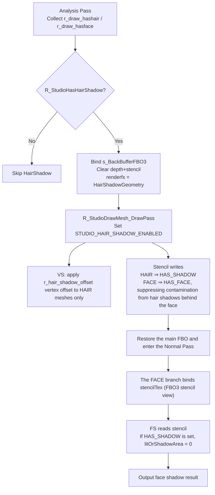

# HairShadow

## Overview
HairShadow is a "screen-space hair shadow" path in the Studio Celshade pipeline in `Plugins/Renderer`: it first writes hair/face geometry into an off-screen depth-stencil buffer, then reads stencil bits by screen coordinates during the face fragment stage of the main render to determine whether a fragment must fall into the shadow region.

Its core goal is to produce stable, controllable shadows on the face when hair occludes it, without relying on conventional transparency sorting.

## Responsibilities
- Detect during analysis whether a model contains both `STUDIO_NF_CELSHADE_HAIR` and `STUDIO_NF_CELSHADE_FACE` meshes.
- Trigger the HairShadow geometry pass through dedicated `renderfx` (`kRenderFxDrawHairShadowGeometry`).
- Use distinct stencil-writing strategies for the "hair shadow bit" and the "face occlusion bit" in the HairShadow pass.
- Bind and sample the stencil texture of `s_BackBufferFBO3` for faces in the main render pass, making the shadow decision by screen-space location.
- Expose runtime and model-level parameter entry points (`r_studio_hair_shadow`, `r_studio_hair_shadow_offset`, and `studio_celshade_control.hair_shadow_offset`).

## Involved files (without line numbers)
- docs/Renderer.md
- Plugins/Renderer/enginedef.h
- Plugins/Renderer/gl_common.h
- Plugins/Renderer/gl_local.h
- Plugins/Renderer/gl_rmain.cpp
- Plugins/Renderer/gl_studio.cpp
- Build/svencoop/renderer/shader/common.h
- Build/svencoop/renderer/shader/studio_shader.vert.glsl
- Build/svencoop/renderer/shader/studio_shader.frag.glsl

## Architecture
Overall flow:

Key implementation points:
- Enablement condition: `R_StudioHasHairShadow()` requires `r_draw_hashair && r_draw_hasface && r_studio_hair_shadow>0 && !R_IsRenderingShadowView()`.
- Pass scheduling: `StudioRenderModel_Template` executes the HairShadow pass after analysis (`renderfx = kRenderFxDrawHairShadowGeometry`) and changes the render target to `s_BackBufferFBO3`.
- Shader variant: `STUDIO_HAIR_SHADOW_ENABLED` injects `#define HAIR_SHADOW_ENABLED` and selects the dedicated branch.
- Vertex offset: `studio_shader.vert.glsl` offsets only meshes with `HAIR_SHADOW_ENABLED && STUDIO_NF_CELSHADE_HAIR`; the offset parameter comes from `r_hair_shadow_offset`.
- Screen-space decision: the face-celshade branch of `studio_shader.frag.glsl` reads `stencilTex` when `STENCIL_TEXTURE_ENABLED` is set, and sets `litOrShadowArea` to `0.0` when `STENCIL_MASK_HAS_SHADOW` is present.

## Dependencies
- Mesh flags: `STUDIO_NF_CELSHADE_FACE` and `STUDIO_NF_CELSHADE_HAIR` (from external `studio_texture` configuration).
- Render-state bits: `STUDIO_HAIR_SHADOW_ENABLED` and `STUDIO_STENCIL_TEXTURE_ENABLED`.
- renderfx protocol: `kRenderFxDrawHairShadowGeometry`.
- FBO resource: `s_BackBufferFBO3` (`GL_RGBA8 + GL_DEPTH24_STENCIL8`, with a stencil view for sampling).
- Texture binding: `STUDIO_BIND_TEXTURE_STENCIL = 6`.
- Shared shader functions/constants: `LoadStencilValueFromStencilTexture`, `STENCIL_MASK_HAS_SHADOW`, and `STENCIL_MASK_HAS_FACE`.
- Parameter sources:
  - Global cvars: `r_studio_hair_shadow` and `r_studio_hair_shadow_offset`.
  - Model-level override: `hair_shadow_offset` in `studio_celshade_control` (parsed by `R_StudioLoadExternalFile_Celshade`).

## Notes
- When `r_studio_celshade=0`, the code clears `STUDIO_NF_CELSHADE_ALLBITS`, disabling the entire HairShadow path.
- FACE- and HAIR-flagged meshes must coexist in the same model; otherwise `R_StudioHasHairShadow()` is false.
- The HairShadow pass is primarily for depth/stencil writes (`glDrawBuffer(GL_NONE)`), not direct color output.
- Face-shadow decisions depend on `s_BackBufferFBO3.s_hBackBufferStencilView`; if the stencil view is unavailable, the face branch cannot obtain shadow-occlusion information.
- Code comments call `r_studio_hair_shadow_offset` a "screen space offset", but the implementation geometrically offsets hair vertices before projecting them to the screen.
- HairShadow does not run in ShadowView (`!R_IsRenderingShadowView()`), avoiding a conflict with the shadow-map view.

## Callers (optional)
- `StudioRenderModel_Template`: drives Analysis -> HairShadow pass -> Normal pass.
- `R_StudioDrawMesh_AnalysisPass`: collects `r_draw_hashair / r_draw_hasface`.
- `R_StudioDrawMesh_DrawPass`:
  - recognizes `kRenderFxDrawHairShadowGeometry` and sets `STUDIO_HAIR_SHADOW_ENABLED`;
  - binds the stencil texture for the face branch in the normal pass.
- `R_UseStudioProgram`: generates/selects the `HAIR_SHADOW_ENABLED` shader variant according to `StudioProgramState`.

## Pass render-state configuration (by geometry; stencil-focused)

### Stencil-bit semantics
- `STENCIL_MASK_HAS_SHADOW = 0x1`: marks "hair-shadow geometry".
- `STENCIL_MASK_HAS_FACE = 0x2`: marks "face geometry".

### 1) Analysis Pass (feature collection)
- Entry: uses `R_StudioDrawMesh_AnalysisPass` when `r_draw_analyzingstudio = true`.
- Geometry handling:
  - The normal path only collects `r_draw_hashair / r_draw_hasface / r_draw_hasalpha / r_draw_hasadditive`.
  - It does not switch to HairShadow-specific render state.
- Stencil: no writes (only collects flags; does not perform stencil operations).

### 2) HairShadow Geometry Pass (`kRenderFxDrawHairShadowGeometry`)
- Scheduling layer (`StudioRenderModel_Template`):
  - Binds `s_BackBufferFBO3`.
  - Clears depth/stencil with `GL_ClearDepthStencil(1.0f, STENCIL_MASK_NONE, STENCIL_MASK_ALL)`.
  - Uses `glDrawBuffer(GL_NONE)`; this pass is mainly for depth/stencil writes.
- Geometry filtering (`R_StudioDrawMesh_DrawPass`):
  - Only `STUDIO_NF_CELSHADE_HAIR` or `STUDIO_NF_CELSHADE_FACE` meshes participate; all other meshes immediately `return`.
- Stencil setup (core):
  - Face geometry: `GL_BeginStencilWrite(STENCIL_MASK_HAS_FACE, STENCIL_MASK_HAS_FACE | STENCIL_MASK_HAS_SHADOW)`.
    - Purpose: when foreground face geometry exists, suppress incorrect contamination of the face by hair shadows behind it.
  - Hair geometry: `GL_BeginStencilWrite(STENCIL_MASK_HAS_SHADOW, STENCIL_MASK_HAS_SHADOW)`.
    - Purpose: write only the shadow bit for later reading by face fragments.
- Depth/blending/rasterization:
  - `glDisable(GL_BLEND)` and `glDepthMask(GL_TRUE)`.
  - By default, `glEnable(GL_CULL_FACE); glCullFace(GL_FRONT)`; disable culling for `STUDIO_NF_DOUBLE_FACE`.
- Pass cleanup: restores `glDrawBuffer(GL_COLOR_ATTACHMENT0)` and binds the original FBO again.

### 3) HairFaceColorMix Geometry Pass (`kRenderFxDrawHairFaceColorMixGeometry`)
- Scheduling layer (`StudioRenderModel_Template`):
  - Binds `s_BackBufferFBO4`.
  - Uses `GL_ClearColor(0,0,0,1)` + `GL_ClearDepthStencil(...)`.
- Geometry filtering:
  - Only `STUDIO_NF_CELSHADE_FACE` meshes participate; non-FACE meshes immediately `return`.
- Stencil setup:
  - The code path explicitly states `//No need to write stencil here`; it performs no HairFaceColorMix-specific stencil writes.
- Depth/blending:
  - `glDisable(GL_BLEND)` and `glDepthMask(GL_TRUE)`.
- Color output:
  - This pass outputs face `diffuseColor` to `s_BackBufferFBO4`; if a specular texture exists, it first performs `diffuseColor.a *= rawSpecularColor.a`.

### 4) Normal Pass (Face Geometry)
- Texture-binding condition:
  - If the current geometry is `STUDIO_NF_CELSHADE_FACE` and is not in the HairShadow/HairFaceColorMix pass, it attempts to bind `s_BackBufferFBO3.s_hBackBufferStencilView` to `STUDIO_BIND_TEXTURE_STENCIL(6)` and sets `STUDIO_STENCIL_TEXTURE_ENABLED`.
- Stencil usage:
  - This stage primarily reads stencil rather than writing it.
  - The face-celshade branch of `studio_shader.frag.glsl` reads `stencilTex`:
    - When `STENCIL_MASK_HAS_SHADOW` is present, `litOrShadowArea = 0.0`, pushing the corresponding face pixel into shadow.

### 5) Normal Pass (Hair Geometry)
- Texture bindings:
  - Binds the mix diffuse (slot 7) and depth (slot 8) of `s_BackBufferFBO4` for screen-space color mixing.
- Stencil:
  - There is no HairShadow-specific stencil-write logic; the key stencil data for hair shadows has already been produced in the HairShadow Geometry Pass.

### 6) DrawPass shared state restoration (after every mesh draw)
- `glDepthMask(GL_TRUE)`
- `glDisable(GL_BLEND)`
- `glEnable(GL_CULL_FACE)`
- `glEnable(GL_DEPTH_TEST)`
- `glDepthFunc(GL_LEQUAL)`
- `GL_EndStencil()`
