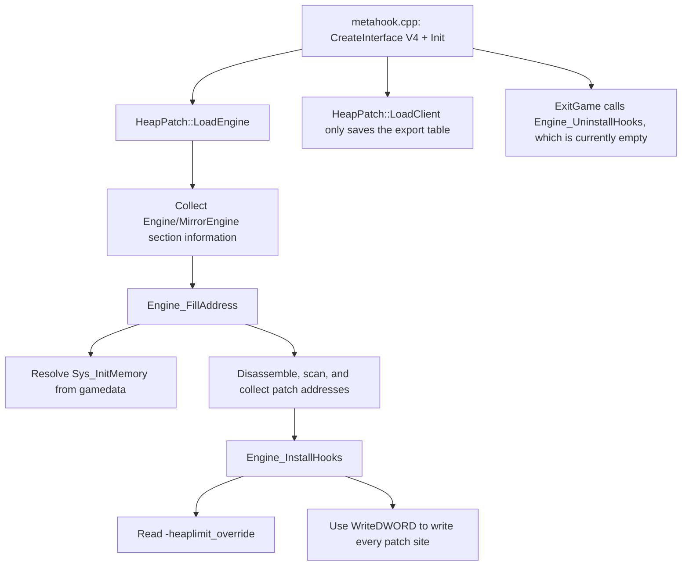

# HeapPatch

## Overview
`HeapPatch` is a utility plugin that locates heap-size immediates related to `Sys_InitMemory` after engine startup and rewrites them to a larger threshold, mitigating out-of-memory issues caused by insufficient fixed heap limits in GoldSrc/SvEngine.

## Responsibilities
- During `LoadEngine`, collects section information for the engine image/real module and resolves the `Sys_InitMemory` entry address.
- Traverses `Sys_InitMemory` control flow by disassembly to locate the immediate-field addresses of `MOV/CMP imm` instructions related to the heap limit.
- Rewrites target immediates to a new byte value based on the default or the `-heaplimit_override` (MB) launch parameter.
- Supports mirror-engine scenarios by converting addresses between image and real-engine spaces through RVA/VA mappings.

## Involved Files (without line numbers)
- `Plugins/HeapPatch/plugins.cpp`
- `Plugins/HeapPatch/plugins.h`
- `Plugins/HeapPatch/privatehook.cpp`
- `Plugins/HeapPatch/privatehook.h`
- `Plugins/HeapPatch/exportfuncs.cpp`
- `Plugins/HeapPatch/exportfuncs.h`
- `Plugins/HeapPatch/enginedef.h`
- `Plugins/HeapPatch/HeapPatch.vcxproj`
- `MetaHook.sln`
- `scripts/build-Plugins.bat`
- `Build/svencoop/metahook/configs/plugins_goldsrc.lst`
- `Build/svencoop/metahook/configs/plugins_svencoop.lst`
- `src/metahook.cpp`

## Architecture
The core flow follows the `IPluginsV4` lifecycle:

Key implementation points:
- `Engine_FillAddress_Sys_InitMemory`: Resolves `Sys_InitMemory` gamedata-only via `ResolveGameSymbol` (MetaHook API 109) against the real engine image; failure is fatal with symbol / buildnum / CRC64 / status diagnostics.
- `Engine_FillAddress_Sys_InitMemory_Patches`: Maps the real-image entry into the search space (mirror when present) and uses `DisasmRanges` to traverse branches and match `MOV/CMP` immediates;
  - `ENGINE_SVENGINE`: Matches `0x20000000` (512 MB)
  - Non-`ENGINE_SVENGINE`: Matches `0x2000000` (32 MB, blob), `0x2800000` (40 MB), and `0x8000000` (128 MB, including Cry of Fear; not gated on buildnum)
- `Engine_InstallHooks`: The default limit is 256 MB; when `-heaplimit_override` is provided, it is clamped to `[32, 1024]` MB and written back to every patch address.

## Dependencies
- MetaHook API: `ResolveGameSymbol` / `GetModuleCRC64` / `GetGameSymbolStatusString` / `DisasmRanges` / `WriteDWORD` / `GetEngineType` / `GetEngineBuildnum` / section-query interfaces.
- Capstone: used for instruction-level parsing (`privatehook.cpp`; the project includes `$(CapstoneIncludeDirectory)` and `$(CapstoneCheckRequirements)`).
- Plugin-system lifecycle: `src/metahook.cpp` centrally dispatches `Init/LoadEngine/LoadClient/ExitGame/Shutdown`.
- Build and load integration: `MetaHook.sln`, `scripts/build-Plugins.bat`, `plugins_goldsrc.lst`, and `plugins_svencoop.lst`.

## Notes
- `Engine_UninstallHooks()` is currently empty: this plugin is a one-time patch whose writes take effect immediately and whose original immediates are not reverted during `ExitGame`.
- Patch sites depend on gamedata for the function entry and on disassembly for intra-function immediates; if no heap-limit immediate matches, `Sys_Error("Sys_InitMemory imm not found")` is triggered. Missing gamedata for `Sys_InitMemory` is a separate fatal (`Failed to resolve "Sys_InitMemory"` with CRC64 / status).
- `-heaplimit_override` is measured in MB and forcibly constrained to `32~1024`; out-of-range values are clamped.
- `g_Sys_InitMemory_Patches` is collected through control-flow traversal and limited by `max_insts=1000` and `max_depth=16`; extreme instruction layouts may be missed.
- Cry of Fear (`cof-5936`) includes the 128 MB (`0x8000000`) maximum in `Sys_InitMemory`; that immediate is collected together with 40 MB and is not gated on `buildnum >= 6153`.

## Callers (optional)
- `src/metahook.cpp`:
  - Calls `IPluginsV4::Init` after creating the plugin API.
  - Calls `IPluginsV4::LoadEngine` in a loop during engine loading.
  - Calls `IPluginsV4::LoadClient` after the client export table is ready.
  - Calls `IPluginsV4::ExitGame` and `IPluginsV4::Shutdown` during shutdown.
- Plugin load manifests: both `Build/svencoop/metahook/configs/plugins_goldsrc.lst` and `plugins_svencoop.lst` include `HeapPatch.dll`.
