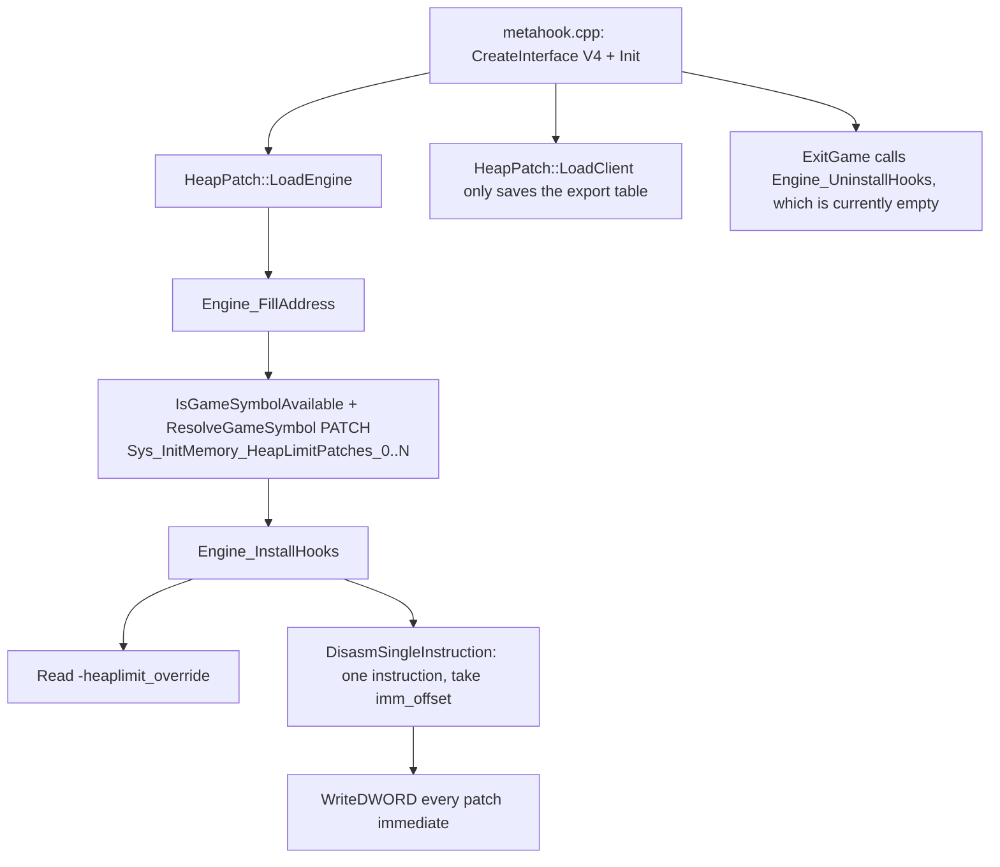

# HeapPatch

## Overview
`HeapPatch` is a utility plugin that locates heap-size immediates related to `Sys_InitMemory` after engine startup and rewrites them to a larger threshold, mitigating out-of-memory issues caused by insufficient fixed heap limits in GoldSrc/SvEngine.

## Responsibilities
- During `LoadEngine`, resolves every numbered gamedata PATCH record `Sys_InitMemory_HeapLimitPatches_0..N` to its real-image target instruction address.
- Decodes exactly one instruction per target and takes the DWORD immediate operand position from the decode (no control-flow traversal, no signature search).
- Rewrites target immediates to a new byte value based on the default or the `-heaplimit_override` (MB) launch parameter.

## Involved Files (without line numbers)
- `Plugins/HeapPatch/plugins.cpp`
- `Plugins/HeapPatch/plugins.h`
- `Plugins/HeapPatch/privatehook.cpp`
- `Plugins/HeapPatch/privatehook.h`
- `Plugins/HeapPatch/exportfuncs.cpp`
- `Plugins/HeapPatch/exportfuncs.h`
- `Plugins/HeapPatch/enginedef.h`
- `Plugins/HeapPatch/HeapPatch.vcxproj`
- `MetaHook.sln`
- `scripts/build-Plugins.bat`
- `Build/svencoop/metahook/configs/plugins_goldsrc.lst`
- `Build/svencoop/metahook/configs/plugins_svencoop.lst`
- `src/metahook.cpp`

## Architecture
The core flow follows the `IPluginsV4` lifecycle:

Key implementation points:
- `Engine_FillAddress`: Enumerates `Sys_InitMemory_HeapLimitPatches_0..N` gamedata-only via `IsGameSymbolAvailable` + `ResolveGameSymbol(..., MH_GAMESYMBOL_KIND_PATCH, ...)` (MetaHook API 110) against the real engine image; index 0 is required, the first `SYMBOL_NOT_FOUND` after it ends the enumeration, and any other status is fatal with symbol / buildnum / CRC64 / status diagnostics.
- `FindHeapLimitImmediate`: Decodes exactly one instruction at the resolved target address with `DisasmSingleInstruction` and accepts only `MOV` / `CMP` with a DWORD immediate operand 2; the written address is `instruction + encoding.imm_offset`. The PATCH address is the instruction address, not the immediate address; no `patch_sig` search, fixed offset or old-immediate matching is involved.
- `Engine_InstallHooks`: The default limit is 256 MB; when `-heaplimit_override` is provided, it is clamped to `[32, 1024]` MB and written back to every patch immediate.

## Dependencies
- MetaHook API: `ResolveGameSymbol` / `IsGameSymbolAvailable` / `GetModuleCRC64` / `GetGameSymbolStatusString` / `DisasmSingleInstruction` / `WriteDWORD` / `GetEngineType` / `GetEngineBuildnum` / `GetEngineBase`.
- Capstone: used for instruction-level parsing (`privatehook.cpp`; the project includes `$(CapstoneIncludeDirectory)` and `$(CapstoneCheckRequirements)`).
- Plugin-system lifecycle: `src/metahook.cpp` centrally dispatches `Init/LoadEngine/LoadClient/ExitGame/Shutdown`.
- Build and load integration: `MetaHook.sln`, `scripts/build-Plugins.bat`, `plugins_goldsrc.lst`, and `plugins_svencoop.lst`.

## Notes
- `Engine_UninstallHooks()` is currently empty: this plugin is a one-time patch whose writes take effect immediately and whose original immediates are not reverted during `ExitGame`.
- Patch sites come entirely from gamedata; disassembly is used only to locate the immediate field inside the already-resolved instruction. A decode failure or an unexpected instruction layout reports the PATCH symbol and address and aborts without searching for a replacement. A missing index-0 PATCH record is fatal (`Failed to resolve "Sys_InitMemory_HeapLimitPatches_0"` with CRC64 / status).
- `-heaplimit_override` is measured in MB and forcibly constrained to `32~1024`; out-of-range values are clamped.
- `g_Sys_InitMemory_HeapLimitPatches` holds `{symbolName, instructionAddress}` pairs; every upstream-provided target is written, and the record count is never hard-coded.
- Cry of Fear (`cof-5936`) ships 6 heap-limit patches (40 MB ×1 + 128 MB ×5) and blob 3248–4554 ship 4 each; the plugin no longer distinguishes them by engine type or immediate value.

## Callers (optional)
- `src/metahook.cpp`:
  - Calls `IPluginsV4::Init` after creating the plugin API.
  - Calls `IPluginsV4::LoadEngine` in a loop during engine loading.
  - Calls `IPluginsV4::LoadClient` after the client export table is ready.
  - Calls `IPluginsV4::ExitGame` and `IPluginsV4::Shutdown` during shutdown.
- Plugin load manifests: both `Build/svencoop/metahook/configs/plugins_goldsrc.lst` and `plugins_svencoop.lst` include `HeapPatch.dll`.
