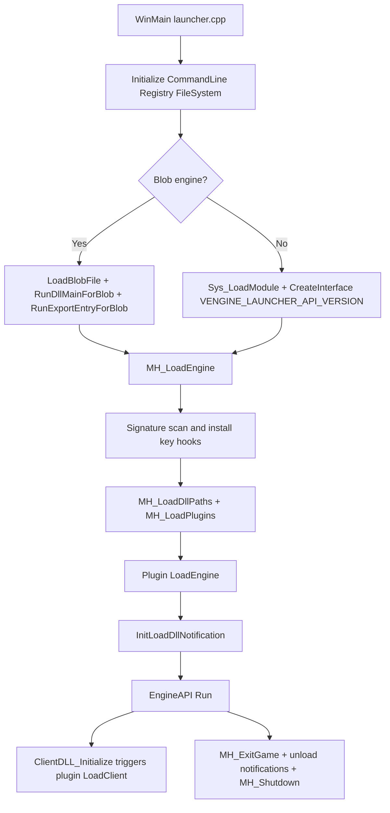

# MetaHook

## Overview
`MetaHook` is the core source collection on the Loader side. It starts the game engine (a normal PE or legacy blob), locates key internal engine symbols, installs hooks, loads and drives plugin lifecycles, forwards DLL load notifications, and reclaims resources during shutdown. The main execution chain enters through `src/launcher.cpp`, with its core logic implemented in `src/metahook.cpp`.

## Responsibilities
- Startup and restart control: parses the command line, initializes the registry/filesystem, selects and loads `hw.dll/sw.dll`, and executes `IEngineAPI::Run`.
- Engine adaptation and symbol location: performs signature scanning and disassembly-based location in code sections by engine type (GoldSrc/SvEngine/HL25/blob), including the build number, `ppEngfuncs`, `ppExportFuncs`, `gClientUserMsgs`, `cl_parsefuncs`, studio interfaces, and more.
- Hook infrastructure: provides four hook types—inline, VFT, IAT, and inline-patch—and supports transactional commits (batch registration followed by a single commit).
- Plugin lifecycle management: reads plugins from `plugins.lst`, negotiates V4/V3/V2/V1 interfaces, and calls `Init/LoadEngine/LoadClient/ExitGame/Shutdown`.
- Blob module loading: recognizes blob files, decodes, relocates, repairs imports, invokes entry points, and supports blob import-table hook queries.
- DLL load notifications: centrally distributes blob/Ldr load/unload events to plugins, carrying engine/client/blob/critical-region flags.
- Runtime capability exposure: exposes memory read/write, disassembly, pattern search, module queries, thread pools, notification registration, and other capabilities to plugins through `gMetaHookAPI` / `gMetaHookAPI_LegacyV2`.

## Involved Files (No Line Numbers)
- src/launcher.cpp
- src/metahook.cpp
- src/LoadBlob.cpp
- src/LoadBlob.h
- src/LoadDllNotification.cpp
- src/LoadDllNotification.h
- src/commandline.cpp
- src/registry.cpp
- src/sys_launcher.cpp
- src/Z.cpp
- src/sys.h
- include/metahook.h
- include/Interface/IPlugins.h

## Architecture
Main runtime flow:

Key source responsibilities:
- `launcher.cpp`: process entry point, single-instance mutex, engine DLL selection, engine-run loop, restart/video-mode fallback.
- `metahook.cpp`: core state and API tables, symbol scanning, hook management, plugin loading and lifecycle, image DLLs, thread pool.
- `LoadBlob.cpp`: blob format validation/decoding/loading/unloading, blob queries, blob IAT hooks.
- `LoadDllNotification.cpp`: prioritizes `LdrRegisterDllNotification`, falls back to an `LdrLoadDll` detour, and centralizes event dispatch.
- `commandline.cpp`: command-line parsing and rewriting, supporting `@file` argument expansion.
- `registry.cpp`: read/write wrapper for `HKCU\Software\Valve\Half-Life\Settings`.
- `sys_launcher.cpp`: executable-path and long-path helper functions.
- `Z.cpp`: static buffer for the `.blob` section (enabled only in blob-support/debug builds).

## Dependencies
- Internal interfaces: `metahook.h`, `IPlugins.h`, `IEngineAPI.h`, `IFileSystem/IFileSystem_HL25`, `ICommandLine`, `IRegistry`.
- Third-party capabilities: Detours (inline detours), Capstone (disassembly/instruction scanning), MemoryModule/LoadDllMemoryApi (read-only image-DLL loading and relocation).
- Runtime assets: `<game>\metahook\configs\plugins.lst`, `<game>\metahook\plugins\*.dll`, `<game>\metahook\dlls` (recursively added to PATH).
- Plugin ABI: first negotiates `METAHOOK_PLUGIN_API_VERSION_V4`, then falls back to V3/V2/V1 in order.

## Notes
- Plugin invocation order is the reverse of the order written in `plugins.lst`: `MH_LoadPlugin` inserts at the head of a linked list, while `LoadEngine/LoadClient` traverse the list from its head.
- The `_SSE.dll` branch in `MH_LoadPlugins` performs duplicate attempts (the same condition twice).
- `MH_FreeHooksForModule` is currently `TODO`, although the unload-notification path already calls it; hook reclamation after module unloading is not actually implemented.
- `LoadDllNotification` dispatches callbacks even inside the `Ldr` critical region; plugin callbacks must avoid blocking or reentrancy-sensitive operations themselves.
- Blob support is limited by the `METAHOOK_BLOB_SUPPORT` compilation macro; unsupported builds directly error and require `metahook_blob.exe`.
- `MH_LoadEngine` relies on extensive signature/disassembly-based location; if the engine binary layout changes, it may trigger early termination via `MH_SysError`.
- `launcher.cpp` contains helper code that does not participate in the current main flow (for example, `SetActiveProcess` is not called).

## Callers (Optional)
- Startup caller: `WinMain` (`src/launcher.cpp`) directly calls `MH_LoadEngine` / `MH_ExitGame` / `MH_Shutdown`.
- Engine callback caller: the engine calls `ClientDLL_Initialize` while initializing the client; MetaHook takes control and triggers plugin `LoadClient`.
- Plugin caller: after obtaining `metahook_api_t` and `mh_interface_t` through `IPluginsV2+::Init`, plugins call back into Loader-exposed capabilities.
