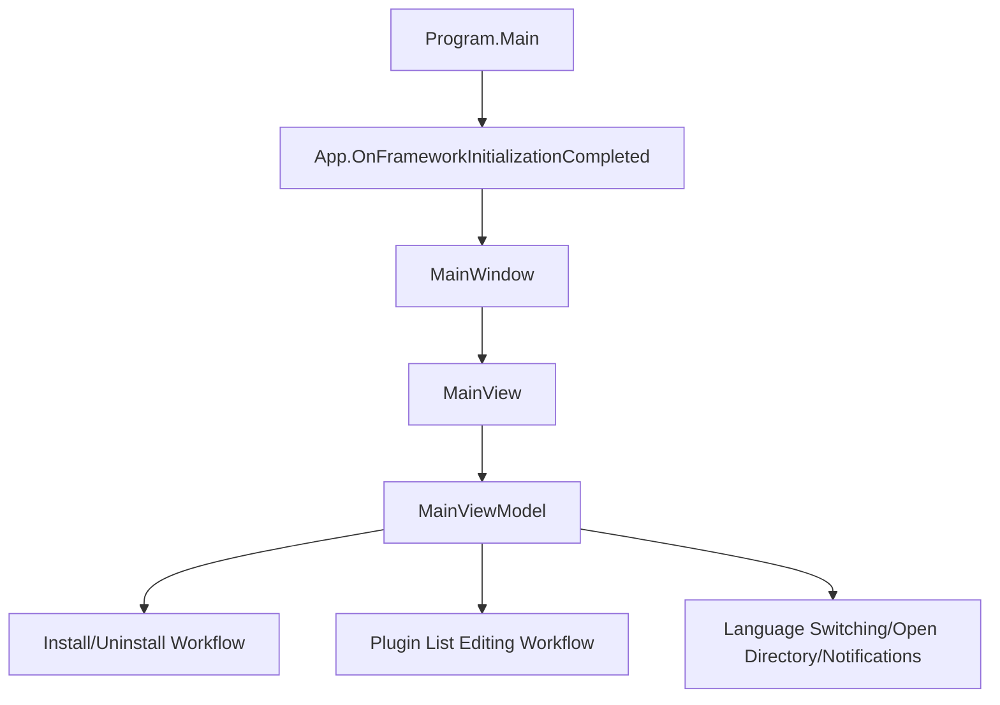
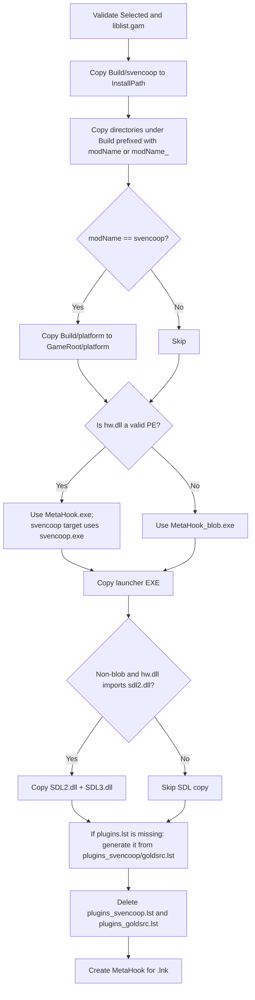

# MetahookInstaller

## Overview
`toolsrc/MetahookInstaller` is a Windows installer tool based on Avalonia + ReactiveUI (.NET 8). It deploys MetaHook runtime files from the repository's `Build/` directory to a target GoldSrc/Sven Co-op game directory and provides visual editing for `plugins.lst` (enable/disable, ordering, and saving).

## Responsibilities
- Automatically discover the Steam installation path and Steam Libraries, infer installation directories for preset games, and generate a selectable Mod list.
- Perform installation: copy base/Mod directories, choose `MetaHook.exe` or `MetaHook_blob.exe`, copy `SDL2.dll/SDL3.dll` as needed, write `plugins.lst`, and create a launch shortcut.
- Perform uninstallation: delete installer-known directories/files (including shortcuts) and provide notification feedback.
- Provide a plugin editor: read `metahook/configs/plugins.lst` and `metahook/plugins/*.dll`, supporting drag-and-drop ordering, moving entries between lists, enable-state editing, and persistent saving.
- Provide auxiliary functions: language switching (`zh-CN` / `en-US`), quick opening of common directories, and Toast/Notification prompts.

## Files Involved (Do Not Include Line Numbers)
- `toolsrc/MetahookInstaller/Directory.Build.props`
- `toolsrc/MetahookInstaller/MetahookInstallerAvalonia.Desktop/Program.cs`
- `toolsrc/MetahookInstaller/MetahookInstallerAvalonia.Desktop/MetahookInstallerAvalonia.Desktop.csproj`
- `toolsrc/MetahookInstaller/MetahookInstallerAvalonia.Desktop/app.manifest`
- `toolsrc/MetahookInstaller/MetahookInstallerAvalonia.Desktop/Properties/PublishProfiles/FolderProfile.pubxml`
- `toolsrc/MetahookInstaller/MetahookInstallerAvalonia/MetahookInstallerAvalonia.csproj`
- `toolsrc/MetahookInstaller/MetahookInstallerAvalonia/App.axaml`
- `toolsrc/MetahookInstaller/MetahookInstallerAvalonia/App.axaml.cs`
- `toolsrc/MetahookInstaller/MetahookInstallerAvalonia/ViewModels/MainViewModel.cs`
- `toolsrc/MetahookInstaller/MetahookInstallerAvalonia/ViewModels/PluginInfo.cs`
- `toolsrc/MetahookInstaller/MetahookInstallerAvalonia/ViewModels/ViewModelBase.cs`
- `toolsrc/MetahookInstaller/MetahookInstallerAvalonia/Handler/Command.cs`
- `toolsrc/MetahookInstaller/MetahookInstallerAvalonia/Behavior/ListBoxDragDrop.cs`
- `toolsrc/MetahookInstaller/MetahookInstallerAvalonia/Styles/ViewStyles.axaml`
- `toolsrc/MetahookInstaller/MetahookInstallerAvalonia/Views/MainWindow.axaml`
- `toolsrc/MetahookInstaller/MetahookInstallerAvalonia/Views/MainWindow.axaml.cs`
- `toolsrc/MetahookInstaller/MetahookInstallerAvalonia/Views/MainView.axaml`
- `toolsrc/MetahookInstaller/MetahookInstallerAvalonia/Views/MainView.axaml.cs`
- `toolsrc/MetahookInstaller/MetahookInstallerAvalonia/Views/InstallerPage.axaml`
- `toolsrc/MetahookInstaller/MetahookInstallerAvalonia/Views/EditorPage.axaml`
- `toolsrc/MetahookInstaller/MetahookInstallerAvalonia/Lang/Resources.resx`
- `toolsrc/MetahookInstaller/MetahookInstallerAvalonia/Lang/Resources.zh-CN.resx`
- `MetaHook.sln`
- `scripts/install-helper-AIO.bat`
- `scripts/install-helper-CopyBuild.bat`
- `scripts/install-helper-CopySDL2.bat`
- `scripts/install-helper-CreateShortcut.bat`

## Architecture
The overall structure uses **Desktop Host + Avalonia UI + ViewModel business orchestration**.

Key objects and data structures:
- `MainViewModel`: Core business orchestration (installation, uninstallation, Steam discovery, plugin editing, command composition).
- `ModInfo`: Target game/Mod description (`Name/Directory/AppID/GamePath/InstallPath`).
- `PluginInfo`: Plugin entry (`Name/Enabled/Index`).
- `PluginInfoComparer`: Deduplicates plugin names (case-insensitive comparison).
- `ItemsListBoxDropHandler`: Plugin-list drag-and-drop behavior (Move/Swap/Copy) and index write-back.

Main installation workflow (`MainViewModel.InstallMod`):

Plugin editing workflow (Page 2):
- `InitPluginList`: Read `plugins.lst` to obtain configured entries; scan `metahook/plugins/*.dll` to generate the available list; deduplicate by plugin name and calculate display indices.
- `ToAvaliableCommand` / `ToPluginsCommand`: Move entries between the “enabled/available” lists.
- `ItemsListBoxDropHandler` adjusts order through drag-and-drop, then `RecaculatePluginIndex` is called consistently.
- `SavePluginList`: Write `_plugins` back to `plugins.lst`; disabled items use the `;` prefix.

## Dependencies
- External libraries (NuGet): `Avalonia`, `ReactiveUI.Avalonia`, `Irihi.Ursa`, `Semi.Avalonia`, `Xaml.Behaviors.Avalonia`, `securifybv.ShellLink`.
- Windows dependencies: registry `HKCU\Software\Valve\Steam` (reads SteamPath), `explorer.exe`, and `.lnk` shortcut writing.
- Repository contract dependencies:
  - `Build/` directory contents (`MetaHook.exe` / `MetaHook_blob.exe` / `svencoop` / `platform` / `SDL2.dll` / `SDL3.dll`, and others).
  - Game directory structure (`<mod>/liblist.gam`, `metahook/configs/plugins*.lst`, `metahook/plugins/*.dll`).
- Solution integration: the `Tools` group in `MetaHook.sln` includes `MetahookInstallerAvalonia` and `MetahookInstallerAvalonia.Desktop`.
- Historical script chain: `scripts/install-helper-*.bat` overlaps with this GUI tool's responsibilities, showing that installer logic evolved from batch processing to a UI tool.

## Notes
- Path discovery and configuration-file I/O depend heavily on the current working directory (such as `./Build` and `./lang`); if the launch directory changes, behavior may diverge by failing to find Build/language configuration.
- Uninstallation deletes fixed allowlisted paths, has limited coverage, and does not back up files; user content manually placed under those paths risks deletion.
- The desktop project does not explicitly request elevation; when the target game directory is protected (such as `Program Files`), installation/uninstallation may throw permission exceptions (the code prompts but does not elevate automatically).

## Callers (Optional)
- Startup call chain: `MetahookInstallerAvalonia.Desktop/Program.cs` -> `App.axaml.cs` -> `MainWindow` (`DataContext = new MainViewModel()`).
- UI triggers:
  - `InstallerPage.axaml` triggers `InstallCommand` and `UninstallCommand`.
  - `EditorPage.axaml` triggers `ToAvaliableCommand`, `ToPluginsCommand`, `ResetCommand`, and `SaveCommand`.
  - The language menu in `MainWindow.axaml` triggers `ChangeLanguageCommand`.
  - The directory button in `MainView.axaml` triggers `OpenFolderCommand`.
