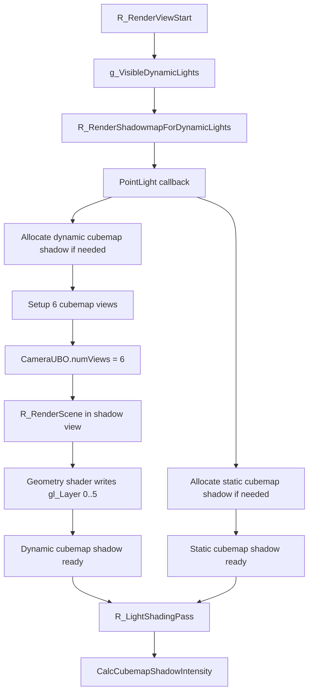

# PointLightShadow

## Overview
PointLightShadow handles shadow-map generation and deferred-lighting sampling for point lights in Renderer. It centers on cubemap shadow mapping, supports static world shadows and dynamic entity shadows separately, and writes all six directions into the same cubemap depth texture with a single multiview draw.

## Responsibilities
- Allocate or reuse `CCubemapShadowTexture` for shadow-casting point lights.
- Build projection matrices, world matrices, and shadow matrices for six cubemap views in the Shadow pass.
- With `CameraUBO.numViews = 6` and a multiview geometry shader, emit all six cubemap faces in one `R_RenderScene()` call.
- When a static-shadow cache exists, draw only opaque entities for the dynamic-shadow pass; without static shadows, draw both world and entities.
- In `R_LightShadingPass()`, bind static and dynamic cubemap-shadow textures to the point-light shader and use PCF for shadow sampling.

## Involved Files & Symbols
- `Plugins/Renderer/gl_light.h` - `CDynamicLight`
- `Plugins/Renderer/gl_light.cpp` - `R_AddVisibleDynamicLight`, `R_IterateVisibleDynamicLights`, `R_LightShadingPass`
- `Plugins/Renderer/gl_shadow.cpp` - `CCubemapShadowTexture`, `R_CreateCubemapShadowTexture`, `R_SetupShadowMatrix`, `R_RenderShadowmapForDynamicLights`
- `Plugins/Renderer/gl_rmain.cpp` - `R_PreRenderView`, `R_RenderScene`
- `Plugins/Renderer/gl_wsurf.cpp` - world-surface shadow rendering path in Shadow view
- `Plugins/Renderer/gl_studio.cpp` - `STUDIO_SHADOW_CASTER_ENABLED` in Shadow view
- `Build/svencoop/renderer/shader/common.h` - `CameraUBO.numViews`
- `Build/svencoop/renderer/shader/wsurf_shader.geom.glsl` - `gl_Layer` multiview output
- `Build/svencoop/renderer/shader/studio_shader.geom.glsl` - `gl_Layer` multiview output
- `Build/svencoop/renderer/shader/dlight_shader.frag.glsl` - `CalcCubemapShadowIntensity`

## Architecture
The per-frame point-light shadow flow is as follows:

1. `R_RenderViewStart()` first adds visible point lights from `g_BSPDynamicLights` and `g_EngineDynamicLights` to `g_VisibleDynamicLights`.
2. `R_RenderShadowmapForDynamicLights()` enters the PointLight callback through `R_IterateVisibleDynamicLights()`.
3. If `static_shadow_size > 0`, the system allocates a static `CCubemapShadowTexture` for the point light and generates a world-shadow cache once when the texture is not ready.
4. If `dynamic_shadow_size > 0`, the system allocates a dynamic `CCubemapShadowTexture` for the point light; that pass enables `r_draw_shadowview`, `r_draw_multiview`, `r_draw_nofrustumcull`, and `r_draw_lineardepth`.
5. On the CPU, it configures `vieworg`, `viewangles`, a `90 x 90` perspective projection, frustum, and shadow matrix for each of the cubemap's six directions, then writes six camera-data sets into `CameraUBO`.
6. `R_RenderScene()` is called once; the geometry shader loops according to `CameraUBO.numViews` and emits to the cubemap's six faces through `gl_Layer`.
7. In `R_LightShadingPass()`, the point-light shader decides whether to enable static-cubemap-shadow and dynamic-cubemap-shadow macros based on the ready states of `pStaticShadowTexture` and `pDynamicShadowTexture`, then samples in the fragment stage with `CalcCubemapShadowIntensity()`.

Static and dynamic point-light shadows divide responsibilities as follows:
- Static cubemap shadow:
  - Participates only when `static_shadow_size > 0`.
  - Primarily caches world-geometry shadows; readiness is determined by `c_brush_polys > 0`.
- Dynamic cubemap shadow:
  - Targets shadows from changing entities.
  - When a static shadow already exists, the dynamic pass draws only `DRAW_CLASSIFY_OPAQUE_ENTITIES`, avoiding repeated world drawing.
  - When no static shadow exists, the dynamic pass draws `DRAW_CLASSIFY_WORLD | DRAW_CLASSIFY_OPAQUE_ENTITIES` to ensure complete point-light shadows.

## Dependencies
- `static_shadow_size`, `dynamic_shadow_size`, `pStaticShadowTexture`, and `pDynamicShadowTexture` on `CDynamicLight`.
- The `CCubemapShadowTexture` wrapper around `GL_GenCubemapShadowTexture`.
- The `CameraUBO` multiview structure and geometry-shader `gl_Layer` output capability.
- `R_SetupShadowMatrix()` generates the matrix from world coordinates to shadow-texture space.
- The point-light shadow branch and cubemap-shadow sampler in the deferred-lighting shader.

## Notes
- Ordinary engine point lights from `cl_dlights` default to `shadow = 0` in `R_ProcessEngineDynamicLights()`, so they normally do not use PointLightShadow; this topic mainly covers point-light shadows for map `light_dynamic` entities.
- Dynamic point-light shadows enable `r_draw_lineardepth`, so the shader uses linear-depth comparison consistent with distance to the light source.
- If a point light is bound to `source_entity_index`, that entity is hidden in the shadow pass to prevent self-projection from contaminating the shadow.
- Static and dynamic point-light shadows both use cubemaps, but differ in ready state and draw classification.
- The point-light lighting stage can bind static cubemap shadow and dynamic cubemap shadow simultaneously; both affect the final shadow result in the shader.

## Callers (optional)
- `Plugins/Renderer/gl_rmain.cpp` - `R_PreRenderView` calls `R_RenderShadowMap`
- `Plugins/Renderer/gl_shadow.cpp` - the PointLight callback in `R_RenderShadowmapForDynamicLights` generates the cubemap Shadow Map
- `Plugins/Renderer/gl_light.cpp` - the PointLight callback in `R_LightShadingPass` samples cubemap shadow
