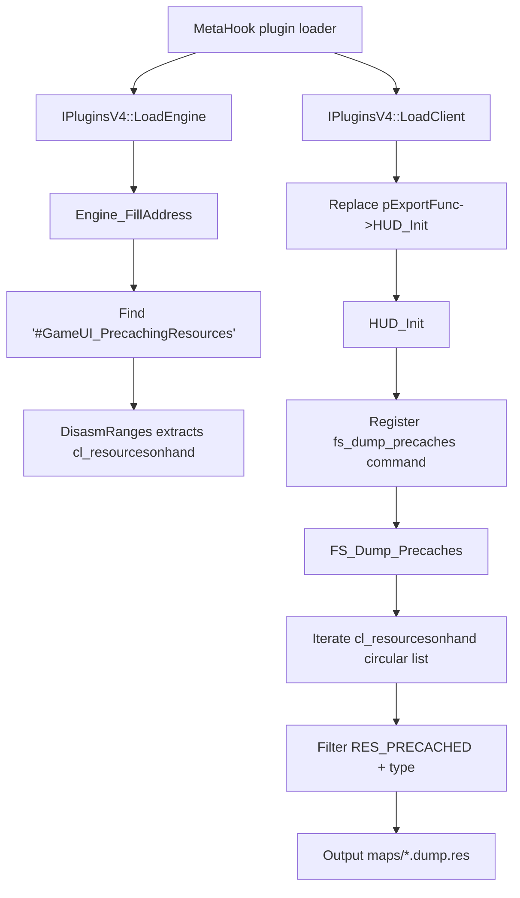

# PrecacheManager

## Overview
`PrecacheManager` is a MetaHookSv utility plugin. After client initialization, it registers the `fs_dump_precaches` console command to export the current map's precached resources to `[ModDirectory]\\maps\\[mapname].dump.res`. During engine loading, the plugin locates the runtime resource-list head `cl_resourcesonhand` through signature scanning and disassembly.

## Responsibilities
- Initializes the plugin runtime environment during `IPluginsV4::LoadEngine` (file-system interfaces, engine type/version, and mirrored engine-section information).
- Calls `Engine_FillAddress` to scan and resolve the `cl_resourcesonhand` address, establishing the resource-iteration entry point.
- Takes over `HUD_Init` during `IPluginsV4::LoadClient` and registers the `fs_dump_precaches` command in `HUD_Init`.
- Executes `FS_Dump_Precaches`: iterates the precached-resource list, filters by type, and writes a `.dump.res` file.

## Involved Files (without line numbers)
- Plugins/PrecacheManager/plugins.cpp
- Plugins/PrecacheManager/plugins.h
- Plugins/PrecacheManager/exportfuncs.cpp
- Plugins/PrecacheManager/exportfuncs.h
- Plugins/PrecacheManager/privatehook.cpp
- Plugins/PrecacheManager/privatehook.h
- include/metahook.h
- include/HLSDK/engine/custom.h
- Build/svencoop/metahook/configs/plugins_goldsrc.lst
- Build/svencoop/metahook/configs/plugins_svencoop.lst
- scripts/build-Plugins.bat
- README.md
- READMECN.md

## Architecture
The core consists of three stages:
1. **Plugin lifecycle integration** (`plugins.cpp`): `LoadEngine` gathers engine/file-system context and resolves addresses; `LoadClient` takes over `HUD_Init`.
2. **Address-resolution layer** (`privatehook.cpp`): locates the relevant code region using the `#GameUI_PrecachingResources` string, scans instructions with `DisasmRanges`, identifies the data-section immediate referenced by `CMP reg, imm`, and maps it to `cl_resourcesonhand` in the real engine address space.
3. **Command-execution layer** (`exportfuncs.cpp`): `HUD_Init` registers the command, while `FS_Dump_Precaches` iterates the circular doubly linked resource list and exports the file.

## Dependencies
- **MetaHook API**: `GetEngineType`, `GetEngineBuildnum`, `GetMirrorEngineBase`, `GetSectionByName`, `SearchPattern`, `DisasmRanges`, and `SysError`.
- **Engine export table**: `cl_enginefunc_t` (`pfnGetLevelName`, `pfnAddCommand`, and `Con_Printf`).
- **File-system abstraction**: `IFileSystem` / `IFileSystem_HL25`, invoked uniformly through `FILESYSTEM_ANY_OPEN/CLOSE/WRITE`.
- **Disassembly capability**: Capstone's `cs_insn` structure for instruction-level matching.
- **Resource flags/types**: `RES_PRECACHED`, and the plugin-defined `resourcetype_t` and `resource_t`.
- **Loading and build integration**: `plugins_goldsrc.lst`, `plugins_svencoop.lst`, and `scripts/build-Plugins.bat`.

## Notes
- `FS_Dump_Precaches` exports only `t_sound`, `t_model` (excluding models that begin with `*`), and `t_generic`; it does not export decal/eventscript/world or other types.
- Resource iteration depends on `cl_resourcesonhand` being resolved successfully; a signature mismatch causes `Sig_VarNotFound` to trigger `Sys_Error` (normally a fatal error path).
- The export-file naming logic removes the last four characters from the map name and appends `.dump.res`, implicitly assuming a `.bsp` map-name suffix.
- Sven Co-op sound resources are also affected by the `soundcache.txt` mechanism, so the export list does not necessarily cover all sound assets (as documented in README/READMECN).
- `private_funcs_t` / `gPrivateFuncs` and `GetVFunctionFromVFTable` do not form a complete hook-installation path in the current version; they are retained as templated capability.

## Callers (optional)
- The MetaHook plugin framework drives the `Init/LoadEngine/LoadClient` lifecycle through `EXPOSE_SINGLE_INTERFACE(..., METAHOOK_PLUGIN_API_VERSION_V4)`.
- The console command system calls `FS_Dump_Precaches` when the user runs `fs_dump_precaches`.
- Both `Build/svencoop/metahook/configs/plugins_goldsrc.lst` and `Build/svencoop/metahook/configs/plugins_svencoop.lst` load `PrecacheManager.dll`.
