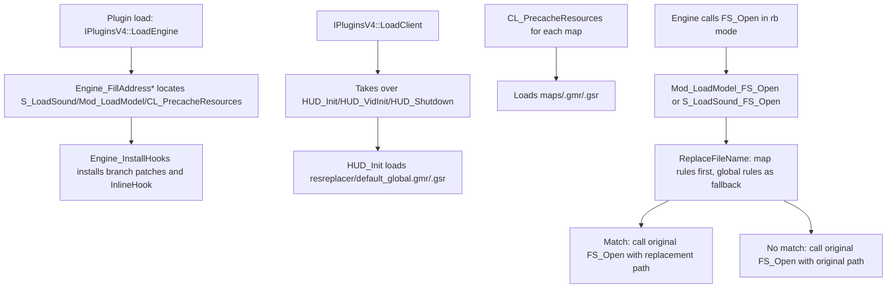

# ResourceReplacer

## Overview
`ResourceReplacer` is a runtime resource-redirection plugin. Without modifying original files on disk, it replaces model/sound load paths with specified resource paths through `.gmr/.gsr` rules.
The plugin performs replacement through patches at internal engine `FS_Open` call sites and supports both plain and regular-expression mapping rules.

## Responsibilities
- Loads and clears global and map-level resource replacement rules during the client lifecycle.
- Intercepts `FS_Open("rb")` on model and sound loading paths and rewrites file names according to the rules.
- Maintains address-discovery and hook-installation logic across engine variants (GoldSrc/SvEngine/HL25/blob).
- Ensures the extension is unchanged before and after replacement to prevent cross-type resource replacement.

## Involved Files (without line numbers)
- Plugins/ResourceReplacer/plugins.cpp
- Plugins/ResourceReplacer/plugins.h
- Plugins/ResourceReplacer/exportfuncs.cpp
- Plugins/ResourceReplacer/exportfuncs.h
- Plugins/ResourceReplacer/privatehook.cpp
- Plugins/ResourceReplacer/privatehook.h
- Plugins/ResourceReplacer/ResourceReplacer.cpp
- Plugins/ResourceReplacer/ResourceReplacer.h
- Plugins/ResourceReplacer/util.cpp
- Plugins/ResourceReplacer/util.h
- docs/ResourceReplacer.md
- docs/ResourceReplacerCN.md
- Build/svencoop/metahook/configs/plugins_goldsrc.lst
- scripts/build-Plugins.bat
- MetaHook.sln

## Architecture
Core objects and layers:
- **Rule layer**: `CResourceReplacer` (`m_MapEntries` / `m_GlobalEntries`) manages rule sets; entry types are `CPlainResourceReplaceEntry` and `CRegexResourceReplaceEntry`.
- **Lifecycle layer**: `HUD_Init` loads global rules, `HUD_VidInit` clears map rules, and `HUD_Shutdown` releases all rules.
- **Engine-hook layer**: `Engine_FillAddress*` performs signature/disassembly-based location; `Engine_InstallHooks` redirects target engine calls to plugin wrapper functions.
- **Replacement execution layer**: `Mod_LoadModel_FS_Open` / `S_LoadSound_FS_Open` invoke `ReplaceFileName` for `rb` reads.

Key behavioral details:
- Rule parsing: `LoadReplaceList` reads line by line, ignores empty lines and lines whose first character is `#` or `/`, supports optional quotes, and uses a regular-expression rule when the third token is `regex`.
- Match order: `ReplaceFileName` iterates map rules first, then global rules (map rules have higher priority).
- Map rule file names: removes the extension from `pfnGetLevelName()` and appends `.gmr/.gsr` (for example, `maps/foo.bsp` -> `maps/foo.gmr/.gsr`).

## Dependencies
- MetaHook API: `SearchPattern*`, `ReverseSearchFunctionBegin*`, `DisasmRanges`, `InlinePatchRedirectBranch`, `InlineHook/UnHook`, and `GetEngineType/GetEngineBuildnum`.
- Capstone: used to traverse instruction streams and locate `FS_Open` call sites.
- Engine exports/interfaces: `COM_LoadFile`, `COM_FreeFile`, `pfnGetLevelName`, and `cl_exportfuncs_t`.
- SourceSDK/utility functions: `V_GetFileExtension`, `stricmp`, `TrimString`, and `RemoveFileExtension`.
- Project integration: `plugins_goldsrc.lst` (loading), `MetaHook.sln`, and `scripts/build-Plugins.bat` (building).

## Notes
- Plain rules use `stricmp` for **exact full-string matching** (case-insensitive); regular-expression rules use `std::regex_match` (which requires a full-string match and is case-sensitive by default).
- Extensions before and after replacement must match (such as `.mdl/.spr/.wav`), otherwise replacement is rejected even when a rule matches.
- The plugin does not verify that the replacement target file actually exists; a missing target can cause an error/failure during resource loading.
- Replacement occurs only when `FS_Open` has `pOptions == "rb"`; other open modes do not participate.
- Address discovery relies on signatures and disassembly heuristics (especially identifying `FS_Open` through calls near the `"rb"` string); an unknown engine build may trigger `Sys_Error`.
- `LoadGlobalReplaceList` does not proactively clear global rules before loading; the current design relies on the `HUD_Init` lifecycle normally running only once.

## Callers (optional)
- Plugin loader: loads `ResourceReplacer.dll` in `Build/svencoop/metahook/configs/plugins_goldsrc.lst`.
- Plugin lifecycle entry points: `IPluginsV4::LoadEngine` / `LoadClient` / `ExitGame`.
- Client export chain: `HUD_Init`, `HUD_VidInit`, and `HUD_Shutdown`.
- Redirected internal engine call sites: `FS_Open` call branches in `S_LoadSound` and `Mod_LoadModel`, plus the `CL_PrecacheResources` inline hook.
