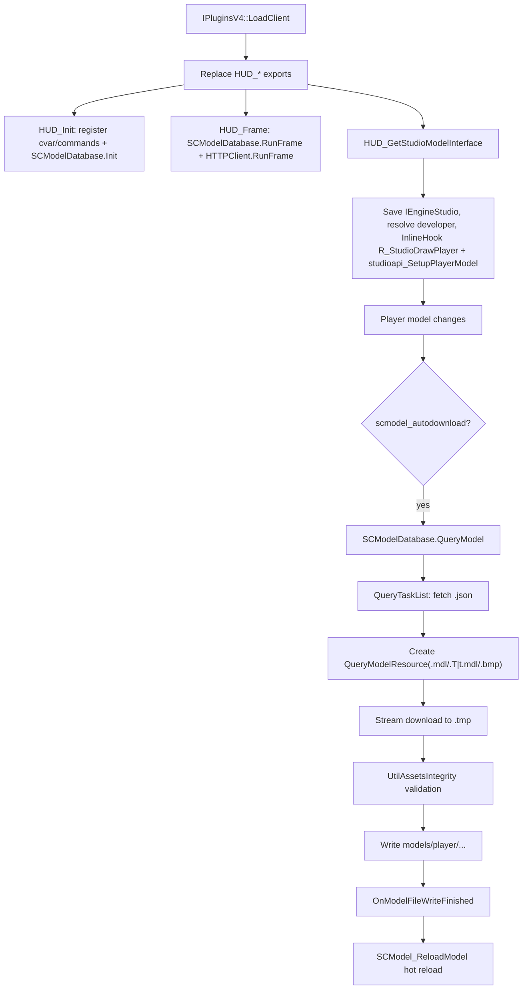

# SCModelDownloader

## Overview
`Plugins/SCModelDownloader` is an automatic player-model download plugin for the Sven Co-op client. By taking over `HUD_*` exports and the `SetupPlayerModel` call chain, it triggers asynchronous download tasks when a player's model changes, validates and writes model assets, then hot-reloads the player model; it also provides GameUI settings and task pages plus an interaction to "switch to the new-version model".

## Responsibilities
- Take over `HUD_Init/HUD_Frame/HUD_Shutdown/HUD_GetStudioModelInterface`, attaching database initialization, per-frame task driving, and cleanup logic to the client lifecycle.
- Inline-hook the two player-model callers `R_StudioDrawPlayer` and `studioapi_SetupPlayerModel`, rebuild the engine's model-change predicate at the caller entry, and conditionally trigger `QueryModel` (`scmodel_autodownload`) with the state the original caller just wrote.
- Maintain model metadata: `models.json` (available-model index) and `versions.json` (old name -> latest-version-name mapping).
- Maintain the query-task queue and state machine (`Querying/Receiving/Failed/Finished`), and dispatch state changes to the UI.
- Download asset files (`.mdl/.T|t.mdl/.bmp`) to temporary files, perform integrity validation, then write them to the destination directory.
- Manage the local player's "skip model upgrade" list (`skippedmodels.txt`), supporting switching/skipping after a prompt.
- Provide VGUI2 interfaces: a settings page (automatic download, download latest version, CDN, forced database update) and a task-list page.

## Involved files (without line numbers)
- Plugins/SCModelDownloader/plugins.cpp
- Plugins/SCModelDownloader/plugins.h
- Plugins/SCModelDownloader/exportfuncs.cpp
- Plugins/SCModelDownloader/exportfuncs.h
- Plugins/SCModelDownloader/privatehook.cpp
- Plugins/SCModelDownloader/privatehook.h
- Plugins/SCModelDownloader/SCModelDatabase.cpp
- Plugins/SCModelDownloader/SCModelDatabase.h
- Plugins/SCModelDownloader/UtilHTTPClient.cpp
- Plugins/SCModelDownloader/UtilHTTPClient.h
- Plugins/SCModelDownloader/UtilAssetsIntegrity.cpp
- Plugins/SCModelDownloader/UtilAssetsIntegrity.h
- Plugins/SCModelDownloader/VGUI2ExtensionImport.cpp
- Plugins/SCModelDownloader/VGUI2ExtensionImport.h
- Plugins/SCModelDownloader/BaseUI.cpp
- Plugins/SCModelDownloader/GameUI.cpp
- Plugins/SCModelDownloader/SCModelDownloaderDialog.cpp
- Plugins/SCModelDownloader/SCModelDownloaderDialog.h
- Plugins/SCModelDownloader/SCModelDownloaderSettingsPage.cpp
- Plugins/SCModelDownloader/SCModelDownloaderSettingsPage.h
- Plugins/SCModelDownloader/TaskListPage.cpp
- Plugins/SCModelDownloader/TaskListPage.h
- Plugins/SCModelDownloader/TaskListPanel.cpp
- Plugins/SCModelDownloader/TaskListPanel.h
- Build/svencoop/scmodeldownloader/SCModelDownloaderDialog.res
- Build/svencoop/scmodeldownloader/SCModelDownloaderSettingsPage.res
- Build/svencoop/scmodeldownloader/TaskListPage.res
- Build/svencoop/scmodeldownloader/gameui_english.txt
- Build/svencoop/scmodeldownloader/gameui_schinese.txt
- Build/svencoop/metahook/configs/plugins_svencoop.lst

## Architecture
The core consists of three layers:
1. **Entry and hook layer** (`plugins.cpp` + `exportfuncs.cpp` + `privatehook.cpp`)
   - `LoadClient` replaces HUD exports.
   - `LoadEngine` -> `Engine_FillAddress` resolves the five private symbols from gamedata; `HUD_GetStudioModelInterface` saves `IEngineStudio`, resolves `developer`, then installs the two caller inline hooks. See [[scmodeldownloader-privatevars]].
2. **Download and state-machine layer** (`SCModelDatabase.cpp`)
   - `CSCModelDatabase` holds the task queue, database, version mapping, and callback list.
   - Task types: `QueryDatabase`, `QueryVersions`, `QueryTaskList`, and `QueryModelResource`.
3. **UI and interaction layer** (`GameUI.cpp` + dialogs/pages)
   - Displays download-task status.
   - Provides configuration options and forced updates.
   - Prompts the local player to switch to the latest version or skip it when their model changes.

Additional flow:
- `RunFrame` also watches for changes to the local player's current model and triggers `ISCModelLocalPlayerModelChangeHandler`; based on this, `GameUI.cpp` checks the `versions.json` mapping and prompts the player to switch to an updated version.
- The model repository is sharded: `repoId = SCModel_Hash(lowerName) % 32`, and file manifests are fetched from `scmodels_data_<repoId>`.

## Dependencies
- **MetaHook/engine interfaces**: `metahook_api_t`, `cl_enginefunc_t`, `engine_studio_api_t`, and file-system macros (`FILESYSTEM_ANY_*`).
- **Dynamic libraries (runtime)**:
  - `UtilHTTPClient_libcurl.dll` (preferred) or `UtilHTTPClient_SteamAPI.dll` (fallback)
  - `UtilAssetsIntegrity.dll`
  - `VGUI2Extension.dll` (required to register UI callbacks)
- **Third-party libraries (build time)**: RapidJSON, Capstone, and ScopeExit.
- **Network endpoints**:
  - `https://raw.githubusercontent.com/wootguy/pmodels/.../models.json`
  - `https://raw.githubusercontent.com/wootguy/scmodels/.../versions.json`
  - `https://wootdata.github.io/scmodels_data_<id>/models/player/...`
  - `https://cdn.jsdelivr.net/...` (when `scmodel_cdn=1`)
- **Local data/assets**:
  - `scmodeldownloader/models.json`
  - `scmodeldownloader/versions.json`
  - `scmodeldownloader/skippedmodels.txt`
  - `models/player/<name>/...` (download output)
  - `Build/svencoop/scmodeldownloader/*.res, gameui_*.txt`

## Notes
- Since issue #855 (2026-09-09) every private address is resolved from gamedata (`R_StudioDrawPlayer` / `studioapi_SetupPlayerModel` / `Host_IsSinglePlayerGame` functions, `DM_PlayerState` / `cl_players_model` globals); the plugin no longer consumes `R_StudioChangePlayerModel` or its call sites, and the signature search / CFG walk / call-site patch are deleted. The plugin is still enabled only in `plugins_svencoop.lst`, so only the `ENGINE_SVENGINE` (`cl_players_sc`) branch is exercised; details in [[scmodeldownloader-privatevars]].
- A comment in `BuildQueryList` notes that model queries may fail before the database becomes available; they must be triggered again after subsequent database tasks complete.
- Failed tasks retry after a fixed 5 seconds (`OnFailure` sets `m_flNextRetryTime`), so retries continue during network instability.
- `GetNewerVersionModel` returns the `c_str()` of an internal `std::string` in `m_VersionMapping`; callers must treat it as a short-lived pointer and must not cache it long term.
- `Engine_FillAddress` no longer disassembles anything: `DM_PlayerState` comes from a GLOBAL record and `cl_players` / `cl_players_sc` are recovered from the `cl_players_model` member address minus `offsetof(player_info_t, model)` (0x130), with `sizeof(player_info_sc_t) == 0x250` asserted at compile time. A missing symbol aborts with a specific `Failed to resolve "<symbol>"` diagnostic instead of a bare `Could not found`.
- Several UI callbacks have empty implementations (`Start/Shutdown/RunFrame`, etc.); current primary functionality is concentrated in KeyValues/TaskBar callbacks and database callbacks.

## Callers (optional)
- Plugin load chain: `IPluginsV4::LoadClient` replaces `HUD_*` exports with this plugin's implementation.
- Runtime engine call chain: after `SetupPlayerModel` is patched, it calls `R_StudioChangePlayerModel`, triggering the automatic-download entry point.
- UI call chain:
  - `CTaskListPage` refreshes the task list through `RegisterQueryStateChangeCallback` + `EnumQueries`.
  - `CSCModelDownloaderSettingsPage` calls `BuildQueryDatabase/BuildQueryVersions` to force an update.
  - `CSCModelLocalPlayerModelChangeHandler` calls `GetNewerVersionModel/QueryModel/AddSkippedModel`.
