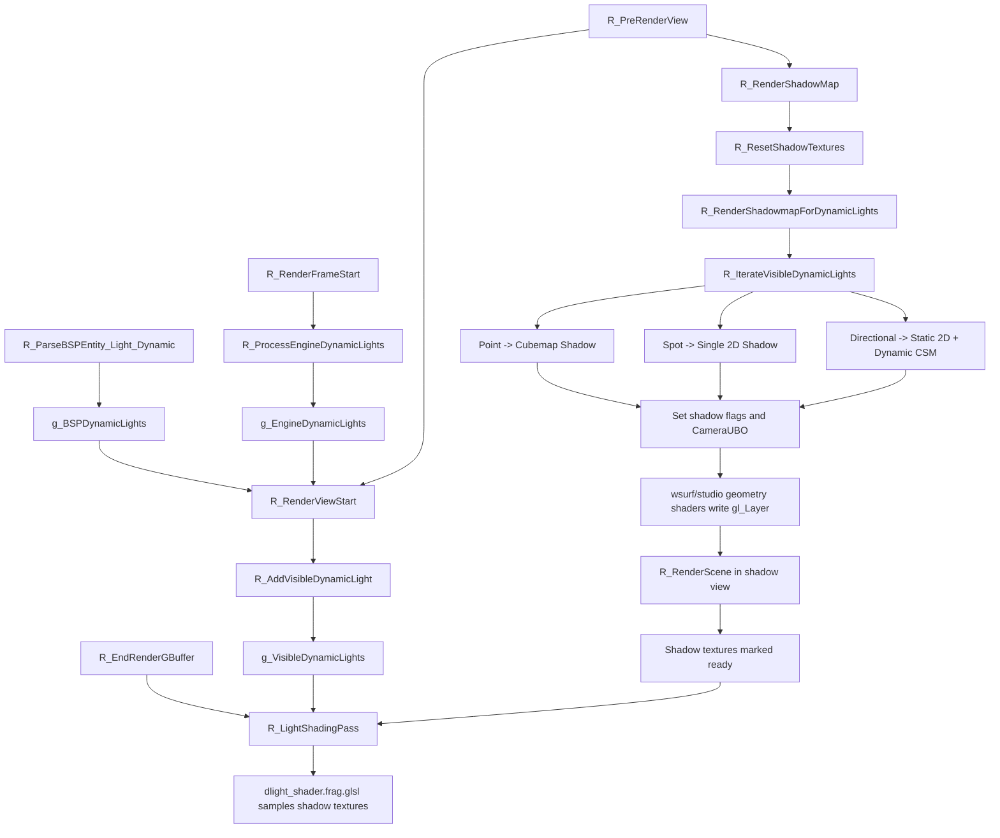

# ShadowMapping

## Overview
Renderer's dynamic-light Shadow Mapping system generates depth shadow textures for each visible dynamic light before the main scene's G-Buffer geometry stage, then samples them by light type during deferred lighting. The system normalizes engine `cl_dlights` and map `light_dynamic` entities into `CDynamicLight`, then handles point, spot, and directional lights through the same traversal callbacks.

## Responsibilities
- Maps engine and map dynamic lights consistently to `CDynamicLight`, retaining shadow sizes, CSM parameters, and shadow texture handles.
- Builds `g_VisibleDynamicLights` before each view, retaining only lights that participate in this frame's lighting and shadows.
- Allocates or reuses shadow textures by light type: cubemaps for point lights, single-layer 2D textures for spotlights, and static single-layer orthographic shadows plus dynamic CSM texture arrays for directional lights.
- Reuses `R_RenderScene()` to generate Shadow Maps through states such as `r_draw_shadowview`, `r_draw_multiview`, and `r_draw_lineardepth`, rather than maintaining a separate geometry pipeline.
- Binds shadow matrices, cascade distances, and depth textures to the dynamic-light shader in `R_LightShadingPass()` to apply shadow attenuation in deferred lighting.
- Uses the `IShadowTexture` hierarchy to manage texture size, viewport, ready state, shadow matrices, and CSM split distances.

## Involved Files & Symbols
- `Plugins/Renderer/gl_rmain.cpp` - `R_RenderFrameStart`, `R_PreRenderView`, `R_RenderViewStart`, `R_RenderScene`, `R_EndRenderOpaque`
- `Plugins/Renderer/gl_light.h` - `CDynamicLight`, `CVisibleDynamicLightEntry`
- `Plugins/Renderer/gl_light.cpp` - `R_ProcessEngineDynamicLights`, `R_AddVisibleDynamicLight`, `R_IterateVisibleDynamicLights`, `R_LightShadingPass`, `R_EndRenderGBuffer`, `g_EngineDynamicLights`, `g_BSPDynamicLights`, `g_VisibleDynamicLights`
- `Plugins/Renderer/gl_shadow.h` - `IShadowTexture`, `R_ShouldRenderShadow`, `R_RenderShadowMap`
- `Plugins/Renderer/gl_shadow.cpp` - `CBaseShadowTexture`, `CSingleShadowTexture`, `CCubemapShadowTexture`, `CCascadedShadowTexture`, `R_ShouldCastShadow`, `R_SetupShadowMatrix`, `R_RenderShadowmapForDynamicLights`, `R_ResetShadowTextures`
- `Plugins/Renderer/gl_wsurf.cpp` - `R_ParseBSPEntity_Light_Dynamic`, `R_DrawWorldSurfaceLeafShadow`, `R_DrawWorldSurfaceModelShadowProxy`
- `Plugins/Renderer/gl_studio.cpp` - `STUDIO_SHADOW_CASTER_ENABLED` branch in Shadow view
- `Build/svencoop/renderer/shader/common.h` - `CSM_LEVELS`, `CameraUBO.numViews`
- `Build/svencoop/renderer/shader/wsurf_shader.geom.glsl` - multiview output to `gl_Layer`
- `Build/svencoop/renderer/shader/studio_shader.geom.glsl` - multiview output to `gl_Layer`
- `Build/svencoop/renderer/shader/dlight_shader.frag.glsl` - `CalcShadowIntensityLinear`, `CalcCSMShadowIntensity`, `CalcCubemapShadowIntensity`

## Architecture
The per-frame Shadow Mapping workflow has three phases: light preparation → Shadow Map generation → deferred-lighting sampling.

1. `R_RenderFrameStart()` calls `R_ProcessEngineDynamicLights()`, converting `cl_dlights` into `g_EngineDynamicLights`. The engine flashlight is mapped to a spotlight with `dynamic_shadow_size = 256`; ordinary engine point lights do not enable shadows by default.
2. During map loading, `R_ParseBSPEntity_Light_Dynamic()` parses `light_dynamic` entities and writes parameters including `shadow`, `static_shadow_size`, `dynamic_shadow_size`, `csm_lambda`, and `csm_margin` into `g_BSPDynamicLights`.
3. `R_PreRenderView()` first calls `R_RenderViewStart()`, passes currently active lights from `g_BSPDynamicLights` and `g_EngineDynamicLights` to `R_AddVisibleDynamicLight()`, and forms `g_VisibleDynamicLights`.
4. `R_PreRenderView()` then calls `R_RenderShadowMap()`, which first executes `R_ResetShadowTextures()` and then traverses visible lights through `R_RenderShadowmapForDynamicLights()` to generate Shadow Maps.
5. The Shadow pass switches to `r_draw_shadowview` mode and enables `r_draw_multiview`, `r_draw_nofrustumcull`, and `r_draw_lineardepth` as needed. The geometry stage still reuses `R_RenderScene()`; `gl_wsurf.cpp` and `gl_studio.cpp` merely switch to shadow-caster shader variants in this mode.
6. After main-scene geometry rendering finishes, `R_EndRenderOpaque()` triggers `R_EndRenderGBuffer()`; it calls `R_LightShadingPass()`, traverses `g_VisibleDynamicLights` again, binds generated Shadow Textures to the dynamic-light shader, and completes shadowed deferred lighting.

Shadow Map details by light type:
- Point lights:
  - Static shadows use `CCubemapShadowTexture` and are generated only when `static_shadow_size > 0` and the texture is not ready, primarily for world geometry.
  - Dynamic shadows also use `CCubemapShadowTexture`, rendering 6 views at once with `CameraUBO.numViews = 6`; the geometry shader writes to the 6 cubemap faces through `gl_Layer`.
  - If a static shadow exists, the dynamic-shadow pass draws only opaque entities; otherwise, the dynamic pass draws both world geometry and entities.
- Spotlights:
  - Currently generate only dynamic single-layer 2D Shadow Maps, using `CSingleShadowTexture`.
  - The projection matrix converts `coneAngle * 2` to FOV, enables `r_draw_lineardepth`, and uses the linear-depth variant for shadow comparison.
- Directional lights:
  - Static shadows use `CSingleShadowTexture` with a single-layer orthographic projection and draw only world geometry.
  - Dynamic shadows use `CCascadedShadowTexture`, backed by a `size x size x 4` 2D texture array.
  - CSM splits are based on the main view near/far plane and FOV. The linear/logarithmic blend parameter `csm_lambda` calculates 4 splits, and `csm_margin` expands each cascade's orthographic bounding box.
  - The matrices for all 4 cascades are written to `CameraUBO` at once; `R_RenderScene()` is called only once, and the multiview geometry shader writes to the 4 layers of the texture array through `gl_Layer`.

Shadow Map integration with the lighting stage:
- `R_SetupShadowMatrix()` generates a shadow matrix in bias * projection * world form, allowing shaders to map world coordinates into shadow-texture space.
- `R_LightShadingPass()` enables different shader macros depending on whether textures are ready:
  - Point lights enable static/dynamic cubemap-shadow macros and may use PCF.
  - Spotlights enable the dynamic single-layer shadow macro and upload `u_dynamicShadowMatrix`.
  - Directional lights can enable both static single-layer shadow and dynamic CSM macros, uploading `u_staticShadowMatrix`, `u_csmMatrices`, and `u_csmDistances`.
- In `dlight_shader.frag.glsl`:
  - Point lights sample cubemap shadows through `CalcCubemapShadowIntensity()`.
  - Spotlights sample single-layer 2D shadows through `CalcShadowIntensityLinear()`.
  - Directional lights sample `sampler2DArrayShadow csmTex` through `CalcCSMShadowIntensity()` and take `min` between the static directional-light shadow and CSM result.

## Dependencies
- Renderer deferred-rendering chain: Shadow Map generation requires `R_CanRenderGBuffer()` to be true, so it depends on available deferred lighting / G-Buffer support.
- Shared view data: `CameraUBO` and `CSM_LEVELS` are defined in `Build/svencoop/renderer/shader/common.h` and shared by CPU and shader code.
- Geometry-shader multiview output: `wsurf_shader.geom.glsl` and `studio_shader.geom.glsl` use `CameraUBO.numViews` and `gl_Layer` to write one draw into cubemap faces or CSM array layers.
- Dynamic-light sources: engine `cl_dlights` are updated through `R_ProcessEngineDynamicLights()`; map `light_dynamic` is loaded through `R_ParseBSPEntity_Light_Dynamic()`.
- Shadow switches: the global switch is `r_shadow`; flashlight-shadow parameters also depend on the `r_flashlight_*` control variables.

## Notes
- `R_ShouldRenderShadow()` directly skips the entire Shadow Map generation stage in shadow view, water view, portal, dev overview, or when `r_shadow = 0`.
- `R_ResetShadowTextures()` marks only dynamic shadow textures of lights visible this frame as not ready; static shadow textures can be cached across frames and are rebuilt only on first generation or after a size change.
- Static shadow passes for point and directional lights choose `SetReady(true/false)` based on whether `c_brush_polys` is greater than 0, indicating whether static world geometry actually wrote to the shadow texture.
- A model bound to a light can be temporarily hidden through `source_entity_index` during the Shadow pass, preventing the light source from casting into its own Shadow Map.
- `R_ShouldCastShadow()` primarily constrains studio entities casting shadows; world surfaces do not use this decision, instead using a separate world-shadow drawing path or shadow proxy in `gl_wsurf.cpp`.
- Spotlights currently have no corresponding static single-layer shadow branch. Although later parameter structures permit a static-shadow pointer, generation and shading currently use only dynamic 2D shadows.
- The 4 directional-light CSM cascades currently use fixed `CSM_LEVELS = 4`, estimating orthographic size from the bounding frustum sphere radius to prioritize stability and avoid clipping.

## Callers (optional)
- `Plugins/Renderer/gl_rmain.cpp` - `R_RenderFrameStart` calls `R_ProcessEngineDynamicLights`
- `Plugins/Renderer/gl_rmain.cpp` - `R_PreRenderView` calls `R_RenderViewStart`, `R_RenderShadowMap`, and `R_RenderWaterPass` in order
- `Plugins/Renderer/gl_shadow.cpp` - `R_RenderShadowMap` calls `R_ResetShadowTextures` and `R_RenderShadowmapForDynamicLights`
- `Plugins/Renderer/gl_light.cpp` - `R_EndRenderGBuffer` calls `R_LightShadingPass`
