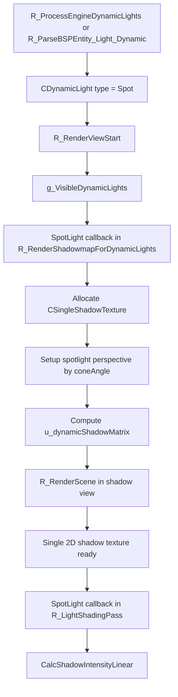

# SpotLightShadow

## Overview
SpotLightShadow handles single-layer 2D Shadow Map generation and deferred-lighting sampling for spotlights in Renderer. The current implementation focuses on dynamic shadows, covering both flashlights mapped from engine `cl_dlights` and spotlights defined by map `light_dynamic` entities.

## Responsibilities
- Consolidates flashlight or map-spotlight parameters into `CDynamicLight` fields: `distance`, `coneAngle`, `origin`, `angles`, and `dynamic_shadow_size`.
- Allocates or reuses a `CSingleShadowTexture` for each spotlight.
- Computes a perspective projection from `coneAngle` during the Shadow pass and generates a single-layer shadow matrix.
- Reuses `R_RenderScene()` through `r_draw_shadowview` and `r_draw_lineardepth` to generate the 2D depth shadow map.
- In `R_LightShadingPass()`, binds `dynamicShadowTex` and `u_dynamicShadowMatrix`, then uses the linear-depth shadow-compare variant to sample spotlight shadows.

## Involved Files & Symbols
- `Plugins/Renderer/gl_light.h` - `CDynamicLight`
- `Plugins/Renderer/gl_light.cpp` - `R_ProcessEngineDynamicLights`, `R_AddVisibleDynamicLight`, `R_IterateVisibleDynamicLights`, `R_LightShadingPass`
- `Plugins/Renderer/gl_shadow.cpp` - `CSingleShadowTexture`, `R_CreateSingleShadowTexture`, `R_SetupShadowMatrix`, `R_RenderShadowmapForDynamicLights`
- `Plugins/Renderer/gl_rmain.cpp` - `R_PreRenderView`, `R_RenderScene`
- `Plugins/Renderer/gl_studio.cpp` - `STUDIO_SHADOW_CASTER_ENABLED` branch in Shadow view
- `Plugins/Renderer/gl_wsurf.cpp` - world and entity geometry rendering branches in Shadow view
- `Build/svencoop/renderer/shader/dlight_shader.frag.glsl` - `CalcShadowIntensityLinear`

## Architecture
The spotlight-shadow workflow has three phases: light-parameter preparation → Shadow Map generation → deferred-lighting sampling.

1. `R_ProcessEngineDynamicLights()` maps the engine flashlight to `DynamicLightType_Spot`:
   - Calculates `distance` and `coneAngle` through `r_flashlight_distance` and `r_flashlight_cone_degree`.
   - Determines `origin` and `angles` from the first-person view, weapon attachment, entity angles, and collision trace.
   - Defaults to `dynamic_shadow_size = 256`, `static_shadow_size = 0`, and `shadow = 1`.
2. During map loading, `R_ParseBSPEntity_Light_Dynamic()` can also directly create `DynamicLightType_Spot` with `shadow` and `dynamic_shadow_size` parameters.
3. `R_RenderViewStart()` adds visible spotlights to `g_VisibleDynamicLights`.
4. The SpotLight callback in `R_RenderShadowmapForDynamicLights()` allocates `CSingleShadowTexture` when needed, then enables `r_draw_shadowview`, `r_draw_multiview`, and `r_draw_lineardepth`.
5. The CPU calculates the shadow-view FOV from `coneAngle * 2`, uses `R_SetupPerspective()` to establish the single-layer perspective projection, and then generates the shadow matrix for `u_dynamicShadowMatrix`.
6. The Shadow pass clears `DRAW_CLASSIFY_TRANS_ENTITIES`, `DRAW_CLASSIFY_PARTICLES`, `DRAW_CLASSIFY_DECAL`, and `DRAW_CLASSIFY_WATER`; spotlight shadows therefore cover only opaque world geometry and opaque entities.
7. In `R_LightShadingPass()`, if the spotlight shader finds `pDynamicShadowTexture->IsReady()`, it enables `DLIGHT_DYNAMIC_SHADOW_TEXTURE_ENABLED`, uploads the texture size and `u_dynamicShadowMatrix`, then performs the shadow comparison through `CalcShadowIntensityLinear()`.

Both spotlight lighting draw paths, volume and fullscreen, share the same Shadow Map:
- When `args->bVolume` is true, it draws cone geometry through `DrawConeSpotLight`.
- When `args->bVolume` is false, it uses the fullscreen-triangle path `DrawFullscreenSpotLight`.
- Both branches bind the same `dynamicShadowTex` and `u_dynamicShadowMatrix` in the shader.

## Dependencies
- `CDynamicLight` fields `distance`, `coneAngle`, `dynamic_shadow_size`, and `pDynamicShadowTexture`.
- Flashlight controls: `r_flashlight_distance`, `r_flashlight_min_distance`, `r_flashlight_cone_degree`, and `r_flashlight_*` lighting parameters.
- `CSingleShadowTexture` and its underlying `GL_GenShadowTexture`.
- `R_SetupPerspective()`, `R_SetupShadowMatrix()`, and the spotlight branch in the deferred-lighting shader.

## Notes
- Spotlights currently implement only dynamic single-layer shadows. Although the parameter structure contains `ppStaticShadowTexture`, the generation and shading paths do not actually use static spotlight shadows.
- Spotlight shadow comparison uses `CalcShadowIntensityLinear()`, unlike directional-light nonlinear projected sampling.
- In the local player's first-person view, the flashlight first tries the weapon attachment, then falls back to the view origin plus left/right-hand offsets.
- The flashlight first performs `PM_PlayerTrace`; if the distance is too short or the origin is inside an entity, it directly sets the dynamic light to `DynamicLightType_Unknown`, skipping both shadows and lighting.
- The spotlight Shadow pass hides the entity corresponding to `source_entity_index` to avoid self-shadowing artifacts.

## Callers (optional)
- `Plugins/Renderer/gl_light.cpp` - `R_ProcessEngineDynamicLights` creates flashlight `CDynamicLight` instances
- `Plugins/Renderer/gl_rmain.cpp` - `R_PreRenderView` calls `R_RenderShadowMap`
- `Plugins/Renderer/gl_shadow.cpp` - the SpotLight callback in `R_RenderShadowmapForDynamicLights` generates the 2D Shadow Map
- `Plugins/Renderer/gl_light.cpp` - the SpotLight callback in `R_LightShadingPass` samples the single-layer spotlight shadow
