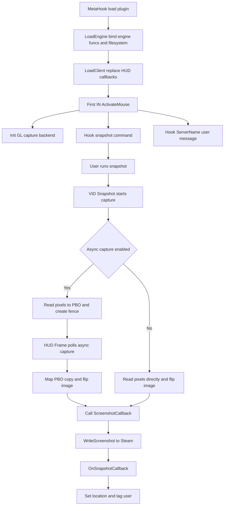

# SteamScreenshots

## Overview
`SteamScreenshots` is a screenshot-bridging plugin intended only for Sven Co-op. It intercepts the engine `snapshot` command, captures the current OpenGL framebuffer, and uploads it to the Steam screenshot manager through Steamworks `ISteamScreenshots`.

## Responsibilities
- Take over exported callbacks in `client.dll` during plugin loading: `HUD_Frame`, `HUD_Shutdown`, and `IN_ActivateMouse`.
- Initialize the screenshot subsystem upon first-frame mouse activation (`IN_ActivateMouse`) and install the `snapshot` command hook.
- Maintain server-name context (through the `ServerName` user message) and use it to annotate Steam screenshot metadata.
- Capture OpenGL pixels, choosing the synchronous path or the PBO+Fence asynchronous path based on capabilities.
- Submit captured data to `SteamScreenshots()->WriteScreenshot` and set the Location and user tag in the `ScreenshotReady_t` callback.

## Files Involved (Do Not Include Line Numbers)
- `Plugins/SteamScreenshots/plugins.cpp`
- `Plugins/SteamScreenshots/plugins.h`
- `Plugins/SteamScreenshots/exportfuncs.cpp`
- `Plugins/SteamScreenshots/exportfuncs.h`
- `Plugins/SteamScreenshots/gl_capture.h`
- `Plugins/SteamScreenshots/gl_catpure.cpp`
- `Plugins/SteamScreenshots/SteamScreenshots.vcxproj`
- `Build/svencoop/metahook/configs/plugins_svencoop.lst`

## Architecture
Core objects and modules:
- Plugin entry: `IPluginsV4` (takes over `Init/LoadEngine/LoadClient/HUD_*`).
- Screenshot management: `CSnapshotManager` (`STEAM_CALLBACK` handles `ScreenshotReady_t`).
- Capture backend: `gl_catpure.cpp` (global state + Sync/Async capture implementations).

Key workflow:

Additional notes:
- `HUD_Frame` calls `GL_QueryAsyncCapture` every frame and clears `g_szServerName` when not in a map (`levelname` is empty).
- `HUD_Shutdown` frees capture resources (PBO, Sync, ImageBuffer) before forwarding to the original `HUD_Shutdown`.

## Dependencies
- MetaHook API: `HookCmd`, `GetVideoMode`, and the plugin-export replacement mechanism.
- HLSDK/client interfaces: `cl_enginefunc_t`, `parsemsg` (`BEGIN_READ/READ_STRING`), and user-message hooks.
- OpenGL + GLEW: `glReadPixels`, `GL_PIXEL_PACK_BUFFER`, `glFenceSync/glClientWaitSync`.
- Steamworks: `steam_api.h`, `ISteamScreenshots`, `ScreenshotReady_t`, `SteamUser`.
- Build dependencies (vcxproj): `steam_api.lib` and GLEW-related libraries; the project is a Win32 DLL.
- Runtime configuration: loaded as `SteamScreenshots.dll` from `plugins_svencoop.lst`.

## Notes
- Command-hook installation is tied to the first `IN_ActivateMouse`; if that path does not run, the screenshot command is not taken over. The engine calls `IN_ActivateMouse` after registering the `snapshot` screenshot command.
- `ServerName` retains at most 255 bytes and depends on server messages; it is cleared at the main menu or when not in a map.
- Asynchronous capture requires OpenGL 3.2 + Sync API; otherwise it falls back to synchronous capture (which may cause momentary stalls).
- `ScreenshotCallback` and `OnSnapshotCallback` assume the Steam interface is available by default; the code has no explicit null-pointer protection.

## Callers (Optional)
- The MetaHook plugin loader instantiates the plugin and drives its lifecycle through `EXPOSE_SINGLE_INTERFACE(IPluginsV4, ...)`.
- Sven Co-op configuration `plugins_svencoop.lst` directly lists `SteamScreenshots.dll`.
- After `snapshot` is hooked, the engine command system calls `VID_Snapshot_f`.
- Engine message dispatch reaches `__MsgFunc_ServerName` through `HOOK_MESSAGE(ServerName)`.
- The client per-frame/shutdown paths drive asynchronous querying and resource cleanup through the replaced `HUD_Frame` and `HUD_Shutdown`.
