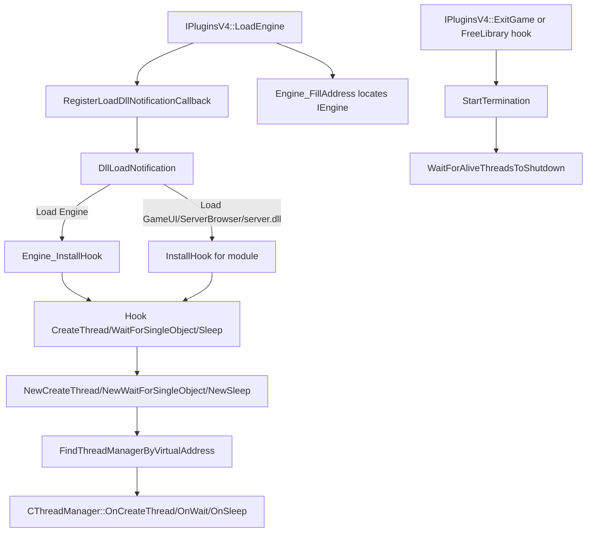

# ThreadGuard

## Overview
`ThreadGuard` is a MetaHook plugin that intercepts thread-related APIs (`CreateThread` / `WaitForSingleObject` / `Sleep`) in target modules and centrally waits for threads to terminate during shutdown, reducing the risk of crashes or prolonged hangs caused by background threads continuing after DLL unloading.

## Responsibilities
- Registers `DllLoadNotification` in `LoadEngine` and dynamically installs/uninstalls hooks for the engine and designated DLLs on load/unload.
- Creates a `CThreadManager` for each target module, records thread handles created by `CreateThread`, and maintains termination state.
- Short-circuits busy-wait paths during termination: returns immediate completion for `WaitForSingleObject(..., 0)` and calls `ExitThread(0)` for non-main threads using `Sleep(1)`.
- Calls `StartTermination + WaitForAliveThreadsToShutdown` in `ExitGame` or the `FreeLibrary` unload path to wait for tracked threads to exit.
- Hooks `_restart` through `EngineCommand_InstallHook`, executing `shutdownserver` before the original restart function to fix incomplete server cleanup during restart.

## Involved Files (No Line Numbers)
- `Plugins/ThreadGuard/plugins.cpp`
- `Plugins/ThreadGuard/plugins.h`
- `Plugins/ThreadGuard/privatehook.cpp`
- `Plugins/ThreadGuard/privatehook.h`
- `Plugins/ThreadGuard/ThreadManager.cpp`
- `Plugins/ThreadGuard/ThreadManager.h`
- `Plugins/ThreadGuard/exportfuncs.cpp`
- `Plugins/ThreadGuard/exportfuncs.h`
- `Plugins/ThreadGuard/ThreadGuard.vcxproj`

## Architecture
The core has three layers:
1. **Plugin lifecycle layer (`plugins.cpp`)**: initializes global interfaces, registers the DLL-notification callback, and initiates engine-thread convergence in `ExitGame`.
2. **Module routing layer (`privatehook.cpp`)**: chooses hooks to install into `Engine` / `GameUI.dll` / `ServerBrowser.dll` / `server.dll` based on DLL name/engine flags, and cleans up the matching `IThreadManager` on unload.
3. **Thread management layer (`ThreadManager.cpp`)**:
   - Uses `_ReturnAddress()` + `.text` range matching to attribute API calls to the `CThreadManager` for the correct module;
   - Tracks the thread-handle array (`m_hAliveThread`);
   - During termination, calls `WaitForMultipleObjects(..., INFINITE)` to wait for all threads to end, then `CloseHandle`.

Supplement: since issue #855 (2026-09-09) `Engine_FillAddress(void)` resolves `IEngine** engine` from gamedata (`ResolveGameSymbol(real base, "engine", MH_GAMESYMBOL_KIND_GLOBAL)`); the old `"Sys_InitArgv( OrigCmd )"` string anchor + disassembly scan is deleted. `GetEngineDLLState()` still dereferences the slot once to determine `DLL_CLOSE/DLL_RESTART`. See [[threadguard-privatevars]].

## Dependencies
- **MetaHook API**: `RegisterLoadDllNotificationCallback` / `IATHook` / `BlobIATHook` / `UnHook` / `HookCmd` / `FindCmd`, and the gamedata trio `ResolveGameSymbol` / `GetModuleCRC64` / `GetGameSymbolStatusString`.
- **Win32 threading and module APIs**: `CreateThread`, `DuplicateHandle`, `WaitForSingleObject`, `WaitForMultipleObjects`, `Sleep`, `ExitThread`, `CloseHandle`, `FreeLibrary`.
- **Engine interface**: `IEngine::GetState()` (`IEngine.h`) gates the termination phase.

## Notes
- The thread-handle pool is fixed at `MAXIMUM_WAIT_OBJECTS`; when full, it attempts to reclaim a signaled slot, and otherwise calls `SysError("Failed to insert thread to thread manager!")`.
- `WaitForSingleObject` is handled specially only when `dwMilliseconds == 0`; `Sleep` triggers “exit the thread immediately during termination” only for `Sleep(1)`, leaving other wait/sleep paths uncontrolled.
- Actual waiting for thread exit occurs only when `GetEngineDLLState()` is `DLL_CLOSE` or `DLL_RESTART`.
- `GameUI.dll` / `ServerBrowser.dll` skip thread hooks when they depend on `steam_api.dll` and do not import `CreateThread` (they are considered to use the callback model).
- `server.dll`-related hooks are enabled only under the `svencoop` directory (`ServerDLL_InstallHook` has an explicit gate).
- Since #855 `Engine_FillAddress` is gamedata-only: it resolves GLOBAL `engine` with the real module base and aborts with a specific `Failed to resolve "engine"` diagnostic (symbol / buildnum / CRC64 / status) instead of the old silent-null `Sys_Error("CEngine not found")`. Mirror-space conversion, section preparation and the unused no-argument `Engine_InstallHook` / `Engine_UninstallHook` declarations were removed.
- `ThreadManager.cpp` contains `#if 0`-disabled code related to the “closed thread” flow, indicating that only the alive-thread path is currently maintained.

## Callers (Optional)
- MetaHook plugin framework: drives `IPluginsV4::Init/LoadEngine/LoadClient/ExitGame/Shutdown`.
- The DLL-notification system registered in `LoadEngine`: calls `DllLoadNotification` at runtime to install/uninstall target-module hooks.
- `LoadClient`: calls `EngineCommand_InstallHook` to install the `_restart` command hook.
- `ExitGame`: calls `Engine_WaitForShutdown(g_pMetaHookAPI->GetEngineModule(), g_pMetaHookAPI->GetBlobEngineModule())`.
- Hooked `FreeLibrary` path: `NewFreeLibrary_Engine` / `NewFreeLibrary_GameUI` trigger the corresponding `*_WaitForShutdown` before module release.
