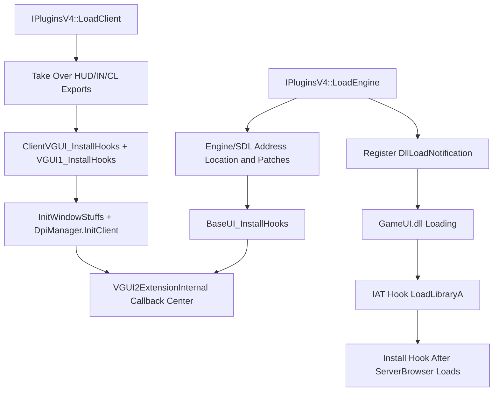

# VGUI2Extension

## Overview
`VGUI2Extension` is MetaHookSv's VGUI2 extension-framework plugin. At runtime, it takes over entry points such as `BaseUI/GameUI/ClientVGUI/KeyValues/GameConsole` and wraps original VGUI2 calls into registrable callback chains for UI extension, interception, and redirection by other plugins.

It also handles language forcing (`-forcelang` / `-steamlang`) and HiDPI support (`-high_dpi` / `-no_high_dpi`), and exports interfaces including `IVGUI2Extension`, `ISurface2`, `ISchemeManager2`, `IInput2`, and `IDpiManager`.

## Responsibilities
- Provide the `IVGUI2Extension` callback registry (sorted and dispatched by `GetAltitude()`).
- Install VGUI2-related hooks (vtable + inline + IAT) during `IPluginsV4::LoadEngine/LoadClient`.
- Track deferred loading of `GameUI.dll` / `ServerBrowser.dll` and install secondary hooks.
- Intercept `KeyValues_LoadFromFile` (GameUI/ClientUI/ServerBrowser) and expose a unified callback entry point.
- Proxy `ISurface` / `ISchemeManager` to incorporate font management, language settings, and scaling-conversion logic.
- Implement DPI detection, forced HD proportional mode, and `SKIN` search-path injection (`*_dpiNNN` / `*_hidpi`).
- Handle Win32/SDL IME events to improve Chinese/Japanese/Korean input and candidate-window behavior.

## Files Involved (Do Not Include Line Numbers)
- `Plugins/VGUI2Extension/plugins.cpp`
- `Plugins/VGUI2Extension/plugins.h`
- `Plugins/VGUI2Extension/VGUI2ExtensionInternal.cpp`
- `Plugins/VGUI2Extension/VGUI2ExtensionInternal.h`
- `Plugins/VGUI2Extension/BaseUI.cpp`
- `Plugins/VGUI2Extension/GameUI.cpp`
- `Plugins/VGUI2Extension/ClientVGUI.cpp`
- `Plugins/VGUI2Extension/VGUI1Hook.cpp`
- `Plugins/VGUI2Extension/exportfuncs.cpp`
- `Plugins/VGUI2Extension/exportfuncs.h`
- `Plugins/VGUI2Extension/privatefuncs.cpp`
- `Plugins/VGUI2Extension/privatefuncs.h`
- `Plugins/VGUI2Extension/DpiManagerInternal.cpp`
- `Plugins/VGUI2Extension/DpiManagerInternal.h`
- `Plugins/VGUI2Extension/SurfaceHook.cpp`
- `Plugins/VGUI2Extension/SchemeHook.cpp`
- `Plugins/VGUI2Extension/Scheme2.cpp`
- `Plugins/VGUI2Extension/Surface2.cpp`
- `Plugins/VGUI2Extension/InputWin32.cpp`
- `Plugins/VGUI2Extension/KeyValuesSystemHook.cpp`
- `Plugins/VGUI2Extension/FontManager.cpp`
- `Plugins/VGUI2Extension/Win32Font.cpp`
- `include/Interface/IVGUI2Extension.h`
- `docs/VGUI2Extension.md`

## Architecture
The core consists of three layers:
1. **Plugin lifecycle layer** (`plugins.cpp`)
   - `LoadEngine`: Read engine information, locate private symbols, patch `VGUIClient001` and language paths, install BaseUI hooks, initialize the DPI engine phase, and register DLL-load notifications.
   - `LoadClient`: Take over `cl_exportfuncs`, locate client private symbols, install `ClientVGUI/VGUI1`-related hooks, and initialize the window/DPI client phase.
2. **Callback-center layer** (`VGUI2ExtensionInternal.*`)
   - Maintains eight callback containers: `BaseUI/GameUI/GameUIOptionDialog/GameUITaskBar/GameUIBasePanel/GameConsole/ClientVGUI/KeyValues`.
   - Sorts registrations by `Altitude` from high to low; terminates subsequent plugins during dispatch when `Result >= HANDLED`.
3. **Concrete hook/proxy layer** (`BaseUI.cpp`, `GameUI.cpp`, `ClientVGUI.cpp`, `SurfaceHook.cpp`, `SchemeHook.cpp`, `VGUI1Hook.cpp`)
   - Proxy functions consistently use the two-stage `CallbackContext` invocation: pre-callback with `IsPost=false` -> original function (may be skipped) -> post-callback with `IsPost=true`.
   - `DllLoadNotification` + `NewLoadLibraryA_GameUI` handles deferred loading of `GameUI.dll/ServerBrowser.dll`.

The capabilities defined publicly in `IVGUI2Extension.h` generally correspond one-to-one with the implementation:
- The `Register*/Unregister*` family <-> eight vectors inside `CVGUI2Extension`.
- `GetBaseDirectory/GetCurrentLanguage` <-> `GetBaseDirectory()` and `GetCurrentGameLanguage()`.
- The semantics of `VGUI2Extension_Result` (`HANDLED/OVERRIDE/SUPERCEDE/...`) are used by proxy functions to determine whether to call the original function and post-callback plugins.

## Dependencies
- MetaHook API: `VFTHook/InlineHook/IATHook/InlinePatchRedirectBranch/DisasmRanges/SearchPattern`, and others.
- VGUI2/GoldSrc interfaces: `IBaseUI`, `IGameUI`, `IClientVGUI`, `ISurface`, `ISchemeManager`, `IKeyValuesSystem`.
- Runtime libraries and system components: `GameUI.dll`, `ServerBrowser.dll`, `vgui2.dll`, `sdl2.dll`, Win32 IME/User32.
- Text and fonts: collaboration among `FontManager/Win32Font/SurfaceHook/Scheme2`.
- Configuration and environment: command-line options (`-forcelang`, `-steamlang`, `-high_dpi`, `-no_high_dpi`, `-nomousespi`) and the Steam language registry.

## Notes
- `Engine_InstallHooks`/`Engine_UninstallHooks`, `Client_InstallHooks`/`Client_UninstallHooks`, and `EngineSurface_InstallHooks`/`EngineSurface_UninstallHooks` are currently empty implementations; the actual main logic resides on the BaseUI/GameUI/ClientVGUI/Surface/Scheme side.
- `g_bIsSvenCoop` is only declared and initialized to `false`; the current source does not show a branch that sets it to `true`.
- Callback containers provide neither deduplication nor locking; duplicate registration triggers duplicate callbacks, and concurrent thread registration/unregistration is not a design goal.
- Symbol location in many places relies on signature scanning and disassembly; game-version/binary-layout changes cause `Sig_NotFound`.

## Callers (Optional)
Plugins confirmed to obtain `VGUI2_EXTENSION_INTERFACE_VERSION` through `VGUI2ExtensionImport.cpp` and register callbacks:
- `Plugins/CaptionMod` (BaseUI/ClientVGUI/GameUI)
- `Plugins/BulletPhysics` (BaseUI/ClientVGUI/GameUI)
- `Plugins/Renderer` (BaseUI/GameUI)
- `Plugins/SCModelDownloader` (BaseUI/GameUI/TaskBar/KeyValues, and others)

Common calling pattern:
- `Register*Callbacks(...)` during initialization
- `Unregister*Callbacks(...)` on shutdown
- `VGUI2Extension()->GetCurrentLanguage()` when reading the language
