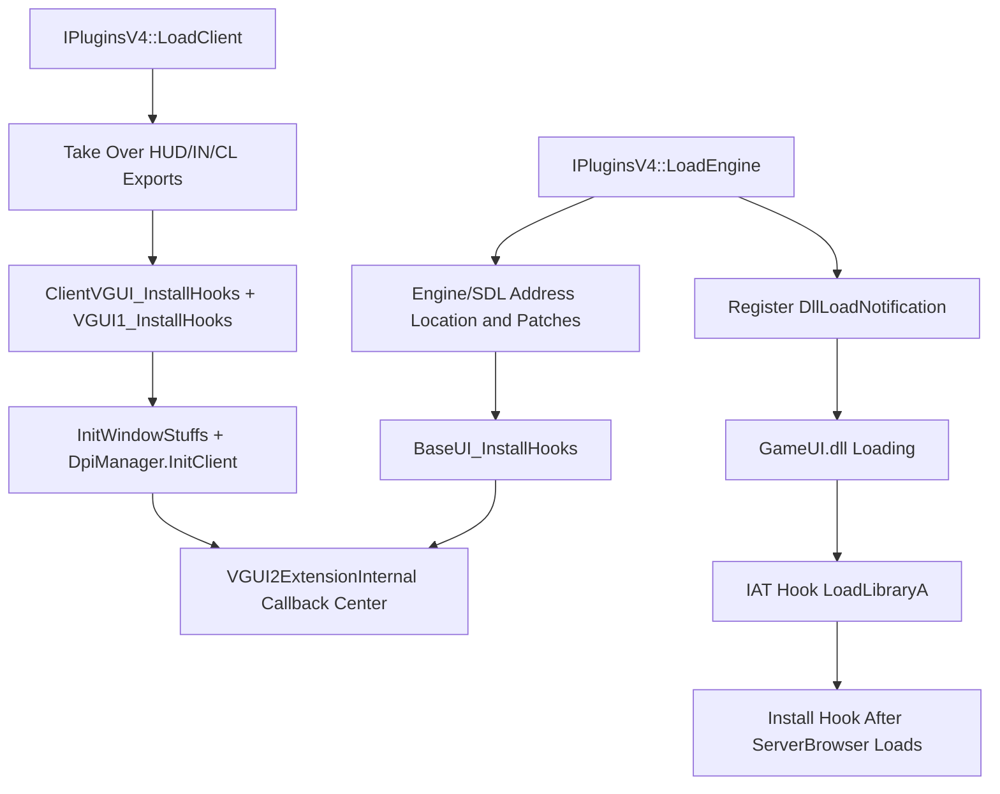

# VGUI2Extension

## Overview
`VGUI2Extension` is MetaHookSv's VGUI2 extension-framework plugin. At runtime, it takes over entry points such as `BaseUI/GameUI/ClientVGUI/KeyValues/GameConsole` and wraps original VGUI2 calls into registrable callback chains for UI extension, interception, and redirection by other plugins.

It also handles language forcing (`-forcelang` / `-steamlang`) and HiDPI support (`-high_dpi` / `-no_high_dpi`), and exports interfaces including `IVGUI2Extension`, `ISurface2`, `ISchemeManager2`, `IInput2`, and `IDpiManager`.

## Responsibilities
- Provide the `IVGUI2Extension` callback registry (sorted and dispatched by `GetAltitude()`).
- Install VGUI2-related hooks (vtable + inline + IAT) during `IPluginsV4::LoadEngine/LoadClient`.
- Track deferred loading of `GameUI.dll` / `ServerBrowser.dll` and install secondary hooks.
- Intercept `KeyValues_LoadFromFile` (GameUI/ClientUI/ServerBrowser) and expose a unified callback entry point.
- Proxy `ISurface` / `ISchemeManager` to incorporate font management, language settings, and scaling-conversion logic.
- Implement DPI detection, forced HD proportional mode, and `SKIN` search-path injection (`*_dpiNNN` / `*_hidpi`).
- Handle Win32/SDL IME events to improve Chinese/Japanese/Korean input and candidate-window behavior.

## Files Involved (Do Not Include Line Numbers)
- `Plugins/VGUI2Extension/plugins.cpp`
- `Plugins/VGUI2Extension/plugins.h`
- `Plugins/VGUI2Extension/VGUI2ExtensionInternal.cpp`
- `Plugins/VGUI2Extension/VGUI2ExtensionInternal.h`
- `Plugins/VGUI2Extension/BaseUI.cpp`
- `Plugins/VGUI2Extension/GameUI.cpp`
- `Plugins/VGUI2Extension/ClientVGUI.cpp`
- `Plugins/VGUI2Extension/VGUI1Hook.cpp`
- `Plugins/VGUI2Extension/exportfuncs.cpp`
- `Plugins/VGUI2Extension/exportfuncs.h`
- `Plugins/VGUI2Extension/privatefuncs.cpp`
- `Plugins/VGUI2Extension/privatefuncs.h`
- `Plugins/VGUI2Extension/DpiManagerInternal.cpp`
- `Plugins/VGUI2Extension/DpiManagerInternal.h`
- `Plugins/VGUI2Extension/SurfaceHook.cpp`
- `Plugins/VGUI2Extension/SchemeHook.cpp`
- `Plugins/VGUI2Extension/Scheme2.cpp`
- `Plugins/VGUI2Extension/Surface2.cpp`
- `Plugins/VGUI2Extension/InputWin32.cpp`
- `Plugins/VGUI2Extension/KeyValuesSystemHook.cpp`
- `Plugins/VGUI2Extension/FontManager.cpp`
- `Plugins/VGUI2Extension/Win32Font.cpp`
- `include/Interface/IVGUI2Extension.h`
- `docs/VGUI2Extension.md`

## Architecture
The core consists of three layers:
1. **Plugin lifecycle layer** (`plugins.cpp`)
   - `LoadEngine`: Read engine information, locate private symbols, patch `VGUIClient001` and language paths, install BaseUI hooks, initialize the DPI engine phase, and register DLL-load notifications.
   - `LoadClient`: Take over `cl_exportfuncs`, locate client private symbols, install `ClientVGUI/VGUI1`-related hooks, and initialize the window/DPI client phase.
2. **Callback-center layer** (`VGUI2ExtensionInternal.*`)
   - Maintains eight callback containers: `BaseUI/GameUI/GameUIOptionDialog/GameUITaskBar/GameUIBasePanel/GameConsole/ClientVGUI/KeyValues`.
   - Sorts registrations by `Altitude` from high to low; terminates subsequent plugins during dispatch when `Result >= HANDLED`.
3. **Concrete hook/proxy layer** (`BaseUI.cpp`, `GameUI.cpp`, `ClientVGUI.cpp`, `SurfaceHook.cpp`, `SchemeHook.cpp`, `VGUI1Hook.cpp`)
   - Proxy functions consistently use the two-stage `CallbackContext` invocation: pre-callback with `IsPost=false` -> original function (may be skipped) -> post-callback with `IsPost=true`.
   - `DllLoadNotification` + `NewLoadLibraryA_GameUI` handles deferred loading of `GameUI.dll/ServerBrowser.dll`.

```mermaid
flowchart TD
  A[IPluginsV4::LoadEngine] --> B[Engine/SDL Address Location and Patches]
  B --> C[BaseUI_InstallHooks]
  C --> D[VGUI2ExtensionInternal Callback Center]
  A --> E[Register DllLoadNotification]
  E --> F[GameUI.dll Loading]
  F --> G[IAT Hook LoadLibraryA]
  G --> H[Install Hook After ServerBrowser Loads]

  I[IPluginsV4::LoadClient] --> J[Take Over HUD/IN/CL Exports]
  J --> K[ClientVGUI_InstallHooks + VGUI1_InstallHooks]
  K --> L[InitWindowStuffs + DpiManager.InitClient]
  L --> D
```

The capabilities defined publicly in `IVGUI2Extension.h` generally correspond one-to-one with the implementation:
- The `Register*/Unregister*` family <-> eight vectors inside `CVGUI2Extension`.
- `GetBaseDirectory/GetCurrentLanguage` <-> `GetBaseDirectory()` and `GetCurrentGameLanguage()`.
- The semantics of `VGUI2Extension_Result` (`HANDLED/OVERRIDE/SUPERCEDE/...`) are used by proxy functions to determine whether to call the original function and post-callback plugins.

## Dependencies
- MetaHook API: `VFTHook/InlineHook/IATHook/InlinePatchRedirectBranch/DisasmRanges/SearchPattern/ResolveGameSymbol`, and others.
- VGUI2/GoldSrc interfaces: `IBaseUI`, `IGameUI`, `IClientVGUI`, `ISurface`, `ISchemeManager`, `IKeyValuesSystem`.
- Runtime libraries and system components: `GameUI.dll`, `ServerBrowser.dll`, `vgui2.dll`, `sdl2.dll`, Win32 IME/User32.
- Text and fonts: collaboration among `FontManager/Win32Font/SurfaceHook/Scheme2`.
- Configuration and environment: command-line options (`-forcelang`, `-steamlang`, `-high_dpi`, `-no_high_dpi`, `-nomousespi`) and the Steam language registry.

## Notes
- `Engine_InstallHooks`/`Engine_UninstallHooks` install/remove the legacy engine language registry hook. `Client_InstallHooks`/`Client_UninstallHooks` and `EngineSurface_InstallHooks`/`EngineSurface_UninstallHooks` remain empty; most UI logic resides on the BaseUI/GameUI/ClientVGUI/Surface/Scheme side.
- `g_bIsSvenCoop` is only declared and initialized to `false`; the current source does not show a branch that sets it to `true`.
- Callback containers provide neither deduplication nor locking; duplicate registration triggers duplicate callbacks, and concurrent thread registration/unregistration is not a design goal.
- Symbol location in many places relies on signature scanning and disassembly; game-version/binary-layout changes cause `Sig_NotFound`.
- The EngineSurface window/scissor globals (`pmainwindow`, `g_bScissor`, `g_ScissorRect`) come from the gamedata catalog since 2026-09-26, through the `GamedataResolvePtr` helper added to `plugins.h` (`static_assert(METAHOOK_API_VERSION >= 109)`; the helper is required-kind, so a missing record is fatal). This was the plugin's first gamedata dependency. The mirror-engine `EngineSurface::pushMakeCurrent` disassembly that used to locate them is gone, and the fields it fed were deleted with it: `gPrivateFuncs.enginesurface_pushMakeCurrent` (its only reader was the disasm root) and `index_enginesurface_pushMakeCurrent` (its only reader was the single `GetVFunctionFromVFTable` call — this plugin's `EngineSurface_InstallHooks` is a no-op, so nothing ever hooked slot 1). The two `engineSurface_vftable` locals existed only to feed that call and went with it; `EngineSurface_FillAddress` now just creates the surface and resolves the three globals. The dependency is pinned by the Renderer gate (`RENDERER_ENGINE_ALL_GLOBALS`): both plugins look symbols up by the loaded engine module's CRC64, and the gate pins these three names on all 11 identities, which is the catalog's complete set of engine CRC64 values.
- ClientVGUI's background-panel block (`CClientVGUIProxy::Start`) now resolves its panel member offset (`CounterStrikeViewport.m_pCSBackGround`) and the `Activate` vtable slot (`vgui2::Frame::Activate()`, read through `mh_gamesymbol_t::vfuncIndex`, API 115) from gamedata instead of a hardcoded `0x72C` plus a 159/160 disassembly sweep. Only the field offset the `Activate` body zeroes (no catalog record yet) and the CZDS WorldMap block still use disassembly. The shared index cache field and `VGUI2_IsFitToScreen` were deleted with it. Details in [[game-data]].
- The engine-side locators in `privatefuncs.cpp` that only fed engine globals now resolve them from the catalog too (2026-09-28): `cl_time`, `cl_oldtime`, `realtime`, `cl_viewentity`, `listener_origin`, `staticEngineSurface` and `host_parms`, all seven published on 11/11 engine identities, so `GamedataResolvePtr(RealDllInfo.ImageBase, ...)` is required-kind. The locators lost their now-unused `DllInfo` parameter; `privatefuncs.cpp` dropped from 1669 to 1331 lines. `host_parms` is used as a `quakeparms_t*` (`enginedef.h`) whose `basedir` sits at offset 0, which is what the catalog's plain-gv record denotes; `hostparam_basedir` is gone and `GetBaseDirectory()` reads `host_parms->basedir`. The callsite-shaped PATCH records are **not** covered well enough to migrate: `VGUIClient001_CreateInterface` exists on 5/11 identities and `V_strncpy`/`V_strncpy_FallbackGameDir` on 6/11 (the hl-3248/3266/3329/3647/4554 builds have none), so `Engine_PatchAddress_VGUIClient001` / `Engine_PatchAddress_LanguageStrncpy` keep scanning. The gate pins the seven globals via `VGUI2EXTENSION_ENGINE_GLOBALS`; `validate_vgui2extension` takes `include_engine`, false for the Counter-Strike client snapshots that publish no engine module. The same pass deleted the plugin's dead engine state: `scr_drawloading`, `rgpszrawsentence`, `cszrawsentences` (never assigned here; CaptionMod and Renderer resolve their own copies from gamedata), `SCR_IsLoadingVisible()` (whose only reader was that always-NULL `scr_drawloading`) and the never-assigned `gPrivateFuncs.SCR_BeginLoadingPlaque`. Details in [[game-data]].

- Legacy language override (2026-09-28): the catalog now exports the five-argument `Sys_GetRegKeyValueUnderRoot` FUNCTION for hl-3248/3266/3329/3647/4554. Its presence selects an InlineHook and bypasses `Engine_PatchAddress_LanguageStrncpy`; other engines retain that scan. `LanguageRegistry.h` calls the original trampoline with unchanged arguments first, then matches only the complete implicit-HKCU `Software\\Valve\\Steam` / `Language` pair, case-insensitively. Nonempty `-forcelang` overrides the returned buffer with bounded copying; otherwise the existing Steam registry language is preserved (these engines already read it without `-steamlang`). The effective, possibly truncated language is mirrored to `m_szCurrentGameLanguage`. HKLM, explicit HKCU prefixes (not stripped by this old ABI), other keys and values pass through. This supersedes the older note above that incomplete V_strncpy coverage requires keeping the scan on legacy engines: those engines have no English initialization copy; their English literal is only a comparison baseline. See the implementation/verification entry in [[game-data]].

- Engine `vgui2::Panel::Init` now comes from the catalog (2026-09-29): `Engine_FillAddress_PanelInit` resolves `vgui2::Panel::Init(int, int, int, int)` as an engine FUNCTION (11/11 engine identities) instead of running the shared `VGUI2_FindPanelInit` disassembly walk; its signature and `Engine_FillAddress` lost the now-unused `DllInfo` parameter. `VGUI2_FindPanelInit` / `VGUI2_IsPanelInit` stay because `GameUI.cpp` still uses them for GameUI.dll (gameui module) and ServerBrowser.dll (serverbrowser module) panel init — both modules now publish the same symbol on 11/11 identities, and CS shares the HL GameUI.dll / ServerBrowser.dll, so those two call sites are migratable later. The `gameui` / `serverbrowser` / `vgui2` modules were added to the catalog since the 2026-09-28 pass. The dependency is pinned by `VGUI2EXTENSION_ENGINE_FUNCTIONS`. See [[game-data]].

## Callers (Optional)
Plugins confirmed to obtain `VGUI2_EXTENSION_INTERFACE_VERSION` through `VGUI2ExtensionImport.cpp` and register callbacks:
- `Plugins/CaptionMod` (BaseUI/ClientVGUI/GameUI)
- `Plugins/BulletPhysics` (BaseUI/ClientVGUI/GameUI)
- `Plugins/Renderer` (BaseUI/GameUI)
- `Plugins/SCModelDownloader` (BaseUI/GameUI/TaskBar/KeyValues, and others)

Common calling pattern:
- `Register*Callbacks(...)` during initialization
- `Unregister*Callbacks(...)` on shutdown
- `VGUI2Extension()->GetCurrentLanguage()` when reading the language
