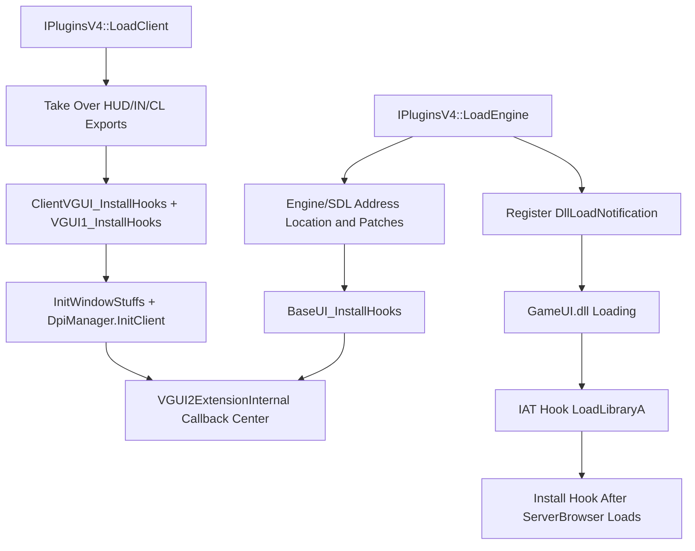

# VGUI2Extension

## Overview
`VGUI2Extension` is MetaHookSv's VGUI2 extension-framework plugin. At runtime, it takes over entry points such as `BaseUI/GameUI/ClientVGUI/KeyValues/GameConsole` and wraps original VGUI2 calls into registrable callback chains for UI extension, interception, and redirection by other plugins.

It also handles language forcing (`-forcelang` / `-steamlang`) and HiDPI support (`-high_dpi` / `-no_high_dpi`), and exports interfaces including `IVGUI2Extension`, `ISurface2`, `ISchemeManager2`, `IInput2`, and `IDpiManager`.

## Responsibilities
- Provide the `IVGUI2Extension` callback registry (sorted and dispatched by `GetAltitude()`).
- Install VGUI2-related hooks (vtable + inline + IAT) during `IPluginsV4::LoadEngine/LoadClient`.
- Track deferred loading of `GameUI.dll` / `ServerBrowser.dll` and install secondary hooks.
- Intercept `KeyValues_LoadFromFile` (GameUI/ClientUI/ServerBrowser) and expose a unified callback entry point.
- Proxy `ISurface` / `ISchemeManager` to incorporate font management, language settings, and scaling-conversion logic.
- Implement DPI detection, forced HD proportional mode, and `SKIN` search-path injection (`*_dpiNNN` / `*_hidpi`).
- Handle Win32/SDL IME events to improve Chinese/Japanese/Korean input and candidate-window behavior.

## Files Involved (Do Not Include Line Numbers)
- `Plugins/VGUI2Extension/plugins.cpp`
- `Plugins/VGUI2Extension/plugins.h`
- `Plugins/VGUI2Extension/VGUI2ExtensionInternal.cpp`
- `Plugins/VGUI2Extension/VGUI2ExtensionInternal.h`
- `Plugins/VGUI2Extension/BaseUI.cpp`
- `Plugins/VGUI2Extension/GameUI.cpp`
- `Plugins/VGUI2Extension/ClientVGUI.cpp`
- `Plugins/VGUI2Extension/VGUI1Hook.cpp`
- `Plugins/VGUI2Extension/exportfuncs.cpp`
- `Plugins/VGUI2Extension/exportfuncs.h`
- `Plugins/VGUI2Extension/privatefuncs.cpp`
- `Plugins/VGUI2Extension/privatefuncs.h`
- `Plugins/VGUI2Extension/DpiManagerInternal.cpp`
- `Plugins/VGUI2Extension/DpiManagerInternal.h`
- `Plugins/VGUI2Extension/SurfaceHook.cpp`
- `Plugins/VGUI2Extension/SchemeHook.cpp`
- `Plugins/VGUI2Extension/Scheme2.cpp`
- `Plugins/VGUI2Extension/Surface2.cpp`
- `Plugins/VGUI2Extension/InputWin32.cpp`
- `Plugins/VGUI2Extension/KeyValuesSystemHook.cpp`
- `Plugins/VGUI2Extension/FontManager.cpp`
- `Plugins/VGUI2Extension/Win32Font.cpp`
- `include/Interface/IVGUI2Extension.h`
- `docs/VGUI2Extension.md`

## Architecture
The core consists of three layers:
1. **Plugin lifecycle layer** (`plugins.cpp`)
   - `LoadEngine`: Read engine information, locate private symbols, patch `VGUIClient001` and language paths, install BaseUI hooks, initialize the DPI engine phase, and register DLL-load notifications.
   - `LoadClient`: Take over `cl_exportfuncs`, locate client private symbols, install `ClientVGUI/VGUI1`-related hooks, and initialize the window/DPI client phase.
2. **Callback-center layer** (`VGUI2ExtensionInternal.*`)
   - Maintains eight callback containers: `BaseUI/GameUI/GameUIOptionDialog/GameUITaskBar/GameUIBasePanel/GameConsole/ClientVGUI/KeyValues`.
   - Sorts registrations by `Altitude` from high to low; terminates subsequent plugins during dispatch when `Result >= HANDLED`.
3. **Concrete hook/proxy layer** (`BaseUI.cpp`, `GameUI.cpp`, `ClientVGUI.cpp`, `SurfaceHook.cpp`, `SchemeHook.cpp`, `VGUI1Hook.cpp`)
   - Proxy functions consistently use the two-stage `CallbackContext` invocation: pre-callback with `IsPost=false` -> original function (may be skipped) -> post-callback with `IsPost=true`.
   - `DllLoadNotification` + `NewLoadLibraryA_GameUI` handles deferred loading of `GameUI.dll/ServerBrowser.dll`.

```mermaid
flowchart TD
  A[IPluginsV4::LoadEngine] --> B[Engine/SDL Address Location and Patches]
  B --> C[BaseUI_InstallHooks]
  C --> D[VGUI2ExtensionInternal Callback Center]
  A --> E[Register DllLoadNotification]
  E --> F[GameUI.dll Loading]
  F --> G[IAT Hook LoadLibraryA]
  G --> H[Install Hook After ServerBrowser Loads]

  I[IPluginsV4::LoadClient] --> J[Take Over HUD/IN/CL Exports]
  J --> K[ClientVGUI_InstallHooks + VGUI1_InstallHooks]
  K --> L[InitWindowStuffs + DpiManager.InitClient]
  L --> D
```

The capabilities defined publicly in `IVGUI2Extension.h` generally correspond one-to-one with the implementation:
- The `Register*/Unregister*` family <-> eight vectors inside `CVGUI2Extension`.
- `GetBaseDirectory/GetCurrentLanguage` <-> `GetBaseDirectory()` and `GetCurrentGameLanguage()`.
- The semantics of `VGUI2Extension_Result` (`HANDLED/OVERRIDE/SUPERCEDE/...`) are used by proxy functions to determine whether to call the original function and post-callback plugins.

## Dependencies
- MetaHook API: `VFTHook/InlineHook/IATHook/InlinePatchRedirectBranch/DisasmRanges/SearchPattern/ResolveGameSymbol`, and others.
- VGUI2/GoldSrc interfaces: `IBaseUI`, `IGameUI`, `IClientVGUI`, `ISurface`, `ISchemeManager`, `IKeyValuesSystem`.
- Runtime libraries and system components: `GameUI.dll`, `ServerBrowser.dll`, `vgui2.dll`, `sdl2.dll`, Win32 IME/User32.
- Text and fonts: collaboration among `FontManager/Win32Font/SurfaceHook/Scheme2`.
- Configuration and environment: command-line options (`-forcelang`, `-steamlang`, `-high_dpi`, `-no_high_dpi`, `-nomousespi`) and the Steam language registry.

## Notes
- `Engine_InstallHooks`/`Engine_UninstallHooks` install/remove the legacy engine language registry hook. `Client_InstallHooks`/`Client_UninstallHooks` and `EngineSurface_InstallHooks`/`EngineSurface_UninstallHooks` remain empty; most UI logic resides on the BaseUI/GameUI/ClientVGUI/Surface/Scheme side.
- `g_bIsSvenCoop` is only declared and initialized to `false`; the current source does not show a branch that sets it to `true`.
- Callback containers provide neither deduplication nor locking; duplicate registration triggers duplicate callbacks, and concurrent thread registration/unregistration is not a design goal.
- Symbol location in many places relies on signature scanning and disassembly; game-version/binary-layout changes cause `Sig_NotFound`.
- The EngineSurface window/scissor globals (`pmainwindow`, `g_bScissor`, `g_ScissorRect`) come from the gamedata catalog since 2026-09-26, through the `GamedataResolvePtr` helper added to `plugins.h` (`static_assert(METAHOOK_API_VERSION >= 109)`; the helper is required-kind, so a missing record is fatal). This was the plugin's first gamedata dependency. The mirror-engine `EngineSurface::pushMakeCurrent` disassembly that used to locate them is gone, and the fields it fed were deleted with it: `gPrivateFuncs.enginesurface_pushMakeCurrent` (its only reader was the disasm root) and `index_enginesurface_pushMakeCurrent` (its only reader was the single `GetVFunctionFromVFTable` call — this plugin's `EngineSurface_InstallHooks` is a no-op, so nothing ever hooked slot 1). The two `engineSurface_vftable` locals existed only to feed that call and went with it; `EngineSurface_FillAddress` now just creates the surface and resolves the three globals. The dependency is pinned by the Renderer gate (`RENDERER_ENGINE_ALL_GLOBALS`): both plugins look symbols up by the loaded engine module's CRC64, and the gate pins these three names on all 11 identities, which is the catalog's complete set of engine CRC64 values.
- ClientVGUI's background-panel block (`CClientVGUIProxy::Start`) now resolves its panel member offset (`CounterStrikeViewport.m_pCSBackGround`) and the `Activate` vtable slot (`vgui2::Frame::Activate()`, read through `mh_gamesymbol_t::vfuncIndex`, API 115) from gamedata instead of a hardcoded `0x72C` plus a 159/160 disassembly sweep. Only the field offset the `Activate` body zeroes and the CZDS WorldMap block still used disassembly. The shared index cache field and `VGUI2_IsFitToScreen` were deleted with it. Details in [[game-data]]. **(Superseded 2026-09-30: the remaining field offset and the CZDS WorldMap block are migrated too — see the `ClientUIProxy_Start_FillAddress` entry below.)**
- The engine-side locators in `privatefuncs.cpp` that only fed engine globals now resolve them from the catalog too (2026-09-28): `cl_time`, `cl_oldtime`, `realtime`, `cl_viewentity`, `listener_origin`, `staticEngineSurface` and `host_parms`, all seven published on 11/11 engine identities, so `GamedataResolvePtr(RealDllInfo.ImageBase, ...)` is required-kind. The locators lost their now-unused `DllInfo` parameter; `privatefuncs.cpp` dropped from 1669 to 1331 lines. `host_parms` is used as a `quakeparms_t*` (`enginedef.h`) whose `basedir` sits at offset 0, which is what the catalog's plain-gv record denotes; `hostparam_basedir` is gone and `GetBaseDirectory()` reads `host_parms->basedir`. The initial assessment that partial PATCH coverage prevented migration was incorrect: older engines use a different factory/language path. See the factory migration and legacy language entries below. The gate pins the seven globals via `VGUI2EXTENSION_ENGINE_GLOBALS`; `validate_vgui2extension` takes `include_engine`, false for the Counter-Strike client snapshots that publish no engine module. The same pass deleted the plugin's dead engine state: `scr_drawloading`, `rgpszrawsentence`, `cszrawsentences` (never assigned here; CaptionMod and Renderer resolve their own copies from gamedata), `SCR_IsLoadingVisible()` (whose only reader was that always-NULL `scr_drawloading`) and the never-assigned `gPrivateFuncs.SCR_BeginLoadingPlaque`. Details in [[game-data]].

- Legacy language override (2026-09-28): the catalog now exports the five-argument `Sys_GetRegKeyValueUnderRoot` FUNCTION for hl-3248/3266/3329/3647/4554. Its presence selects an InlineHook and bypasses `Engine_PatchAddress_LanguageStrncpy`; other engines retain that scan. `LanguageRegistry.h` calls the original trampoline with unchanged arguments first, then matches only the complete implicit-HKCU `Software\\Valve\\Steam` / `Language` pair, case-insensitively. Nonempty `-forcelang` overrides the returned buffer with bounded copying; otherwise the existing Steam registry language is preserved (these engines already read it without `-steamlang`). The effective, possibly truncated language is mirrored to `m_szCurrentGameLanguage`. HKLM, explicit HKCU prefixes (not stripped by this old ABI), other keys and values pass through. This supersedes the older note above that incomplete V_strncpy coverage requires keeping the scan on legacy engines: those engines have no English initialization copy; their English literal is only a comparison baseline. See the implementation/verification entry in [[game-data]].

- Engine `vgui2::Panel::Init` now comes from the catalog (2026-09-29): `Engine_FillAddress_PanelInit` resolves `vgui2::Panel::Init(int, int, int, int)` as an engine FUNCTION (11/11 engine identities) instead of running the shared `VGUI2_FindPanelInit` disassembly walk; its signature and `Engine_FillAddress` lost the now-unused `DllInfo` parameter. `VGUI2_FindPanelInit` / `VGUI2_IsPanelInit` stayed at that point because `GameUI.cpp` still used them for GameUI.dll (gameui module) and ServerBrowser.dll (serverbrowser module) panel init — both modules now publish the same symbol on 11/11 identities, and CS shares the HL GameUI.dll / ServerBrowser.dll, so those two call sites were migratable later. The `gameui` / `serverbrowser` / `vgui2` modules were added to the catalog since the 2026-09-28 pass. The dependency is pinned by `VGUI2EXTENSION_ENGINE_FUNCTIONS`. See [[game-data]].

- `ClientUIProxy_Start_FillAddress` migration (2026-09-30): both remaining disassembly blocks are now catalog-backed. The CS background panel resolves `CounterStrikeViewport::CCSBackGroundPanel::Activate()` for the hook slot and `CounterStrikeViewport::CCSBackGroundPanel.m_offsetX` (`0x134`) for the field the handler zeroes, replacing the `VGUI2_IsCSBackGroundPanelActivate` body walk (`m_offsetY` is `0x138 = m_offsetX + 4`, which is why the old predicate took the minimum of its two candidates). The CZDS WorldMap block resolves `CZEROViewPort.m_pWorldMapPanel` (`0x7a8`), `CWorldMap::PaintBackground()` and `CWorldMapMissionSelect::PaintBackground()` (both vfunc slot 106), replacing the hardcoded `0x7A8`, the `for (105..106)` slot sweep and the two object-vtable reads. The original implementation hand-patched the `call [reg+disp]` inside each PaintBackground body (disassembly, because no call-site PATCH record exists); it was replaced the same day by the same flag + double-VFTHook shape as `CTeamMenu::LoadMapPage` / `RichText::SetText`: `ClientUIProxy_Start_FillAddress` VFTHooks `CWorldMap::PaintBackground` / `CWorldMapMissionSelect::PaintBackground` on the live panels (slot from `GamedataResolveVFuncIndex`, original captured into `gPrivateFuncs.CWorldMap*_PaintBackground`), and the handlers `CWorldMap_PaintBackground` / `CWorldMapMissionSelect_PaintBackground` raise `g_bIsPaintWorldMapBackground` (save/restore) around the original call. `Surface_InstallHooks` now VFTHooks `ISurface::GetScreenSize` / `ISurface_HL25::GetScreenSize` at vtable slot 32 (`kSurfaceVTableIndex_GetScreenSize`; `vgui2::ISurface::GetScreenSize` is published only as a slot-only `virtualFunction` declaration with no `func_rva`, so it is metadata-only and cannot be resolved through `GamedataResolve*`), and both proxies' `GetScreenSize` override the width to `tall * 640.0 / 480.0` while the flag is set. Enabling that hook exposed a latent bug: `m_pfnGetScreenSize` was declared `(int&, int&)` without the `void* pthis, int` prefix every other surface pointer uses, so the proxy would have called the original with the wrong register layout; it is now `(void* pthis, int, int&, int&)` and called as `m_pfnGetScreenSize(this, 0, wide, tall)`. Deleted as dead code in the earlier pass: `VGUI2_IsCSBackGroundPanelActivate`, `VGUI2_IsCWorldMapPaintBackground`, `gPrivateFuncs.{CCSBackGroundPanel_vftable, CWorldMap_vftable, CWorldMapMissionSelect_vftable}` and the never-assigned `CWorldMap_PaintBackground_vftable_index` / `CWorldMapMissionSelect_PaintBackground_vftable_index` fields (the `CWorldMap*_PaintBackground` pointers are back, now filled by the VFTHook). Gates: `VGUI2EXTENSION_BACKGROUND_PANEL_VIRTUAL_FUNCTIONS`, `VGUI2EXTENSION_CZDS_CLIENT_GAMES` / `_CZDS_STRUCT_MEMBERS` / `_CZDS_VIRTUAL_FUNCTIONS`; `vgui2::ISurface::GetScreenSize` is deliberately not gated. Validation: `python -m pytest scripts/tests -q` 172 passed / 2 skipped / 1105 subtests; Release and Debug Win32 builds succeeded; in-game WorldMap / background-panel paths not verified. See [[game-data]].

- GameUI.cpp A-tier migration (2026-09-29): three GameUI.dll dialog constructors and both remaining `vgui2::Panel::Init` call sites now resolve from the catalog. `GameUI_FillAddress_GameConsoleDialog` / `_CreateMultiplayerGameDialog` / `_COptionsDialog` each collapsed to one `GamedataResolvePtr(RealDllInfo.ImageBase, <payload symbolName>, FUNCTION)` line (`CGameConsoleDialog::CGameConsoleDialog()`, `CCreateMultiplayerGameDialog::CCreateMultiplayerGameDialog(vgui2::Panel*)`, `COptionsDialog::COptionsDialog(vgui2::Panel*)`), dropping `DllInfo`. `GameUI_Panel_Init` (gameui module) and `ServerBrowser_FillAddress_PanelInit` (serverbrowser module) resolve `vgui2::Panel::Init(int, int, int, int)`. All four string/`ReverseSearchFunctionBeginEx` locators are gone. `VGUI2_FindPanelInit` / `VGUI2_IsPanelInit` (~320 lines) became unused and were deleted (`privatefuncs.cpp` 832 → 510, declaration removed from `privatefuncs.h`), superseding the same-day note that kept them for these call sites. `VGUI2_FindKeyValueVFTable` / `VGUI2_FindMenuVFTable` are still used and stay. New gates `VGUI2EXTENSION_GAMEUI_FUNCTIONS` / `VGUI2EXTENSION_SERVERBROWSER_FUNCTIONS` pin the four gameui entries and `vgui2::Panel::Init` on all 11 engine identities. Validation: `python -m pytest scripts/tests -q` 166 passed / 2 skipped / 949 subtests; `scripts/validate-gamedata.py Build/svencoop/metahook/gamedata` passed (21 snapshots / 5 engine families); Release and Debug Win32 plugin builds succeeded. No game runtime test performed. The B-tier remainder (option-subpage ctors, PropertySheet/Menu/TextEntry/RichText/TaskBar/BasePanel/MessageBox vfuncs, the `offset_propertySheet` / `offset_ScrollBar` / `_activePage` member offsets, serverbrowser KeyValues and `SetSize` call-site patches) still needs upstream records; the option-subpage ctors and the CZero-only career-frame ctors were migrated on 2026-09-30, see the next item. See [[game-data]].
- GameUI.cpp B-tier migration (2026-09-30): all eight remaining GameUI.dll locators are catalog-backed after upstream PR #301 (`feat(gameui): add options and console private symbols (#298)`, merged 2026-09-29). `GameUI_FillAddress_CCareerProfileFrame` / `_CCareerMapFrame` / `_CCareerBotFrame` resolve `CCareerProfileFrame::CCareerProfileFrame(vgui2::Panel*)` / `CCareerMapFrame::*` / `CCareerBotFrame::*` (FUNCTION, published only by `cof-5936` and the nine `hl-*` identities) and keep the `g_bIsCZero` guard, because the resolve would be fatal on the Sven Co-op GameUI.dll that publishes no career frames; `_COptionsSubAudio`, `_COptionsSubVideo`, `_COptionsSubMultiplayer_ctor` resolve their `COptionsSub*::COptionsSub*(vgui2::Panel*)` ctors (11/11); `_ConsoleHistory` resolves `vgui2::RichText::OnThink()` (VIRTUAL_FUNCTION **published with a `func_rva`, so it is address-bearing**, unlike the slot-only `vgui2::ISurface::GetScreenSize`), deleting the whole `ConsoleHistory` string → vftable → slot `0x158/4` scan; `_RichText` resolves `vgui2::RichText::InsertString(char const*)` through `GamedataResolvePtrIfAvailable` and falls back to the required `CGameConsoleDialog::Print(char const*)`, deleting the `Unable to condump to ` `DisasmRanges`. `ApplyVidSettings` became `GamedataResolvePtrIfAvailable` `COptionsSubVideo::ApplyVidSettings(bool)` (10/11, absent on hl-10210) with a matching install guard. **hl-10210 was deliberately not "fixed" while migrating**: the catalog publishes only `COptionsSubVideo::OnApplyChanges()` there (vfunc slot 159), and the sub-page ctor wrapper already inline-hooks that same address via the object vtable, so installing the `COptionsSubVideo_ApplyVidSettings_HL25` wrapper on top would double-hook one address; that field and its wrapper were deleted instead (their only writer was the rewritten locator), leaving `GameUI_COptionsSubVideo_ApplyVidSettings` inactive on hl-10210 as before. Equivalence was recomputed against the real GameUI.dll binaries with capstone: condump callsite 5/5, ConsoleHistory vftable slot 86 → OnThink 4/4, career two-push anchors 9/9 inside the catalog function bodies, `#GameUI_Audio` / `#GameUI_Video` callsites inside `COptionsDialog::COptionsDialog` 4/4, `_setvideomode` anchor reachable from `ApplyVidSettings(bool)` (hl-8684/hl-4554/svencoop) and from `OnApplyChanges()` (hl-10210), and no function-separating padding between the `SpraypaintList` anchor and the multiplayer ctor. Gates: `VGUI2EXTENSION_GAMEUI_FUNCTIONS` grew to seven, plus new `_GAMEUI_VIRTUAL_FUNCTIONS`, `_GAMEUI_CAREER_GAMES` / `_GAMEUI_CAREER_FUNCTIONS`, `_GAMEUI_APPLYVIDSETTINGS_GAMES` / `_GAMEUI_APPLYVIDSETTINGS` and a "exactly one condump callee per identity" complementarity check (`_GAMEUI_RICHTEXT_CALLEES`). Validation: `python -m pytest scripts/tests -q` 177 passed / 2 skipped / 1397 subtests; `scripts/validate-gamedata.py` passed; Release and Debug Win32 builds exited 0. In-game options pages, career frames and the condump path were not verified. See [[game-data]].

- Client cursor-visibility migration (2026-09-29): both `g_iVisibleMouse` locators are gone. `Client_FillAddress_SCClient_VisibleMouse` (an 18-byte `Search_Pattern` over the client module, reached only when `pfnClientFactory("SCClientDLL001")` is non-null) and the ~140-line `Client_FillAddress_VisibleMouse` fallback (a `DisasmRanges` walk rooted at the client export `IN_Accumulate`, validating candidates with second `Search_Pattern` fill-zero probes) are replaced by a single `GamedataResolvePtrIfAvailable(RealDllInfo.ImageBase, "g_iVisibleMouse", MH_GAMESYMBOL_KIND_GLOBAL)`. The SCClient branch and its `SCClientDLL001` gate are deleted outright — that factory only ever selected the Sven path, and none of `g_bIsCounterStrike` / `g_bIsCZero` / `g_bIsCZDS` depended on it. `Client_FillAddress` lost its now-unused `DllInfo` parameter (caller in `plugins.cpp` passes `g_ClientDLLInfo` directly), and `g_MirrorClientDLLInfo` became write-only and was deleted with its initialization block in `LoadClient` (it was read only by the retired locators' `DllInfo`). The resolution stays `IfAvailable` because only the Sven Co-op snapshots publish the record today — GoldSrc_VibeSignatures issue #295 tracks CS/CZ/HL/CoF coverage (that project's `find-g_iVisibleMouse.py` from issue #281 is Sven-specific: anchored on `IN_MouseEvent`/`IN_Accumulate` plus the `TeamFortressViewport::UpdateCursorState` writer). On the other clients `g_iVisibleMouse` resolves null and the cursor adjustment in `exportfuncs.cpp` is skipped, matching the pre-migration behaviour only if the fallback had also failed there. The consumer gate `VGUI2EXTENSION_VISIBLE_MOUSE_GAMES` (`svencoop-10257`, `svencoop-8948`) pins the record on the publishing identities only. Validation: 129 gamedata contract tests passed (737 subtests), Release and Debug Win32 plugin builds succeeded; no game runtime test performed.

- Client factory migration (2026-09-29): `Engine_PatchAddress_VGUIClient001` now queries `VGUIClient001_CreateInterface` on `RealDllInfo.ImageBase` and resolves it as PATCH before preserving the original CALL target and redirecting to the existing wrapper. Only `SYMBOL_NOT_FOUND` selects the legacy `g_pClientFactory` GLOBAL path; other query errors are fatal. All string/pattern/reverse scans and mirror address conversions in this locator are removed. The PATCH denotes `Sys_GetFactory(hClientDLL)`, not the later `factory("VClientVGUI001", nullptr)` query, whose ABI differs. Windows hl-6153/8684/10210 and svencoop-8948/10257 require this PATCH in the VGUI2Extension gate; the remaining six configured engine identities require the callback global. Partial patch inventory reflects different engine implementations, not missing necessary symbols. Validation: 125 gamedata contract tests passed, packaged gamedata passed for 21 snapshots / 5 engine families, Release and Debug Win32 plugin builds succeeded (Debug reports LNK4075 for `/EDITANDCONTINUE` versus `/SAFESEH`); no game runtime test performed.

- Language copy migration (2026-09-29): `Engine_PatchAddress_LanguageStrncpy` now resolves both `FileSystem_SetGameDirectory_V_strncpy_callsite_0` and `FileSystem_AddFallbackGameDir_V_strncpy_callsite_0` as PATCH on the real engine module before redirecting either call to `NewV_strncpy`. The existing registry-reader early return remains for hl-3248/3266/3329/3647/4554. The six other configured Windows engine identities require both copy patches in the consumer gate; the old pattern/disassembly/jump-following locator is removed. `InlinePatchRedirectBranch` saves the original target for both direct CALL and import-indirect CALL, including deferred hook transactions. Raw PE inspection verified that each version's two sites share one target: cof-5936 `0x1e700f0`, hl-6153 `0x1e04ce0`, hl-8684 `0x1e07050`, svencoop-8948 `0x1e359e0`, svencoop-10257 `0x1e3b4f0`; hl-10210 shares IAT slot `0x102b2520`. Thus the existing shared `gPrivateFuncs.V_strncpy` remains appropriate. Validation: 127 gamedata contract tests passed, the packaged catalog passed for 21 snapshots / 5 engine families, Release and Debug Win32 builds succeeded. No game runtime test performed. This supersedes the earlier statements that newer engines retain the language-copy scan.

## Callers (Optional)
Plugins confirmed to obtain `VGUI2_EXTENSION_INTERFACE_VERSION` through `VGUI2ExtensionImport.cpp` and register callbacks:
- `Plugins/CaptionMod` (BaseUI/ClientVGUI/GameUI)
- `Plugins/BulletPhysics` (BaseUI/ClientVGUI/GameUI)
- `Plugins/Renderer` (BaseUI/GameUI)
- `Plugins/SCModelDownloader` (BaseUI/GameUI/TaskBar/KeyValues, and others)

Common calling pattern:
- `Register*Callbacks(...)` during initialization
- `Unregister*Callbacks(...)` on shutdown
- `VGUI2Extension()->GetCurrentLanguage()` when reading the language
