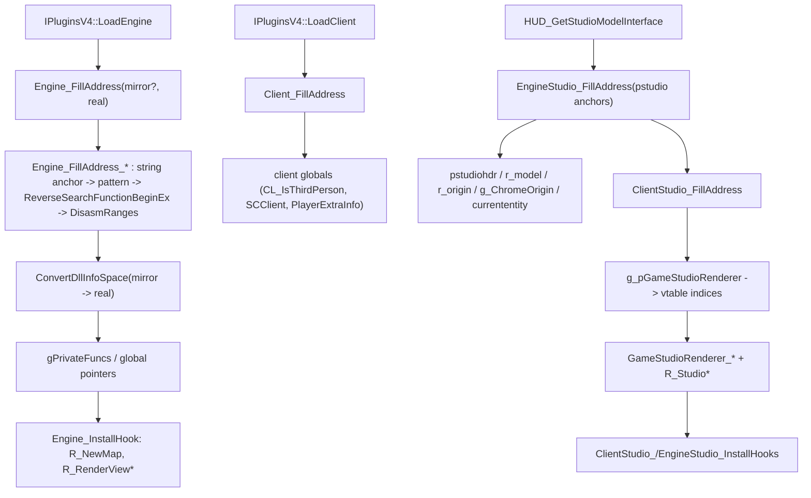

# Game-private symbols used by `BulletPhysics`

This document inventories the unexported engine (`hw.dll`) and client (`client.dll`) functions and global-variable slots that `Plugins/BulletPhysics` locates and consumes. Symbol names are the plugin's local `gPrivateFuncs.*` fields and global pointers; parenthetical names describe the inferred engine/client-side role rather than official debug-symbol names.

## Scope and shared resolution process
- The scope covers the engine render/view functions (`R_NewMap`, `R_RenderView`, `V_RenderView`, `R_CullBox`, `R_DrawTEntitiesOnList`), the engine/client Studio renderer functions and their vtable indices, and the engine/client global slots (`cl_max_edicts`, `cl_entities`, `cl_visedicts`, `mod_known`, `gTempEnts`, `allow_cheats`, `cl_frames`, `g_iUser1/2`, `g_pitchdrift`, `g_PlayerExtraInfo*`, and the Studio API data pointers).
- **gamedata-only (2026-09-12, issue #865).** Every engine/client private symbol is now resolved through `g_pMetaHookAPI->ResolveGameSymbol` (FUNCTION / GLOBAL / VIRTUAL_FUNCTION) or `QueryGameSymbolScalar` (size_of_frame). All signature scans, string/push patterns, `ReverseSearchFunctionBeginEx`, `DisasmRanges` control-flow walks, vtable-index derivation, `ConvertDllInfoSpace`, `GetVFunctionFromVFTable`, the mirror module images and the Capstone dependency were deleted. There is no scan fallback. `scripts/validate-gamedata.py` now carries a BulletPhysics consumer gate. The table entries below that describe the old scan mechanisms are historical; the gamedata inventory section at the end is authoritative.
- Public MetaHook APIs, saved engine interfaces, and ordinary plugin state (for example `g_EngineDLLInfo`, `g_MirrorEngineDLLInfo`, `g_ClientDLLInfo`, `g_iEngineType`, `g_dwEngineBuildnum`, `g_dwVideoMode`) are excluded. So are functions obtained from public interface tables (`gEngfuncs.*`, `pExportFuncs->*`, `pstudio->*`, `gEngfuncs.pEfxAPI->*`) even though they are stored in `gPrivateFuncs` — see the boundary section.
- **Module bases.** `Engine_FillAddress(g_EngineDLLInfo.ImageBase)` / `Client_FillAddress(g_ClientDLLInfo.ImageBase)` pass the real module base to `ResolveGameSymbol`; MetaHook derives the module CRC-64/XZ from the on-disk file (or a registered blob source) and returns `moduleBase + rva`. No mirror image or RVA remapping is involved.
- Most entry points are idempotent (`if (gPrivateFuncs.X) return;`) and share the scan strategy: string anchor in `.data`/`.rdata` -> build a `push <string>` / `call` pattern with the string VA patched into the immediate field -> `ReverseSearchFunctionBeginEx` to recover the function prologue -> `DisasmRanges` to extract the target operand. Per-engine-type `.text` signatures (`*_SIG_SVENGINE` / `_HL25` / `_NEW` / `_BLOB`) are the fallback when the string path fails.
- Missing results are reported via `Sig_NotFound` / `Sig_VarNotFound` / `Sig_FuncNotFound` -> `Sys_Error("Could not found: <name> ... buildnum")` (fatal). `ClientStudio_FillAddress` additionally requires at least one of `g_pGameStudioRenderer` / `R_StudioRenderModel`.
- `HUD_GetStudioModelInterface` is a second entry point (client export takeover): it copies the public `engine_studio_api_t`, installs the engine-studio `StudioCheckBBox` hook, then resolves the client `g_pGameStudioRenderer` global + its `GameStudioRenderer_*` virtual functions and installs those hooks. Engine-side render/view, engine Studio functions and Studio globals are already resolved at `LoadEngine`.
- **Failure policy for old builds.** The 6 upstream engine-only builds (hl-3248/3266/3329/3647/4554/6153) publish no client module, so the client-side symbols can never be resolved. The plugin fails loudly (`Sys_Error`) exactly as it would on any missing gamedata symbol; it does not silently skip hooks or fall back to scanning.

## Private functions

### Engine render / view
| Local symbol / inferred game symbol | Signature of field | Resolution mechanism | Subsequent use |
| --- | --- | --- | --- |
| `gPrivateFuncs.R_NewMap` (`R_NewMap`) | `void (*)(void)` | `Engine_FillAddress_R_NewMap`: anchor string `"Setting up renderer...\n"`; pattern `68 <str> E8`; `DisasmRanges(+0x50)` takes the first `E8` call target. Fallback: `R_NEWMAP_SIG_*` per engine type. | `Engine_InstallHook` -> `Install_InlineHook(R_NewMap)`; invoked by the engine. The plugin `R_NewMap` wrapper calls the original, then `ClientPhysicManager()->NewMap()`, `ClientEntityManager()->NewMap()`, `g_pViewPort->NewMap()`. No external plugin callers. |
| `gPrivateFuncs.R_RenderView` / `gPrivateFuncs.R_RenderView_SvEngine` | `void (*)(void)` / `void (*)(int viewIdx)` | `Engine_FillAddress_R_RenderView`: anchor string `"R_RenderView: NULL worldmodel"`; pattern `75 2A 68 <str>`; `ReverseSearchFunctionBeginEx(+0x100)` with predicate `D9 05` / `55 8B EC` / `83 EC`. Fallback: `R_RENDERVIEW_SIG_*`. The same disasm pass extracts the two data-slot candidates below. Only one of the two fields is populated, selected by engine type. | `Engine_InstallHook` hooks `R_RenderView` (or `R_RenderView_SvEngine` on SvEngine); wrappers skip the call while `g_bIsUpdatingRefdef`, otherwise call the original. No external plugin callers. |
| `gPrivateFuncs.V_RenderView` (`V_RenderView`) | `void (*)(void)` | `Engine_FillAddress_V_RenderView`: software mode uses string `"R_RenderView: called without enough stack"` + `68 <str> E8` + reverse search; hardware mode scans `.text` for `68 00 40 00 00 FF` (push mask; call), disassembles `+0x120` for the `call R_RenderView` target, then reverse-searches the prologue. Fallback: `V_RENDERVIEW_SIG_*`. | Forced view refresh during Sven third-person: `HUD_TempEntUpdate` sets `g_bIsUpdatingRefdef`, calls `CAM_Think()` + `V_RenderView()`; plugin wrapper calls the original. |
| `gPrivateFuncs.R_CullBox` (`R_CullBox`) | `qboolean (*)(vec3_t mins, vec3_t maxs)` | `Engine_FillAddress_R_CullBox`: purely per-engine-type `.text` signatures `R_CULLBOX_SIG_*` (no string anchor). | Plugin `R_CullBox` wrapper is called from `BasePhysicManager.cpp:678` (`StudioCheckBBox` visibility: `(*nVisible) = R_CullBox(aabbmins, aabbmaxs) ? 0 : 1`). Returns `false` when the pointer is null (software mode). |
| `gPrivateFuncs.R_DrawTEntitiesOnList` (`R_DrawTEntitiesOnList`) | `void (*)(int onlyClientDraw)` | `Engine_FillAddress_R_DrawTEntitiesOnList`: anchor string `"Non-sprite set to glow"`; pattern `68 <str> E8`; `ReverseSearchFunctionBeginEx(+0x500)` with predicate `D9 05` / `55 8B EC`. Fallback: `R_DRAWTENTITIESONLIST_SIG_*`. It is also the scan root for `cl_parsecount` / `cl_frames` / `size_of_frame`. | **Resolved but never called or hooked** (dead field in this plugin). |

### Engine Studio renderer
| Local symbol / inferred game symbol | Signature of field | Resolution mechanism | Subsequent use |
| --- | --- | --- | --- |
| `gPrivateFuncs.R_StudioDrawModel` | `int (*)(int flags)` | `ClientStudio_FillAddress_EngineStudioDrawPlayer`: take the real `(*ppinterface)->StudioDrawModel` thunk (skip a leading `E9` jmp), map to real space. | Hooked (`ClientStudio_InstallHooks`); wrapper runs the ragdoll-aware `StudioDrawModel_Template` then calls this original. |
| `gPrivateFuncs.R_StudioDrawPlayer` | `int (*)(int flags, entity_state_s* pplayer)` | Same function via `(*ppinterface)->StudioDrawPlayer`. | Hooked; wrapper runs `StudioDrawPlayer_Template` (Counter-Strike model redirect, ragdoll origin/weapon suppression) then calls this original. |
| `gPrivateFuncs.R_StudioSetupBones` | `void (*)(void)` | anchor string `"Bip01 Spine\0"`; pattern `68 <str> ?? E8`; `ReverseSearchFunctionBeginEx(+0x1000)` with two prologue predicates (`83 EC 48 A1 ... 33 C4` / `55 8B EC 83 EC`). | Hooked; `StudioSetupBones_Template` runs physics SetupBones/JiggleBones around the original. |
| `gPrivateFuncs.R_StudioMergeBones` | `void (*)(void)` | `ClientStudio_FillAddress_EngineStudioDrawPlayer`: pattern `83 B8 08 03 00 00 0C` inside the `StudioDrawModel` thunk (`+0x250`); `DisasmRanges(+0x80)`, first `E8` target. | **Resolved only** (no hook, no call). |
| `gPrivateFuncs.R_StudioSaveBones` | `void (*)(void)` | Same walk: second distinct `E8` target that differs from `R_StudioSetupBones`. | **Resolved only** (no hook, no call). |
| `gPrivateFuncs.R_StudioRenderModel` | `void (*)(void)` | Pattern `50 E8 ?? ?? ?? ?? 83 C4 10 E8 ?? ?? ?? ?? E8 ?? ?? ?? ?? 8B`; target = `GetCallAddress(addr + 9)`. | **Resolved only**; also doubles as the `ClientStudio_FillAddress` success gate (with `g_pGameStudioRenderer`). |
| `gPrivateFuncs.R_StudioRenderFinal` | `void (*)(void)` | `DisasmRanges(R_StudioRenderModel, +0x80)`: first `E8` (5-byte) call target. | **Resolved only**. |

### Client `CGameStudioRenderer` virtual table
`g_pGameStudioRenderer` is the client's singleton pointer; the plugin reads its vptr (`vftable = *(PVOID**)g_pGameStudioRenderer`) and resolves individual virtuals by index with `GetVFunctionFromVFTable`.

| Local symbol / inferred game symbol | Vtable index | Resolution mechanism | Subsequent use |
| --- | --- | --- | --- |
| `gPrivateFuncs.GameStudioRenderer_StudioDrawPlayer` (`__fastcall (pthis,int,int,entity_state_s*)`) | `_vftable_index`, default `3` | `ClientStudio_FillAddress_StudioDrawPlayer`: disasm client `StudioDrawPlayer` thunk `+0x200` for `CALL [reg+disp]` with `disp` `8..0x200` (`index = disp/4`), or `CALL imm` matching `vftable[i]` for `i` in `1..3`. | Hooked (`ClientStudio_InstallHooks`); wrapper -> `StudioDrawPlayer_Template` -> this original. |
| `gPrivateFuncs.GameStudioRenderer__StudioDrawPlayer` | `_vftable_index`, default `100/4` | Counter-Strike only: disasm `GameStudioRenderer_StudioDrawPlayer` `+0x100` for `CALL [reg+disp]` with `disp` `0x60..0x70`. | **Resolved only** (used as a deeper base for the vtable walk). |
| `gPrivateFuncs.GameStudioRenderer_StudioDrawModel` | `_vftable_index`, default `2` | `ClientStudio_FillAddress_StudioDrawModel`: same `CALL [reg+disp]`/`CALL imm`-vs-vtable scan (`+0x80`). | Hooked; wrapper -> `StudioDrawModel_Template` -> this original. |
| `gPrivateFuncs.GameStudioRenderer_StudioCalcAttachments` | `_vftable_index` | Bounded BFS over vtable entries `4..9` (`DisasmRanges`, `max_insts=1000`, `max_depth=16`); match on push of the string `"Too many attachments on %s\n"` or on member offsets `0xD4` / `0xD8`. | **Index anchor only**: drives `StudioSetupBones`/`StudioSaveBones`/`StudioMergeBones` indices (`-1` / `+1` / `+2`). |
| `gPrivateFuncs.GameStudioRenderer_StudioRenderModel` | `_vftable_index` | Walk from `StudioDrawPlayer`/`_StudioDrawPlayer` looking for the `CALL [reg+disp]` that follows the call to `IEngineStudio.StudioSetRemapColors` (`disp` `0x30..0x80`). | **Index anchor only** (and needed to find `StudioRenderFinal`). |
| `gPrivateFuncs.GameStudioRenderer_StudioRenderFinal` | `_vftable_index`, default `RenderModel_index + 1` | Disasm `StudioRenderModel` `+0x100` for `CALL [reg+disp]` near the `RenderModel` index. | **Resolved only** (index anchor). |
| `gPrivateFuncs.GameStudioRenderer_StudioSetupBones` / `_StudioSaveBones` / `_StudioMergeBones` | indices derived | `StudioCalcAttachments_index - 1` / `+ 1` / `+ 2`, resolved via `GetVFunctionFromVFTable`. | `StudioSetupBones` is **hooked**; `SaveBones` / `MergeBones` are **resolved only**. |

> On SvEngine client installs where `g_pGameStudioRenderer` is absent but the engine Studio renderer is present (`R_StudioRenderModel`), only the engine-side hooks are used.

## Private global variables

### Engine image
| Local symbol / inferred game object | Declaration location | Resolution mechanism | Subsequent use |
| --- | --- | --- | --- |
| `gTempEnts` (`TEMPENTITY *`, base of the engine temp-entity array) | `Plugins/BulletPhysics/privatehook.h` (extern), defined `privatehook.cpp` | `Engine_FillAddress_TempEntsVars`: per-engine signature embeds the pointer value in a `push imm32` (`GTEMPENTS_SIG_SVENGINE` / `_NEW`), read at `addr + 8`. | `ClientEntityManager.cpp:49,89,97` (temp-ent index lookup `&gTempEnts[entindex - ENTINDEX_TEMPENTITY]`); `EngineGetTempTentsBase()` / `EngineGetTempTentByIndex()`. |
| `cl_max_edicts` (`int *`) | `exportfuncs.h` (extern), defined `exportfuncs.cpp` | `Engine_FillAddress_CL_ReallocateDynamicData`: string `"CL_Reallocate cl_entities\n"` + push/call pattern + reverse search; `DisasmRanges(+0x150)` accepts `MOV reg,[abs]` followed by `83 C4 04` or `IMUL reg,reg,[abs],imm`. | `EngineGetMaxClientEdicts()`: `ClientEntityManager.cpp:62,72` (range checks), `exportfuncs.cpp:1873` edict loop. |
| `cl_entities` (`cl_entity_t **`) | `exportfuncs.h` (extern), defined `exportfuncs.cpp` | Same function: after the `CL_Reallocate` call, `MOV [abs], EAX`. | `EngineGetClientEntitiesBase()`: `ClientEntityManager.cpp:62` (range check), `:107` (pointer -> index). |
| `mod_known` (`model_t *`, base of the known-model array) | `privatehook.h` (extern), defined `privatehook.cpp` | `Engine_FillAddress_ModKnown`: pattern `B8 9D 82 97 53 81 E9`, pointer read at `addr + 7`. | `EngineGetModelIndex()` / `EngineGetModelByIndex()` / `EngineFindWorldModelBySubModel()` (used from `BasePhysicManager`). |
| `mod_numknown` (`int *`) | `privatehook.h` (extern), defined `privatehook.cpp` | `Engine_FillAddress_Mod_NumKnown`: string `"Cached models:\n"` + `57 68 <str> E8`; `DisasmRanges(+0x50)` accepts `MOV reg,[abs]` or `CMP [abs],reg` in `.data`. | `EngineGetNumKnownModel()` / `EngineGetMaxKnownModel()`: `BasePhysicManager.cpp:784,847,852,881,3251`. |
| `cl_parsecount` (`int *`) | `privatehook.h` (extern), defined `privatehook.cpp` | `Engine_FillAddress_R_DrawTEntitiesOnListVars`: disasm `R_DrawTEntitiesOnList`; find `MOV eax,[abs]` whose current value is `63` (`cl_parsemod`), then within `+3` instructions accept `MOV`/`AND reg,[abs]`. | `ClientEntityManager.cpp:262` (PVS delay check); via `R_GetPlayerState()` in `BaseRagdollObject.cpp:37`, `PhysicDebugGUI.cpp:765,770`. |
| `cl_frames` (`void *`, base of the `frame_t` ring) | `privatehook.h` (extern), defined `privatehook.cpp` | Same function, within `+20` of the `cl_parsemod` match: `LEA reg,[mem+disp]` with `disp` in `.data`. | Via `R_GetPlayerState()`: `cl_frames + size_of_frame * ((*cl_parsecount) & 63)` (same sites as `cl_parsecount`). |
| `size_of_frame` (`int`, `sizeof(frame_t)`) | `privatehook.h` (extern), defined `privatehook.cpp` | Same function, within `+5` of the `cl_parsemod` match: `IMUL reg,reg,imm` with `imm` in `0x4000..0xF000`. Defaults to `0x42B8` when `g_dwEngineBuildnum <= 8684`. | Frame stride in `R_GetPlayerState()` (same sites). |
| `cl_viewentity` (`int *`) | `privatehook.h` (extern), defined `privatehook.cpp` | `Engine_FillAddress_CL_ViewEntityVars`: SvEngine reads the pointer at `addr + 10` from `CL_VIEWENTITY_SIG_SVENGINE`; GoldSrc scans `A1 ???? 48 3B ?`, disassembles `+0x100` to confirm `CMP [abs],0x200`, then reads the pointer at `addr + 1`. | `CL_IsFirstPersonMode()` (`exportfuncs.cpp`); no consumers outside the resolution/handler files. |
| `allow_cheats` (`int *`) | `privatehook.h` (extern), defined `privatehook.cpp` | `Engine_FillAddress_CL_Set_ServerExtraInfo`: **SvEngine only**; uses MetaHook `FindCLParseFuncByName("svc_sendextrainfo")`, then `DisasmRanges(+0x100)` for `MOV [abs], EAX`. Non-SvEngine leaves it null. | `AllowCheats()` gates the `bv_*` debug commands and debug draw: `PhysicDebugGUI.cpp:357`; other engines use the `sv_cheats` cvar. |
| `cl_numvisedicts` (`int *`) | `exportfuncs.h` (extern), defined `exportfuncs.cpp` | `Engine_FillAddress_VisEdicts`: pattern `8B 0D ?? ?? ?? ?? 81 F9 00 02 00 00` (`mov ecx,[g]; cmp ecx,200h`), pointer read at `+2`. | `ClientEntityManager.cpp:421` visible-entity loop bound (`IsEntityInVisibleList`). |
| `cl_visedicts` (`cl_entity_t **`) | `exportfuncs.h` (extern), defined `exportfuncs.cpp` | Same function: `DisasmRanges(+0x150)` for `MOV [disp+ecx*4], reg` -> array base `disp`. | `ClientEntityManager.cpp:423` (`cl_visedicts[i] == ent` visible-list membership). |
| `r_worldentity` (`cl_entity_t *`) | `exportfuncs.h` (extern), defined `exportfuncs.cpp` | `Engine_FillAddress_R_RenderView`: taken from the first `CMP [abs],0` candidate and corrected by `- offsetof(cl_entity_t, model)`. | `BaseDynamicObject.cpp:79` / `BaseStaticObject.cpp:81` (skip world as dynamic/static), `BasePhysicManager.cpp:808` (world brush model creation), `BulletStaticRigidBody.cpp:54`. |
| `cl_worldmodel` (`model_t **`) | `exportfuncs.h` (extern), defined `exportfuncs.cpp` | Same function: second candidate from `MOV eax,[abs]` immediately followed by `85 C0`. | `BasePhysicManager.cpp:26,33` (world surface lookup), `:808` (world model), `:3123,3131` (BULLET_WORLD debug level), `:4492` (world-node index arrays). |

### Client image
| Local symbol / inferred game object | Declaration location | Resolution mechanism | Subsequent use |
| --- | --- | --- | --- |
| `g_pGameStudioRenderer` (`void *`, `CGameStudioRenderer` singleton) | `privatehook.h` (extern), defined `privatehook.cpp` | `ClientStudio_FillAddress_StudioDrawPlayer`: `DisasmRanges` the client `StudioDrawPlayer` thunk `+0x200` for `MOV ECX, imm` with `imm` in client `.data`. | Vtable base for all `GameStudioRenderer_*` resolutions (no other consumer). |
| `g_iUser1` / `g_iUser2` (`int *`) | `privatehook.h` (extern), defined `privatehook.cpp` | `Client_FillAddress_CL_IsThirdPerson`: anchor is the client's exported `CL_IsThirdPerson` (from `pExportFuncs` or `GetProcAddress`); `DisasmRanges(+0x100)` collects up to 16 `.data` candidates (`MOV reg,[abs]`, `CMP [abs],0`); the last two are accepted when adjacent (`diff == sizeof(int)`). | `V_CalcRefdef` spectator resolution (`(*g_iUser1)` observer mode, `(*g_iUser2)` target index, `exportfuncs.cpp:1979-1981`); additionally `BaseRagdollObject.cpp:432` (`if (g_iUser1 && !(*g_iUser1)) return false;`). |
| `g_ViewEntityIndex_SCClient` (`int *`) | `privatehook.h` (extern), defined `privatehook.cpp` | `Client_FillAddress_ViewEntityIndex`, only for `g_dwEngineBuildnum >= 10182`: pattern `FF 15 ?? ?? ?? ?? 85 C0 ?? 8B 00 ?? 05`; `DisasmRanges(+0x80)` for `CMP reg,[abs]`. | `BasePhysicManager.cpp:3554-3564,3633-3643,3726-3736`: zero/restore around `StudioDrawPlayer`/`StudioDrawModel` in the ragdoll bone-setup paths. |
| `g_bRenderingPortals_SCClient` (`bool *`) | `privatehook.h` (extern), defined `privatehook.cpp` | `Client_FillAddress_RenderingPortals`: pattern `6A 00 6A 00 6A 00 8B ?? FF 50 ??`; `DisasmRanges(+0x80)` for `MOV [abs], 1`. Resolved only when the `SCClientDLL001` factory exists. | `R_IsRenderingPortals()` -> `V_CalcRefdef` skips view sync during portal rendering (`exportfuncs.cpp:1967`); no consumers outside the handlers. |
| `g_pitchdrift` (`struct pitchdrift_t *`) | `privatehook.h` (extern), defined `privatehook.cpp` | `Client_FillAddress_Drift`: pattern `C7 05 ?? ?? ?? ?? 00 00 00 00 FF 15 ?? ?? ?? ?? 89`, pointer read at `addr + 2`. | Sven Co-op: save/restore pitch drift around the forced `CAM_Think()` + `V_RenderView()` in `HUD_TempEntUpdate`; no consumers outside the handlers. |
| `g_PlayerExtraInfo` (`extra_player_info_t (*)[65]`) / `g_PlayerExtraInfo_CZDS` (`extra_player_info_czds_t (*)[65]`) | `CounterStrike.cpp` (defined), `privatehook.h` (extern) | `Client_FillAddress_PlayerExtraInfo` (CS `cstrike` / `czero` / `czeror` only): scan `.text` for three consecutive `66 89 [disp+reg]` word stores, disasm `+0x100` to collect the four 16-bit `.data` candidates, sort, verify the `playerclass`/`teamnumber` adjacency, then subtract `offsetof(..., teamnumber)`. `czeror` uses the `_CZDS` layout. | `CounterStrike.cpp:48,50,58,60,63,65`: `CounterStrike_IsVIP()` / `CounterStrike_GetTeamNumber()`; Counter-Strike minimal-model and VIP logic. |

## Studio API data pointers (engine `.data` reached through the public `pstudio` table)

These are engine-private global slots, but the anchor is a public `engine_studio_api_t` member (whose body loads the slot) rather than a string/signature.

| Local symbol / inferred game object | Anchor + resolution | Subsequent use |
| --- | --- | --- |
| `currententity` (`cl_entity_t **`) | `EngineStudio_FillAddress_GetCurrentEntity`: `pstudio->GetCurrentEntity`; `DisasmRanges(+0x10)` for `MOV EAX,[abs]`. | Heavily used to save/set/restore the current entity around engine Studio calls: `BasePhysicManager.cpp` (build physics objects, `SetupBonesForRagdoll`/`Ex`, `UpdateBonesForRagdoll`, `ClientEntityManager.cpp:198` owner check); also `(*currententity)` in every Studio draw/bbox handler. |
| `r_model` (`model_t **`) | `EngineStudio_FillAddress_SetRenderModel`: `pstudio->SetRenderModel`; `DisasmRanges(+0x10)` for `MOV [abs], reg`. | **No consumer outside the resolution file** (engine current-render-model slot). |
| `pstudiohdr` (`studiohdr_t **`) | `EngineStudio_FillAddress_StudioSetHeader`: `pstudio->StudioSetHeader`; `DisasmRanges(+0x10)` for `MOV [abs], reg`. | `exportfuncs.cpp:250,494`: `(*pstudiohdr)` in `StudioSetupBones_Template` and `studioapi_StudioCheckBBox`; no consumers outside. |
| `r_origin` (`float *`) | `EngineStudio_FillAddress_SetChromeOrigin`: `pstudio->SetChromeOrigin`; `DisasmRanges(+0x50)`, `r_origin` from the lower of >=2 `FLD [abs]` / `MOV reg,[abs]` / `MOV reg,imm` candidates. | `EngineGetRendererViewOrigin()` -> `PhysicDebugGUI.cpp:375,377,381,397` (camera origin for debug picking/tracing). |
| `g_ChromeOrigin` (`float *`) | Same function: the lower of >=2 `MOV [abs],reg` / `MOVQ` / `FSTP [abs]` candidates. | **No consumer anywhere** (dead slot in this plugin). |
| `pbonetransform` / `plighttransform` (`float (*)[MAXSTUDIOBONES][3][4]`) | **Not scanned** — assigned from the public `pstudio->StudioGetBoneTransform()` / `StudioGetLightTransform()` in `HUD_GetStudioModelInterface`. | Bone/light matrices used by ragdoll physics: read/written across `BulletDynamicObject.cpp`, `BulletDynamicRigidBody.cpp`, `BulletRagdollObject.cpp`, `BulletRagdollRigidBody.cpp`, `BulletPhysicManager.cpp`. |

## Interface-derived function pointers (stored in `gPrivateFuncs`, but not game-private)

| Local symbol | Source | Use |
| --- | --- | --- |
| `gPrivateFuncs.studioapi_StudioCheckBBox` | `pstudio->StudioCheckBBox` (public `engine_studio_api_t`) | `EngineStudio_InstallHooks` inline-hooks it; the plugin handler consults physics bbox visibility then calls this original. |
| `gPrivateFuncs.efxapi_R_TempModel` | `gEngfuncs.pEfxAPI->R_TempModel` (public `cl_enginefunc_t`) | `HUD_Init` inline-hooks it when the `ClCorpse` message is hooked; the handler tags corpse temp-entities with `PhyCorpseFlag`. |

`IEngineStudio.SetupPlayerModel`, `IEngineStudio.StudioSetRemapColors`, `IEngineStudio.Mod_ForName`, and `IEngineStudio.StudioGetBoneTransform/LightTransform` are likewise public API used as anchors/sources, not private symbols.

## Hooks installed
| Target | Installed from | Kind |
| --- | --- | --- |
| `R_NewMap` | `Engine_InstallHook` | inline |
| `R_RenderView` (or `R_RenderView_SvEngine` on SvEngine) | `Engine_InstallHook` | inline |
| `GameStudioRenderer_StudioSetupBones` / `_StudioDrawPlayer` / `_StudioDrawModel` | `ClientStudio_InstallHooks` | inline |
| `R_StudioSetupBones` / `R_StudioDrawPlayer` / `R_StudioDrawModel` | `ClientStudio_InstallHooks` | inline |
| `studioapi_StudioCheckBBox` | `EngineStudio_InstallHooks` (from `HUD_GetStudioModelInterface`) | inline |
| `efxapi_R_TempModel` | `HUD_Init` | inline |

`Engine_UninstallHook` also calls `Uninstall_Hook(Mod_LoadStudioModel)`, but `g_phook_Mod_LoadStudioModel` is a static null never assigned (`Mod_LoadStudioModel` was removed from `private_funcs_t`), so it is a no-op. `Engine_UninstallHook` restores the two engine render hooks; `ClientStudio_UninstallHooks` / `EngineStudio_UninstallHooks` restore the Studio hooks.

## Architecture


## Dependencies
- `Plugins/BulletPhysics/plugins.cpp` — supplies the real + mirror engine/client `mh_dll_info_t`, copies `gEngfuncs`, calls `Engine_FillAddress` / `Client_FillAddress`, drives the VGUI2Extension lifecycle.
- `Plugins/BulletPhysics/privatehook.cpp` — engine + client resolution (`Engine_FillAddress`, `Client_FillAddress`), the global definitions, `ConvertDllInfoSpace`, `GetVFunctionFromVFTable`, hook install/uninstall.
- `Plugins/BulletPhysics/exportfuncs.cpp` — engine-studio + client-studio resolution (`EngineStudio_FillAddress`, `ClientStudio_FillAddress`), `HUD_GetStudioModelInterface` (the second resolution/hook entry), all handlers and accessors.
- MetaHook APIs `SearchPattern` / `SearchPatternNoWildCard`, `ReverseSearchFunctionBeginEx`, `DisasmRanges`, `GetNextCallAddr`, `InlineHook` / `UnHook`, `GetEngineBase/Size`, `GetMirrorEngineBase/Size`, `GetClientBase/Size`, `GetMirrorClientBase/Size`, `GetSectionByName`, `GetEngineType`, `GetEngineBuildnum`, `GetVideoMode`, `GetEngineFactory`, `GetClientFactory`, `GetClientModule`, `FindCLParseFuncByName`, `SysError`.
- Capstone `cs_insn` (`pinst->detail->x86.operands[...]`, `mem.base` / `mem.disp` / `mem.index` / `mem.scale`, `X86_INS_*`).
- Public `engine_studio_api_t`, `cl_enginefunc_t`, `r_studio_interface_t`, and `gEngfuncs.pfnGetGameDirectory()` (game-directory branch selection).

## Notes
- **gamedata validation surface.** Engine-update breakage now manifests as a gamedata validator failure at build/publish time (`scripts/validate-gamedata.py` BulletPhysics gate) or a clear `Sys_Error` at load, not as an opaque signature miss.
- **Resolved but not consumed elsewhere** (dead fields in this plugin): `R_DrawTEntitiesOnList`, `R_StudioRenderModel`, `R_StudioRenderFinal`, `R_StudioMergeBones`, `R_StudioSaveBones`, the client `GameStudioRenderer_StudioRenderModel` / `_StudioRenderFinal` / `_StudioCalcAttachments` / `__StudioDrawPlayer` virtuals (vtable-index anchors only), and the globals `g_ChromeOrigin` and `r_model`. Several engine studio functions are located because they anchor the vtable indices rather than because they are called.
- Glue consumed only inside `exportfuncs.cpp`/`privatehook.cpp` (no external plugin consumers): `cl_viewentity`, `cl_frames`, `size_of_frame`, `mod_known`, `mod_numknown`, `g_iUser2`, `g_pitchdrift`, `pstudiohdr`, `g_pGameStudioRenderer`, `g_bRenderingPortals_SCClient`.
- `R_RenderView` and `R_StudioDrawPlayer`/`R_StudioDrawModel` are resolved from **two different spaces**: the engine render hook targets the engine function, while the client `GameStudioRenderer_*` hook targets the client DLL's `CGameStudioRenderer` virtuals; both are installed so client- and engine-side renders are covered.
- The engine globals are addressed as **raw addresses or single-dereference pointers**, not gamedata slots: e.g. `cl_entities` / `cl_max_edicts` are pointer slots (`*ptr`), `mod_known` is the array base itself, and `cl_frames` is a byte base combined with `size_of_frame` and `(*cl_parsecount) & 63`.
- Sven Co-op-only symbols: `allow_cheats`, `g_bRenderingPortals_SCClient`, `g_ViewEntityIndex_SCClient`, `g_pitchdrift`; these are unresolved (left null) on GoldSrc, and the corresponding plugin paths are gated by `g_bIsSvenCoop` / engine type.
- Counter-Strike-only: `g_PlayerExtraInfo` / `g_PlayerExtraInfo_CZDS` (game-directory `cstrike` / `czero` / `czeror`), plus the CS branch that walks `GameStudioRenderer::_StudioDrawPlayer`.
- Layout assumptions are compile-time asserted in `privatehook.h`: `extra_player_info_t` (`0x74`), `extra_player_info_czds_t` (`0x1C`), `team_info_t` (`0x28`); `r_worldentity` uses `offsetof(cl_entity_t, model)`.
- The `bv_*` cvars/commands, Bullet3 world, and VGUI2Extension UI are plugin-owned and out of scope.

## Callers
- `IPluginsV4::LoadEngine` (`plugins.cpp`) calls `Engine_FillAddress` then `Engine_InstallHook`.
- `IPluginsV4::LoadClient` (`plugins.cpp`) calls `Client_FillAddress` then `Client_InstallHooks` (no-op).
- `HUD_GetStudioModelInterface` (`exportfuncs.cpp`) calls `EngineStudio_FillAddress` + `EngineStudio_InstallHooks`, then `ClientStudio_FillAddress` + `ClientStudio_InstallHooks`.
- `HUD_Init` installs the `efxapi_R_TempModel` hook; `Engine_UninstallHook` / `ClientStudio_UninstallHooks` / `EngineStudio_UninstallHooks` restore them.

Related: [[bulletphysics-plugin-overview]] [[private-symbols-disasm-workflow]] [[vgui2-extension]]


## gamedata inventory and consumer semantics (2026-09-12, issue #865)

All names below are the canonical gamedata symbol names; `module` and `kind` are the snapshot values.

### Engine module (`ResolveGameSymbol` with `g_EngineDLLInfo.ImageBase`)

| Symbol | Kind | Plugin field / type | Consumer |
| --- | --- | --- | --- |
| `R_NewMap` | function | `gPrivateFuncs.R_NewMap` | hooked (`R_NewMap` wrapper) |
| `R_RenderView` | function | `gPrivateFuncs.R_RenderView` / `R_RenderView_SvEngine` | hooked; SvEngine variant takes `int viewIdx` |
| `V_RenderView` | function | `gPrivateFuncs.V_RenderView` | forced refresh in `HUD_TempEntUpdate` |
| `R_CullBox` | function | `gPrivateFuncs.R_CullBox` | `BasePhysicManager` bbox visibility |
| `R_StudioDrawModel` / `R_StudioDrawPlayer` / `R_StudioSetupBones` | function | `gPrivateFuncs.R_Studio*` | hooked (engine Studio path) |
| `cl_max_edicts` | global | `int* cl_max_edicts` (`*ptr`) | edict range checks |
| `cl_entities` | global | `cl_entity_t** cl_entities` (`*ptr`) | entity base |
| `gTempEnts` | global | `TEMPENTITY* gTempEnts` (static array base) | temp-entity array |
| `cl_viewentity` | global | `int* cl_viewentity` (`*ptr`) | `CL_IsFirstPersonMode` |
| `mod_known` | global | `void* mod_known` (static array base) | model index lookups |
| `mod_numknown` | global | `int* mod_numknown` (`*ptr`) | known-model count |
| `cl_frames` | global | `void* cl_frames` (**frame_t ring base**) | `R_GetPlayerState` |
| `cl_parsecount` | global | `int* cl_parsecount` (`*ptr`) | `R_GetPlayerState` + messagenum |
| `cl_numvisedicts` / `cl_visedicts` | global | `int*` / `cl_entity_t**` | visible-entity list |
| `r_worldentity` | global | `cl_entity_t* r_worldentity` (object base) | world entity skip |
| `cl_worldmodel` | global | `model_t** cl_worldmodel` (`*ptr`) | world model |
| `currententity` / `pstudiohdr` / `r_origin` | global | `cl_entity_t**` / `studiohdr_t**` / `float*` | Studio handlers / debug draw |
| `allow_cheats` | global | `int* allow_cheats` (`*ptr`) | SvEngine-only `AllowCheats` |
| `size_of_frame` | scalar | `int size_of_frame` | frame stride; value consumed verbatim |

### Client module (`ResolveGameSymbol` with `g_ClientDLLInfo.ImageBase`)

| Symbol | Kind | Plugin field | Notes |
| --- | --- | --- | --- |
| `g_iUser1` / `g_iUser2` | global | `int*` (`*ptr`) | optional (null-guarded) |
| `g_bRenderingPortals_SCClient` / `g_ViewEntityIndex_SCClient` / `g_pitchdrift` | global | typed ptrs | Sven Co-op only; required there |
| `g_PlayerExtraInfo` | global | `extra_player_info_t(*)[65]` | cstrike / czero |
| `g_PlayerExtraInfo_CZDS` | global | `extra_player_info_czds_t(*)[65]` | czeror |
| `g_pGameStudioRenderer` | global | `void*` (renderer object address) | required; client Studio presence gate |
| `GameStudioRenderer_StudioDrawModel` / `_StudioDrawPlayer` / `_StudioSetupBones` | virtualFunction | `__fastcall` fn ptrs | hooked (client Studio path) |

### `cl_frames` semantics (critical)

Upstream `cl_frames` is the `frame_t` ring base: the snapshot locates it at the `Q_memset(cl_frames, 0, size_of_frame * count)` destination in `CL_ReallocateDynamicData` (e.g. hl-10210 `gv_inst_offset 0x6d`). The per-client `entity_state_t` array is `frame_t::playerstate` (offset 24 = `offsetof(frame_t, playerstate)`, defined in `Plugins/BulletPhysics/enginedef.h`). Therefore `R_GetPlayerState` must add that member offset explicitly:

```cpp
(char*)cl_frames + size_of_frame * ((*cl_parsecount) & 63) + offsetof(frame_t, playerstate) + sizeof(entity_state_t) * entindex
```

Do **not** treat `cl_frames` as the playerstate member base (or vice versa) — that is the "frame 首地址 vs 成员数组首地址" trap called out in the issue.

### Removed machinery

`#include <capstone.h>` and the Capstone include/check from the project, all `*_SIG_*` macros, `Search_Pattern*` macros, `GetCallAddress`, `ReverseSearchFunctionBeginEx` callers, `DisasmRanges` walks, `ConvertDllInfoSpace`, `GetVFunctionFromVFTable`, `walk_context_t`, mirror `mh_dll_info_t` fields, and the dead resolved-only fields (`R_DrawTEntitiesOnList`, `R_StudioRenderModel/RenderFinal/MergeBones/SaveBones`, the `GameStudioRenderer_*` dead virtuals and all `_vftable_index` anchors, `r_model`, `g_ChromeOrigin`, `g_iWaterLevel`, `R_RecursiveWorldNode`, `FirstPerson_f`, `ThreadPerson_f`).
