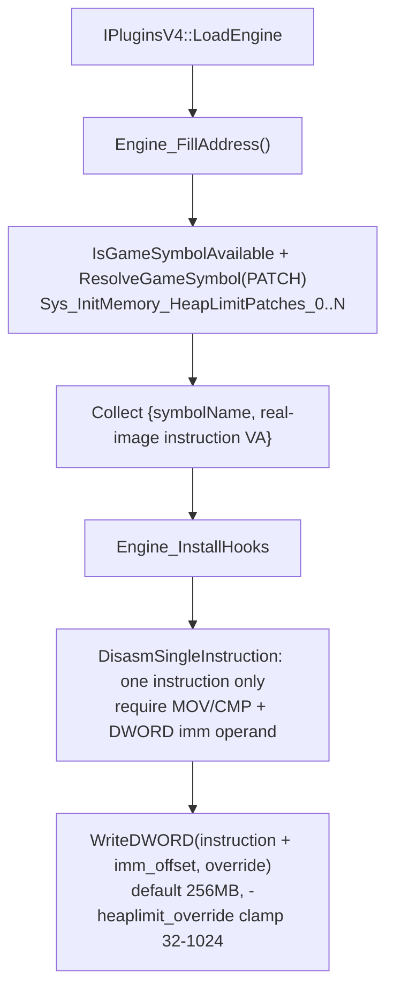

# Game-private symbols used by `HeapPatch`

This document inventories the unexported game instruction operands that `Plugins/HeapPatch` locates in the engine image and consumes. Since issue #853 the plugin resolves **no game-private function** — only numbered gamedata PATCH records, whose addresses are target instructions.

## Scope and shared resolution process
- The scope covers the heap-limit immediate operands inside `Sys_InitMemory`; the plugin does **not** locate or dereference any game-private global-variable slot, vtable, or exported interface beyond the public `cl_enginefunc_t` table.
- Public MetaHook APIs, saved engine interfaces, and ordinary plugin state (for example `g_EngineDLLInfo`, `g_iEngineType`, `g_dwEngineBuildnum`) are excluded.
- `IPluginsV4::LoadEngine` calls `Engine_FillAddress()` (no arguments); no mirror-image search space is built. The heap-limit patch set is enumerated as contiguous numbered PATCH symbols: build `Sys_InitMemory_HeapLimitPatches_<n>` from 0, probe each with `IsGameSymbolAvailable`, then resolve with `ResolveGameSymbol(..., MH_GAMESYMBOL_KIND_PATCH, ...)` against the real engine module base `g_EngineDLLInfo.ImageBase`. Index 0 is required; the first `SYMBOL_NOT_FOUND` after index 0 ends the enumeration, while any other status aborts. A resolution failure prints a diagnostic (symbol name, engine buildnum, module CRC64, status string) and terminates via `Sys_Error`, mirroring the launcher's `MH_LoadEngine_ResolveSymbol` semantics. There is no signature/string/reverse-search fallback.
- **Instruction address vs immediate address**: the PATCH `patch_rva` is the address of the target **instruction**, not of the immediate field. At write time the plugin disassembles exactly one instruction at that real-image address via `DisasmSingleInstruction` and takes `encoding.imm_offset` from the decode; the written address is `instructionAddress + imm_offset`. No fixed `+2` / `+6` offset, version table, or `patch_sig` parsing is used, and the signature is never searched or used to re-locate anything.
- The decode accepts only `MOV` / `CMP` with two operands where operand 2 is an immediate, `encoding.imm_size == sizeof(DWORD)`, and the immediate field lies inside the decoded instruction length. A decode failure or layout mismatch reports the PATCH symbol and instruction address and aborts without searching for an alternative site.
- Resolution (all PATCH symbols) completes in `Engine_FillAddress` before `Engine_InstallHooks` writes anything, and the decode/write check runs immediately adjacent to each `WriteDWORD`. A build-time `static_assert(METAHOOK_API_VERSION >= 110)` pins the required host API (`IsGameSymbolAvailable`).

## Private instruction operands (patch targets)
| Local state | Source and meaning | Use |
| --- | --- | --- |
| `g_Sys_InitMemory_HeapLimitPatches` (`std::vector<HeapLimitPatchSite>`) | `Engine_FillAddress` (`Plugins/HeapPatch/privatehook.cpp`) collects `{symbolName, instructionAddress}` for every `Sys_InitMemory_HeapLimitPatches_N` record. | `Engine_InstallHooks` decodes each instruction and overwrites its DWORD immediate with the override limit via `WriteDWORD`. |

## Applied override
- `Engine_InstallHooks` computes the new limit as 256 MB by default (the SvEngine and non-SvEngine branches currently hold the same value), then honors the command line `-heaplimit_override` read through the public `gEngfuncs.CheckParm`, clamped to the 32–1024 MB range, and writes it as bytes to the immediate of every collected patch. Every upstream-provided target is written; none is skipped.

## Architecture

## Dependencies
- `Plugins/HeapPatch/plugins.cpp` - provides the real engine base and invokes address filling and patch application.
- MetaHook APIs `ResolveGameSymbol`, `IsGameSymbolAvailable`, `GetModuleCRC64`, `GetGameSymbolStatusString` (gamedata, API 110), `DisasmSingleInstruction`, `WriteDWORD`, `SysError`, `GetEngineType`, `GetEngineBuildnum`, `GetEngineBase`.
- Public `cl_enginefunc_t` table (`CheckParm`) for the command-line override.
- Capstone `cs_insn` encoding fields (`imm_offset`, `imm_size`) inside the single-instruction callback.

## Notes
- The plugin installs **no inline hooks**: it neither detours `Sys_InitMemory` nor redirects any call site. `Engine_UninstallHooks` is an empty stub, so the immediate overwrites are never restored (harmless because the engine image is reloaded per process).
- `Sys_InitMemory` is **no longer resolved**: it was only the root of the removed control-flow walk. `private_funcs_t` / `gPrivateFuncs` are gone, along with `Sys_InitMemory_SearchContext`, the walk bounds (`max_insts` / `max_depth` / branch queue), `IsHeapLimitImmediate`, the 32 / 40 / 128 / 512 MB immediate constants, `ConvertDllInfoSpace`, and the mirror-image preparation.
- Immediate encoding offsets observed in the packaged data are 1 (`B8+r` / `3D`), 2 (`81 /7 id`), 3 (`C7 /0 ib id` with disp8), and 6 (`C7 /0 id` / `81 /7 id` with disp32); the plugin handles them generically through `encoding.imm_offset`.
- Data baseline (2026-09-09, issue #853): 43 `Sys_InitMemory_HeapLimitPatches_*` PATCH records across the 10 declared Windows versions (svencoop-10257 ×5, cof-5936 ×6, hl-3248/3266/3329/3647/4554/6153/8684/10210 ×4 each). Every record was statically verified to decode as `MOV`/`CMP` with a DWORD operand-2 immediate holding one of `0x2000000` / `0x2800000` / `0x8000000` / `0x20000000`; the counts are not hard-coded in the plugin.
- `scripts/validate-gamedata.py` gates the `Sys_InitMemory_HeapLimitPatches` set through `NUMBERED_PATCH_SETS` (kind `patch`, contiguous from 0) for every declared engine family; `Sys_InitMemory` itself is no longer in `COMMON_REQUIRED` because nothing consumes it.
- Migration history: gamedata-only function entry since 2026-09-07 (issue #848) — the `"Available memory less than"` string search, `push; call` pattern matching, and `ReverseSearchFunctionBeginEx` were removed then; the intra-function immediate operands still used a bounded walk. Issue #853 (2026-09-09) replaced that walk with gamedata PATCH records plus single-instruction decoding.

## Callers
- `IPluginsV4::LoadEngine` (`Plugins/HeapPatch/plugins.cpp`) calls `Engine_FillAddress` and then `Engine_InstallHooks`.
- `IPluginsV4::ExitGame` calls `Engine_UninstallHooks` (no-op).
