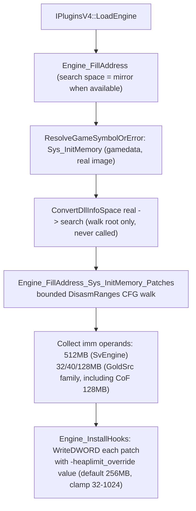

# Game-private symbols used by `HeapPatch`

This document inventories the unexported game functions and intra-function instruction operands that `Plugins/HeapPatch` locates in the engine image and consumes. Symbol names are the plugin's local `gPrivateFuncs` fields; the parenthetical names describe the inferred engine-side role rather than official debug-symbol names.

## Scope and shared resolution process
- The scope covers one game-private function (`Sys_InitMemory`) plus the immediate-operand encodings inside its body; the plugin does **not** locate or dereference any game-private global-variable slot, vtable, or exported interface beyond the public `cl_enginefunc_t` table.
- Public MetaHook APIs, saved engine interfaces, and ordinary plugin state (for example `g_EngineDLLInfo`, `g_MirrorEngineDLLInfo`, `g_iEngineType`, `g_dwEngineBuildnum`) are excluded.
- `IPluginsV4::LoadEngine` builds section info for the loaded engine image and, where available, a mirror image. The function entry is resolved **gamedata-only** through `ResolveGameSymbolOrError` (MetaHook API 109 `ResolveGameSymbol` against the real engine module base `g_EngineDLLInfo.ImageBase`); a resolution failure prints a diagnostic (symbol name, engine buildnum, module CRC64, status string) and terminates via `Sys_Error`, mirroring the launcher's `MH_LoadEngine_ResolveSymbol` semantics. There is no signature/string/reverse-search fallback.
- The bounded capstone walk that discovers heap-limit immediates still runs in the search space (mirror copy when one exists); the walk root is mapped from the real-image VA via `ConvertDllInfoSpace(realVA, RealDllInfo, SearchDllInfo)`, and patch addresses are mapped back to the real image before `WriteDWORD`. The walk is functional core (the gamedata model cannot express intra-instruction operand addresses), not a fallback.
- A missing function entry or a walk that yields zero immediates is fatal. Patches are applied only after both resolution routines return. A build-time `static_assert(METAHOOK_API_VERSION >= 109)` pins the required host API.

## Private functions
| Local symbol / inferred game symbol | Declaration location | Resolution mechanism | Subsequent use |
| --- | --- | --- | --- |
| `gPrivateFuncs.Sys_InitMemory` (`Sys_InitMemory`) | `Plugins/HeapPatch/privatehook.h` (`private_funcs_t`) | `ResolveGameSymbolOrError("Sys_InitMemory")` (gamedata-only, real-image VA). Mapped into the search space as the root of `Engine_FillAddress_Sys_InitMemory_Patches`. | The function pointer is never called or hooked; it serves only as the root of the bounded disassembly that collects heap-limit immediates inside the function body. |

## Private instruction operands (patch targets)
| Local state | Source and meaning | Use |
| --- | --- | --- |
| `g_Sys_InitMemory_Patches` (`std::set<PVOID>`) | `Engine_FillAddress_Sys_InitMemory_Patches` (`Plugins/HeapPatch/privatehook.cpp`) walks a bounded capstone control-flow traversal (start window 0x1000, 1,000-instruction cap, depth 16, following immediate `jmp`/`jcc` and stopping at `jmp`/`int3`/`ret`) rooted at `Sys_InitMemory` mapped into the search space. It records the real-image address of the immediate encoding (`address + encoding.imm_offset`) of every `mov`/`cmp` whose second operand is a heap-limit IMM from `IsHeapLimitImmediate`: `0x20000000` (512 MB) for `ENGINE_SVENGINE`; otherwise `0x2000000` (32 MB, blob 3248-4554), `0x2800000` (40 MB), and `0x8000000` (128 MB, GoldSrc 6153+ / HL25 / Cry of Fear). Values are taken from `GoldSrc_VibeSignatures` `bin_artifacts` function bodies, **not** gated on `buildnum >= 6153` — cof-5936 (build 5936) ships both 40 MB and 128 MB. An empty set is fatal (`Sys_Error("Sys_InitMemory imm not found")`). | `Engine_InstallHooks` overwrites each collected operand with the override limit via `WriteDWORD`. |

## Applied override
- `Engine_InstallHooks` computes the new limit as 256 MB by default (the SvEngine and non-SvEngine branches currently hold the same value), then honors the command line `-heaplimit_override` read through the public `gEngfuncs.CheckParm`, clamped to the 32–1024 MB range, and writes it as bytes to every address in `g_Sys_InitMemory_Patches`.

## Architecture

## Dependencies
- `Plugins/HeapPatch/plugins.cpp` - provides engine/mirror image metadata and invokes address filling and patch application.
- `Plugins/HeapPatch/enginedef.h` - carries engine-side struct redeclarations (`sfx_t`, `sfxcache_t`, `channel_t`) for compilation; these types are not dereferenced at any private address in the current code.
- MetaHook APIs `ResolveGameSymbol`, `GetModuleCRC64`, `GetGameSymbolStatusString` (gamedata, API 109), `DisasmRanges`, `WriteDWORD`, `SysError`, `GetEngineType`, `GetEngineBuildnum`, `GetEngineBase`, `GetEngineSize`, `GetMirrorEngineBase`, `GetMirrorEngineSize`, `GetSectionByName`.
- Public `cl_enginefunc_t` table (`CheckParm`) for the command-line override.

## Notes
- The plugin installs **no inline hooks**: it neither detours `Sys_InitMemory` nor redirects any call site. `Engine_UninstallHooks` is an empty stub, so the immediate overwrites are never restored (harmless because the engine image is reloaded per process).
- The four leftover prologue signature macros `SYS_INITMEMORY_SIG_HL25` / `_8308` / `_NEW` / `_BLOB` were removed from `Plugins/HeapPatch/privatehook.cpp` on 2026-09-06; they had no remaining references in the plugin.
- Migration status (2026-09-07): gamedata-only via `ResolveGameSymbol`. All legacy locators were removed: `"Available memory less than"` string search, `push; call` pattern matching, and `ReverseSearchFunctionBeginEx`. `scripts/validate-gamedata.py` `COMMON_REQUIRED` now gates `Sys_InitMemory` for every declared engine family. svencoop-10257 windows RVA: `0xbc390`. The intra-function immediate operands remain a bounded walk — same role as `ResourceReplacer`'s `FS_Open` call sites.
- Heap-limit immediate families (2026-09-07, scanned from `GoldSrc_VibeSignatures` `bin_artifacts` / `bin`): SvEngine 512MB ×5; hl-10210 / hl-8684 / hl-6153 40MB + 128MB; blob 3248-4554 32MB + 40MB; cof-5936 40MB ×1 + 128MB ×5. 14MB (`0x0e00000`, `MINIMUM_WIN_MEMORY`) is present but not patched.

## Callers
- `IPluginsV4::LoadEngine` (`Plugins/HeapPatch/plugins.cpp`) calls `Engine_FillAddress` (search space first, real image second) and then `Engine_InstallHooks`.
- `IPluginsV4::ExitGame` calls `Engine_UninstallHooks` (no-op).
