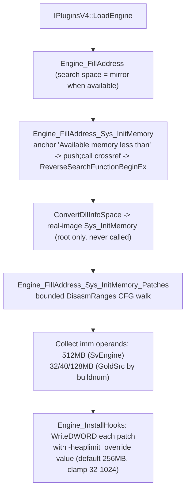

# Game-private symbols used by `HeapPatch`

This document inventories the unexported game functions and intra-function instruction operands that `Plugins/HeapPatch` locates in the engine image and consumes. Symbol names are the plugin's local `gPrivateFuncs` fields; the parenthetical names describe the inferred engine-side role rather than official debug-symbol names.

## Scope and shared resolution process
- The scope covers one game-private function (`Sys_InitMemory`) plus the immediate-operand encodings inside its body; the plugin does **not** locate or dereference any game-private global-variable slot, vtable, or exported interface beyond the public `cl_enginefunc_t` table.
- Public MetaHook APIs, saved engine interfaces, and ordinary plugin state (for example `g_EngineDLLInfo`, `g_MirrorEngineDLLInfo`, `g_iEngineType`, `g_dwEngineBuildnum`) are excluded.
- `IPluginsV4::LoadEngine` builds section info for the loaded engine image and, where available, a mirror image. Resolution runs in the search space (mirror copy preferred), and every recovered address is mapped back to the real image through the local `ConvertDllInfoSpace` helper (`Plugins/HeapPatch/privatehook.cpp`) before being stored or patched.
- This plugin is **not yet gamedata-backed**: neither `gamedata/` nor `scripts/validate-gamedata.py` contains `Sys_InitMemory`, so location still uses the legacy string-anchor plus cross-reference plus reverse-entry scan (`SearchPattern` / `ReverseSearchFunctionBeginEx`), unlike the launcher and `ResourceReplacer` which resolve through MetaHook API 109 `ResolveGameSymbol`.
- A missing function entry or a walk that yields zero immediates terminates via the `Sig_FuncNotFound` / `Sys_Error` macro chain (`Plugins/HeapPatch/plugins.h`), printing the engine buildnum; patches are applied only after both resolution routines return.

## Private functions
| Local symbol / inferred game symbol | Declaration location | Resolution mechanism | Subsequent use |
| --- | --- | --- | --- |
| `gPrivateFuncs.Sys_InitMemory` (`Sys_InitMemory`) | `Plugins/HeapPatch/privatehook.h` (`private_funcs_t`) | `Engine_FillAddress_Sys_InitMemory` (`Plugins/HeapPatch/privatehook.cpp`): finds the string `"Available memory less than"` in `.data`/`.rdata`, builds the wildcard pattern `push imm32; call rel32` (`68 ?? ?? ?? ?? E8 ?? ?? ?? ??`) with the string address embedded in the immediate slot, locates the `push` in `.text`, then recovers the owning function entry with `ReverseSearchFunctionBeginEx` (0x500 window; predicate accepts the `55 8B EC` EBP-frame prologue or the prologueless `83 EC` form — the routine is inlined in HL25). Mapped to the real image via `ConvertDllInfoSpace`; failure is fatal. | The function pointer is never called or hooked; it serves only as the root of the bounded disassembly that collects heap-limit immediates inside the function body. |

## Private instruction operands (patch targets)
| Local state | Source and meaning | Use |
| --- | --- | --- |
| `g_Sys_InitMemory_Patches` (`std::set<PVOID>`) | `Engine_FillAddress_Sys_InitMemory_Patches` (`Plugins/HeapPatch/privatehook.cpp`) walks a bounded capstone control-flow traversal (start window 0x1000, 1,000-instruction cap, depth 16, following immediate `jmp`/`jcc` and stopping at `jmp`/`int3`/`ret`) rooted at `Sys_InitMemory` mapped into the search space. It records the real-image address of the immediate encoding (`address + encoding.imm_offset`) of every `mov`/`cmp` whose second operand is an IMM equal to the engine's default heap limit: `0x20000000` (512 MB) for `ENGINE_SVENGINE`, or `0x2000000` (32 MB, buildnum < 6153) / `0x2800000` (40 MB) / `0x8000000` (128 MB, buildnum >= 6153) otherwise. An empty set is fatal (`Sys_Error("Sys_InitMemory imm not found")`). | `Engine_InstallHooks` overwrites each collected operand with the override limit via `WriteDWORD`. |

## Applied override
- `Engine_InstallHooks` computes the new limit as 256 MB by default (the SvEngine and non-SvEngine branches currently hold the same value), then honors the command line `-heaplimit_override` read through the public `gEngfuncs.CheckParm`, clamped to the 32–1024 MB range, and writes it as bytes to every address in `g_Sys_InitMemory_Patches`.

## Architecture

## Dependencies
- `Plugins/HeapPatch/plugins.cpp` - provides engine/mirror image metadata and invokes address filling and patch application.
- `Plugins/HeapPatch/enginedef.h` - carries engine-side struct redeclarations (`sfx_t`, `sfxcache_t`, `channel_t`) for compilation; these types are not dereferenced at any private address in the current code.
- MetaHook APIs `SearchPattern`, `ReverseSearchFunctionBeginEx`, `DisasmRanges`, `WriteDWORD`, `SysError`, `GetEngineType`, `GetEngineBuildnum`, `GetEngineBase`, `GetEngineSize`, `GetMirrorEngineBase`, `GetMirrorEngineSize`, `GetSectionByName`.
- Public `cl_enginefunc_t` table (`CheckParm`) for the command-line override.

## Notes
- The plugin installs **no inline hooks**: it neither detours `Sys_InitMemory` nor redirects any call site. `Engine_UninstallHooks` is an empty stub, so the immediate overwrites are never restored (harmless because the engine image is reloaded per process).
- The four leftover prologue signature macros `SYS_INITMEMORY_SIG_HL25` / `_8308` / `_NEW` / `_BLOB` were removed from `Plugins/HeapPatch/privatehook.cpp` on 2026-09-06; they had no remaining references in the plugin.
- The disassembly comment inside `Engine_FillAddress_Sys_InitMemory` shows an unrelated `S_LoadSound: Couldn't load %s` snippet as a generic `push; call` example; the actual anchor string is `"Available memory less than"`.
- Migration status (2026-09-06): still legacy scanning. A future gamedata migration would need `Sys_InitMemory` in the catalog for the walk root; the intra-function immediate operands (heap-limit constants per engine family/buildnum) are functional core in the same sense as `ResourceReplacer`'s `FS_Open` call sites — the gamedata model cannot express intra-instruction operand addresses, so the bounded walk must remain.

## Callers
- `IPluginsV4::LoadEngine` (`Plugins/HeapPatch/plugins.cpp`) calls `Engine_FillAddress` (search space first, real image second) and then `Engine_InstallHooks`.
- `IPluginsV4::ExitGame` calls `Engine_UninstallHooks` (no-op).