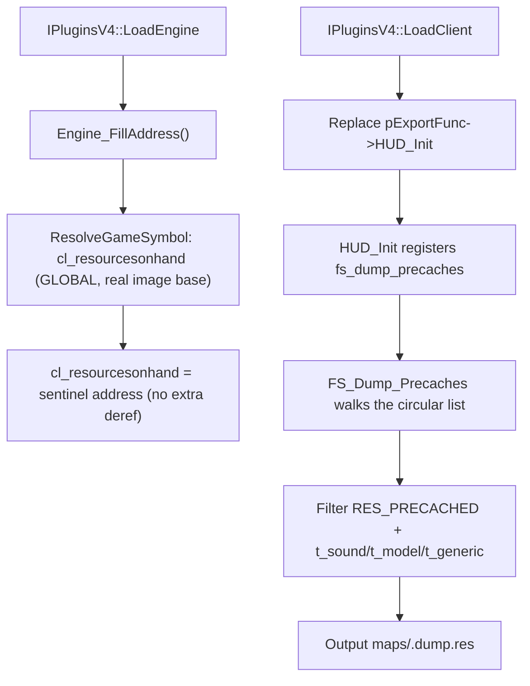

# Game-private symbols used by `PrecacheManager`

This document inventories the unexported game global-variable slot that `Plugins/PrecacheManager` locates and consumes. The plugin resolves exactly one game-private object at runtime — the `cl_resourcesonhand` resource-list sentinel — directly from gamedata. The `private_funcs_t` function table is declared but never wired.

## Scope and shared resolution process
- The scope covers the single game-private global slot `cl_resourcesonhand` recovered by `privatehook.cpp`, plus the ABI-critical local re-declarations of the engine's `resource_t` / `resourcetype_t` types. The plugin does **not** hook any game-private function and installs no inline hooks.
- The `HUD_Init` takeover is a client export-table replacement done in `IPluginsV4::LoadClient` (`Plugins/PrecacheManager/plugins.cpp`), not private-symbol hooking, and is therefore out of scope.
- Public MetaHook APIs, saved engine interfaces, and ordinary plugin state (for example `g_EngineDLLInfo`, `g_iEngineType`, `g_dwEngineBuildnum`) are excluded.
- `IPluginsV4::LoadEngine` calls `Engine_FillAddress()` (no arguments); the plugin no longer builds a mirror-image search space. `cl_resourcesonhand` is resolved **gamedata-only** through `ResolveGameSymbol(g_EngineDLLInfo.ImageBase, "cl_resourcesonhand", MH_GAMESYMBOL_KIND_GLOBAL, &address)`; a resolution failure prints a diagnostic (symbol name, engine buildnum, module CRC64, status string) and terminates via `Sys_Error`. There is no signature/string/pattern/disassembly fallback. A build-time `static_assert(METAHOOK_API_VERSION >= 109)` pins the required host API.
- The returned address is a real-image VA used as-is; the plugin does not add or remove a dereference. Upstream verification (2026-09-09): the recorded reference is `CMP ESI, <global address>` in `hw.dll` (`81 FE D4 92 10 02` at svencoop-10257 RVA 0x265b5 → `0x021092D4`; `81 FE E4 64 DB 02` at hl-3248 RVA 0x199a9 → `0x02DB64E4`), i.e. the operand encodes the sentinel object's address itself.

## Private variables and internal tables

| Local symbol / inferred game object | Declaration location | Resolution code range and mechanism | Subsequent use |
| --- | --- | --- | --- |
| `cl_resourcesonhand` (address of the engine's global `resource_t` sentinel node heading the client on-hand precache-resource circular doubly-linked list) | `Plugins/PrecacheManager/privatehook.h` (extern), defined at `Plugins/PrecacheManager/exportfuncs.cpp` | `Engine_FillAddress` (`Plugins/PrecacheManager/privatehook.cpp`) resolves the gamedata GLOBAL `cl_resourcesonhand` once and assigns the real-image address to the plugin variable. Fatal on failure. | `FS_Dump_Precaches` (`Plugins/PrecacheManager/exportfuncs.cpp`) dereferences the sentinel as a node: iterates from `cl_resourcesonhand->pNext` until the walk returns to the sentinel, keeps entries with `RES_PRECACHED` and type `t_sound` / `t_model` (skipping `*`-prefixed submodels) / `t_generic`, and writes them to `maps/<mapname>.dump.res` when the `fs_dump_precaches` command runs. |

## Private functions

| Local symbol / inferred game symbol | Declaration location | Resolution mechanism | Subsequent use |
| --- | --- | --- | --- |
| `gPrivateFuncs.CL_PrecacheResources` (`CL_PrecacheResources`, the engine's resource-precaching routine) | `Plugins/PrecacheManager/privatehook.h` (`private_funcs_t`), instance zero-initialized at `Plugins/PrecacheManager/privatehook.cpp` | **None.** The field is never assigned, called, or hooked; the engine routine is no longer implicated by any locator. | None; retained as scaffolding for a future hook. |

## Private ABI types re-declared locally
- `resourcetype_t` and `resource_s` / `resource_t` (`Plugins/PrecacheManager/privatehook.h`) are local copies of the engine's resource-node layout (shared copy at `include/HLSDK/engine/custom.h`); they define how the list nodes are read, so they must track the engine ABI.
- `RES_PRECACHED` is taken from the shared `include/HLSDK/engine/custom.h` header rather than re-declared.

## Plugin-owned helper state

| Local state | Source and meaning | Use |
| --- | --- | --- |
| `gPrivateFuncs` | `Plugins/PrecacheManager/privatehook.cpp`, the plugin's private-function table. | Currently dead: only the never-assigned `CL_PrecacheResources` field exists. |

## Architecture

## Dependencies
- `Plugins/PrecacheManager/plugins.cpp` - provides the real engine base and invokes `Engine_FillAddress`; takes over `HUD_Init` in `LoadClient`.
- `Plugins/PrecacheManager/exportfuncs.cpp` - defines `cl_resourcesonhand` and consumes it in `FS_Dump_Precaches`.
- MetaHook APIs `ResolveGameSymbol`, `GetModuleCRC64`, `GetGameSymbolStatusString` (gamedata, API 109), `GetEngineType`, `GetEngineBuildnum`, `GetEngineBase`, `SysError`.
- Shared HLSDK header `include/HLSDK/engine/custom.h` (`RES_PRECACHED`).

## Notes
- The single located symbol is a **data slot**, not a function: the plugin never detours or patches anything in the engine image; its only write path is the `.dump.res` output file.
- `cl_resourcesonhand` is the address of the sentinel node itself (the engine global is a `resource_t` value, not a pointer); iteration starts at `.pNext` and terminates when the walk returns to the sentinel address. The gamedata GLOBAL address is used directly — dereferencing it once more would be wrong.
- The missing-symbol path is now fatal at load time with a diagnostic instead of leaving `cl_resourcesonhand` null and deferring the failure to the first `fs_dump_precaches` invocation.
- Migration status (2026-09-09, issue #853): fully gamedata-only. Removed: the `"#GameUI_PrecachingResources"` string anchor (`.data` / `.rdata` searches), the `push imm32; call` pattern construction, `CL_PrecacheResources_SearchContext`, the `CMP reg, imm` operand filter, `DisasmRanges`, `ConvertDllInfoSpace`, and the mirror-image preparation.
- `scripts/validate-gamedata.py` gates `cl_resourcesonhand` as a `global` record in `COMMON_REQUIRED` for every declared engine family. svencoop-10257 windows RVA: `0x4092d4`.

## Callers
- `IPluginsV4::LoadEngine` (`Plugins/PrecacheManager/plugins.cpp`) calls `Engine_FillAddress`.
- The console command system invokes `FS_Dump_Precaches` when the user runs `fs_dump_precaches`, registered by the `HUD_Init` replacement.
